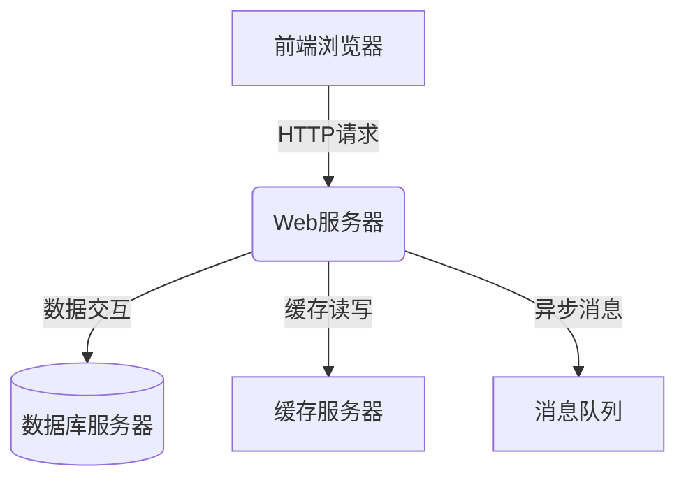
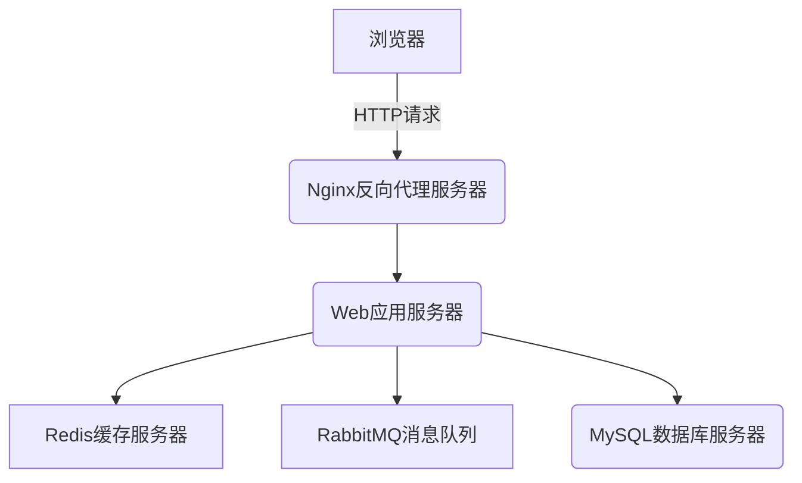

# 基于BS结构的房屋租售管理系统详细设计与具体代码实现

## 1. 背景介绍

### 1.1 房地产行业现状

房地产行业是国民经济的重要支柱产业之一,在我国经济社会发展中扮演着重要角色。随着城市化进程的不断推进,人们对于住房的需求日益增长,房地产市场呈现出蓬勃发展的态势。然而,传统的房地产租售模式存在诸多不足,例如信息不对称、流程低效、缺乏透明度等问题。这些问题不仅影响了行业的健康发展,也给消费者带来了诸多不便。

### 1.2 互联网+房地产

互联网技术的迅速发展为房地产行业带来了全新的机遇。通过将互联网技术与传统房地产业务相结合,可以打造高效、透明、智能化的房地产租售管理平台,从而优化租售流程、提高工作效率、增强用户体验。基于BS(Browser/Server)架构的房屋租售管理系统就是这种互联网+房地产模式的典型代表。

### 1.3 BS架构简介

BS架构是一种经典的软件系统架构模式,其中B(Browser)代表浏览器,S(Server)代表服务器。在BS架构中,浏览器作为客户端,通过网络与服务器进行交互,服务器负责处理业务逻辑和数据存储。BS架构具有跨平台、易部署、易维护等优点,非常适合构建基于Web的应用系统。

## 2. 核心概念与联系

### 2.1 系统架构概览

基于BS结构的房屋租售管理系统主要由以下几个核心组件构成:

1. **前端浏览器**:作为客户端,提供用户界面,允许用户进行各种操作,如浏览房源信息、发布房源、预约看房等。
2. **Web服务器**:负责接收和响应来自浏览器的HTTP请求,处理业务逻辑,与数据库进行交互。
3. **数据库服务器**:用于存储系统中的各种数据,如房源信息、用户信息、交易记录等。
4. **缓存服务器**:提高系统响应速度,缓解数据库压力。
5. **消息队列**:实现系统的异步处理,提高系统的吞吐量和可靠性。

这些组件通过网络协议(如HTTP、TCP/IP等)进行通信和协作,共同构建了一个完整的房屋租售管理系统。

### 2.2 系统核心功能

房屋租售管理系统的核心功能包括:

1. **房源管理**:发布、编辑、删除房源信息,包括房屋基本信息、图片、价格等。
2. **用户管理**:注册、登录、个人信息维护等。
3. **交易管理**:租房、售房流程,包括在线预约看房、签订合同、支付租金/房款等。
4. **消息通知**:向用户推送系统通知、交易提醒等。
5. **数据统计**:统计房源浏览量、成交量、用户活跃度等数据,为决策提供支持。

## 3. 核心算法原理具体操作步骤

### 3.1 房源搜索算法

房源搜索是系统的核心功能之一,用户可以根据自身需求设置搜索条件,如地理位置、价格范围、房型等,系统需要高效地从海量房源数据中检索出符合条件的房源。常见的搜索算法有:

1. **前缀树(Trie树)搜索**:适用于搜索关键词的场景,如地址搜索。
2. **倒排索引搜索**:适用于根据多个条件组合搜索的场景,如根据地理位置、价格、房型等条件搜索房源。
3. **地理位置搜索**:利用空间索引(如R-树)实现附近房源搜索。

以倒排索引搜索为例,其核心步骤如下:

1. **构建倒排索引**:遍历所有房源数据,对每个搜索字段(如地理位置、价格、房型等)构建倒排索引,将字段值映射到对应的房源ID列表。
2. **查询解析**:将用户输入的搜索条件解析成对应的字段值列表。
3. **索引查找**:根据字段值列表,从倒排索引中获取对应的房源ID列表。
4. **列表交集**:计算所有字段值列表对应的房源ID列表的交集,得到最终的搜索结果。
5. **结果排序**:根据相关性打分,对搜索结果进行排序,展现给用户。

### 3.2 推荐算法

为了提高用户体验,系统需要为用户推荐感兴趣的房源。常见的推荐算法有:

1. **协同过滤算法**:基于用户的历史行为(如浏览记录、收藏记录等)推荐类似用户感兴趣的房源。
2. **内容推荐算法**:根据房源的特征(如地理位置、价格、房型等)推荐相似的房源。
3. **混合推荐算法**:将协同过滤和内容推荐相结合,发挥两者的优势。

以基于用户的协同过滤算法为例,其核心步骤如下:

1. **构建用户行为矩阵**:根据用户的浏览记录、收藏记录等,构建用户-房源行为矩阵。
2. **计算用户相似度**:基于用户行为矩阵,计算任意两个用户之间的相似度,常用的相似度计算方法有余弦相似度、皮尔逊相关系数等。
3. **找到相似用户**:对目标用户,找到与其相似度较高的Top N个用户,作为相似用户组。
4. **推荐房源**:从相似用户组中,提取这些用户感兴趣而目标用户尚未接触的房源,作为推荐结果。

### 3.3 智能分配算法

对于中介机构而言,如何高效地将新增房源分配给不同的经纪人是一个重要问题。常见的分配算法有:

1. **轮询算法**:按照固定顺序,将新增房源依次分配给不同的经纪人。
2. **负载均衡算法**:根据经纪人的当前工作负载,将新增房源分配给负载较低的经纪人。
3. **智能分配算法**:综合考虑经纪人的专长、历史成交量、工作负载等因素,将新增房源分配给最合适的经纪人。

以智能分配算法为例,其核心步骤如下:

1. **建立经纪人模型**:根据经纪人的专长(如擅长地段、房型等)、历史成交量、当前工作负载等信息,构建经纪人模型。
2. **房源特征提取**:对新增房源进行特征提取,如地理位置、价格、房型等。
3. **匹配计算**:基于经纪人模型和房源特征,计算每个经纪人与该房源的匹配度,匹配度可以是多个因素的加权综合。
4. **分配房源**:将新增房源分配给匹配度最高的经纪人。

## 4. 数学模型和公式详细讲解举例说明

### 4.1 余弦相似度

余弦相似度是计算两个向量之间相似度的常用方法,在协同过滤推荐算法中经常使用。设有两个向量$\vec{a}$和$\vec{b}$,其余弦相似度定义为:

$$\text{cos}(\vec{a}, \vec{b}) = \frac{\vec{a} \cdot \vec{b}}{\|\vec{a}\| \|\vec{b}\|}$$

其中$\vec{a} \cdot \vec{b}$表示两个向量的点积,$ \|\vec{a}\| $和$ \|\vec{b}\| $分别表示向量$\vec{a}$和$\vec{b}$的$L_2$范数。

余弦相似度的取值范围为$[0, 1]$,值越大,表示两个向量越相似。当两个向量完全相同时,余弦相似度为1;当两个向量夹角为90度时,余弦相似度为0。

在推荐系统中,我们可以将用户的行为记录(如浏览记录、收藏记录等)表示为一个向量,然后计算任意两个用户向量之间的余弦相似度,作为这两个用户的相似度。

### 4.2 皮尔逊相关系数

皮尔逊相关系数也是计算两个向量之间相似度的常用方法,常用于协同过滤推荐算法中。设有两个向量$\vec{x}$和$\vec{y}$,其皮尔逊相关系数定义为:

$$r_{xy} = \frac{\sum_{i=1}^{n}(x_i - \overline{x})(y_i - \overline{y})}{\sqrt{\sum_{i=1}^{n}(x_i - \overline{x})^2}\sqrt{\sum_{i=1}^{n}(y_i - \overline{y})^2}}$$

其中$\overline{x}$和$\overline{y}$分别表示向量$\vec{x}$和$\vec{y}$的均值。

皮尔逊相关系数的取值范围为$[-1, 1]$,值越接近1,表示两个向量越相似;值越接近-1,表示两个向量越不相似;值为0,表示两个向量之间没有线性相关性。

在推荐系统中,我们可以将用户对不同房源的评分表示为一个向量,然后计算任意两个用户评分向量之间的皮尔逊相关系数,作为这两个用户的相似度。

### 4.3 TF-IDF

TF-IDF(Term Frequency-Inverse Document Frequency)是一种常用的文本特征向量化方法,在文本挖掘、信息检索等领域有广泛应用。在房源搜索中,我们可以将房源标题、描述等文本信息转换为TF-IDF向量,用于相似度计算和搜索排序。

对于一个词$t$和一个文档$d$,其TF-IDF定义为:

$$\text{tfidf}(t, d) = \text{tf}(t, d) \times \text{idf}(t)$$

其中:

- $\text{tf}(t, d)$表示词$t$在文档$d$中出现的频率,常用的计算方式有原始频率、对数频率等。
- $\text{idf}(t) = \log\frac{N}{1 + \text{df}(t)}$,其中$N$表示总文档数,$\text{df}(t)$表示包含词$t$的文档数量。$\text{idf}$用于衡量一个词的重要性,出现在较少文档中的词,其$\text{idf}$值较高。

通过计算每个词的TF-IDF值,我们可以构建一个文档的TF-IDF向量,然后利用向量相似度(如余弦相似度)计算不同文档之间的相似程度。

在房源搜索中,我们可以将用户输入的搜索关键词和房源标题、描述等文本信息分别转换为TF-IDF向量,然后计算它们之间的相似度,作为该房源与搜索条件的匹配程度,用于搜索结果排序。

## 4. 项目实践:代码实例和详细解释说明

### 4.1 系统架构

下面是基于BS架构的房屋租售管理系统的整体架构示意图:

该系统采用了典型的三层架构:

1. **表现层**:浏览器,提供用户界面,接收用户输入,展示数据。
2. **业务逻辑层**:Web应用服务器,处理业务逻辑,与数据库和其他服务进行交互。
3. **数据访问层**:数据库服务器,负责数据的持久化存储。

此外,系统还引入了以下辅助组件:

- **Nginx反向代理服务器**:负责负载均衡、缓存静态资源等,提高系统的响应速度和可扩展性。
- **Redis缓存服务器**:缓存热点数据,减轻数据库压力。
- **Rab