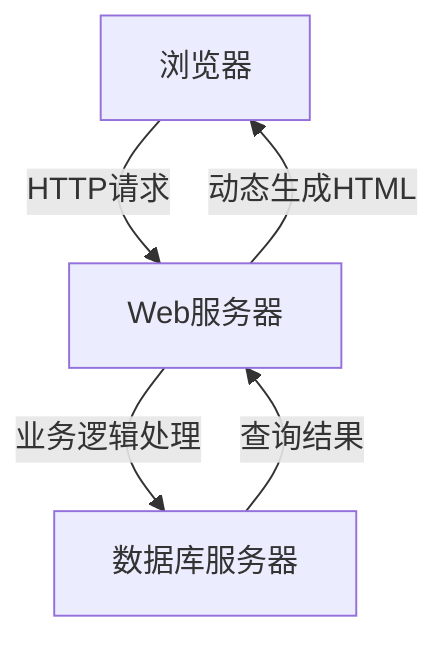

# 基于B/S模式的网络教学系统详细设计与具体代码实现

## 1.背景介绍

### 1.1 网络教学系统的重要性

在当今信息时代,教育领域正在经历前所未有的变革。传统的教学模式已经无法满足现代社会对高质量教育资源的渴求。网络教学系统(E-Learning System)的出现为解决这一问题提供了一种有效的解决方案。

网络教学系统利用互联网和多媒体技术,打破了时间和空间的限制,实现了教育资源的共享和优化配置。学生可以随时随地进行自主学习,教师也可以更加灵活地组织教学活动。同时,网络教学系统还能够实现个性化学习、智能化测评等功能,大大提高了教学效率和质量。

### 1.2 B/S模式的优势

在网络教学系统的架构设计中,B/S(Browser/Server,浏览器/服务器)模式是一种常见的选择。相比传统的C/S(Client/Server,客户端/服务器)模式,B/S模式具有以下优势:

1. **跨平台性强**:只需要一个支持标准的Web浏览器,就可以访问系统,无需安装专门的客户端软件。
2. **部署和维护简单**:所有的业务逻辑都集中在服务器端,只需要维护服务器端的应用程序。
3. **可扩展性好**:由于采用了三层或多层架构,各个层之间是相对独立的,便于系统的扩展和升级。
4. **成本低廉**:无需为每个客户端安装和维护专门的软件,降低了总体成本。

因此,基于B/S模式设计网络教学系统,不仅能够充分利用互联网的优势,而且还具有良好的可扩展性和可维护性,是一种非常合理的选择。

## 2.核心概念与联系

### 2.1 B/S架构

B/S架构是一种典型的三层或多层架构,包括表现层(浏览器)、业务逻辑层(Web服务器)和数据层(数据库服务器)。

1. **表现层(浏览器)**:负责向用户显示信息,接收用户输入的数据和操作请求。
2. **业务逻辑层(Web服务器)**:处理用户请求,执行相应的业务逻辑,与数据层进行交互。
3. **数据层(数据库服务器)**:存储系统的数据,为业务逻辑层提供数据服务。

用户通过浏览器发送HTTP请求到Web服务器,Web服务器根据请求执行相应的业务逻辑,并与数据库服务器交互,最终将动态生成的HTML页面返回给浏览器显示。

### 2.2 网络教学系统的核心功能

一个完整的网络教学系统通常包括以下核心功能:

1. **课程管理**:提供课程资源的上传、组织和管理功能。
2. **学习管理**:支持学生自主学习,包括学习资源浏览、在线测试、讨论交流等功能。
3. **教学管理**:支持教师组织教学活动,包括发布课程、布置作业、组织讨论等功能。
4. **考核评价**:提供在线考试、自动阅卷、成绩统计等功能,实现对学习过程的评价。
5. **系统管理**:实现对用户、角色、权限等系统配置信息的管理。

这些核心功能模块之间存在着密切的联系和交互,共同构建了一个完整的网络教学系统。

## 3.核心算法原理具体操作步骤

### 3.1 用户认证与授权

用户认证和授权是网络教学系统的基础,确保系统的安全性和可靠性。常见的用户认证算法包括:

1. **密码哈希算法**:将用户密码经过单向哈希算法(如MD5、SHA-256等)处理后存储在数据库中,防止密码被窃取。
2. **加盐哈希算法**:在哈希计算时加入随机的"盐值",提高哈希值的随机性和安全性。

用户认证的具体步骤如下:

1. 用户输入用户名和密码。
2. 服务器从数据库查询该用户的哈希密码和盐值。
3. 将用户输入的密码与盐值拼接,经过相同的哈希算法计算得到一个哈希值。
4. 比对计算出的哈希值与数据库中存储的哈希密码是否一致,如果一致则认证通过。

用户授权通常采用基于角色的访问控制(RBAC)策略,将系统功能按照职责分离到不同的角色,每个用户被分配一个或多个角色,从而获得相应的操作权限。

### 3.2 在线考试算法

在线考试是网络教学系统的一个重要功能,需要一些专门的算法来实现:

1. **随机抽题算法**:从题库中随机抽取指定数量的试题,组成试卷。可以根据题型、难度等条件进行分类抽题。
2. **计时控制算法**:控制考试的总时长,并根据题目剩余时间动态调整答题时间。
3. **防作弊算法**:禁止考生打开其他窗口或程序,监控键盘、鼠标等行为,一旦发现可疑行为则终止考试。
4. **自动阅卷算法**:根据预设的评分标准和答案,自动批改选择题、判断题等题型,大大提高阅卷效率。

以随机抽题算法为例,其核心思想是通过生成随机数的方式,从题库中抽取指定数量的试题。具体步骤如下:

1. 根据题型、难度等条件,从题库中获取满足条件的试题集合。
2. 计算满足条件的试题总数 $N$。
3. 生成 $n$ 个不重复的随机数(种子),范围在 $[0,N)$ 之间。
4. 根据这 $n$ 个随机数的值,从试题集合中取出对应的试题,组成最终的试卷。

该算法的时间复杂度为 $O(n)$,能够有效地实现试卷的随机抽取。

### 3.3 个性化推荐算法

为了提高网络教学系统的适用性和吸引力,可以引入个性化推荐算法,根据用户的学习行为和偏好,推荐合适的课程资源和学习路径。常见的个性化推荐算法包括:

1. **协同过滤算法**:基于用户之间的相似性,推荐与目标用户相似的其他用户喜欢的资源。
2. **基于内容的推荐算法**:分析资源的内容特征,推荐与用户历史喜好相似的资源。
3. **混合推荐算法**:综合协同过滤和基于内容的算法,发挥各自的优势。

以基于内容的推荐算法为例,其核心思路是建立资源和用户之间的相似度模型,推荐与用户历史偏好相似的资源。具体步骤如下:

1. 提取资源的内容特征,构建特征向量。常用的特征包括标题、描述、关键词等。
2. 计算资源与用户历史偏好的相似度,可以使用余弦相似度、Jaccard相似度等相似度度量方法。
3. 根据相似度大小,推荐前 $N$ 个最相似的资源给用户。

这种算法需要合理地选择特征和相似度度量方法,才能获得较好的推荐效果。同时,还需要考虑算法的实时性和可扩展性,以适应大规模的资源和用户数据。

## 4.数学模型和公式详细讲解举例说明

在网络教学系统的设计中,数学模型和公式是不可或缺的。下面将详细介绍几个常见的数学模型和公式。

### 4.1 余弦相似度

余弦相似度是一种常用的相似度度量方法,广泛应用于文本挖掘、推荐系统等领域。它度量两个非零向量之间的夹角余弦值,其数学表达式如下:

$$sim(A,B)=\cos(\theta)=\frac{A \cdot B}{\|A\|\|B\|}=\frac{\sum_{i=1}^{n}A_iB_i}{\sqrt{\sum_{i=1}^{n}A_i^2}\sqrt{\sum_{i=1}^{n}B_i^2}}$$

其中 $A$ 和 $B$ 是两个 $n$ 维向量,分别表示资源和用户的特征向量。$A \cdot B$ 表示两个向量的点积,而 $\|A\|$ 和 $\|B\|$ 分别表示向量的模长。

余弦相似度的值域为 $[0,1]$,值越大表示两个向量越相似。当两个向量完全相同时,相似度为1;当两个向量夹角为90度时,相似度为0。

例如,假设资源 $A$ 的特征向量为 $(2,3,0,1)$,用户历史偏好 $B$ 的特征向量为 $(1,2,0,3)$,则它们的余弦相似度为:

$$sim(A,B)=\frac{2\times1+3\times2+0\times0+1\times3}{\sqrt{2^2+3^2+0^2+1^2}\sqrt{1^2+2^2+0^2+3^2}}=\frac{10}{\sqrt{14}\sqrt{14}}=0.71$$

可以看出,这两个向量的相似度较高,因此可以将资源 $A$ 推荐给该用户。

### 4.2 TF-IDF权重

在文本挖掘和信息检索领域,TF-IDF(Term Frequency-Inverse Document Frequency)是一种常用的特征权重计算方法,用于评估一个词对于一个文档集或语料库的重要程度。TF-IDF权重由两部分组成:

1. **词频(TF)**:该词在文档中出现的频率,常用的计算方式为:

$$tf(t,d)=\frac{n_{t,d}}{\sum_{t'\in d}n_{t',d}}$$

其中 $n_{t,d}$ 表示词 $t$ 在文档 $d$ 中出现的次数,分母是文档 $d$ 中所有词出现的总次数。

2. **逆向文档频率(IDF)**:该词在整个文档集中的普遍重要程度,常用的计算方式为:

$$idf(t,D)=\log\frac{|D|}{1+|d\in D:t\in d|}$$

其中 $|D|$ 表示文档集的总数,分母表示包含词 $t$ 的文档数量。

最终的TF-IDF权重为两者的乘积:

$$tfidf(t,d,D)=tf(t,d)\times idf(t,D)$$

TF-IDF权重能够很好地平衡词在文档和文档集中的重要程度,可以作为文本特征的权重,用于文本相似度计算、文本分类等任务。

例如,假设我们有一个包含 $10^6$ 篇文档的语料库,其中有 $10^3$ 篇文档包含词 $t$。如果一篇文档 $d$ 包含 $5$ 次 $t$,文档 $d$ 的总词数为 $100$,则词 $t$ 在文档 $d$ 中的TF-IDF权重为:

$$\begin{aligned}
tf(t,d)&=\frac{5}{100}=0.05\\
idf(t,D)&=\log\frac{10^6}{10^3+1}=5.91\\
tfidf(t,d,D)&=0.05\times5.91=0.30
\end{aligned}$$

可以看出,虽然词 $t$ 在文档 $d$ 中出现的频率不高,但由于它在整个语料库中较为稀有,因此获得了较高的TF-IDF权重,体现了它的重要程度。

### 4.3 PageRank算法

PageRank算法是谷歌公司发明的一种用于网页排名的算法,它通过网页之间的链接结构,计算每个网页的重要程度。该算法的核心思想是:一个高质量的网页,往往会被许多其他高质量的网页链接到。PageRank算法的数学模型如下:

$$PR(p_i)=(1-d)+d\sum_{p_j\in M(p_i)}\frac{PR(p_j)}{L(p_j)}$$

其中:

- $PR(p_i)$表示网页$p_i$的