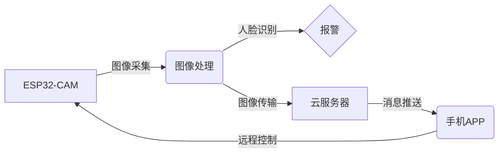

## 基于ESP32-CAM的智能猫眼设计与实现

作者：禅与计算机程序设计艺术

## 1. 背景介绍

### 1.1  传统猫眼的局限性

传统的猫眼作为一种简单有效的门禁观察装置，已经在家庭安全中扮演了重要角色。然而，随着科技的发展和人们安全意识的提高，传统猫眼逐渐暴露出一些局限性：

* **视野狭窄**: 只能观察到正前方有限范围内的景象，无法全面了解门外的情况。
* **功能单一**: 仅能提供简单的观察功能，无法记录访客信息、远程监控等。
* **易受攻击**:  一些不法分子可能通过破坏猫眼窥视室内情况，存在安全隐患。

### 1.2 智能猫眼的优势

为了克服传统猫眼的不足，智能猫眼应运而生。智能猫眼利用先进的电子技术和网络技术，为用户提供更加安全、便捷、智能的家居体验。相比传统猫眼，智能猫眼具有以下优势：

* **广角视野**:  配备广角摄像头，可以捕捉到门外更广阔的区域，减少视觉盲区。
* **实时监控**:  用户可以通过手机APP实时查看门外的情况，即使不在家也能了解家门口的动态。
* **访客记录**:  自动记录访客信息，包括图像、时间等，方便用户查看和管理访客。
* **远程交互**:  支持远程视频通话功能，用户可以通过手机APP与访客进行实时语音和视频交流。
* **安全报警**:  当检测到异常情况时，例如有人在门外逗留、试图撬锁等，会自动向用户发送报警信息。

### 1.3 ESP32-CAM简介

ESP32-CAM 是一款价格低廉、功能强大的物联网开发板，搭载了 ESP32-S 芯片，集成了 Wi-Fi 和蓝牙功能，并且板载了一个 200 万像素的摄像头模块。这些特性使得 ESP32-CAM 成为构建智能猫眼的理想选择。


## 2. 核心概念与联系

### 2.1  系统架构

本智能猫眼系统采用 ESP32-CAM 作为核心处理器和图像采集设备，通过 Wi-Fi 连接到家庭网络，用户可以通过手机 APP 实现远程监控、访客记录、远程交互等功能。



### 2.2  关键技术

* **图像采集**: 利用 ESP32-CAM 的摄像头模块采集门外图像数据。
* **图像处理**: 对采集到的图像数据进行预处理，例如去噪、增强等，以提高图像质量。
* **运动检测**:  利用图像处理算法检测门外是否有运动物体，例如人或动物。
* **人脸识别**: 当检测到人脸时，进行人脸识别，判断是否是家庭成员或陌生人。
* **Wi-Fi 通信**:  ESP32-CAM 通过 Wi-Fi 连接到家庭网络，与手机 APP 进行数据交互。
* **云服务器**:  用于存储访客记录、处理报警信息等。
* **手机 APP**:  提供用户界面，方便用户进行远程监控、访客记录、远程交互等操作。

## 3. 核心算法原理具体操作步骤

### 3.1  运动检测

本系统采用基于帧差法的运动检测算法，其基本原理是比较相邻两帧图像的差异，如果差异超过预设阈值，则判断为有运动物体。具体操作步骤如下:

1. 获取当前帧图像和上一帧图像。
2. 计算两帧图像的差值图像。
3. 对差值图像进行二值化处理，将像素值大于阈值的像素点设置为 1，小于阈值的像素点设置为 0。
4. 对二值化图像进行形态学处理，例如膨胀、腐蚀等，以消除噪声和连接断开的目标区域。
5. 计算目标区域的面积，如果面积大于预设阈值，则判断为有运动物体。

### 3.2  人脸识别

本系统采用基于深度学习的人脸识别算法，其基本原理是利用深度神经网络提取人脸特征，然后将待识别人脸特征与已知人脸库进行比对，判断是否匹配。具体操作步骤如下:

1. 人脸检测：利用人脸检测算法从图像中检测出人脸区域。
2. 人脸对齐：将检测到的人脸区域进行几何变换，使其对齐到标准姿态。
3. 特征提取：利用深度神经网络从对齐后的人脸图像中提取人脸特征。
4. 特征比对：将提取到的人脸特征与已知人脸库进行比对，计算相似度得分。
5. 身份识别：根据相似度得分判断待识别人脸的身份。

## 4. 数学模型和公式详细讲解举例说明

### 4.1  帧差法运动检测

帧差法运动检测算法的数学模型如下：

$$
D(x,y,t) = |I(x,y,t) - I(x,y,t-1)|
$$

其中：

* $D(x,y,t)$ 表示 $(x,y)$ 坐标处在 $t$ 时刻的差值图像像素值。
* $I(x,y,t)$ 表示 $(x,y)$ 坐标处在 $t$ 时刻的当前帧图像像素值。
* $I(x,y,t-1)$ 表示 $(x,y)$ 坐标处在 $t-1$ 时刻的上一帧图像像素值。

### 4.2  人脸识别相似度计算

人脸识别中常用的相似度计算方法是余弦相似度，其公式如下：

$$
similarity = \frac{A \cdot B}{||A|| \cdot ||B||} =  cos(\theta)
$$

其中：

* $A$ 和 $B$ 分别表示两个人脸特征向量。
* $||A||$ 和 $||B||$ 分别表示向量 $A$ 和 $B$ 的模长。
* $\theta$ 表示向量 $A$ 和 $B$ 之间的夹角。

## 5. 项目实践：代码实例和详细解释说明

### 5.1  硬件连接

将 ESP32-CAM 连接到电脑，参考以下电路图：

```
[ESP32-CAM]
GPIO 5  -->  LED 灯正极
GPIO 13 -->  LED 灯负极
GND     -->  GND
3V3     -->  3V3
```

### 5.2  软件代码

```python
# 导入必要的库
import cv2
import face_recognition
import numpy as np
from esp32cam import esp32cam

# 初始化摄像头
esp32cam.init()

# 加载人脸库
known_face_encodings = []
known_face_names = []

# 将已知人脸图像加载到人脸库中
image = face_recognition.load_image_file("known_faces/person_1.jpg")
face_encoding = face_recognition.face_encodings(image)[0]
known_face_encodings.append(face_encoding)
known_face_names.append("Person 1")

# 初始化变量
previous_frame = None
face_locations = []
face_encodings = []
face_names = []
process_this_frame = True

while True:
    # 获取摄像头图像
    frame = esp32cam.capture()

    # 将图像转换为灰度图像
    gray = cv2.cvtColor(frame, cv2.COLOR_BGR2GRAY)

    # 如果是第一帧，则将其保存为上一帧
    if previous_frame is None:
        previous_frame = gray
        continue

    # 计算当前帧与上一帧的差值图像
    frame_delta = cv2.absdiff(previous_frame, gray)
    previous_frame = gray

    # 对差值图像进行阈值处理
    thresh = cv2.threshold(frame_delta, 25, 255, cv2.THRESH_BINARY)[1]

    # 对阈值图像进行形态学处理
    thresh = cv2.dilate(thresh, None, iterations=2)

    # 查找轮廓
    cnts = cv2.findContours(thresh.copy(), cv2.RETR_EXTERNAL,
                            cv2.CHAIN_APPROX_SIMPLE)
    cnts = cnts[0] if len(cnts) == 2 else cnts[1]

    # 遍历所有轮廓
    for c in cnts:
        # 如果轮廓面积小于预设阈值，则忽略
        if cv2.contourArea(c) < 1000:
            continue

        # 计算轮廓的边界框
        (x, y, w, h) = cv2.boundingRect(c)

        # 在原始图像上绘制边界框
        cv2.rectangle(frame, (x, y), (x + w, y + h), (0, 255, 0), 2)

        # 如果正在处理当前帧
        if process_this_frame:
            # 提取人脸区域
            face_locations = face_recognition.face_locations(frame)

            # 提取人脸特征
            face_encodings = face_recognition.face_encodings(
                frame, face_locations)

            # 初始化人脸名称列表
            face_names = []

            # 遍历所有检测到的人脸
            for face_encoding in face_encodings:
                # 将当前人脸特征与已知人脸库进行比对
                matches = face_recognition.compare_faces(
                    known_face_encodings, face_encoding)
                name = "Unknown"

                # 找到最佳匹配的人脸
                face_distances = face_recognition.face_distance(
                    known_face_encodings, face_encoding)
                best_match