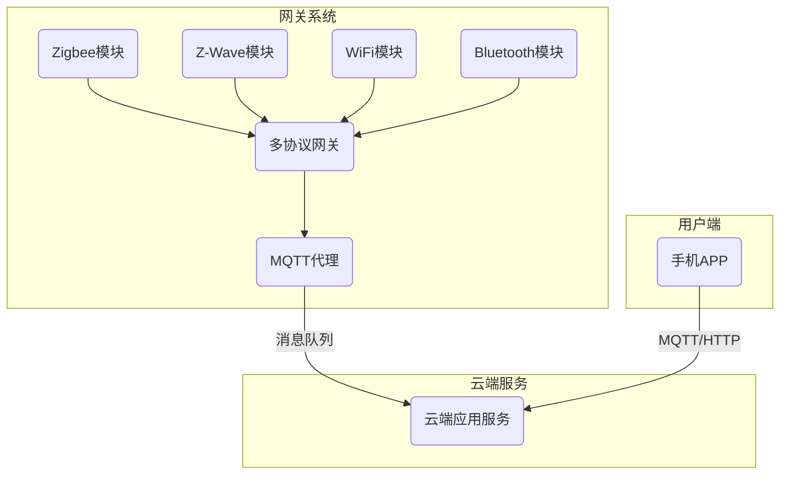
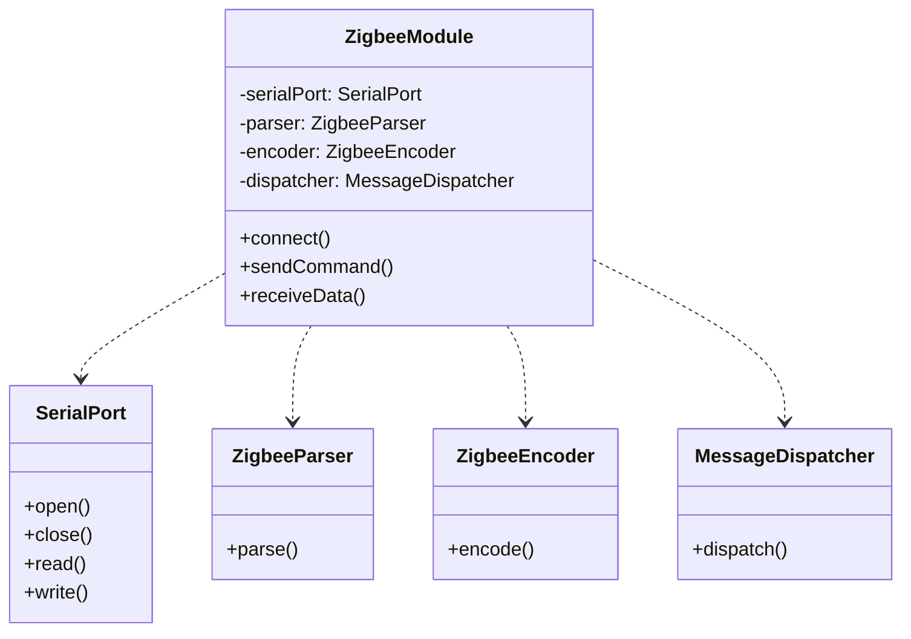

# 基于Java的智能家居设计：依托Java平台的多协议网关开发

## 1.背景介绍

### 1.1 智能家居概述

随着物联网技术的不断发展,智能家居应用越来越普及。智能家居系统旨在将家中的各种电子设备连接起来,实现自动化控制和远程管理,为人们的生活带来极大的便利性。但由于不同制造商采用了不同的通信协议,使得智能家居设备之间存在互操作性问题,难以实现无缝集成。

### 1.2 多协议网关的重要性

为了解决这一问题,需要引入多协议网关作为不同协议设备之间的桥梁。多协议网关能够与各种智能设备进行通信,将不同协议的数据进行转换和路由,从而实现设备之间的互联互通。

### 1.3 Java在物联网领域的应用

Java作为一种成熟的编程语言,具有跨平台、安全性高、垃圾回收等优点,非常适合用于开发物联网应用。Java平台提供了丰富的库和框架支持,如Java ME嵌入式版本、MQTT消息队列传输协议等,可以方便地构建物联网系统。

## 2.核心概念与联系  

### 2.1 物联网体系架构

物联网体系架构通常分为感知层、网络层和应用层三个部分:

- 感知层: 各种智能设备、传感器等,用于采集环境数据。
- 网络层: 负责不同节点之间的数据传输,包括有线和无线网络。
- 应用层: 提供各种智能家居应用服务,如家电控制、环境监测等。

多协议网关位于网络层,承担着协议转换和数据路由的任务。

### 2.2 常见智能家居通信协议

智能家居设备广泛采用以下通信协议:

- Zigbee: 低功耗、短距离无线通信协议,应用于传感器网络。
- Z-Wave: 另一种低功耗射频技术,专为智能家居设计。  
- Wi-Fi: 常用的无线局域网协议,传输速率较高。
- Bluetooth: 短距离无线技术,应用于个人区域网络。
- MQTT: 基于发布/订阅模式的轻量级消息传输协议。

多协议网关需要支持上述主流协议,实现不同设备之间的互通。

### 2.3 网关架构模式

多协议网关的架构模式主要有以下几种:

- 协议转换网关: 将不同协议数据相互转换。
- 代理网关: 代理设备与云端应用的交互。
- 消息队列网关: 基于消息队列实现协议解耦。
- 云端网关: 将协议转换逻辑放在云端。

不同架构模式在功能、性能、扩展性等方面有所差异,需要根据实际需求进行选择。

## 3.核心算法原理具体操作步骤

### 3.1 多协议网关总体设计

一个典型的基于Java的多协议网关架构如下所示:



该架构包括以下几个关键模块:

1. 协议模块: 分别实现对应协议的通信能力,如Zigbee、Z-Wave、WiFi、Bluetooth等模块。
2. 多协议网关: 核心模块,负责协议转换、数据路由等功能。
3. MQTT代理: 提供基于MQTT的消息队列服务。
4. 云端应用服务: 接收网关上传的数据,提供智能家居应用。
5. 手机APP: 用户通过APP与云端服务交互,实现远程控制。

### 3.2 协议模块设计

每个协议模块需要实现以下核心功能:

1. 建立物理连接: 通过串口、网络等方式与协议设备连接。
2. 协议解析: 将原始数据解析为协议数据包。
3. 命令编码: 将控制命令编码为协议数据包。
4. 消息分发: 将接收到的消息分发到网关核心模块。

以Zigbee模块为例,其设计如下:



其他协议模块的设计思路类似,只需要替换对应的解析器、编码器等组件。

### 3.3 协议转换算法

协议转换是多协议网关的核心功能,其算法流程如下:

1. 接收原始数据包
2. 根据数据包特征识别协议类型
3. 使用对应的协议解析器解析数据包
4. 将解析结果标准化为设备模型
5. 根据目标协议对设备模型进行编码
6. 发送编码后的数据包到目标协议

该算法的伪代码实现如下:

```python
def protocol_conversion(raw_data):
    # 1. 接收原始数据包
    
    # 2. 识别协议类型
    protocol_type = identify_protocol(raw_data)
    
    # 3. 使用对应的协议解析器解析数据包
    parser = get_parser(protocol_type)
    parsed_data = parser.parse(raw_data)
    
    # 4. 标准化为设备模型
    device_model = standardize_model(parsed_data)
    
    # 5. 根据目标协议对设备模型进行编码
    target_protocol = ... # 假设已知目标协议
    encoder = get_encoder(target_protocol)
    encoded_data = encoder.encode(device_model)
    
    # 6. 发送编码后的数据包
    send_data(encoded_data, target_protocol)
```

其中，`identify_protocol`、`get_parser`、`get_encoder`等函数需要根据实际情况实现。

### 3.4 MQTT消息队列集成

为了提高系统的可扩展性和解耦性,多协议网关通常会集成消息队列机制。以MQTT为例,其集成流程如下:

1. 启动MQTT代理服务器
2. 网关作为MQTT客户端连接代理服务器
3. 网关将协议转换后的数据发布到特定主题
4. 云端应用订阅相关主题,获取设备数据
5. 云端应用向网关发送控制命令

MQTT集成的示例代码:

```java
// 1. 创建MQTT客户端实例
MqttClient client = new MqttClient(brokerUrl, clientId);

// 2. 设置回调
client.setCallback(new MqttCallback() {...});

// 3. 连接代理服务器
MqttConnectOptions options = new MqttConnectOptions();
options.setUserName(username);
options.setPassword(password);
client.connect(options);

// 4. 订阅主题
client.subscribe("home/device/#");

// 5. 发布数据
MqttMessage message = new MqttMessage(payload);
message.setQos(qos);
client.publish("home/device/sensor1", message);
```

通过MQTT的发布/订阅机制,网关和云端应用可以实现解耦,提高系统的灵活性和可伸缩性。

## 4.数学模型和公式详细讲解举例说明  

在智能家居系统中,常常需要对传感器数据进行处理和建模,以实现更智能的控制决策。以温度控制为例,我们可以建立一个简单的PID控制模型。

### 4.1 PID控制原理

PID控制是一种常见的反馈控制算法,广泛应用于工业自动化领域。它根据系统的偏差值(期望值与实际值之差)、偏差的变化率以及偏差的积分,计算出控制量,从而调节被控对象朝预期目标逼近。

PID控制算法公式如下:

$$u(t) = K_p e(t) + K_i \int_{0}^{t} e(t)dt + K_d \frac{de(t)}{dt}$$

其中:

- $u(t)$是控制量
- $e(t)$是偏差值
- $K_p$是比例系数
- $K_i$是积分系数
- $K_d$是微分系数

通过调节$K_p$、$K_i$、$K_d$三个参数,可以控制系统的响应速度、稳定性和抗干扰性。

### 4.2 温度控制建模

假设我们需要控制房间温度保持在22℃,可以建立如下PID控制模型:

$$u(t) = K_p (22 - T(t)) + K_i \int_{0}^{t} (22 - T(t))dt + K_d \frac{d(22 - T(t))}{dt}$$

其中$T(t)$是当前房间温度。

该模型的Python实现如下:

```python
import time

class TempPIDController:
    def __init__(self, kp, ki, kd):
        self.kp = kp
        self.ki = ki
        self.kd = kd
        self.target_temp = 22.0
        self.integral = 0
        self.prev_error = 0

    def control(self, current_temp):
        error = self.target_temp - current_temp
        self.integral += error
        derivative = error - self.prev_error
        output = self.kp * error + self.ki * self.integral + self.kd * derivative
        self.prev_error = error
        return output

# 模拟温度变化
temp = 20
controller = TempPIDController(0.5, 0.1, 0.2)

while True:
    control_output = controller.control(temp)
    temp += control_output  # 假设控制量可以改变温度
    print(f"Current temp: {temp:.2f}, Control output: {control_output:.2f}")
    time.sleep(1)
```

通过不断调整PID参数,可以使房间温度逐渐趋近于目标值22℃,实现智能温控。

## 5.项目实践：代码实例和详细解释说明

为了更好地说明基于Java的多协议网关的实现,下面给出一个简单的示例项目。

### 5.1 项目结构

```
gateway-project
├── pom.xml
└── src
    ├── main
    │   ├── java
    │   │   └── com
    │   │       └── example
    │   │           ├── gateway
    │   │           │   ├── Gateway.java
    │   │           │   ├── ProtocolManager.java
    │   │           │   └── mqtt
    │   │           │       └── MqttClient.java
    │   │           └── protocols
    │   │               ├── zigbee
    │   │               │   ├── ZigbeeModule.java
    │   │               │   ├── ZigbeeParser.java
    │   │               │   └── ZigbeeEncoder.java
    │   │               └── zwave
    │   │                   ├── ZWaveModule.java
    │   │                   ├── ZWaveParser.java
    │   │                   └── ZWaveEncoder.java
    │   └── resources
    │       └── log4j.properties
    └── test
        └── java
            └── com
                └── example
                    └── gateway
                        └── GatewayTest.java
```

该项目使用Maven进行构建管理,主要包括以下几个模块:

- `gateway`: 网关核心模块,包括`Gateway`、`ProtocolManager`和`MqttClient`等类。
- `protocols`: 协议模块,包括`ZigbeeModule`、`ZWaveModule`等不同协议的实现。
- `test`: 单元测试模块。

### 5.2 Gateway模块

`Gateway`是整个系统的入口,负责初始化各个模块并启动网关服务。

```java
public class Gateway {
    private ProtocolManager protocolManager;
    private MqttClient mqttClient;

    public Gateway() {
        protocolManager = new ProtocolManager();
        mqttClient = new MqttClient();
    }

    public void start() {
        // 初始化协议模块
        protocolManager.initProtocols();

        // 连接MQTT代理
        mqttClient.connect();

        // 启动网关服务
        while (true) {
            // 接收原始数据包
            byte[] rawData