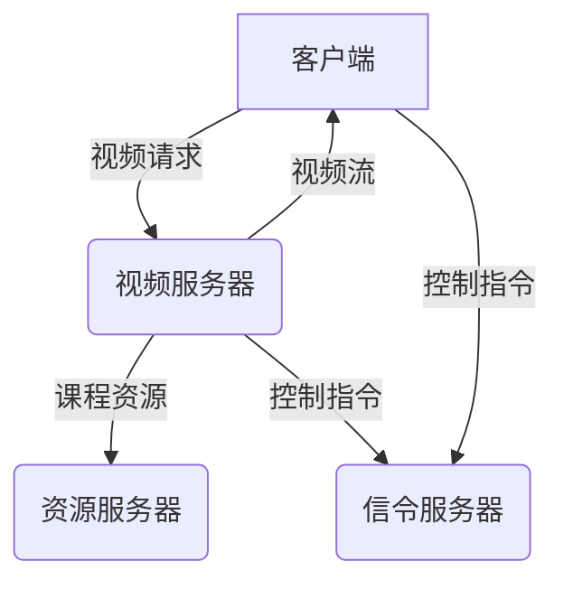

# 基于LAN的视频教学系统详细设计与具体代码实现

## 1.背景介绍

### 1.1 传统教学模式的挑战

在传统的教学模式中,教师通常在固定的教室里面对学生进行面对面的授课。这种模式存在一些固有的局限性:

- 时空限制:学生和教师需要同时在同一个地点,无法实现异地教学。
- 资源利用率低:优质教学资源无法被充分利用和共享。
- 互动性差:课堂互动受到一定限制,学生的个性化需求难以满足。

### 1.2 视频教学的优势

随着互联网和多媒体技术的快速发展,视频教学应运而生,它克服了传统教学的诸多不足:

- 无地域限制:只要有网络,师生双方可以在任何地方进行教学。
- 资源共享:优质教学视频可以被多次重复利用。
- 个性化学习:学生可根据自身情况自主选择学习进度和内容。
- 多元互动:除了传统的师生互动,还可以增加在线答疑、讨论区等互动方式。

### 1.3 局域网视频教学系统的需求

尽管网络视频教学具有诸多优势,但对于一些特殊场合而言,仍需要一套适用于局域网环境的视频教学系统,主要有以下需求:

- 无需外网:某些场景下无法访问互联网,需要在局域网内实现视频教学。
- 高带宽要求:视频传输对带宽要求较高,局域网可以满足这一需求。
- 高安全性:局域网相对封闭,可以有效防止非法访问和数据泄露。
- 多终端支持:需要支持不同终端设备(PC、手机、平板等)访问。

基于以上背景,本文将详细介绍一套基于局域网环境的视频教学系统的设计与实现。

## 2.核心概念与联系

### 2.1 系统架构概览

基于LAN的视频教学系统主要由以下几个核心组件组成:



- 客户端: 运行在不同终端设备上的客户端程序,用于播放视频和发送控制指令。
- 视频服务器: 负责视频流的存储、处理和分发。
- 资源服务器: 存储课程相关资源(课件、练习、作业等)。
- 信令服务器: 处理来自客户端和视频服务器的控制指令。

### 2.2 关键技术点

实现这一系统需要综合运用多种技术:

- 流媒体技术: 视频的实时传输、码率控制、缓存管理等。
- 网络编程: 基于TCP/IP协议栈的可靠数据传输。
- 多线程编程: 高并发连接管理、异步IO处理。
- 数据库技术: 存储课程资源、用户信息等结构化数据。
- Web开发技术: 为系统提供友好的Web管理界面。

## 3.核心算法原理具体操作步骤  

### 3.1 视频编解码

为了实现高效的视频传输,需要对视频进行压缩编码。常用的视频编码标准包括H.264、VP9等。编码步骤如下:

1. 将原始视频分割成一系列帧。
2. 对每一帧进行预处理(降噪、去隔行扫描等)。
3. 进行帧内编码(利用当前帧的冗余信息)和帧间编码(利用前后帧的冗余信息)。
4. 将编码后的视频数据按格式封装。

解码则是编码过程的逆操作。

### 3.2 流式传输控制

为了实现流畅的视频播放,需要对视频流数据进行精细的传输控制:

1. 客户端向服务器发送请求,建立视频流连接。
2. 服务器根据客户端的网络状况,调整视频码率和分辨率。
3. 服务器将编码后的视频数据分成数据包,通过TCP协议可靠传输。
4. 客户端实时接收数据包,进行解码、缓存和播放。
5. 客户端根据缓存状况,向服务器发送控制指令,调整发送速率。

此外,还需要处理带宽波动、网络拥塞等异常情况。

### 3.3 多路视频合成

在一些场景下,需要将来自不同视频源的多路视频合成到同一个窗口内显示,这需要以下步骤:

1. 确定每路视频在合成窗口的位置和大小。
2. 将解码后的视频帧数据填充到预先分配的合成窗口缓冲区中。
3. 对合成窗口缓冲区进行编码,生成新的视频流。
4. 将新的视频流发送给客户端进行播放。

需要注意的是,由于多路视频源的帧率可能不同,因此在合成时需要进行帧率转换,避免画面撕裂。

## 4.数学模型和公式详细讲解举例说明

### 4.1 码率控制算法

视频的码率直接影响视频质量和所需带宽。码率控制算法需要在视频质量和码率之间寻求平衡:

$$
\begin{aligned}
&\text{目标: } &&\min \quad D + \lambda R\\
&\text{受: }&&T_\text{dec} \le T_\text{display}\\
&&&R \le R_\text{channel}\\
&&&\cdots
\end{aligned}
$$

其中:

- $D$表示失真度量,用于衡量视频质量。
- $R$表示码率。
- $\lambda$为码率-失真权衡参数。
- $T_\text{dec}$为解码时间。
- $T_\text{display}$为显示时间间隔,解码时间不得超过显示时间间隔。
- $R_\text{channel}$为信道带宽限制。

这是一个约束优化问题,可以通过动态规划等算法求解。

### 4.2 帧间预测编码

H.264等编码标准利用了帧间的冗余信息,通过对当前帧和参考帧的差值编码,可以有效降低码率:

$$
\begin{aligned}
\text{参考帧: }&P(x,y)\\
\text{当前帧: }&I(x,y)\\
\text{残差帧: }&R(x,y) = I(x,y) - P(x',y')\\
&\text{对残差帧R进行编码}
\end{aligned}
$$

其中$(x',y')$是通过运动估计得到的$(x,y)$像素在参考帧中的位置。

帧间预测需要计算帧间的运动矢量,这是一个计算量很大的操作。许多快速算法(如三步搜索、六线程估计等)被提出来加速这一过程。

### 4.3 视频客户端缓存模型

为了实现流畅的播放,客户端需要一个合理的缓存模型,将视频数据预先缓存,并动态调整缓存大小:

$$
\begin{aligned}
&\text{初始缓存: }&&B_0\\
&\text{缓存区间: }&&[B_\text{min},B_\text{max}]\\
&\text{当前缓存: }&&B_t\\
&\text{码率: }&&R\\
&\text{调整策略: }&&\\
&&\begin{cases}
B_t > B_\text{max},\quad \text{降低码率请求}\\
B_t < B_\text{min},\quad \text{提高码率请求}\\
\end{cases}
\end{aligned}
$$

初始缓存$B_0$需要根据带宽情况估算。缓存区间$[B_\text{min},B_\text{max}]$设置也很重要,过大会增加延迟,过小会影响连续性。当前缓存$B_t$超出区间时,需要向服务器发送调整码率的请求。

## 4.项目实践: 代码实例和详细解释说明

为了展示实际应用,我们给出了一个基于Python的简化视频服务器实现,仅包含核心功能:

```python
import socket
import threading
import cv2

# 视频文件路径
VIDEO_FILE = 'sample.mp4'

# 读取视频文件
cap = cv2.VideoCapture(VIDEO_FILE)

# 创建Socket并绑定端口
server_socket = socket.socket(socket.AF_INET, socket.SOCK_STREAM)
server_socket.bind(('0.0.0.0', 8000))
server_socket.listen(5)
print('Server listening on port 8000...')

# 视频流发送函数
def send_video_stream(conn, addr):
    try:
        print(f'Client {addr} connected.')
        while True:
            ret, frame = cap.read()
            if not ret:
                break
            _, img_encode = cv2.imencode('.jpg', frame)
            data = img_encode.tobytes()
            conn.sendall(data)
    finally:
        conn.close()
        print(f'Client {addr} disconnected.')

# 服务器主循环
while True:
    conn, addr = server_socket.accept()
    thread = threading.Thread(target=send_video_stream, args=(conn, addr))
    thread.start()
```

这个示例代码使用OpenCV读取视频文件,并通过Socket将视频帧以JPEG编码的形式发送给连接的客户端。

1. 首先,我们导入所需的模块,并指定视频文件路径。
2. 使用`cv2.VideoCapture`读取视频文件。
3. 创建服务器Socket,绑定到指定端口并开始监听连接请求。
4. 定义`send_video_stream`函数,用于处理客户端连接。在该函数中,我们逐帧读取视频,对帧进行JPEG编码,然后通过Socket发送给客户端。
5. 在主循环中,服务器不断接受新的客户端连接,并为每个连接创建一个新线程,调用`send_video_stream`函数。

需要注意,这只是一个简单的示例,实际系统中需要考虑更多因素,如多客户端管理、码率控制、错误处理等。

## 5.实际应用场景

基于LAN的视频教学系统可以应用于以下场景:

1. **学校内部教学**: 学校可以构建自己的视频教学平台,实现多媒体辅助教学、在线课程、录播课程等功能。

2. **企业内部培训**: 企业内部培训也可以采用视频直播或录播的方式,降低培训成本,实现资源共享。

3. **医院远程会诊**: 通过视频会议系统,医生可以远程为患者进行诊断和指导,特别适用于急救或者分散的医疗资源。

4. **监狱在线教育**: 为服刑人员提供在线教育,提高其就业技能,有助于日后重新融入社会。

5. **应急指挥调度**: 在自然灾害或重大事故发生时,可以通过视频会议系统进行远程指挥调度,提高应急响应能力。

总的来说,这一系统可以广泛应用于教育培训、医疗卫生、应急管理等领域,极大提高了资源利用效率。

## 6.工具和资源推荐  

在开发基于LAN的视频教学系统时,可以使用以下工具和资源:

### 6.1 开发工具

- **FFmpeg**: 跨平台的多媒体框架,提供了强大的视频编解码功能。
- **GStreamer**: 开源的多媒体框架,支持多种插件和协议。
- **OpenCV**: 计算机视觉库,可用于视频捕获、处理和显示。
- **WebRTC**: Web实时通信技术,可用于浏览器间的视频传输。

### 6.2 编程语言和框架

- **Python**: 功能强大的解释型语言,有多个视频处理库可用。
- **C/C++**: 性能优异,适合编写高效的视频编解码器和流媒体服务器。
- **Java/Kotlin**: 跨平台性好,可用于开发Android客户端应用。
- **Swift/Objective-C**: 适合开发iOS客户端应用。
- **Node.js**: 可用于开发基于Web的视频应用。

### 6.3 开源项目

- **Red5**: 开源的流媒体服务器,支持多种协议和编码格式。
- **nginx-rtmp-module**: Nginx的RTMP模块,可以构建流媒体服务器。
- **jitsi**: 开源的视频会议系统,支持WebRTC。
- **BigBlueButton**: 开源的在线学习平台,提供了视频会议、屏幕共享等功能。

### 6.4 在线资源

-