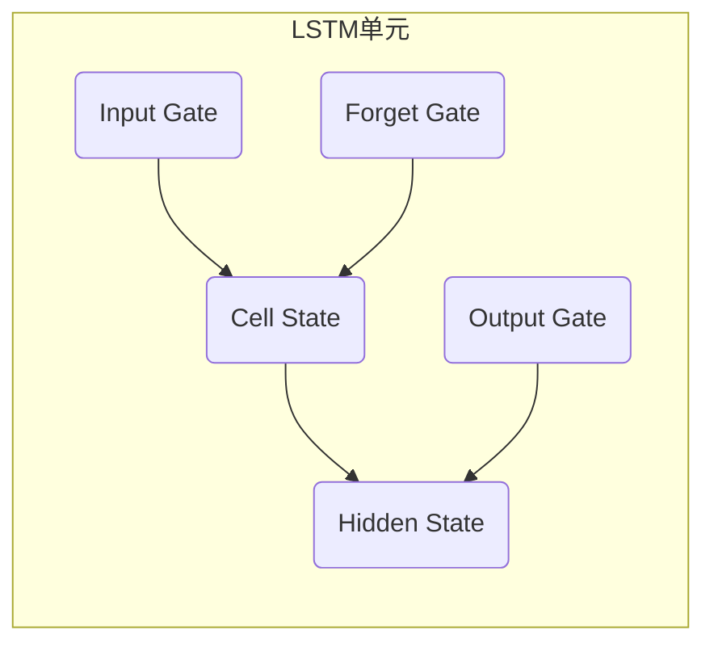

# 基于LSTM完成对英文词性标注的设计与实现

## 1.背景介绍

### 1.1 词性标注的重要性

在自然语言处理(NLP)领域中,词性标注是一个基础且关键的任务。它指的是为每个单词分配相应的词性标记,例如名词、动词、形容词等。准确的词性标注对于诸多下游NLP任务至关重要,包括句法分析、语义理解、机器翻译等。因此,设计和实现高效准确的词性标注系统一直是NLP研究的重点之一。

### 1.2 传统词性标注方法的局限性  

早期的词性标注系统主要基于规则和统计模型,如隐马尔可夫模型(HMM)。这些方法虽然在一定程度上有效,但存在一些明显缺陷:

1. 规则库构建成本高,需要大量的人工劳动。
2. 统计模型依赖大量标注语料,且只能学习局部特征。
3. 上下文利用有限,难以捕捉长距离依赖关系。
4. 缺乏迁移和泛化能力,针对新领域需重新标注训练。

### 1.3 LSTM在词性标注中的应用

近年来,深度学习技术在NLP领域取得了卓越的成就。其中,长短期记忆网络(Long Short-Term Memory, LSTM)是一种强大的循环神经网络架构,能够有效捕捉序列数据中的长期依赖关系。LSTM在多个NLP任务中表现出色,如机器翻译、语音识别等,也被成功应用于词性标注任务。

基于LSTM的词性标注系统能够自动从大规模未标注语料中学习特征表示,并利用上下文信息来预测每个单词的词性,从而克服了传统方法的诸多不足。因此,本文将重点介绍基于LSTM的英文词性标注系统的设计与实现。

## 2.核心概念与联系

### 2.1 LSTM网络结构

LSTM是一种特殊的循环神经网络(RNN),专门设计用于解决长期依赖问题。不同于传统的RNN,LSTM通过精心设计的门控机制,能够有效地控制细胞状态的传递和更新,从而捕获长期依赖关系。

LSTM网络的核心组成部分包括:

- 遗忘门(Forget Gate): 控制从上一时刻细胞状态传递的程度。
- 输入门(Input Gate): 控制当前输入和上一状态的融合程度。
- 输出门(Output Gate): 控制细胞状态对隐藏状态的影响程度。

这些门控机制的协同工作,使LSTM能够灵活地控制信息流,从而解决梯度消失或爆炸的问题。下面是LSTM单元结构的示意图:

### 2.2 词性标注任务

词性标注是给定一个句子序列,为其中每个单词预测一个对应的词性标记的过程。形式上,可以将其视为一个序列标注问题,即将输入序列 $X=\{x_1,x_2,...,x_n\}$ 映射到相同长度的标记序列 $Y=\{y_1,y_2,...,y_n\}$。

通常,我们使用one-hot编码或分布式词向量来表示输入单词 $x_i$,而输出 $y_i$ 则是一个多分类问题,对应着词性标记集合中的某个标记。LSTM能够很好地解决这种序列到序列(Sequence-to-Sequence)的映射问题。

### 2.3 LSTM在词性标注中的应用

将LSTM应用于词性标注任务时,通常会构建一个词性标注模型,其中包含以下几个关键组成部分:

1. **词嵌入层(Word Embedding Layer)**: 将输入单词序列映射为分布式词向量表示。
2. **LSTM层**: 对词向量序列进行编码,捕捉上下文信息和长期依赖关系。
3. **全连接层(Dense Layer)**: 将LSTM的隐藏状态映射到词性标记空间。
4. **解码层(Decoding Layer)**: 对全连接层的输出进行解码,输出预测的词性标记序列。
5. **损失函数(Loss Function)**: 通常使用交叉熵损失函数来计算预测和真实标记序列之间的误差。
6. **优化器(Optimizer)**: 使用随机梯度下降等优化算法,根据损失函数的梯度更新模型参数。

通过有监督的训练过程,LSTM词性标注模型能够从大规模标注语料中自动学习特征表示和上下文依赖关系,从而实现准确的词性标注。

## 3.核心算法原理具体操作步骤

在这一部分,我们将详细介绍基于LSTM的英文词性标注系统的核心算法原理和具体实现步骤。

### 3.1 数据预处理

在训练LSTM词性标注模型之前,需要对输入数据进行适当的预处理,包括:

1. **语料处理**: 获取标准的英文词性标注语料,如Penn Treebank语料库。
2. **分词和标注**: 将语料分割为单词序列和对应的词性标记序列。
3. **构建词表**: 统计语料中出现的所有单词,构建词表(vocabulary),将单词映射为唯一的索引表示。
4. **构建标签表**: 统计语料中出现的所有词性标记,构建标签表(label set),将标签映射为唯一的索引表示。
5. **数据分割**: 将预处理后的数据分割为训练集、验证集和测试集。

### 3.2 模型构建

接下来,我们将构建LSTM词性标注模型的核心部分。以下是关键步骤:

1. **定义模型输入**: 输入是一个形状为(batch_size, sequence_length)的整数张量,表示输入单词序列的索引表示。
2. **词嵌入层**: 将输入单词索引通过词嵌入层转换为分布式词向量表示,形状为(batch_size, sequence_length, embedding_dim)。
3. **LSTM层**: 将词向量序列输入到LSTM层,获取最后一个时间步的隐藏状态,形状为(batch_size, lstm_units)。LSTM层可以是单层或多层堆叠。
4. **全连接层**: 将LSTM的隐藏状态输入到全连接层,输出形状为(batch_size, num_labels),其中num_labels是标签数量。
5. **解码层**: 对全连接层的输出进行解码,例如使用softmax激活函数,获得每个单词对应的词性标记的概率分布。

在模型构建过程中,还需要定义损失函数(如交叉熵损失)、优化器(如Adam优化器)和评估指标(如准确率)。

### 3.3 模型训练

定义好模型结构后,我们可以开始在训练数据上训练LSTM词性标注模型。训练步骤如下:

1. **准备训练数据**: 将训练集数据转换为模型可接受的输入格式,即(input_sequences, label_sequences)对。
2. **模型编译**: 使用定义好的损失函数、优化器和评估指标编译模型。
3. **模型训练**: 调用模型的fit()函数,将训练数据输入到模型中进行训练。可以设置合适的epoch数、batch_size等超参数。
4. **模型评估**: 在训练过程中,使用验证集periodically评估模型的性能,防止过拟合。
5. **模型保存**: 训练完成后,保存模型权重以供后续使用。

### 3.4 模型评估和预测

在完成模型训练后,我们可以在测试集上评估模型的性能,并使用训练好的模型进行词性标注预测。具体步骤如下:

1. **准备测试数据**: 将测试集数据转换为模型可接受的输入格式,即input_sequences。
2. **加载模型权重**: 加载保存的模型权重。
3. **模型评估**: 在测试集上调用模型的evaluate()函数,获取模型在测试集上的性能指标,如准确率等。
4. **词性标注预测**: 使用模型的predict()函数,对输入的单词序列进行词性标注预测,获得预测的标记序列。

通过以上步骤,我们就可以全面地评估LSTM词性标注模型的性能,并将其应用于实际的词性标注任务。

## 4.数学模型和公式详细讲解举例说明

在这一部分,我们将深入探讨LSTM词性标注系统中涉及的数学模型和公式,并通过具体示例进行详细说明。

### 4.1 LSTM单元计算过程

LSTM单元是整个LSTM网络的核心部分,其计算过程包括多个门控机制的协同工作。下面我们将分步骤介绍LSTM单元在时间步t的计算过程:

1. **遗忘门(Forget Gate)**: 决定从上一时间步的细胞状态 $C_{t-1}$ 中保留和遗忘哪些信息。计算公式为:

$$f_t = \sigma(W_f \cdot [h_{t-1}, x_t] + b_f)$$

其中, $\sigma$ 是sigmoid激活函数, $W_f$ 和 $b_f$ 分别是遗忘门的权重和偏置, $h_{t-1}$ 是上一时间步的隐藏状态, $x_t$ 是当前时间步的输入。

2. **输入门(Input Gate)**: 决定从当前输入 $x_t$ 和上一时间步的隐藏状态 $h_{t-1}$ 中获取多少信息,并更新细胞状态。分为两部分计算:

$$i_t = \sigma(W_i \cdot [h_{t-1}, x_t] + b_i)$$
$$\tilde{C}_t = \tanh(W_C \cdot [h_{t-1}, x_t] + b_C)$$

其中, $i_t$ 是输入门的激活值, $\tilde{C}_t$ 是候选细胞状态,用于更新细胞状态。

3. **细胞状态更新(Cell State Update)**: 根据遗忘门和输入门的输出,更新细胞状态:

$$C_t = f_t \odot C_{t-1} + i_t \odot \tilde{C}_t$$

其中, $\odot$ 表示元素乘积运算。

4. **输出门(Output Gate)**: 决定细胞状态对当前时间步隐藏状态的影响程度:

$$o_t = \sigma(W_o \cdot [h_{t-1}, x_t] + b_o)$$
$$h_t = o_t \odot \tanh(C_t)$$

其中, $o_t$ 是输出门的激活值, $h_t$ 是当前时间步的隐藏状态。

通过上述计算过程,LSTM单元能够灵活地控制信息流动,从而有效捕捉长期依赖关系。在词性标注任务中,LSTM层的最后一个时间步的隐藏状态 $h_T$ 通常会被传递到后续的全连接层,用于预测每个单词的词性标记。

### 4.2 交叉熵损失函数

在LSTM词性标注系统中,我们通常使用交叉熵损失函数来计算预测的标记序列与真实标记序列之间的误差。对于单个样本,交叉熵损失的计算公式如下:

$$\text{Loss} = -\sum_{i=1}^{N} y_i \log(\hat{y}_i)$$

其中, $N$ 是标签数量, $y_i$ 是真实标签的one-hot编码表示, $\hat{y}_i$ 是模型预测的概率分布。

对于整个训练集,我们需要计算所有样本的平均损失:

$$\text{Total Loss} = \frac{1}{M}\sum_{j=1}^{M}\text{Loss}_j$$

其中, $M$ 是训练集中样本的总数, $\text{Loss}_j$ 是第j个样本的交叉熵损失。

在训练过程中,我们的目标是通过优化算法(如随机梯度下降)来最小化总损失,从而使模型的预测尽可能接近真实标记。

### 4.3 实例说明

为了更好地理解LSTM词性标注系统的数学模型和公式,我们将通过一个具体实例进行说明。

假设我们有一个简单的句子 "The cat sat on the mat"。其对应的单词序列为:

$$X = \{\text{The}, \text{cat}, \text{sat}, \text{on}, \text{the}, \text{