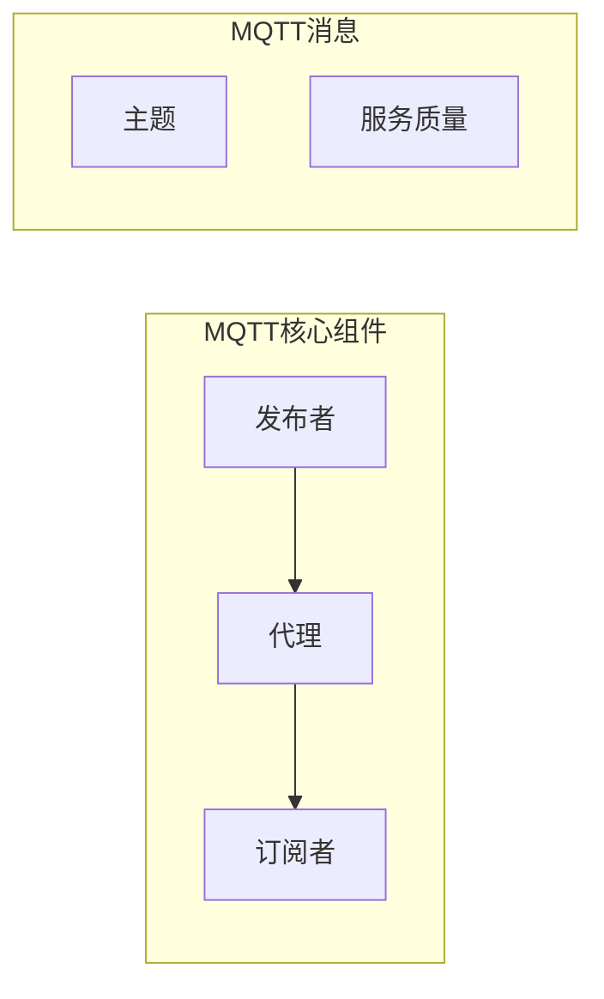

# 基于MQTT的物联网数据采集架构

作者：禅与计算机程序设计艺术

## 1. 背景介绍

### 1.1 物联网数据采集的挑战

随着物联网技术的飞速发展，越来越多的设备接入互联网，产生了海量的数据。如何高效、可靠地采集这些数据成为物联网应用的关键挑战。传统的HTTP协议在面对海量设备连接、低带宽、不稳定的网络环境时显得力不从心。

### 1.2 MQTT协议的优势

MQTT（Message Queuing Telemetry Transport，消息队列遥测传输）协议是一种轻量级的消息发布/订阅协议，专为物联网设备之间的通信而设计。MQTT协议具有以下优势，使其成为物联网数据采集的理想选择：

* **轻量级**: MQTT协议报文结构简单，占用带宽小，非常适合资源受限的物联网设备。
* **发布/订阅模式**: MQTT采用发布/订阅模式，允许多个客户端同时订阅和发布消息，实现高效的数据传输。
* **QoS机制**: MQTT提供三种服务质量（QoS）级别，确保消息可靠传输，满足不同应用场景的需求。
* **低功耗**: MQTT协议支持设备休眠模式，可以有效降低设备功耗。

### 1.3 MQTT在物联网数据采集中的应用

MQTT协议广泛应用于各种物联网数据采集场景，例如：

* **智能家居**:  采集传感器数据，例如温度、湿度、光照等，实现智能控制和自动化。
* **工业物联网**:  采集设备运行数据，例如温度、压力、流量等，实现设备监控和预测性维护。
* **智慧城市**:  采集交通、环境、能源等数据，实现城市智能化管理。

## 2. 核心概念与联系

### 2.1 MQTT核心组件

MQTT协议涉及三个核心组件：

* **发布者（Publisher）**:  负责发布消息的客户端，例如传感器、设备等。
* **订阅者（Subscriber）**:  负责接收消息的客户端，例如数据处理平台、应用程序等。
* **代理（Broker）**:  负责接收发布者发布的消息，并将消息转发给相应的订阅者。

### 2.2 MQTT消息主题

MQTT消息主题使用分层结构，例如 "sensor/temperature/livingroom"，不同层级之间用斜杠 "/" 分隔。订阅者可以通过订阅特定的主题来接收感兴趣的消息。

### 2.3 MQTT消息服务质量（QoS）

MQTT提供三种服务质量（QoS）级别：

* **QoS 0**:  至多一次，消息只发送一次，不保证送达。
* **QoS 1**:  至少一次，消息至少发送一次，可能会重复送达。
* **QoS 2**:  只有一次，消息只发送一次，并保证送达。

### 2.4 MQTT核心概念关系图



## 3. 核心算法原理具体操作步骤

### 3.1 发布者发布消息流程

1.  发布者与MQTT代理建立连接。
2.  发布者发布消息到指定的主题。
3.  MQTT代理接收消息，并根据消息的QoS级别进行处理。
4.  MQTT代理将消息转发给订阅该主题的订阅者。

### 3.2 订阅者接收消息流程

1.  订阅者与MQTT代理建立连接。
2.  订阅者订阅感兴趣的主题。
3.  当MQTT代理收到发布到该主题的消息时，会将消息转发给订阅者。
4.  订阅者接收消息并进行处理。

## 4. 数学模型和公式详细讲解举例说明

MQTT协议本身不涉及复杂的数学模型和公式，但我们可以通过一些指标来评估MQTT数据采集系统的性能：

* **消息吞吐量**:  单位时间内MQTT代理可以处理的消息数量。
* **消息延迟**:  从发布者发布消息到订阅者接收消息的时间间隔。
* **消息丢失率**:  发布的消息中未被成功接收的比例。

## 5. 项目实践：代码实例和详细解释说明

### 5.1 基于Python的MQTT数据采集示例

以下是一个使用Python语言和paho-mqtt库实现的简单MQTT数据采集示例：

```python
import paho.mqtt.client as mqtt

# MQTT代理地址
MQTT_BROKER = "mqtt.example.com"
# MQTT代理端口
MQTT_PORT = 1883
# MQTT主题
MQTT_TOPIC = "sensor/temperature"

# 创建MQTT客户端
client = mqtt.Client()

# 连接MQTT代理
client.connect(MQTT_BROKER, MQTT_PORT, 60)

# 定义消息回调函数
def on_message(client, userdata, msg):
    # 打印接收到的消息
    print(f"Received message: {msg.payload.decode()} on topic: {msg.topic}")

# 设置消息回调函数
client.on_message = on_message

# 订阅主题
client.subscribe(MQTT_TOPIC)

# 开始循环监听消息
client.loop_forever()
```

**代码解释**:

1.  首先，我们导入paho-mqtt库，并定义MQTT代理地址、端口和主题。
2.  然后，我们创建MQTT客户端，并连接到MQTT代理。
3.  接着，我们定义一个消息回调函数 `on_message`，用于处理接收到的消息。
4.  我们使用 `client.on_message` 将消息回调函数注册到MQTT客户端。
5.  我们使用 `client.subscribe` 订阅指定的主题。
6.  最后，我们使用 `client.loop_forever` 开始循环监听消息。

### 5.2 数据可视化

我们可以使用数据可视化工具，例如Grafana，将采集到的数据进行可视化展示，方便用户进行分析和监控。

## 6. 实际应用场景

MQTT协议广泛应用于各种物联网数据采集场景，例如：

* **智能家居**:  智能家居系统可以使用MQTT协议采集传感器数据，例如温度、湿度、光照等，实现智能控制和自动化。
* **工业物联网**:  工业物联网系统可以使用MQTT协议采集设备运行数据，例如温度、压力、流量等，实现设备监控和预测性维护。
* **智慧城市**:  智慧城市系统可以使用MQTT协议采集交通、环境、能源等数据，实现城市智能化管理。

## 7. 工具和资源推荐

* **MQTT代理**:  EMQX、Mosquitto、HiveMQ
* **MQTT客户端库**:  paho-mqtt (Python)、Eclipse Paho (Java)、MQTT.js (JavaScript)
* **数据可视化工具**:  Grafana、ThingsBoard

## 8. 总结：未来发展趋势与挑战

MQTT协议作为一种轻量级、高效、可靠的消息协议，在物联网数据采集领域得到了广泛应用。未来，随着物联网技术的不断发展，MQTT协议将面临以下挑战：

* **安全性**:  随着物联网设备数量的增加，安全问题日益突出，MQTT协议需要进一步加强安全机制，例如数据加密、身份认证等。
* **可扩展性**:  未来物联网设备数量将持续增长，MQTT协议需要不断提升可扩展性，以应对海量设备连接和数据传输的需求。
* **互操作性**:  目前市场上存在多种不同的MQTT代理和客户端实现，不同厂商之间的互操作性问题需要得到解决。

## 9. 附录：常见问题与解答

### 9.1 MQTT协议与HTTP协议的区别？

| 特性    | MQTT                                                         | HTTP                                                          |
| :------ | :----------------------------------------------------------- | :----------------------------------------------------------- |
| 模式    | 发布/订阅                                                     | 请求/响应                                                     |
| 连接方式 | 持久连接                                                     | 短连接                                                         |
| 报文大小 | 轻量级，报文结构简单                                             | 较重，报文结构复杂                                             |
| 应用场景 | 适用于资源受限的设备，例如传感器、嵌入式设备                     | 适用于服务器端应用，例如网站、API                           |

### 9.2 MQTT协议如何保证消息可靠传输？

MQTT协议通过服务质量（QoS）机制来保证消息可靠传输。QoS 0级别不保证消息送达，QoS 1级别保证消息至少送达一次，QoS 2级别保证消息只送达一次。

### 9.3 如何选择合适的MQTT代理？

选择MQTT代理需要考虑以下因素：

* **性能**:  消息吞吐量、消息延迟、连接数等。
* **功能**:  QoS支持、安全机制、集群功能等。
* **成本**:  开源免费、商业收费等。
