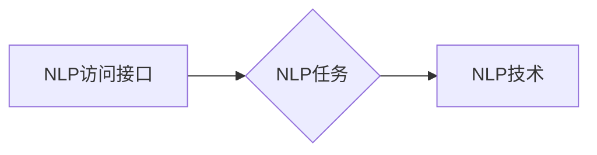

# 基于NPL的自然语言处理访问接口设计与实现

作者：禅与计算机程序设计艺术

## 1. 背景介绍

### 1.1 自然语言处理技术的发展历程

自然语言处理（Natural Language Processing, NLP）作为人工智能领域的一个重要分支，其目标是让计算机能够理解和处理人类语言，实现人机交互的终极目标。自20世纪50年代图灵测试提出以来，NLP技术经历了规则匹配、统计学习和深度学习三个主要阶段，如今已取得了令人瞩目的成就，并在各个领域得到广泛应用。

### 1.2 自然语言处理访问接口的需求背景

随着NLP技术的快速发展和应用普及，越来越多的开发者和企业需要将NLP能力集成到自己的应用系统中。然而，构建和维护一个高效、稳定、易用的NLP访问接口并非易事，需要考虑诸多因素，例如：

*   **高性能**:  NLP任务通常计算密集型，需要高效的算法和硬件支持，以保证接口的响应速度和吞吐量。
*   **可扩展性**: 随着业务量的增长，接口需要能够灵活地扩展，以满足不断增长的需求。
*   **易用性**: 接口应该易于使用和集成，降低开发者的使用门槛。
*   **安全性**: 接口需要保障数据的安全性和隐私性，防止恶意攻击和数据泄露。

### 1.3 本文目标

本文旨在探讨如何设计和实现一个基于NLP的自然语言处理访问接口，以满足上述需求。文章将从以下几个方面展开：

*   核心概念与联系
*   核心算法原理及操作步骤
*   数学模型和公式讲解
*   项目实践：代码实例和详细解释
*   实际应用场景
*   工具和资源推荐
*   总结：未来发展趋势与挑战
*   附录：常见问题与解答

## 2. 核心概念与联系

### 2.1 自然语言处理访问接口

自然语言处理访问接口（Natural Language Processing API, NLP API）是指提供NLP功能的应用程序接口（Application Programming Interface, API）。通过调用NLP API，开发者可以方便地将NLP功能集成到自己的应用系统中，而无需自己构建和维护NLP模型。

### 2.2 常见的NLP任务

NLP API通常提供以下几种常见的NLP任务：

*   **文本预处理**:  包括分词、词性标注、命名实体识别、句法分析等。
*   **文本表示**: 将文本转换为计算机可以处理的向量表示，例如词袋模型、TF-IDF、Word2Vec等。
*   **文本分类**:  将文本归类到预定义的类别中，例如情感分析、垃圾邮件识别等。
*   **文本相似度**: 计算两个文本之间的相似程度，例如问答系统、文本聚类等。
*   **机器翻译**: 将一种语言的文本翻译成另一种语言的文本。
*   **文本生成**:  根据输入的文本或指令生成新的文本，例如聊天机器人、机器写作等。

### 2.3 核心概念之间的联系

下图展示了NLP访问接口、NLP任务和NLP技术之间的关系：



*   NLP访问接口是提供NLP功能的接口，其底层依赖于各种NLP技术。
*   NLP任务是具体的NLP应用场景，例如文本分类、机器翻译等。
*   NLP技术是实现NLP任务的算法和模型，例如深度学习、统计学习等。

## 3. 核心算法原理及操作步骤

### 3.1 文本预处理

#### 3.1.1 分词

分词是将连续的文本序列分割成单个词语的过程。例如，将句子“我喜欢学习自然语言处理” 分割成“我”、“喜欢”、“学习”、“自然语言处理”等词语。

常见的分词算法包括：

*   基于规则的分词方法：根据预定义的规则进行分词，例如正向最大匹配法、逆向最大匹配法等。
*   基于统计的分词方法：利用统计信息进行分词，例如隐马尔可夫模型（Hidden Markov Model, HMM）、条件随机场（Conditional Random Field, CRF）等。
*   基于深度学习的分词方法：利用神经网络进行分词，例如BiLSTM-CRF等。

#### 3.1.2 词性标注

词性标注是为每个词语标注其词性的过程。例如，将句子“我喜欢学习自然语言处理” 中的每个词语标注词性，得到“我/rr 喜欢/vv 学习/vv 自然语言处理/nz”。

常见的词性标注算法包括：

*   基于规则的词性标注方法：根据预定义的规则进行词性标注。
*   基于统计的词性标注方法：利用统计信息进行词性标注，例如HMM、CRF等。
*   基于深度学习的词性标注方法：利用神经网络进行词性标注，例如BiLSTM-CRF等。

#### 3.1.3 命名实体识别

命名实体识别（Named Entity Recognition, NER）是从文本中识别出命名实体的过程。命名实体是指具有特定意义的实体，例如人名、地名、机构名等。

常见的命名实体识别算法包括：

*   基于规则的命名实体识别方法：根据预定义的规则进行命名实体识别。
*   基于统计的命名实体识别方法：利用统计信息进行命名实体识别，例如HMM、CRF等。
*   基于深度学习的命名实体识别方法：利用神经网络进行命名实体识别，例如BiLSTM-CRF等。

### 3.2 文本表示

#### 3.2.1 词袋模型

词袋模型（Bag-of-Words Model, BoW）是一种简单的文本表示方法，它将文本表示成一个向量，向量的每个元素表示一个词语在文本中出现的次数。

例如，对于文本“我喜欢学习自然语言处理”，其词袋模型表示为：

```
{
    "我": 1,
    "喜欢": 1,
    "学习": 1,
    "自然语言处理": 1
}
```

#### 3.2.2 TF-IDF

TF-IDF（Term Frequency-Inverse Document Frequency）是一种用于信息检索与数据挖掘的常用加权技术。它是一种统计方法，用以评估一字词对于一个文件集或一个语料库中的其中一份文件的重要程度。字词的重要性随着它在文件中出现的次数成正比增加，但同时会随着它在语料库中出现的频率成反比下降。

TF-IDF 的计算公式如下：

```
TF-IDF(t, d) = TF(t, d) * IDF(t)
```

其中：

*   **TF(t, d)**：词语 t 在文档 d 中出现的频率。
*   **IDF(t)**：逆文档频率，用于衡量词语 t 的普遍程度。

#### 3.2.3 Word2Vec

Word2Vec 是一种用于学习词嵌入的模型。它将每个词语映射到一个低维向量空间中的一个向量，并且语义上相似的词语在向量空间中彼此靠近。

Word2Vec 有两种模型架构：

*   **CBOW（Continuous Bag-of-Words）**:  根据上下文词语预测目标词语。
*   **Skip-gram**:  根据目标词语预测上下文词语。

### 3.3 文本分类

#### 3.3.1 朴素贝叶斯分类器

朴素贝叶斯分类器（Naive Bayes Classifier）是一种基于贝叶斯定理的概率分类器。它假设每个特征之间相互独立，即一个特征的出现与其他特征的出现无关。

#### 3.3.2 支持向量机

支持向量机（Support Vector Machine, SVM）是一种监督学习模型，用于分类和回归分析。它在特征空间中找到一个最优超平面，将不同类别的样本分开。

#### 3.3.3 深度学习模型

深度学习模型，例如卷积神经网络（Convolutional Neural Network, CNN）和循环神经网络（Recurrent Neural Network, RNN），也可以用于文本分类。

### 3.4 文本相似度

#### 3.4.1 余弦相似度

余弦相似度（Cosine Similarity）是一种常用的文本相似度计算方法，它计算两个向量之间夹角的余弦值。

#### 3.4.2 欧式距离

欧式距离（Euclidean Distance）是计算两个向量之间距离的一种方法。

### 3.5 机器翻译

#### 3.5.1 统计机器翻译

统计机器翻译（Statistical Machine Translation, SMT）是一种基于统计模型的机器翻译方法。

#### 3.5.2 神经机器翻译

神经机器翻译（Neural Machine Translation, NMT）是一种基于神经网络的机器翻译方法。

### 3.6 文本生成

#### 3.6.1 循环神经网络

循环神经网络（Recurrent Neural Network, RNN）是一种用于处理序列数据的神经网络。

#### 3.6.2 Transformer

Transformer 是一种基于注意力机制的神经网络架构，在自然语言处理领域取得了很好的效果。

## 4. 数学模型和公式详细讲解举例说明

### 4.1 朴素贝叶斯分类器

#### 4.1.1 贝叶斯定理

```
P(A|B) = P(B|A) * P(A) / P(B)
```

其中：

*   **P(A|B)**：在事件 B 发生的情况下，事件 A 发生的概率。
*   **P(B|A)**：在事件 A 发生的情况下，事件 B 发生的概率。
*   **P(A)**：事件 A 发生的概率。
*   **P(B)**：事件 B 发生的概率。

#### 4.1.2 朴素贝叶斯分类器的数学模型

```
P(c|x) = P(x|c) * P(c) / P(x)
```

其中：

*   **P(c|x)**：在给定文本 x 的情况下，文本属于类别 c 的概率。
*   **P(x|c)**：在类别 c 中，出现文本 x 的概率。
*   **P(c)**：类别 c 出现的概率。
*   **P(x)**：文本 x 出现的概率。

#### 4.1.3 举例说明

假设我们有一个文本分类任务，需要将文本分类为“体育”和“娱乐”两类。我们有一个训练数据集，其中包含了一些文本及其对应的类别。

| 文本 | 类别 |
|---|---|
| 中国队赢得了比赛 | 体育 |
| 周杰伦发布了新歌 | 娱乐 |
| NBA 总决赛即将开始 | 体育 |

我们可以使用朴素贝叶斯分类器来训练一个模型，用于对新的文本进行分类。

首先，我们需要计算每个类别出现的概率：

```
P(体育) = 2 / 3
P(娱乐) = 1 / 3
```

然后，我们需要计算每个词语在每个类别中出现的概率。例如，词语“中国队”在“体育”类别中出现的概率为：

```
P(中国队|体育) = 1 / 2
```

词语“中国队”在“娱乐”类别中出现的概率为：

```
P(中国队|娱乐) = 0 / 1 = 0
```

最后，我们可以使用贝叶斯定理来计算一个新的文本属于某个类别的概率。例如，对于新的文本“中国队参加了比赛”，我们可以计算它属于“体育”类别的概率：

```
P(体育|中国队参加了比赛) = P(中国队参加了比赛|体育) * P(体育) / P(中国队参加了比赛)
```

其中：

*   **P(中国队参加了比赛|体育)**：在“体育”类别中，出现文本“中国队参加了比赛”的概率。由于“参加了比赛”没有出现在训练数据集中，因此我们可以假设它在“体育”类别中出现的概率为 1。
*   **P(体育)**：类别“体育”出现的概率，为 2/3。
*   **P(中国队参加了比赛)**：文本“中国队参加了比赛”出现的概率。由于这是一个新的文本，因此我们无法直接计算它的概率。

为了计算 **P(中国队参加了比赛)**，我们可以使用拉普拉斯平滑（Laplace Smoothing）：

```
P(中国队参加了比赛) = (1 + 1) / (3 + 2) = 2 / 5
```

因此，我们可以计算出文本“中国队参加了比赛”属于“体育”类别的概率为：

```
P(体育|中国队参加了比赛) = 1 * (2 / 3) / (2 / 5) = 5 / 3
```

同理，我们可以计算出文本“中国队参加了比赛”属于“娱乐”类别的概率为：

```
P(娱乐|中国队参加了比赛) = 0 * (1 / 3) / (2 / 5) = 0
```

因此，我们可以将文本“中国队参加了比赛”分类为“体育”类别。

## 5. 项目实践：代码实例和详细解释说明

### 5.1 项目目标

本项目旨在设计和实现一个基于 NLP 的自然语言处理访问接口，提供文本分类功能。

### 5.2 技术选型

*   编程语言：Python
*   NLP 工具包：Hugging Face Transformers
*   机器学习框架：Scikit-learn

### 5.3 代码实现

#### 5.3.1 安装依赖库

```python
pip install transformers scikit-learn
```

#### 5.3.2 加载预训练模型

```python
from transformers import AutoModelForSequenceClassification, AutoTokenizer

# 加载预训练模型和分词器
model_name = "bert-base-uncased-finetuned-sst-2-english"
model = AutoModelForSequenceClassification.from_pretrained(model_name)
tokenizer = AutoTokenizer.from_pretrained(model_name)
```

#### 5.3.3 定义分类函数

```python
import torch

def classify_text(text):
    """
    对文本进行分类。

    Args:
        text: 待分类的文本。

    Returns:
        分类结果。
    """

    # 对文本进行预处理
    inputs = tokenizer(text, return_tensors="pt")

    # 进行推理
    with torch.no_grad():
        outputs = model(**inputs)

    # 获取预测结果
    logits = outputs.logits
    predicted_class_id = logits.argmax().item()
    predicted_class = model.config.id2label[predicted_class_id]

    return predicted_class
```

#### 5.3.4 测试分类函数

```python
# 测试分类函数
text = "This is a positive sentence."
predicted_class = classify_text(text)
print(f"Predicted class: {predicted_class}")
```

### 5.4 代码解释

*   首先，我们使用 `AutoModelForSequenceClassification.from_pretrained()` 和 `AutoTokenizer.from_pretrained()` 函数加载预训练模型和分词器。
*   然后，我们定义了一个 `classify_text()` 函数，用于对文本进行分类。
*   在 `classify_text()` 函数中，我们首先使用分词器对文本进行预处理，然后使用预训练模型进行推理，最后获取预测结果。
*   最后，我们测试了 `classify_text()` 函数，并打印了预测结果。

## 6. 实际应用场景

### 6.1 情感分析

情感分析可以用于分析用户对产品或服务的评价，例如：

*   **电商平台**: 分析用户对商品的评价，了解用户的情感倾向，从而改进产品或服务。
*   **社交媒体**: 分析用户发布的帖子或评论，了解用户的  情绪变化，从而进行舆情监测。

### 6.2 垃圾邮件识别

垃圾邮件识别可以用于过滤垃圾邮件，例如：

*   **电子邮件服务提供商**:  识别并过滤垃圾邮件，保护用户免受垃圾邮件的骚扰。
*   **社交媒体平台**:  识别并过滤垃圾评论，维护平台的良好氛围。

### 6.3 问答系统

问答系统可以用于回答用户的问题，例如：

*   **搜索引擎**:  根据用户的搜索词条，返回相关的答案。
*   **客服机器人**:  回答用户 frequently asked questions，提供 24/7 的在线客服服务。

## 7. 工具和资源推荐

### 7.1 Hugging Face Transformers

Hugging Face Transformers 是一个用于自然语言处理的开源库，它提供了大量的预训练模型和工具，可以方便地进行文本分类、机器翻译、文本生成等任务。

### 7.2 SpaCy

SpaCy 是一个用于自然语言处理的开源库，它提供了快速、高效的 NLP 工具，可以方便地进行分词、词性标注、命名实体识别等任务。

### 7.3 NLTK

NLTK 是一个用于自然语言处理的 Python 库，它提供了大量的语料库、词典和算法，可以方便地进行文本分析、语义分析等任务。

## 8. 总结：未来发展趋势与挑战

### 8.1 未来发展趋势

*   **预训练模型的规模将越来越大，性能将越来越强**: 随着计算能力的提升和数据的积累，预训练模型的规模将越来越大，性能将越来越强，可以处理更加复杂的 NLP 任务。
*   **多模态 NLP 将成为趋势**: 多模态 NLP 将文本、图像、语音等多种模态的信息融合在一起，可以更好地理解和处理人类语言。
*   **NLP 将更加注重伦理和社会影响**: 随着 NLP 技术的应用越来越广泛，人们越来越关注 NLP 技术的伦理和社会影响，例如算法偏见、隐私保护等问题。

### 8.2 面临的挑战

*   **数据稀缺**:  许多 NLP 任务需要大量的标注数据，而标注数据通常成本高昂。
*   **模型的可解释性**:  深度学习模型通常