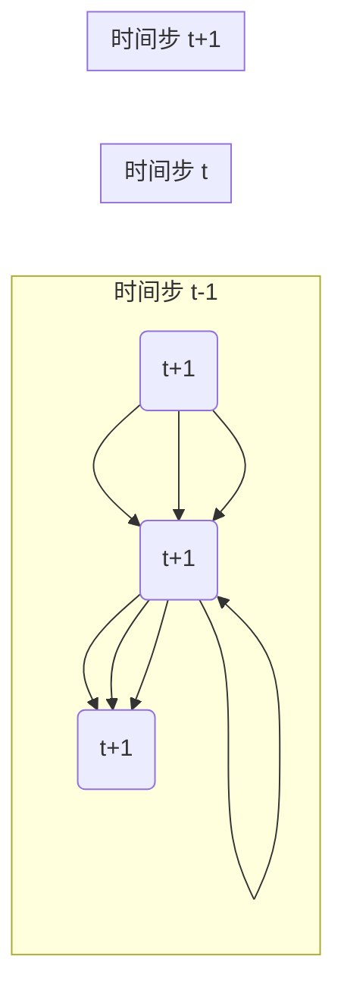

## 基于RNN的智能网络流量控制

作者：禅与计算机程序设计艺术

## 1. 引言：网络流量控制的新纪元

### 1.1 传统的网络流量控制方法及其局限性

传统的网络流量控制方法，例如基于规则的流量整形和基于队列的拥塞控制，在面对日益复杂的网络环境和应用需求时，逐渐显露出其局限性。这些方法往往依赖于预先设定的规则或静态的配置参数，难以适应网络流量的动态变化和突发事件。此外，传统的流量控制方法通常缺乏智能化的分析和决策能力，无法根据网络状态和用户需求进行灵活的流量调度和优化。

### 1.2 RNN在网络流量控制中的应用优势

近年来，深度学习技术，特别是循环神经网络（RNN），在处理序列数据方面展现出强大的能力。网络流量数据本质上是一种时间序列数据，因此RNN非常适合应用于网络流量控制领域。相比于传统的流量控制方法，基于RNN的智能网络流量控制方法具有以下优势：

* **自适应性强:** RNN能够学习网络流量数据的时序特征和规律，并根据网络状态的动态变化自适应地调整流量控制策略。
* **预测能力:** RNN可以预测未来的网络流量趋势，从而提前采取措施，避免网络拥塞的发生。
* **智能化决策:** RNN能够根据网络流量数据和用户需求，智能地进行流量调度和优化，提高网络资源利用率和用户体验。

### 1.3 本文研究内容和结构安排

本文将深入探讨基于RNN的智能网络流量控制方法，并结合实际案例进行分析和讲解。文章结构如下：

* **第二章：核心概念与联系**：介绍RNN的基本概念、原理以及与网络流量控制相关的关键技术。
* **第三章：核心算法原理具体操作步骤**：详细阐述基于RNN的网络流量控制算法的原理和具体操作步骤。
* **第四章：数学模型和公式详细讲解举例说明**：使用数学模型和公式对RNN网络流量控制算法进行建模和分析，并结合实际案例进行讲解。
* **第五章：项目实践：代码实例和详细解释说明**：提供基于Python和TensorFlow的RNN网络流量控制代码实例，并对代码进行详细解释说明。
* **第六章：实际应用场景**：介绍基于RNN的智能网络流量控制方法在实际网络环境中的应用场景。
* **第七章：工具和资源推荐**：推荐一些常用的RNN网络流量控制工具和学习资源。
* **第八章：总结：未来发展趋势与挑战**：总结基于RNN的智能网络流量控制方法的优势和不足，并展望其未来发展趋势和挑战。
* **第九章：附录：常见问题与解答**：解答一些读者在学习和应用RNN网络流量控制过程中可能会遇到的常见问题。

## 2. 核心概念与联系

### 2.1 循环神经网络（RNN）

#### 2.1.1 RNN的基本结构

RNN是一种特殊类型的神经网络，其结构中包含循环连接，允许信息在网络中进行传递和记忆。RNN的基本结构如下图所示：



其中：

* $x(t)$ 表示在时间步 $t$ 的输入数据。
* $h(t)$ 表示在时间步 $t$ 的隐藏状态，它存储了网络对过去信息的记忆。
* $y(t)$ 表示在时间步 $t$ 的输出数据。

#### 2.1.2 RNN的类型

常见的RNN类型包括：

* **简单循环神经网络（Simple RNN）:** 最基本的RNN结构，隐藏状态只有一个。
* **长短期记忆网络（LSTM）:** 一种特殊的RNN结构，能够解决Simple RNN存在的梯度消失和梯度爆炸问题，更适合处理长序列数据。
* **门控循环单元（GRU）:** LSTM的简化版本，参数量更少，训练速度更快。

### 2.2 网络流量控制

#### 2.2.1 网络流量控制的目标

网络流量控制的目标是确保网络资源得到有效利用，并为用户提供高质量的网络服务。具体目标包括：

* **拥塞控制:** 避免网络拥塞的发生，保证网络的稳定运行。
* **流量整形:** 对网络流量进行限制和调整，以满足不同的服务质量需求。
* **负载均衡:** 将网络流量均匀地分配到不同的网络设备上，避免单点过载。

#### 2.2.2 网络流量控制的方法

常见的网络流量控制方法包括：

* **基于规则的流量控制:** 根据预先设定的规则对网络流量进行限制和调整。
* **基于队列的流量控制:** 使用队列来缓存网络数据包，并根据队列长度和优先级进行调度。
* **基于反馈的流量控制:** 根据网络状态和用户反馈信息，动态地调整流量控制策略。

### 2.3 RNN与网络流量控制的联系

RNN非常适合应用于网络流量控制领域，因为它能够学习网络流量数据的时序特征和规律，并根据网络状态的动态变化自适应地调整流量控制策略。具体来说，RNN可以用于：

* **网络流量预测:** 使用历史网络流量数据训练RNN模型，预测未来的网络流量趋势。
* **拥塞控制:** 根据网络流量预测结果，提前采取措施，避免网络拥塞的发生。
* **流量整形:** 根据不同的服务质量需求，使用RNN模型对网络流量进行限制和调整。
* **负载均衡:** 使用RNN模型预测网络设备的负载情况，将网络流量均匀地分配到不同的设备上。

## 3. 核心算法原理具体操作步骤

### 3.1 数据预处理

#### 3.1.1 数据收集

网络流量数据可以通过网络设备（如路由器、交换机）的监控接口收集，也可以使用网络流量分析工具（如tcpdump、Wireshark）进行抓包分析。

#### 3.1.2 数据清洗

收集到的网络流量数据可能包含噪声、异常值和缺失值，需要进行数据清洗以提高数据质量。常用的数据清洗方法包括：

* **缺失值处理:** 使用均值、中位数或插值法填充缺失值。
* **异常值处理:** 使用箱线图、z-score等方法识别和处理异常值。
* **数据平滑:** 使用滑动平均、指数平滑等方法对数据进行平滑处理，减少噪声的影响。

#### 3.1.3 数据归一化

将数据缩放到相同的范围，可以提高模型的训练效率和预测精度。常用的数据归一化方法包括：

* **最小-最大归一化:** 将数据缩放到 [0, 1] 区间。
* **标准化:** 将数据转换为均值为 0，标准差为 1 的分布。

### 3.2 模型构建

#### 3.2.1 选择RNN类型

根据网络流量数据的特点和应用场景，选择合适的RNN类型。例如，如果需要处理长序列数据，可以选择LSTM或GRU；如果数据量较小，可以选择Simple RNN。

#### 3.2.2 确定网络结构

根据网络流量数据的维度和预测目标，确定RNN网络的输入层、隐藏层和输出层的大小。

#### 3.2.3 选择激活函数

选择合适的激活函数可以提高模型的非线性拟合能力。常用的激活函数包括：

* **sigmoid 函数:** 将输出值压缩到 [0, 1] 区间。
* **tanh 函数:** 将输出值压缩到 [-1, 1] 区间。
* **ReLU 函数:** 当输入大于 0 时，输出为输入值本身；当输入小于等于 0 时，输出为 0。

#### 3.2.4 选择损失函数

选择合适的损失函数可以指导模型的训练方向。常用的损失函数包括：

* **均方误差（MSE）:** 用于回归问题，计算预测值与真实值之间差的平方的平均值。
* **平均绝对误差（MAE）:** 用于回归问题，计算预测值与真实值之间差的绝对值的平均值。
* **交叉熵损失函数:** 用于分类问题，计算预测概率分布与真实概率分布之间的差异。

#### 3.2.5 选择优化器

选择合适的优化器可以提高模型的训练效率和泛化能力。常用的优化器包括：

* **随机梯度下降（SGD）:** 每次迭代只使用一个样本更新模型参数。
* **批量梯度下降（BGD）:** 每次迭代使用所有样本更新模型参数。
* **小批量梯度下降（MBGD）:** 每次迭代使用一小部分样本更新模型参数。

### 3.3 模型训练

#### 3.3.1 数据集划分

将数据集划分为训练集、验证集和测试集。训练集用于训练模型参数，验证集用于调整模型超参数，测试集用于评估模型性能。

#### 3.3.2 模型训练

使用训练集数据训练RNN模型，并根据验证集上的性能调整模型超参数。

#### 3.3.3 模型评估

使用测试集数据评估训练好的RNN模型的性能。常用的评估指标包括：

* **准确率:** 预测正确的样本数占总样本数的比例。
* **精确率:** 预测为正例的样本中，真正例的比例。
* **召回率:** 真正例中，被预测为正例的比例。
* **F1 值:** 精确率和召回率的调和平均值。

### 3.4 模型部署

#### 3.4.1 模型保存

将训练好的RNN模型保存到磁盘，以便后续使用。

#### 3.4.2 模型加载

将保存的RNN模型加载到内存，以便进行预测。

#### 3.4.3 模型预测

使用加载的RNN模型对新的网络流量数据进行预测，并根据预测结果采取相应的流量控制措施。

## 4. 数学模型和公式详细讲解举例说明

### 4.1 RNN的数学模型

RNN的数学模型可以表示为：

$$
\begin{aligned}
h_t &= f(W_{xh}x_t + W_{hh}h_{t-1} + b_h) \\
y_t &= g(W_{hy}h_t + b_y)
\end{aligned}
$$

其中：

* $x_t$ 表示在时间步 $t$ 的输入数据。
* $h_t$ 表示在时间步 $t$ 的隐藏状态。
* $y_t$ 表示在时间步 $t$ 的输出数据。
* $W_{xh}$ 表示输入到隐藏层的权重矩阵。
* $W_{hh}$ 表示隐藏层到隐藏层的权重矩阵。
* $W_{hy}$ 表示隐藏层到输出层的权重矩阵。
* $b_h$ 表示隐藏层的偏置向量。
* $b_y$ 表示输出层的偏置向量。
* $f$ 表示隐藏层的激活函数。
* $g$ 表示输出层的激活函数。

### 4.2 RNN网络流量控制的数学模型

假设我们需要预测未来 $T$ 个时间步的网络流量，可以使用以下数学模型：

$$
\hat{y}_{t+1:t+T} = RNN(x_{1:t})
$$

其中：

* $x_{1:t}$ 表示从时间步 1 到时间步 $t$ 的网络流量数据。
* $\hat{y}_{t+1:t+T}$ 表示从时间步 $t+1$ 到时间步 $t+T$ 的网络流量预测值。
* $RNN$ 表示训练好的RNN模型。

### 4.3 举例说明

假设我们有一个网络流量数据集，包含过去 100 个时间步的网络流量数据。我们想使用RNN模型预测未来 10 个时间步的网络流量。

**步骤 1：数据预处理**

* 将数据划分为训练集（前 80 个时间步）、验证集（后 10 个时间步）和测试集（最后 10 个时间步）。
* 对数据进行归一化处理。

**步骤 2：模型构建**

* 选择LSTM作为RNN类型。
* 输入层大小为 1（网络流量数据只有一个维度）。
* 隐藏层大小为 64。
* 输出层大小为 1（预测未来一个时间步的网络流量）。
* 选择tanh作为隐藏层和输出层的激活函数。
* 选择MSE作为损失函数。
* 选择Adam作为优化器。

**步骤 3：模型训练**

* 使用训练集数据训练LSTM模型，并根据验证集上的性能调整模型超参数。

**步骤 4：模型评估**

* 使用测试集数据评估训练好的LSTM模型的性能。

**步骤 5：模型预测**

* 使用训练好的LSTM模型预测未来 10 个时间步的网络流量。

## 5. 项目实践：代码实例和详细解释说明

```python
import tensorflow as tf

# 定义模型参数
input_size = 1
hidden_size = 64
output_size = 1
learning_rate = 0.001

# 创建LSTM模型
model = tf.keras.Sequential([
    tf.keras.layers.LSTM(hidden_size, return_sequences=True, input_shape=(None, input_size)),
    tf.keras.layers.LSTM(hidden_size),
    tf.keras.layers.Dense(output_size)
])

# 定义损失函数和优化器
loss_fn = tf.keras.losses.MeanSquaredError()
optimizer = tf.keras.optimizers.Adam(learning_rate=learning_rate)

# 编译模型
model.compile(loss=loss_fn, optimizer=optimizer)

# 加载数据集
# ...

# 训练模型
model.fit(train_dataset, epochs=10, validation_data=val_dataset)

# 评估模型
model.evaluate(test_dataset)

# 预测未来 10 个时间步的网络流量
predictions = model.predict(test_dataset)
```

**代码解释：**

* 首先，我们定义了模型参数，包括输入层大小、隐藏层大小、输出层大小和学习率。
* 然后，我们使用 `tf.keras.Sequential` 创建了一个LSTM模型。该模型包含两个LSTM层和一个全连接层。
* 接下来，我们定义了损失函数和优化器，并使用 `model.compile` 编译模型。
* 然后，我们加载数据集，并将数据集划分为训练集、验证集和测试集。
* 接下来，我们使用 `model.fit` 训练模型，并使用 `model.evaluate` 评估模型性能。
* 最后，我们使用 `model.predict` 预测未来 10 个时间步的网络流量。

## 6. 实际应用场景

### 6.1 网络带宽动态调整

基于RNN的智能网络流量控制方法可以用于网络带宽的动态调整。例如，在云计算环境中，可以根据虚拟机的负载情况，使用RNN模型预测未来的网络流量需求，并动态地调整虚拟机的网络带宽，以提高资源利用率和用户体验。

### 6.2 网络安全防护

基于RNN的智能网络流量控制方法可以用于网络安全防护。例如，可以训练RNN模型识别恶意网络流量，并在检测到恶意流量时采取相应的防御措施，如阻断流量、隔离受感染设备等。

### 6.3 网络服务质量保障

基于RNN的智能网络流量控制方法可以用于网络服务质量保障。例如，可以根据不同的服务等级协议（SLA），使用RNN模型对网络流量进行分类和优先级排序，以保证高优先级流量的服务质量。

## 7. 工具和资源推荐

### 7.1 TensorFlow

TensorFlow是一个开源的机器学习平台，提供了丰富的API用于构建和训练RNN模型。

### 7.2 Keras

Keras是一个高级神经网络API，可以运行在TensorFlow、CNTK和Theano之上，提供了更简洁易用的API用于构建和训练RNN模型。

### 7.3 scikit-learn

scikit-learn是一个开源的机器学习库，提供了丰富的数据预处理、模型评估和可视化工具。

## 8. 总结：未来发展趋势与挑战

### 8.1 优势

基于RNN的智能网络流量控制方法具有以下优势：

* **自适应性强:** 能够根据网络状态的动态变化自适应地调整流量控制策略。
* **预测能力:** 可以预测未来的网络流量趋势，提前采取措施。
* **智能化决策:** 能够根据网络流量数据和用户需求，智能地进行流量调度和优化。

### 8.2 不足

基于RNN的智能网络流量控制方法也存在一些不足：

* **计算复杂度高:** RNN模型的训练和预测过程计算量较大，需要较高的硬件配置。
* **数据依赖性强:** RNN模型的性能依赖于训练数据的质量和数量。
* **可解释性差:** RNN模型的决策过程难以解释，不利于故障排查和优化。

### 8.3 未来发展趋势

未来，基于RNN的智能网络流量控制方法将朝着以下方向发展：

* **模型轻量化:** 研究更轻量级的RNN模型，降低计算复杂度。
* **数据增强:** 研究数据增强技术，提高模型的泛化能力。
* **可解释性研究:** 研究RNN模型的可解释性方法，提高模型的可信度和可维护性。

## 9. 附录：常见问题与解答

### 9.1 如何选择合适的RNN类型？

选择RNN类型需要考虑以下因素：

* 数据序列长度：LSTM和GRU更适合处理长序列数据。
* 数据量：数据量较小时，可以选择Simple RNN。
* 计算资源：LSTM和