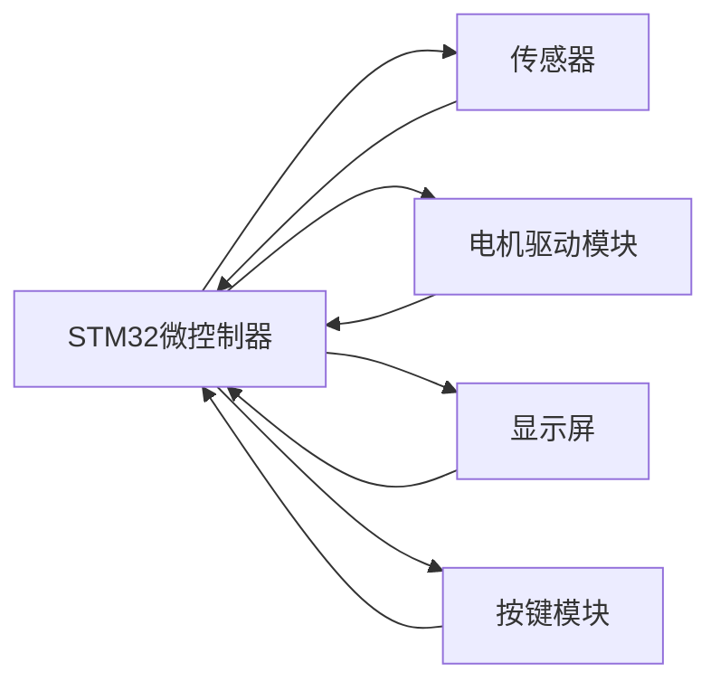

## 基于STM32智能书桌设计与实现

作者：禅与计算机程序设计艺术

## 1. 背景介绍

### 1.1 智能家居的兴起与发展

近年来，随着物联网、人工智能等技术的快速发展，智能家居的概念逐渐走入人们的视野，并迅速成为科技领域的一大热点。智能家居是指利用先进的信息技术、网络技术和自动化控制技术，将家居生活相关的设施集成，构建高效的住宅设施与家庭日程事务的管理系统，提升家居安全性、便利性、舒适性和艺术性。

### 1.2 智能书桌的需求与意义

在智能家居的浪潮下，传统的书桌已经无法满足人们对舒适、健康、高效工作和学习环境的需求。智能书桌作为智能家居的重要组成部分，应运而生。智能书桌可以通过集成传感器、控制器、电机等部件，实现桌面高度调节、灯光亮度调节、坐姿提醒等功能，帮助用户改善工作和学习环境，提升效率和舒适度，预防和缓解颈椎病等职业病。

### 1.3 本文研究内容和目标

本文旨在设计并实现一款基于STM32微控制器的智能书桌，主要研究内容包括：

* 基于STM32的硬件平台搭建，包括传感器、电机、控制电路等。
* 智能书桌控制系统软件设计，包括高度调节、灯光控制、坐姿提醒等功能模块。
* 人机交互界面设计，方便用户操作和使用。

本文目标是实现一款功能完善、性能稳定、成本可控的智能书桌，为用户提供更加舒适、健康、高效的工作和学习环境。

## 2. 核心概念与联系

### 2.1 STM32微控制器

STM32系列32位闪存微控制器使用高性能ARM® Cortex®-M处理器内核，工作频率为72 MHz，具有多种外设，适用于各种应用。

### 2.2 传感器

* **超声波传感器:** 用于测量桌面高度。
* **光敏传感器:** 用于检测环境光线强度，自动调节灯光亮度。
* **人体红外传感器:** 用于检测用户是否离开座位，实现坐姿提醒功能。

### 2.3 电机驱动模块

* **步进电机驱动模块:** 用于控制电机转动，实现桌面高度调节。

### 2.4 显示屏

* **LCD1602液晶显示屏:** 用于显示桌面高度、灯光亮度等信息。

### 2.5 按键模块

* **4x4矩阵键盘:** 用于用户输入指令，控制桌面高度、灯光亮度等。

### 2.6 核心概念联系图



## 3. 核心算法原理具体操作步骤

### 3.1 桌面高度调节算法

#### 3.1.1  算法原理

桌面高度调节采用PID控制算法，根据设定的目标高度和实际高度的偏差，实时调整电机转速，使桌面高度平稳地达到目标值。

#### 3.1.2 操作步骤

1. 获取目标高度值。
2. 读取超声波传感器数据，计算当前桌面高度。
3. 计算目标高度与当前高度的偏差。
4. 根据PID控制算法计算电机转速。
5. 控制电机驱动模块，驱动电机转动，调整桌面高度。
6. 重复步骤2-5，直到桌面高度达到目标值。

### 3.2 灯光控制算法

#### 3.2.1 算法原理

灯光控制采用PWM调光技术，根据环境光线强度，实时调整LED灯的亮度，为用户提供舒适的照明环境。

#### 3.2.2 操作步骤

1. 读取光敏传感器数据，获取环境光线强度。
2. 根据预设的亮度曲线，计算LED灯的PWM占空比。
3. 控制LED灯的PWM输出，调整灯光亮度。

### 3.3 坐姿提醒算法

#### 3.3.1 算法原理

坐姿提醒功能利用人体红外传感器，检测用户是否离开座位。如果用户离开座位一段时间后，系统会发出提醒信号，提醒用户注意休息。

#### 3.3.2 操作步骤

1. 读取人体红外传感器数据，判断用户是否离开座位。
2. 如果用户离开座位，启动计时器。
3. 如果计时器时间到达预设值，发出提醒信号。
4. 如果用户回到座位，停止计时器。

## 4. 数学模型和公式详细讲解举例说明

### 4.1 PID控制算法

PID控制算法是一种常用的自动控制算法，其基本原理是根据系统的实际输出值与期望输出值之间的偏差，利用比例、积分、微分三种控制方式对系统进行控制。

#### 4.1.1 PID控制算法公式

$$
u(t) = K_p e(t) + K_i \int_0^t e(\tau) d\tau + K_d \frac{d}{dt} e(t)
$$

其中：

* $u(t)$ 为控制器的输出信号。
* $e(t)$ 为系统的偏差信号，即期望输出值与实际输出值之差。
* $K_p$ 为比例系数。
* $K_i$ 为积分系数。
* $K_d$ 为微分系数。

#### 4.1.2 PID参数整定

PID参数整定是PID控制算法的关键，需要根据具体的系统特性进行调整。常用的PID参数整定方法有：

* **试凑法:** 通过不断尝试不同的参数组合，找到最佳的控制效果。
* **Ziegler-Nichols法:** 
* **响应曲线法:** 

### 4.2 PWM调光技术

PWM调光技术是一种常用的LED灯调光技术，其基本原理是通过控制LED灯的导通时间来调节LED灯的亮度。

#### 4.2.1 PWM占空比

PWM占空比是指PWM信号中高电平持续时间与PWM信号周期的比值。

$$
Duty Cycle = \frac{T_{on}}{T_{on} + T_{off}}
$$

其中：

* $T_{on}$ 为PWM信号中高电平持续时间。
* $T_{off}$ 为PWM信号中低电平持续时间。

#### 4.2.2 PWM调光原理

通过改变PWM信号的占空比，可以控制LED灯的导通时间，从而调节LED灯的亮度。

## 5. 项目实践：代码实例和详细解释说明

### 5.1 主程序代码

```c
#include "stm32f10x.h"
#include "delay.h"
#include "usart.h"
#include "oled.h"
#include "key.h"
#include "motor.h"
#include "light.h"
#include "ir.h"

int main(void)
{
  // 初始化系统时钟
  SystemInit();

  // 初始化延时函数
  delay_init();

  // 初始化串口
  USART1_Init();

  // 初始化OLED显示屏
  OLED_Init();

  // 初始化按键
  KEY_Init();

  // 初始化电机
  MOTOR_Init();

  // 初始化灯光
  LIGHT_Init();

  // 初始化红外传感器
  IR_Init();

  // 显示欢迎界面
  OLED_ShowString(0, 0, "Welcome to", 16);
  OLED_ShowString(0, 16, "Smart Desk", 16);
  delay_ms(2000);

  // 进入主循环
  while (1)
  {
    // 获取按键值
    u8 key = KEY_Scan(0);

    // 处理按键事件
    switch (key)
    {
    case KEY1_PRES:
      // 桌面高度上升
      MOTOR_Up();
      break;

    case KEY2_PRES:
      // 桌面高度下降
      MOTOR_Down();
      break;

    case KEY3_PRES:
      // 灯光亮度增加
      LIGHT_Up();
      break;

    case KEY4_PRES:
      // 灯光亮度减少
      LIGHT_Down();
      break;

    default:
      break;
    }

    // 检测坐姿
    if (IR_Check() == 1)
    {
      // 用户离开座位，发出提醒
      OLED_ShowString(0, 0, "Please stand up", 16);
    }
    else
    {
      // 用户坐在座位上，清除提醒
      OLED_Clear();
    }

    // 延时
    delay_ms(10);
  }
}
```

### 5.2 代码解释

* 主程序首先初始化系统时钟、延时函数、串口、OLED显示屏、按键、电机、灯光和红外传感器。
* 然后显示欢迎界面。
* 进入主循环后，程序不断扫描按键值，并根据按键值调用相应的函数控制桌面高度、灯光亮度等。
* 程序还会定期检测坐姿，如果用户离开座位一段时间，就会发出提醒。

## 6. 实际应用场景

* **家庭书房:** 智能书桌可以为用户提供更加舒适、健康、高效的家庭书房环境。
* **办公室:** 智能书桌可以帮助用户改善办公环境，提升工作效率，预防和缓解颈椎病等职业病。
* **学校教室:** 智能书桌可以为学生提供更加科学、健康的学习环境。

## 7. 工具和资源推荐

### 7.1 硬件平台

* **STM32F103C8T6开发板:** 
* **超声波传感器模块:** 
* **光敏传感器模块:** 
* **人体红外传感器模块:** 
* **步进电机驱动模块:** 
* **LCD1602液晶显示屏:** 
* **4x4矩阵键盘:** 

### 7.2 软件工具

* **Keil uVision5:** 
* **STM32CubeMX:** 

## 8. 总结：未来发展趋势与挑战

### 8.1 未来发展趋势

* **更加智能化:** 随着人工智能技术的不断发展，智能书桌将会更加智能化，例如可以根据用户的坐姿自动调节桌面高度和灯光亮度，甚至可以根据用户的健康状况提供个性化的健康管理方案。
* **更加人性化:** 智能书桌的设计将会更加人性化，例如可以根据用户的喜好设置不同的桌面主题，提供更加舒适的操作体验。
* **更加个性化:** 智能书桌的功能将会更加个性化，例如可以根据用户的需求定制不同的功能模块，满足用户的个性化需求。

### 8.2 面临的挑战

* **成本控制:** 智能书桌的成本仍然较高，需要进一步降低成本才能更好地普及。
* **技术成熟度:** 智能书桌涉及的技术比较多，需要进一步提高技术的成熟度才能保证产品的稳定性和可靠性。
* **用户接受度:** 智能书桌作为一种新兴产品，需要进一步提高用户的接受度才能更好地推广。

## 9. 附录：常见问题与解答

### 9.1  问：如何调整PID参数？

答：PID参数的调整需要根据具体的系统特性进行，没有一个通用的方法。建议使用试凑法或Ziegler-Nichols法进行参数整定。

### 9.2  问：如何提高桌面高度调节的精度？

答：提高桌面高度调节的精度可以从以下几个方面入手：

* 使用精度更高的超声波传感器。
* 优化PID控制算法。
* 提高电机和电机驱动模块的精度。

### 9.3  问：如何降低智能书桌的成本？

答：降低智能书桌的成本可以从以下几个方面入手：

* 使用成本更低的硬件平台。
* 优化软件设计，减少代码量和硬件资源占用。
* 批量生产，降低生产成本。
