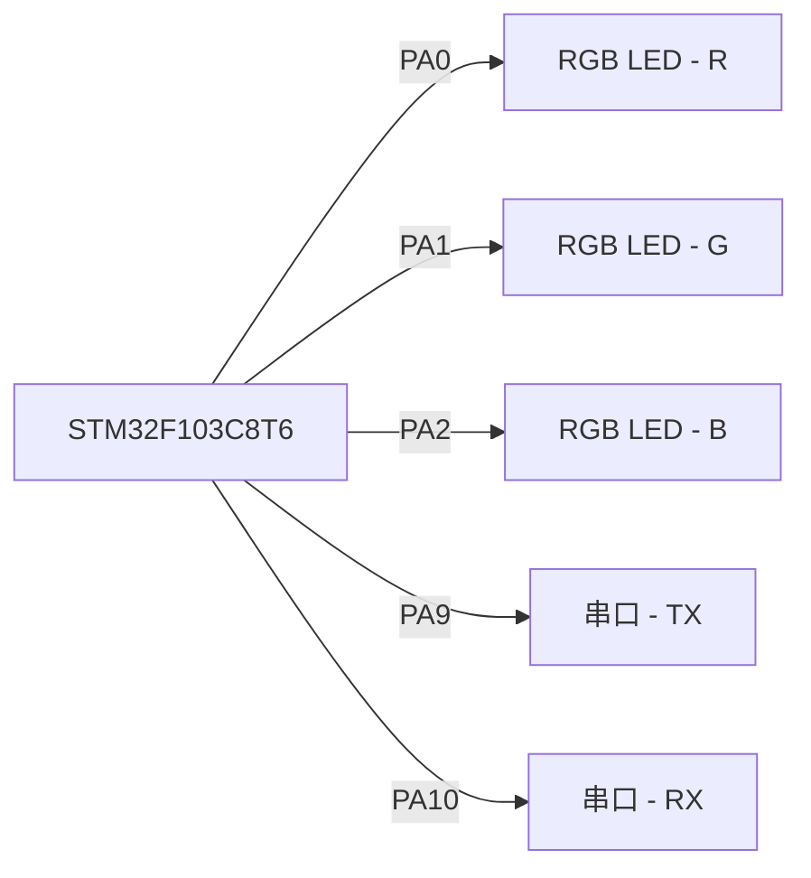

## 基于STM32的多功能氛围灯设计

作者：禅与计算机程序设计艺术

## 1. 引言

### 1.1 氛围灯的兴起与发展

近年来，随着人们对生活品质追求的提高，氛围灯逐渐走进了千家万户。从最初简单的单色灯带，发展到如今功能丰富的智能氛围灯，其技术也在不断进步。氛围灯不仅能够营造舒适的照明环境，还能通过色彩的变化来调节情绪、提升生活情趣。

### 1.2 STM32微控制器概述

STM32系列微控制器是意法半导体（STMicroelectronics）推出的一款高性能、低功耗、功能丰富的32位微控制器。其基于ARM Cortex-M内核架构，拥有丰富的片上外设资源，如定时器、ADC、PWM、USART、SPI、I2C等，能够满足各种应用场景的需求。

### 1.3 本文研究目的及意义

本文旨在基于STM32微控制器设计一款多功能氛围灯，通过软件编程实现多种灯光效果，并探讨其在实际生活中的应用。该设计将融合硬件电路设计、软件编程、灯光控制算法等多方面的知识，具有一定的理论意义和实践价值。

## 2. 核心概念与联系

### 2.1 RGB LED工作原理

RGB LED（Red Green Blue Light Emitting Diode）, 即红绿蓝三色发光二极管，是氛围灯的核心器件。它由三个独立的LED芯片封装在一起，分别发出红、绿、蓝三种颜色的光。通过调节三个LED芯片的亮度比例，可以混合出各种不同的颜色。

RGB LED的控制方式主要有两种：

* **共阳极**: 三个LED的阳极连接在一起，通过控制三个阴极的电流来调节亮度。
* **共阴极**: 三个LED的阴极连接在一起，通过控制三个阳极的电流来调节亮度。

### 2.2 PWM脉冲宽度调制

PWM（Pulse Width Modulation）, 即脉冲宽度调制，是一种常用的数字信号控制模拟电路的方法。通过改变脉冲信号的占空比，可以改变信号的平均电压，从而实现对LED亮度的控制。

STM32微控制器内部集成了硬件PWM模块，可以方便地生成PWM信号。

### 2.3 串口通信协议

串口通信是一种常用的数据传输方式，其具有成本低、实现简单等优点。在本设计中，可以使用串口通信来实现与上位机（如电脑、手机）之间的通信，从而实现对氛围灯的远程控制。

常用的串口通信协议有：

* **RS-232**: 一种全双工通信协议，常用于连接电脑和外设。
* **RS-485**: 一种差分信号传输协议，具有更强的抗干扰能力，常用于工业控制领域。
* **TTL**: 一种单片机常用的通信协议，其逻辑电平与单片机IO口兼容。

### 2.4 软件架构设计

为了实现多功能氛围灯的功能，需要进行合理的软件架构设计。本设计采用模块化设计思想，将整个系统分为以下几个模块：

* **主程序模块**: 负责初始化各个模块，并根据用户的指令调用相应的函数。
* **LED控制模块**: 负责控制RGB LED的亮度和颜色。
* **串口通信模块**: 负责与上位机进行通信，接收用户的控制指令。
* **模式切换模块**: 负责切换不同的灯光模式，如呼吸灯、渐变灯、闪烁灯等。

## 3. 核心算法原理具体操作步骤

### 3.1 RGB LED颜色混合原理

RGB LED的颜色混合遵循加色混色原理，即三种基色光按不同比例混合可以得到各种不同的颜色。

* **红色**: (255, 0, 0)
* **绿色**: (0, 255, 0)
* **蓝色**: (0, 0, 255)
* **黄色**: (255, 255, 0)
* **青色**: (0, 255, 255)
* **紫色**: (255, 0, 255)
* **白色**: (255, 255, 255)
* **黑色**: (0, 0, 0)

在实际应用中，可以通过以下公式计算RGB LED的亮度值:

```
R = (Color >> 16) & 0xFF;
G = (Color >> 8) & 0xFF;
B = Color & 0xFF;
```

其中，Color表示目标颜色值，R、G、B分别表示红色、绿色、蓝色LED的亮度值。

### 3.2 PWM调光原理

PWM调光通过改变脉冲信号的占空比来改变LED的亮度。占空比是指一个周期内高电平时间与总时间的比值。

例如，如果PWM信号的频率为1kHz，占空比为50%，则高电平时间为0.5ms，低电平时间为0.5ms。

```
占空比 = 高电平时间 / 周期
```

在STM32中，可以通过设置定时器的ARR和CCR寄存器来控制PWM信号的频率和占空比。

### 3.3 串口通信数据协议设计

为了实现上位机对氛围灯的控制，需要设计一套串口通信数据协议。在本设计中，采用以下数据格式：

```
帧头 + 命令字 + 数据长度 + 数据 + 校验码
```

* **帧头**: 用于标识数据帧的开始，例如0x55AA。
* **命令字**: 用于标识不同的控制命令，例如0x01表示设置颜色，0x02表示设置亮度。
* **数据长度**: 表示数据域的字节数。
* **数据**: 具体的控制参数，例如颜色值、亮度值等。
* **校验码**: 用于校验数据的完整性，例如可以采用CRC校验。

## 4. 数学模型和公式详细讲解举例说明

### 4.1 呼吸灯效果

呼吸灯效果是指LED的亮度周期性地逐渐增加和减小，如同呼吸一般。

实现呼吸灯效果的数学模型可以使用正弦函数：

```
Brightness = Amplitude * sin(2 * PI * Frequency * Time) + Offset
```

其中：

* **Brightness**: LED的亮度值
* **Amplitude**: 振幅，决定了亮度变化的范围
* **Frequency**: 频率，决定了呼吸的快慢
* **Time**: 时间
* **Offset**: 偏移量，决定了亮度的初始值

例如，如果要实现一个亮度变化范围为0-255，频率为1Hz的呼吸灯效果，可以使用以下公式：

```
Brightness = 127.5 * sin(2 * PI * 1 * Time) + 127.5
```

### 4.2 渐变灯效果

渐变灯效果是指LED的颜色在不同的颜色之间平滑过渡。

实现渐变灯效果可以使用线性插值算法：

```
Color = StartColor * (1 - t) + EndColor * t
```

其中：

* **Color**: 当前颜色值
* **StartColor**: 起始颜色值
* **EndColor**: 结束颜色值
* **t**: 插值系数，取值范围为0-1

例如，如果要实现从红色(255, 0, 0)到绿色(0, 255, 0)的渐变效果，可以使用以下公式：

```
R = 255 * (1 - t) + 0 * t
G = 0 * (1 - t) + 255 * t
B = 0 * (1 - t) + 0 * t
```

### 4.3 闪烁灯效果

闪烁灯效果是指LED以一定的频率闪烁。

实现闪烁灯效果可以使用定时器中断：

1. 设置定时器中断，例如100ms中断一次。
2. 在定时器中断服务函数中，切换LED的状态，例如从亮变暗或从暗变亮。

## 5. 项目实践：代码实例和详细解释说明

### 5.1 硬件电路设计

本设计采用STM32F103C8T6微控制器作为主控芯片，RGB LED模块、串口模块等作为外围电路。

**电路原理图:**



**元器件清单:**

| 元器件 | 型号 | 数量 |
|---|---|---|
| STM32F103C8T6微控制器 | STM32F103C8T6 | 1 |
| RGB LED模块 | 共阳极 | 1 |
| USB转TTL模块 | CP2102 | 1 |
| 电阻 | 220Ω | 3 |
| 杜邦线 | 若干 |

### 5.2 软件代码实现

```c
#include "stm32f10x.h"

// 定义LED引脚
#define LED_R_PIN GPIO_Pin_0
#define LED_G_PIN GPIO_Pin_1
#define LED_B_PIN GPIO_Pin_2

// 定义串口参数
#define USART_BAUDRATE 115200

// 定义颜色结构体
typedef struct {
  uint8_t r;
  uint8_t g;
  uint8_t b;
} Color;

// 定义全局变量
Color currentColor = {0, 0, 0}; // 当前颜色
uint8_t brightness = 127; // 亮度

// 初始化LED引脚
void LED_Init(void) {
  GPIO_InitTypeDef GPIO_InitStructure;

  // 使能GPIOA时钟
  RCC_APB2PeriphClockCmd(RCC_APB2Periph_GPIOA, ENABLE);

  // 配置LED引脚为输出模式
  GPIO_InitStructure.GPIO_Pin = LED_R_PIN | LED_G_PIN | LED_B_PIN;
  GPIO_InitStructure.GPIO_Mode = GPIO_Mode_Out_PP;
  GPIO_InitStructure.GPIO_Speed = GPIO_Speed_50MHz;
  GPIO_Init(GPIOA, &GPIO_InitStructure);
}

// 设置LED颜色
void LED_SetColor(Color color) {
  // 计算PWM占空比
  uint16_t rDutyCycle = (color.r * brightness) >> 8;
  uint16_t gDutyCycle = (color.g * brightness) >> 8;
  uint16_t bDutyCycle = (color.b * brightness) >> 8;

  // 设置PWM输出
  TIM_SetCompare1(TIM2, rDutyCycle);
  TIM_SetCompare2(TIM2, gDutyCycle);
  TIM_SetCompare3(TIM2, bDutyCycle);
}

// 初始化串口
void USART_Init(void) {
  USART_InitTypeDef USART_InitStructure;

  // 使能USART1时钟
  RCC_APB2PeriphClockCmd(RCC_APB2Periph_USART1, ENABLE);

  // 配置USART1参数
  USART_InitStructure.USART_BaudRate = USART_BAUDRATE;
  USART_InitStructure.USART_WordLength = USART_WordLength_8b;
  USART_InitStructure.USART_StopBits = USART_StopBits_1;
  USART_InitStructure.USART_Parity = USART_Parity_No;
  USART_InitStructure.USART_HardwareFlowControl = USART_HardwareFlowControl_None;
  USART_InitStructure.USART_Mode = USART_Mode_Rx | USART_Mode_Tx;
  USART_Init(USART1, &USART_InitStructure);

  // 使能USART1
  USART_Cmd(USART1, ENABLE);
}

// 发送一个字节数据
void USART_SendByte(uint8_t data) {
  USART_SendData(USART1, data);
  while (USART_GetFlagStatus(USART1, USART_FLAG_TXE) == RESET);
}

// 接收一个字节数据
uint8_t USART_ReceiveByte(void) {
  while (USART_GetFlagStatus(USART1, USART_FLAG_RXNE) == RESET);
  return USART_ReceiveData(USART1);
}

// 主函数
int main(void) {
  // 初始化LED
  LED_Init();

  // 初始化串口
  USART_Init();

  // 设置初始颜色
  currentColor.r = 255;
  currentColor.g = 0;
  currentColor.b = 0;
  LED_SetColor(currentColor);

  while (1) {
    // 接收串口数据
    if (USART_GetFlagStatus(USART1, USART_FLAG_RXNE) != RESET) {
      uint8_t command = USART_ReceiveByte();

      switch (command) {
        case 0x01: { // 设置颜色
          currentColor.r = USART_ReceiveByte();
          currentColor.g = USART_ReceiveByte();
          currentColor.b = USART_ReceiveByte();
          LED_SetColor(currentColor);
          break;
        }
        case 0x02: { // 设置亮度
          brightness = USART_ReceiveByte();
          LED_SetColor(currentColor);
          break;
        }
        default:
          break;
      }
    }
  }
}
```

### 5.3 代码解释

* **LED_Init()**: 初始化LED引脚，将LED引脚配置为输出模式。
* **LED_SetColor()**: 设置LED颜色，根据颜色值和亮度计算PWM占空比，并设置PWM输出。
* **USART_Init()**: 初始化串口，配置串口参数，并使能串口。
* **USART_SendByte()**: 发送一个字节数据到串口。
* **USART_ReceiveByte()**: 从串口接收一个字节数据。
* **main()**: 主函数，初始化LED和串口，设置初始颜色，并循环接收串口数据，根据命令字执行相应的操作。

## 6. 实际应用场景

多功能氛围灯可以应用于各种场景，例如：

* **家居照明**: 可以根据不同的场景和氛围调节灯光颜色和亮度，营造温馨舒适的居家环境。
* **娱乐场所**: 可以配合音乐、视频等内容，打造动感十足的灯光效果。
* **汽车内饰**: 可以提升汽车内饰的科技感和档次感。
* **智能家居**: 可以与其他智能家居设备联动，实现更加智能化的控制。

## 7. 工具和资源推荐

### 7.1 硬件开发工具

* **STM32开发板**: 正点原子、野火等品牌的STM32开发板都比较适合初学者使用。
* **ST-LINK调试器**: 用于下载程序和调试代码。
* **USB转TTL模块**: 用于连接电脑和STM32开发板进行串口通信。

### 7.2 软件开发工具

* **Keil MDK**: 一款常用的STM32开发环境。
* **STM32CubeMX**: 一款图形化配置工具，可以方便地生成STM32初始化代码。

### 7.3 学习资源

* **STM32官方网站**: 提供了STM32相关的文档、软件、工具等资源。
* **电子发烧友论坛**: 一个活跃的电子爱好者社区，可以找到很多STM32相关的学习资料和技术交流。

## 8. 总结：未来发展趋势与挑战

### 8.1 未来发展趋势

* **更加智能化**: 随着人工智能技术的不断发展，未来的氛围灯将会更加智能化，能够根据用户的喜好和环境自动调节灯光效果。
* **更加个性化**: 用户可以通过手机APP自定义灯光颜色、亮度、模式等参数，打造独一无二的灯光效果。
* **更加节能环保**: 随着LED技术的不断进步，未来的氛围灯将会更加节能环保。

### 8.2 面临的挑战

* **成本控制**: 为了实现更加丰富的功能和更加智能化的控制，需要使用更加复杂的硬件电路和软件算法，这 inevitably 会增加产品的成本。
* **功耗控制**: 为了延长电池续航时间，需要不断优化硬件电路和软件算法，降低产品的功耗。
* **安全性**: 随着智能家居的普及，氛围灯的安全性也越来越重要，需要采取有效的措施来保障用户的信息安全和设备安全。

## 9. 附录：常见问题与解答

### 9.1 问题1: 如何调节LED的亮度？

**解答:** 可以通过改变PWM信号的占空比来调节LED的亮度。

### 9.2 问题2: 如何实现不同的灯光模式？

**解答:** 可以通过软件编程实现不同的灯光模式，例如呼吸灯、渐变灯、闪烁灯等。

### 9.3 问题3: 如何与手机APP进行通信？

**解答:** 可以使用蓝牙、WiFi等无线通信方式与手机APP进行通信。
