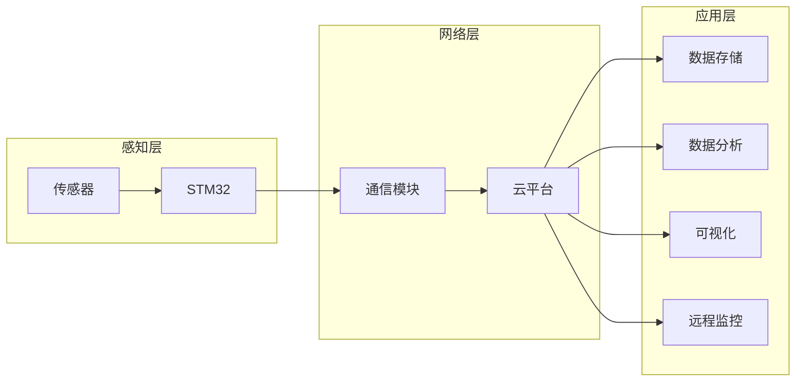

# 基于STM32的数控机床物联网改造研究

作者：禅与计算机程序设计艺术

## 1. 背景介绍

### 1.1 数控机床的现状与挑战

数控机床是现代制造业的核心装备，其自动化、精密化程度直接影响着产品的质量和生产效率。然而，传统的数控机床存在着信息孤岛、数据采集困难、远程监控不便等问题，难以满足智能制造时代对设备互联互通、数据实时共享的需求。

### 1.2 物联网技术的兴起与应用

物联网（IoT）技术的快速发展为解决上述问题提供了新的思路。通过将传感器、网络通信、云计算等技术应用于数控机床，可以实现设备的远程监控、数据采集与分析、故障诊断与预测等功能，从而提升机床的智能化水平和生产效率。

### 1.3 STM32微控制器的优势

STM32系列微控制器以其高性能、低功耗、丰富的片上资源等优势，成为嵌入式系统开发的热门选择。其强大的计算能力和灵活的接口配置，为实现数控机床的物联网改造提供了理想的硬件平台。

## 2. 核心概念与联系

### 2.1 物联网架构

物联网系统通常采用三层架构：

- 感知层：负责采集机床的运行数据，例如温度、压力、振动等。
- 网络层：负责将感知层采集的数据传输到云平台。
- 应用层：负责数据存储、分析、展示和应用开发。

### 2.2 STM32在物联网改造中的作用

STM32微控制器作为感知层的核心，负责传感器数据采集、信号处理和网络通信等功能。其丰富的接口资源可以方便地连接各种传感器和通信模块，而其强大的计算能力可以实现复杂的算法处理，从而提高数据采集的精度和效率。

### 2.3 云平台的功能

云平台负责存储和管理机床数据，并提供数据分析、可视化、远程监控等功能。用户可以通过网页或移动应用远程查看机床状态、历史数据和报警信息，并进行远程控制操作。

## 3. 核心算法原理具体操作步骤

### 3.1 数据采集

- 选择合适的传感器，例如温度传感器、压力传感器、振动传感器等，用于采集机床的运行数据。
- 使用STM32的ADC模块读取传感器模拟信号，并将其转换为数字信号。
- 对数字信号进行滤波、放大等处理，以提高数据精度。

### 3.2 数据传输

- 选择合适的网络通信模块，例如Wi-Fi、以太网、NB-IoT等，用于将数据传输到云平台。
- 使用STM32的网络接口配置通信模块，并建立与云平台的连接。
- 将采集到的数据打包成数据帧，并通过网络传输到云平台。

### 3.3 数据存储与分析

- 云平台接收机床数据，并将其存储到数据库中。
- 对数据进行清洗、转换、分析，以提取有价值的信息。
- 将分析结果以图表、报表等形式展示给用户。

## 4. 数学模型和公式详细讲解举例说明

### 4.1 振动信号分析

机床振动信号可以反映机床的运行状态，通过分析振动信号可以判断机床是否存在故障。常用的振动信号分析方法包括：

- 时域分析：观察振动信号的波形，分析其幅值、频率、周期等特征。
- 频域分析：将振动信号转换为频谱图，分析其频率成分和能量分布。
- 时频分析：将振动信号转换为时频图，分析其频率随时间的变化规律。

### 4.2 温度预测模型

机床温度变化可以反映其负载情况和散热效率，通过建立温度预测模型可以预测机床未来的温度变化趋势。常用的温度预测模型包括：

- 线性回归模型：假设温度与时间呈线性关系，通过拟合直线来预测未来温度。
- 时间序列模型：考虑温度历史数据的变化规律，通过建立时间序列模型来预测未来温度。

## 5. 项目实践：代码实例和详细解释说明

### 5.1 STM32代码示例

```c
// 初始化ADC模块
ADC_InitTypeDef ADC_InitStruct;
ADC_InitStruct.ADC_Mode = ADC_Mode_Independent;
ADC_InitStruct.ADC_ScanConvMode = DISABLE;
ADC_InitStruct.ADC_ContinuousConvMode = ENABLE;
ADC_InitStruct.ADC_ExternalTrigConv = ADC_ExternalTrigConv_None;
ADC_InitStruct.ADC_DataAlign = ADC_DataAlign_Right;
ADC_InitStruct.ADC_NbrOfChannel = 1;
ADC_Init(ADC1, &ADC_InitStruct);

// 配置ADC通道
ADC_RegularChannelConfig(ADC1, ADC_Channel_1, 1, ADC_SampleTime_28Cycles5);

// 启动ADC转换
ADC_Cmd(ADC1, ENABLE);

// 读取ADC转换结果
uint16_t adcValue = ADC_GetConversionValue(ADC1);

// 将ADC值转换为温度值
float temperature = adcValue * 0.1;
```

### 5.2 云平台代码示例

```python
# 连接数据库
db = pymysql.connect(host='localhost', user='root', password='password', database='iot')

# 插入数据
cursor = db.cursor()
sql = "INSERT INTO machine_data (temperature, timestamp) VALUES (%s, %s)"
val = (temperature, datetime.datetime.now())
cursor.execute(sql, val)
db.commit()

# 查询数据
sql = "SELECT * FROM machine_data ORDER BY timestamp DESC LIMIT 10"
cursor.execute(sql)
results = cursor.fetchall()

# 关闭数据库连接
db.close()
```

## 6. 实际应用场景

### 6.1 设备远程监控

通过物联网改造，用户可以远程监控机床的运行状态，实时了解机床的温度、压力、振动等数据，及时发现异常情况并采取措施。

### 6.2 数据采集与分析

物联网系统可以自动采集机床的运行数据，并对其进行分析，从而发现机床的运行规律和潜在问题。例如，通过分析振动数据可以预测机床的故障风险，通过分析温度数据可以优化机床的散热效率。

### 6.3 故障诊断与预测

通过分析机床的运行数据，可以建立故障诊断模型，对机床的故障进行诊断和预测。例如，通过分析振动数据可以判断机床轴承是否损坏，通过分析温度数据可以判断机床电机是否过热。

## 7. 工具和资源推荐

### 7.1 STM32CubeMX

STM32CubeMX是一款图形化配置工具，可以方便地配置STM32微控制器的外设和功能，生成初始化代码。

### 7.2 Keil MDK

Keil MDK是一款集成开发环境，支持STM32微控制器的程序开发、调试和烧录。

### 7.3 阿里云物联网平台

阿里云物联网平台提供设备接入、数据存储、数据分析、应用开发等功能，可以方便地构建物联网应用。

## 8. 总结：未来发展趋势与挑战

### 8.1 智能化

随着人工智能技术的不断发展，未来的数控机床将更加智能化，能够自动学习、优化加工工艺，并实现自主故障诊断和修复。

### 8.2 网络安全

物联网系统的网络安全问题日益突出，需要加强设备安全防护，防止数据泄露和恶意攻击。

### 8.3 数据隐私

机床运行数据包含敏感信息，需要加强数据隐私保护，防止数据被滥用。

## 9. 附录：常见问题与解答

### 9.1 如何选择合适的传感器？

传感器的选择应根据机床的具体应用场景和数据采集需求来确定。例如，如果需要监测机床的温度，可以选择温度传感器；如果需要监测机床的振动，可以选择振动传感器。

### 9.2 如何选择合适的网络通信模块？

网络通信模块的选择应根据机床的网络环境和数据传输需求来确定。例如，如果机床位于Wi-Fi覆盖范围内，可以选择Wi-Fi模块；如果机床位于偏远地区，可以选择NB-IoT模块。

### 9.3 如何保障物联网系统的网络安全？

保障物联网系统的网络安全需要采取多方面的措施，包括：

- 加强设备安全防护，例如设置强密码、定期更新固件等。
- 使用安全的网络通信协议，例如HTTPS、TLS等。
- 对数据进行加密存储和传输。
- 建立完善的安全监控体系，及时发现和处理安全事件。


## 10.  核心概念原理和架构的 Mermaid流程图

