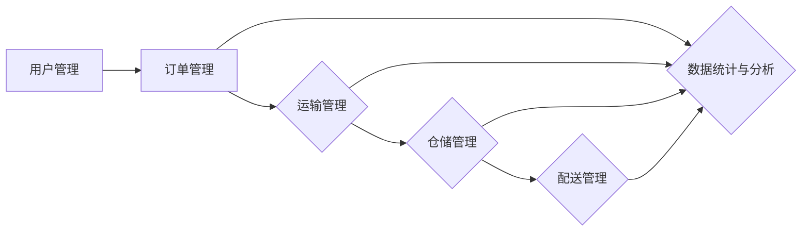
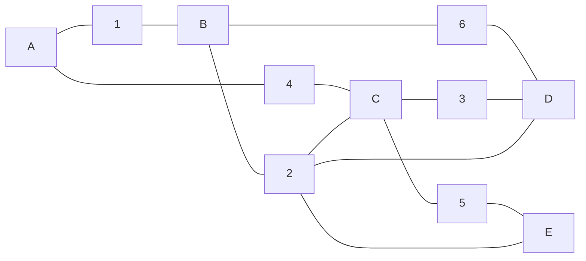

## 基于Web的网上物流系统详细设计与具体代码实现

作者：禅与计算机程序设计艺术

## 1. 背景介绍

### 1.1 物流行业现状及发展趋势

随着电子商务的蓬勃发展和全球化进程的加速，物流行业正经历着前所未有的变革。传统物流模式面临着信息化程度低、效率低下、服务质量难以保证等问题，已无法满足日益增长的物流需求。而互联网技术的快速发展为物流行业带来了新的机遇，推动着物流行业向智能化、信息化、网络化方向发展。

### 1.2 网上物流系统的意义和作用

基于Web的网上物流系统应运而生，它利用互联网技术将货主、物流企业、第三方服务商等相关方连接起来，实现信息共享、资源整合、流程优化，为客户提供便捷、高效、透明的物流服务。网上物流系统不仅可以提高物流企业的运营效率，降低物流成本，还可以提升客户满意度，增强企业竞争力。

### 1.3 本文研究内容及意义

本文将详细介绍基于Web的网上物流系统的架构设计、功能模块、数据库设计、关键技术实现以及代码示例，旨在为物流企业开发和应用网上物流系统提供参考和借鉴。

## 2. 核心概念与联系

### 2.1 物流系统基本概念

* **货主:**  货物的所有者，是物流服务的需求方。
* **物流企业:**  提供物流服务的企业，包括运输、仓储、配送等环节。
* **第三方服务商:**  为物流企业提供增值服务的企业，如保险、金融、信息技术等。
* **订单:**  货主提交的物流服务需求，包含货物信息、起止地点、时间要求等。
* **运输:**  将货物从起点运送到目的地的过程。
* **仓储:**  对货物进行保管、分拣、包装等操作的场所。
* **配送:**  将货物从仓库送达最终客户手中的过程。

### 2.2 网上物流系统核心功能模块

* **用户管理:**  包括货主、物流企业、系统管理员等角色的注册、登录、权限管理等功能。
* **订单管理:**  货主在线下单、订单跟踪、订单查询、订单评价等功能。
* **运输管理:**  车辆调度、路线规划、运输跟踪、费用结算等功能。
* **仓储管理:**  仓库管理、库存管理、出入库管理、货位管理等功能。
* **配送管理:**  配送路线规划、配送人员调度、配送跟踪、签收确认等功能。
* **数据统计与分析:**  提供各种统计报表，如订单量、运输量、仓储量、配送量等，为企业经营决策提供数据支持。

### 2.3 各模块之间关系



## 3. 核心算法原理具体操作步骤

### 3.1 路线规划算法

物流系统中的路线规划算法主要用于解决如何选择最佳路线将货物从起点运输到目的地的问题。常用的路线规划算法包括：

* **Dijkstra算法:**  一种经典的最短路径算法，适用于求解单源最短路径问题，即从一个起点到其他所有点的最短路径。
* **A*算法:**  一种启发式搜索算法，在Dijkstra算法的基础上引入了启发函数，可以更快地找到最优解。
* **遗传算法:**  一种模拟生物进化过程的优化算法，可以用于求解复杂的多目标优化问题。

以Dijkstra算法为例，其具体操作步骤如下：

1. 创建一个距离表，记录起点到所有点的距离，初始时起点到自身的距离为0，到其他点的距离为无穷大。
2. 创建一个已访问节点集合，初始为空。
3. 从距离表中选择距离起点最近的未访问节点，将其加入已访问节点集合。
4. 遍历该节点的所有邻接节点，如果起点到该邻接节点的距离小于距离表中记录的距离，则更新距离表。
5. 重复步骤3-4，直到所有节点都被访问。

### 3.2 库存管理算法

库存管理算法主要用于解决如何优化库存水平，降低库存成本的问题。常用的库存管理算法包括：

* **经济订货批量（EOQ）模型:**  一种经典的库存管理模型，用于确定每次订货的最优数量，以最小化总库存成本。
* **物料需求计划（MRP）:**  一种基于生产计划的物料需求计算方法，可以根据产品的物料清单和生产计划，计算出每个时间段内各种物料的需求量。
* **及时生产（JIT）:**  一种以需求为导向的生产方式，旨在最大限度地减少库存，实现零库存管理。

以EOQ模型为例，其计算公式如下：

$$EOQ = \sqrt{\frac{2DS}{H}}$$

其中：

* D：年需求量
* S：每次订货成本
* H：单位库存持有成本

### 3.3 配送路径优化算法

配送路径优化算法主要用于解决如何规划最佳配送路线，以最短的时间和距离完成所有配送任务的问题。常用的配送路径优化算法包括：

* **旅行商问题（TSP）算法:**  一种经典的路径优化算法，用于求解如何访问多个城市并返回起点，且总路径最短的问题。
* **车辆路径问题（VRP）算法:**  TSP算法的扩展，用于解决如何使用多辆车完成多个配送任务，并满足车辆容量、时间窗等约束条件的问题。

## 4. 数学模型和公式详细讲解举例说明

### 4.1 EOQ模型

**问题:**  某公司年需求量为1000件，每次订货成本为50元，单位库存持有成本为2元，求每次订货的最优数量。

**解:**

根据EOQ模型计算公式：

$$EOQ = \sqrt{\frac{2DS}{H}}$$

代入已知数据：

$$EOQ = \sqrt{\frac{2 \times 1000 \times 50}{2}} = 100$$

因此，每次订货的最优数量为100件。

### 4.2 Dijkstra算法

**问题:**  如下图所示，求节点A到其他所有节点的最短路径。



**解:**

1. 创建距离表：

| 节点 | A | B | C | D | E |
|---|---|---|---|---|---|
| 距离 | 0 | ∞ | ∞ | ∞ | ∞ |

2. 将节点A加入已访问节点集合。

3. 遍历节点A的邻接节点B和C：
    * A到B的距离为1，小于距离表中记录的∞，更新距离表中B的距离为1。
    * A到C的距离为4，小于距离表中记录的∞，更新距离表中C的距离为4。

| 节点 | A | B | C | D | E |
|---|---|---|---|---|---|
| 距离 | 0 | 1 | 4 | ∞ | ∞ |

4. 从距离表中选择距离A最近的未访问节点B，将其加入已访问节点集合。

5. 遍历节点B的邻接节点C和D：
    * A到C的距离为1+2=3，小于距离表中记录的4，更新距离表中C的距离为3。
    * A到D的距离为1+6=7，小于距离表中记录的∞，更新距离表中D的距离为7。

| 节点 | A | B | C | D | E |
|---|---|---|---|---|---|
| 距离 | 0 | 1 | 3 | 7 | ∞ |

6. 重复步骤4-5，直到所有节点都被访问。

最终得到的距离表如下：

| 节点 | A | B | C | D | E |
|---|---|---|---|---|---|
| 距离 | 0 | 1 | 3 | 6 | 8 |

因此，节点A到其他所有节点的最短路径为：

* A -> B: 1
* A -> C: 3
* A -> D: 6
* A -> E: 8

## 5. 项目实践：代码实例和详细解释说明

### 5.1 技术选型

本项目采用Java语言开发，使用Spring Boot框架构建后端服务，使用MySQL数据库存储数据，使用Vue.js框架开发前端页面。

### 5.2 数据库设计

```sql
-- 用户表
CREATE TABLE `user` (
  `id` int(11) NOT NULL AUTO_INCREMENT COMMENT '用户ID',
  `username` varchar(255) NOT NULL COMMENT '用户名',
  `password` varchar(255) NOT NULL COMMENT '密码',
  `role` varchar(255) NOT NULL COMMENT '角色',
  PRIMARY KEY (`id`)
) ENGINE=InnoDB DEFAULT CHARSET=utf8mb4;

-- 订单表
CREATE TABLE `order` (
  `id` int(11) NOT NULL AUTO_INCREMENT COMMENT '订单ID',
  `order_no` varchar(255) NOT NULL COMMENT '订单编号',
  `user_id` int(11) NOT NULL COMMENT '用户ID',
  `goods_name` varchar(255) NOT NULL COMMENT '货物名称',
  `goods_weight` decimal(10,2) NOT NULL COMMENT '货物重量',
  `start_address` varchar(255) NOT NULL COMMENT '始发地',
  `end_address` varchar(255) NOT NULL COMMENT '目的地',
  `status` varchar(255) NOT NULL COMMENT '订单状态',
  `create_time` datetime NOT NULL COMMENT '创建时间',
  PRIMARY KEY (`id`)
) ENGINE=InnoDB DEFAULT CHARSET=utf8mb4;

-- 运输表
CREATE TABLE `transport` (
  `id` int(11) NOT NULL AUTO_INCREMENT COMMENT '运输ID',
  `order_id` int(11) NOT NULL COMMENT '订单ID',
  `vehicle_no` varchar(255) NOT NULL COMMENT '车辆编号',
  `driver_name` varchar(255) NOT NULL COMMENT '司机姓名',
  `driver_phone` varchar(255) NOT NULL COMMENT '司机电话',
  `status` varchar(255) NOT NULL COMMENT '运输状态',
  `create_time` datetime NOT NULL COMMENT '创建时间',
  PRIMARY KEY (`id`)
) ENGINE=InnoDB DEFAULT CHARSET=utf8mb4;

-- 仓储表
CREATE TABLE `warehouse` (
  `id` int(11) NOT NULL AUTO_INCREMENT COMMENT '仓库ID',
  `warehouse_name` varchar(255) NOT NULL COMMENT '仓库名称',
  `address` varchar(255) NOT NULL COMMENT '仓库地址',
  `capacity` int(11) NOT NULL COMMENT '仓库容量',
  PRIMARY KEY (`id`)
) ENGINE=InnoDB DEFAULT CHARSET=utf8mb4;

-- 库存表
CREATE TABLE `inventory` (
  `id` int(11) NOT NULL AUTO_INCREMENT COMMENT '库存ID',
  `warehouse_id` int(11) NOT NULL COMMENT '仓库ID',
  `goods_name` varchar(255) NOT NULL COMMENT '货物名称',
  `quantity` int(11) NOT NULL COMMENT '库存数量',
  PRIMARY KEY (`id`)
) ENGINE=InnoDB DEFAULT CHARSET=utf8mb4;

-- 配送表
CREATE TABLE `delivery` (
  `id` int(11) NOT NULL AUTO_INCREMENT COMMENT '配送ID',
  `order_id` int(11) NOT NULL COMMENT '订单ID',
  `courier_name` varchar(255) NOT NULL COMMENT '快递员姓名',
  `courier_phone` varchar(255) NOT NULL COMMENT '快递员电话',
  `status` varchar(255) NOT NULL COMMENT '配送状态',
  `create_time` datetime NOT NULL COMMENT '创建时间',
  PRIMARY KEY (`id`)
) ENGINE=InnoDB DEFAULT CHARSET=utf8mb4;
```

### 5.3 代码实现

**用户登录接口:**

```java
@RestController
@RequestMapping("/api/user")
public class UserController {

    @Autowired
    private UserService userService;

    @PostMapping("/login")
    public Result login(@RequestBody UserLoginRequest request) {
        User user = userService.findByUsername(request.getUsername());
        if (user == null) {
            return Result.fail("用户名不存在");
        }
        if (!user.getPassword().equals(request.getPassword())) {
            return Result.fail("密码错误");
        }
        return Result.success(user);
    }
}
```

**订单创建接口:**

```java
@RestController
@RequestMapping("/api/order")
public class OrderController {

    @Autowired
    private OrderService orderService;

    @PostMapping("/create")
    public Result create(@RequestBody OrderCreateRequest request) {
        Order order = new Order();
        BeanUtils.copyProperties(request, order);
        order.setOrderNo(UUID.randomUUID().toString().replace("-", ""));
        order.setStatus("待发货");
        order.setCreateTime(new Date());
        orderService.save(order);
        return Result.success(order);
    }
}
```

**路线规划接口:**

```java
@RestController
@RequestMapping("/api/route")
public class RouteController {

    @Autowired
    private RouteService routeService;

    @PostMapping("/plan")
    public Result plan(@RequestBody RoutePlanRequest request) {
        List<String> route = routeService.plan(request.getStartAddress(), request.getEndAddress());
        return Result.success(route);
    }
}
```

### 5.4 测试

使用Postman等工具对接口进行测试，验证接口功能是否正常。

## 6. 实际应用场景

### 6.1 电商平台

电商平台可以使用网上物流系统对接物流公司，实现订单自动发货、物流跟踪、售后服务等功能，提升用户购物体验。

### 6.2 物流企业

物流企业可以开发自己的网上物流系统，为客户提供在线下单、货物跟踪、费用查询等服务，提高运营效率，降低成本。

### 6.3 第三方物流平台

第三方物流平台可以整合多家物流公司的资源，为客户提供更 comprehensive 的物流服务，如国际物流、冷链物流等。

## 7. 工具和资源推荐

### 7.1 开发工具

* **IntelliJ IDEA:**  一款功能强大的Java开发工具。
* **Eclipse:**  一款开源免费的Java开发工具。
* **Visual Studio Code:**  一款轻量级的代码编辑器，支持多种编程语言。

### 7.2 数据库

* **MySQL:**  一款开源免费的关系型数据库。
* **Oracle:**  一款功能强大的商用关系型数据库。
* **PostgreSQL:**  一款开源免费的对象关系型数据库。

### 7.3 框架

* **Spring Boot:**  一款用于简化Spring应用开发的框架。
* **Vue.js:**  一款用于构建用户界面的渐进式框架。
* **React:**  一款用于构建用户界面的JavaScript库。

## 8. 总结：未来发展趋势与挑战

### 8.1 未来发展趋势

* **智能化:**  利用人工智能技术，实现物流过程的自动化、智能化，如自动驾驶、智能仓储等。
* **数字化:**  将物流信息进行数字化处理，实现物流数据的可视化、可追溯、可分析。
* **平台化:**  构建开放共享的物流平台，整合物流资源，提供一站式物流服务。

### 8.2 面临的挑战

* **数据安全:**  物流数据涉及到企业的商业机密和用户的隐私信息，如何保障数据安全是一个重要的挑战。
* **技术标准:**  物流行业缺乏统一的技术标准，导致不同企业之间系统难以互联互通。
* **人才培养:**  物流行业需要大量的复合型人才，既懂物流业务，又懂信息技术。

## 9. 附录：常见问题与解答

### 9.1 如何保证物流信息的安全？

* **数据加密:**  对敏感数据进行加密存储和传输，防止数据泄露。
* **访问控制:**  对不同角色的用户设置不同的访问权限，控制数据的访问范围。
* **安全审计:**  记录用户的操作日志，以便于追溯和审计。

### 9.2 如何提高物流系统的效率？

* **优化算法:**  使用更高效的算法进行路线规划、库存管理、配送路径优化等。
* **缓存技术:**  使用缓存技术减少数据库访问次数，提高系统响应速度。
* **异步处理:**  将耗时的操作异步处理，避免阻塞主线程。


## 10. 后记

本文详细介绍了基于Web的网上物流系统的架构设计、功能模块、数据库设计、关键技术实现以及代码示例，希望能够为物流企业开发和应用网上物流系统提供参考和借鉴。随着互联网技术的不断发展，相信网上物流系统将会越来越完善，为物流行业的发展做出更大的贡献。