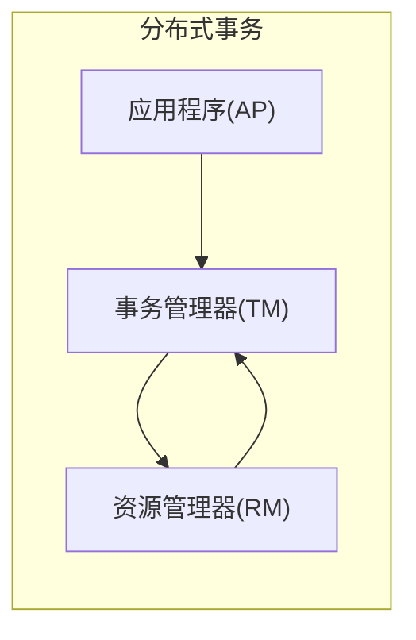
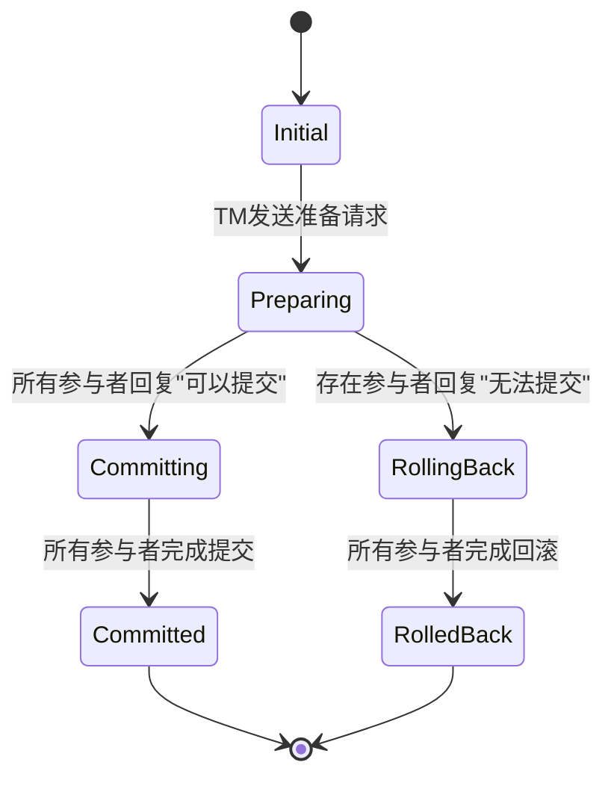

## 1. 背景介绍

### 1.1 分布式系统带来的挑战

随着互联网技术的飞速发展，分布式系统架构已经成为构建大型、高可用性应用的普遍选择。然而，分布式系统也带来了新的挑战，其中之一就是如何保证数据的一致性。在分布式环境下，数据分散存储在不同的节点上，如何确保对这些数据的操作能够满足原子性、一致性、隔离性和持久性（ACID）成为了一个关键问题。

### 1.2 分布式事务的必要性

为了解决数据一致性问题，分布式事务应运而生。分布式事务是指涉及多个数据库或资源管理器的事务，它要求所有参与者要么全部成功提交，要么全部回滚，从而确保数据的一致性。

### 1.3 X/Open XA规范的诞生

为了规范分布式事务的处理流程，X/Open组织制定了X/Open XA规范。该规范定义了分布式事务处理模型，以及事务管理器（Transaction Manager）、资源管理器（Resource Manager）和应用程序之间的接口。

## 2. 核心概念与联系

### 2.1 事务管理器（TM）

事务管理器是分布式事务的核心组件，它负责协调和管理整个事务的执行过程。TM的主要职责包括：

* 定义全局事务的边界
* 监控事务的执行状态
* 协调参与者的提交或回滚

### 2.2 资源管理器（RM）

资源管理器是指能够参与分布式事务的任何资源，例如数据库、消息队列等。RM负责管理其自身资源的提交和回滚操作，并与TM进行交互。

### 2.3 应用程序（AP）

应用程序是发起分布式事务的客户端程序。AP通过调用TM的接口来启动、提交或回滚事务。

### 2.4 两阶段提交协议（2PC）

X/Open XA规范采用两阶段提交协议来保证分布式事务的原子性。2PC分为两个阶段：

* **准备阶段:** TM向所有参与者发送准备请求，询问它们是否可以提交事务。
* **提交阶段:**  如果所有参与者都回复“可以提交”，则TM向所有参与者发送提交请求；否则，TM向所有参与者发送回滚请求。

### 2.5 核心概念关系图



## 3. 核心算法原理具体操作步骤

### 3.1 事务开始

1. 应用程序调用TM的接口，启动一个全局事务。
2. TM为该事务分配一个全局事务ID。

### 3.2 资源操作

1. 应用程序通过RM的接口对资源进行操作。
2. RM记录操作日志，并将其与全局事务ID关联。

### 3.3 准备阶段

1. TM向所有参与者发送准备请求。
2. 每个RM接收到准备请求后，执行以下操作：
    * 检查自身资源是否满足提交条件。
    * 将操作日志写入永久存储。
    * 向TM回复“可以提交”或“无法提交”。

### 3.4 提交/回滚阶段

1. 如果所有参与者都回复“可以提交”，则TM向所有参与者发送提交请求。
2. 每个RM接收到提交请求后，将操作应用到资源，并释放资源锁。
3. 如果有任何一个参与者回复“无法提交”，则TM向所有参与者发送回滚请求。
4. 每个RM接收到回滚请求后，根据操作日志回滚操作，并释放资源锁。

## 4. 数学模型和公式详细讲解举例说明

### 4.1 两阶段提交协议的数学模型

两阶段提交协议可以被抽象成一个状态机模型，包含以下状态：

* **初始状态:** 事务尚未开始。
* **准备状态:** TM已向所有参与者发送准备请求。
* **提交状态:** 事务已成功提交。
* **回滚状态:** 事务已回滚。

### 4.2 状态转移图



## 5. 项目实践：代码实例和详细解释说明

### 5.1 Java平台的JTA规范

Java平台提供了Java Transaction API (JTA) 规范，用于实现分布式事务管理。JTA规范定义了以下接口：

* `javax.transaction.TransactionManager`：事务管理器接口。
* `javax.transaction.UserTransaction`：用户事务接口，供应用程序使用。
* `javax.transaction.xa.XAResource`：资源管理器接口。

### 5.2 Spring框架的分布式事务支持

Spring框架提供了对JTA规范的良好支持，可以通过`JtaTransactionManager`来管理分布式事务。

### 5.3 代码实例

```java
// 获取JTA事务管理器
@Autowired
private PlatformTransactionManager transactionManager;

// 定义事务边界
TransactionTemplate transactionTemplate = new TransactionTemplate(transactionManager);

// 执行事务操作
transactionTemplate.execute(new TransactionCallbackWithoutResult() {
    @Override
    protected void doInTransactionWithoutResult(TransactionStatus status) {
        // 操作数据库1
        // 操作数据库2
    }
});
```

## 6. 实际应用场景

### 6.1 电商平台订单处理

在电商平台中，订单处理通常涉及多个步骤，例如：

* 创建订单
* 扣减库存
* 支付
* 物流配送

这些步骤需要保证原子性，如果任何一个步骤失败，整个订单都需要回滚。

### 6.2 银行转账系统

银行转账系统需要确保资金的安全性，任何一笔转账都需要满足原子性，即要么全部成功，要么全部失败。

## 7. 工具和资源推荐

### 7.1 Atomikos TransactionsEssentials

Atomikos TransactionsEssentials是一个开源的JTA实现，提供了高性能和可靠的分布式事务管理功能。

### 7.2 Narayana

Narayana是JBoss社区提供的一个分布式事务管理器，支持多种协议和平台。

## 8. 总结：未来发展趋势与挑战

### 8.1 微服务架构下的分布式事务

随着微服务架构的流行，分布式事务管理面临着新的挑战。微服务架构将应用程序拆分成多个独立的服务，每个服务都有自己的数据库，这使得分布式事务的协调和管理更加复杂。

### 8.2 分布式事务的性能优化

分布式事务的性能是一个重要问题，两阶段提交协议会带来一定的性能开销。未来，需要探索更高效的分布式事务管理方案。

## 9. 附录：常见问题与解答

### 9.1 XA规范与其他分布式事务解决方案的比较

除了XA规范之外，还有其他一些分布式事务解决方案，例如：

* 基于消息队列的最终一致性方案
* TCC (Try-Confirm-Cancel) 
* Saga模式

### 9.2 如何选择合适的分布式事务解决方案

选择合适的分布式事务解决方案需要考虑以下因素：

* 业务需求
* 系统架构
* 性能要求
* 成本预算
