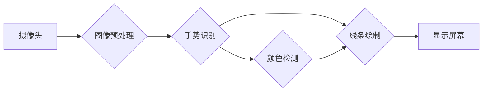

## 基于opencv的隔空作画系统详细设计与具体代码实现

作者：禅与计算机程序设计艺术

## 1. 背景介绍

### 1.1 隔空作画技术概述

隔空作画，也称为空中绘画或虚拟绘画，是一种利用计算机视觉和图像处理技术，让用户在不接触任何物理设备的情况下，仅凭手势动作即可在虚拟空间中进行绘画创作的技术。这项技术近年来发展迅速，并在娱乐、教育、设计等领域展现出巨大的应用潜力。

### 1.2 OpenCV库简介

OpenCV (Open Source Computer Vision Library)是一个开源的计算机视觉库，它提供了丰富的图像处理和计算机视觉算法，广泛应用于图像识别、目标检测、图像分割等领域。OpenCV使用C++编写，并提供了Python、Java、MATLAB等语言的接口，方便开发者使用。

### 1.3 本文目标

本文旨在利用OpenCV库实现一个基于手势识别的隔空作画系统，用户可以通过简单的  手势动作，在屏幕上绘制不同颜色和粗细的线条，实现虚拟绘画的功能。

## 2. 核心概念与联系

### 2.1 手势识别

手势识别是隔空作画系统的核心技术之一，其目的是识别用户的手势动作，并将其转换为相应的绘画指令。常用的手势识别方法包括：

* **基于模板匹配的方法:** 将预先定义好的手势模板与实时采集到的手势图像进行匹配，根据匹配程度判断手势类型。
* **基于机器学习的方法:** 利用大量的手势数据训练模型，使模型能够自动识别不同类型的手势。

### 2.2 图像处理

图像处理技术在隔空作画系统中也扮演着重要的角色，主要用于：

* **图像预处理:** 对摄像头采集到的图像进行去噪、增强等处理，提高图像质量。
* **颜色检测:** 检测用户选择的颜色，用于绘制不同颜色的线条。
* **线条绘制:** 根据用户的手势轨迹，在屏幕上绘制相应颜色和粗细的线条。

### 2.3 系统架构

本隔空作画系统的整体架构如下：



## 3. 核心算法原理具体操作步骤

### 3.1 手势识别算法

本系统采用基于颜色阈值的简单手势识别算法：

1. **获取手势区域:** 利用OpenCV的`inRange`函数，根据预设的颜色阈值，从摄像头图像中提取出手势区域。
2. **形态学操作:** 对手势区域进行形态学开运算和闭运算，去除噪声，连接断裂的区域。
3. **轮廓提取:** 利用OpenCV的`findContours`函数提取手势区域的轮廓。
4. **计算轮廓特征:** 计算轮廓的面积、周长、凸包等特征，用于判断手势类型。

### 3.2 颜色检测算法

本系统采用基于HSV颜色空间的颜色检测算法：

1. **将图像从BGR颜色空间转换为HSV颜色空间:** HSV颜色空间更接近人眼的视觉感知，方便进行颜色识别。
2. **定义颜色阈值范围:** 根据用户选择的颜色，定义相应的HSV颜色阈值范围。
3. **利用`inRange`函数提取目标颜色区域:** 从HSV图像中提取出满足颜色阈值范围的像素点。
4. **计算目标颜色区域的中心点坐标:** 用于指示绘画位置。

### 3.3 线条绘制算法

本系统采用OpenCV的`line`函数绘制线条：

1. **记录手势轨迹:** 存储用户手势的移动轨迹，即一系列坐标点。
2. **根据手势轨迹绘制线条:** 利用`line`函数，根据手势轨迹，依次连接相邻的坐标点，绘制出平滑的线条。

## 4. 数学模型和公式详细讲解举例说明

### 4.1 HSV颜色空间

HSV颜色空间是一种基于色调(H)、饱和度(S)和亮度(V)三个参数来描述颜色的模型。

* **色调(H):** 表示颜色的类型，取值范围为0°到360°，例如红色为0°，绿色为120°，蓝色为240°。
* **饱和度(S):** 表示颜色的纯度，取值范围为0到1，值越大表示颜色越纯，值越小表示颜色越灰暗。
* **亮度(V):** 表示颜色的明暗程度，取值范围为0到1，值越大表示颜色越亮，值越小表示颜色越暗。

将BGR颜色空间转换为HSV颜色空间的公式如下：

```
V = max(R, G, B)
S = {
    0, if V = 0
    (V - min(R, G, B)) / V, otherwise
}
H = {
    0°, if V = R
    60° * (G - B) / (V - min(R, G, B)) + 0°, if V = G
    60° * (B - R) / (V - min(R, G, B)) + 240°, if V = B
    undefined, otherwise
}
```

### 4.2 形态学操作

形态学操作是基于图像形状的处理方法，常用的形态学操作包括：

* **腐蚀:** 将图像中与结构元素完全匹配的区域缩小一圈。
* **膨胀:** 将图像中与结构元素部分匹配的区域扩大一圈。
* **开运算:** 先腐蚀后膨胀，可以去除图像中的小物体和噪声。
* **闭运算:** 先膨胀后腐蚀，可以填充图像中的小孔洞和平滑物体边界。

## 5. 项目实践：代码实例和详细解释说明

```python
import cv2
import numpy as np

# 定义颜色阈值
lower_blue = np.array([100, 50, 50])
upper_blue = np.array([130, 255, 255])

# 定义画笔颜色和粗细
color = (255, 0, 0) # 默认颜色为蓝色
thickness = 5

# 初始化摄像头
cap = cv2.VideoCapture(0)

# 创建画布
canvas = np.zeros((480, 640, 3), np.uint8)

# 上一个绘制点坐标
prev_x, prev_y = 0, 0

while True:
    # 读取摄像头画面
    ret, frame = cap.read()

    # 图像预处理
    frame = cv2.flip(frame, 1) # 水平翻转
    hsv = cv2.cvtColor(frame, cv2.COLOR_BGR2HSV) # 转换为HSV颜色空间

    # 手势识别
    mask = cv2.inRange(hsv, lower_blue, upper_blue) # 提取蓝色区域
    mask = cv2.erode(mask, None, iterations=2) # 腐蚀
    mask = cv2.dilate(mask, None, iterations=2) # 膨胀
    cnts, hierarchy = cv2.findContours(mask.copy(), cv2.RETR_EXTERNAL, cv2.CHAIN_APPROX_SIMPLE) # 提取轮廓

    # 如果检测到手势
    if len(cnts) > 0:
        # 找到最大轮廓
        c = max(cnts, key=cv2.contourArea)

        # 计算轮廓中心点坐标
        M = cv2.moments(c)
        cX = int(M["m10"] / M["m00"])
        cY = int(M["m01"] / M["m00"])

        # 绘制线条
        if prev_x != 0 and prev_y != 0:
            cv2.line(canvas, (prev_x, prev_y), (cX, cY), color, thickness)

        # 更新上一个绘制点坐标
        prev_x, prev_y = cX, cY
    else:
        # 如果没有检测到手势，则重置上一个绘制点坐标
        prev_x, prev_y = 0, 0

    # 将画布叠加到摄像头画面上
    frame = cv2.add(frame, canvas)

    # 显示画面
    cv2.imshow("Air Drawing", frame)

    # 按下'q'键退出程序
    if cv2.waitKey(1) & 0xFF == ord('q'):
        break

# 释放资源
cap.release()
cv2.destroyAllWindows()
```

**代码解释:**

1. 导入必要的库：`cv2` (OpenCV) 和 `numpy`。
2. 定义颜色阈值：`lower_blue` 和 `upper_blue` 定义了蓝色的 HSV 颜色范围。
3. 定义画笔颜色和粗细：`color` 和 `thickness` 分别定义了画笔的颜色和粗细。
4. 初始化摄像头：`cv2.VideoCapture(0)` 打开默认摄像头。
5. 创建画布：`canvas` 是一个黑色图像，用于绘制线条。
6. 进入主循环：
    * 读取摄像头画面：`cap.read()` 读取一帧图像。
    * 图像预处理：将图像水平翻转，并转换为 HSV 颜色空间。
    * 手势识别：使用颜色阈值提取蓝色区域，进行形态学操作去除噪声，并提取轮廓。
    * 如果检测到手势：
        * 找到最大轮廓。
        * 计算轮廓中心点坐标。
        * 如果有上一个绘制点，则绘制线条。
        * 更新上一个绘制点坐标。
    * 否则：重置上一个绘制点坐标。
    * 将画布叠加到摄像头画面上。
    * 显示画面。
    * 按下 'q' 键退出程序。
7. 释放资源：关闭摄像头并销毁所有窗口。

## 6. 实际应用场景

隔空作画系统具有广泛的应用场景，例如：

* **娱乐:** 可以用于开发体感游戏、互动娱乐设施等。
* **教育:** 可以用于儿童绘画启蒙、艺术教育等。
* **设计:** 可以用于产品设计、建筑设计、服装设计等。
* **医疗:** 可以用于辅助康复训练、手术模拟等。

## 7. 工具和资源推荐

* **OpenCV:** 开源计算机视觉库，提供了丰富的图像处理和计算机视觉算法。
* **Python:** 一种易于学习和使用的编程语言，广泛应用于数据科学、机器学习等领域。
* **NumPy:** Python 的数值计算库，提供了高效的数组操作和数学函数。

## 8. 总结：未来发展趋势与挑战

隔空作画技术近年来发展迅速，但仍然面临一些挑战：

* **手势识别的鲁棒性:** 目前的手势识别算法容易受到光照、背景等因素的干扰，需要开发更加鲁棒的算法。
* **绘画体验的提升:** 目前的隔空作画系统在绘画精度、流畅度等方面还有待提高，需要开发更加自然的交互方式和更加精细的绘制算法。
* **应用场景的拓展:** 目前隔空作画系统的应用场景还比较有限，需要探索更多应用场景，例如与 VR/AR 技术结合，实现更加沉浸式的绘画体验。

## 9. 附录：常见问题与解答

**Q: 为什么我的程序无法检测到手势？**

**A:** 可能是以下原因导致的：

* 摄像头没有正确连接或配置。
* 颜色阈值设置不正确，无法准确提取手势区域。
* 光照条件不佳，影响了手势识别的效果。

**Q: 如何提高绘画的精度？**

**A:** 可以尝试以下方法：

* 使用更加精确的手势识别算法。
* 降低画笔的粗细。
* 增加画布的分辨率。

**Q: 如何实现更多颜色和画笔效果？**

**A:** 可以尝试以下方法：

* 定义更多颜色阈值范围，用于识别不同颜色的手势。
* 使用不同的画笔形状和大小，例如圆形、方形、三角形等。
* 添加画笔纹理和透明度等效果。
