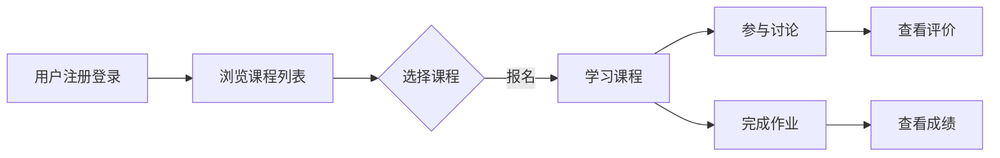

## 基于 Spring Boot 的前后端分离在线学习平台

作者：禅与计算机程序设计艺术

## 1. 背景介绍

### 1.1 在线教育的兴起与发展

近年来，随着互联网技术的飞速发展和普及，在线教育作为一种新型的教育模式，逐渐走进了人们的视野，并迅速发展壮大。在线教育打破了传统教育模式的时间和空间限制，为广大学习者提供了更加灵活、便捷、高效的学习方式，同时也为教育资源的共享和优质教育资源的普及提供了新的途径。

### 1.2  传统学习平台的局限性

传统的学习平台，通常采用前后端耦合的架构，即前端代码和后端代码混合在一起，难以维护和扩展。此外，传统的学习平台大多功能单一，缺乏互动性和趣味性，难以满足现代学习者的个性化需求。

### 1.3 Spring Boot 与前后端分离架构的优势

Spring Boot 是一个基于 Java 的开源框架，可以帮助开发者快速构建独立的、生产级的 Spring 应用程序。它简化了 Spring 应用的初始搭建以及开发过程，并提供了一系列开箱即用的功能模块，例如 Web 开发、数据访问、安全控制等。

前后端分离架构是一种将前端和后端代码完全分离的架构模式。前端负责用户界面和用户交互，后端负责业务逻辑处理和数据存储。前后端之间通过 API 进行数据交互。这种架构模式具有以下优势：

* **提高开发效率:** 前后端开发者可以并行开发，互不影响，缩短开发周期。
* **提高代码可维护性:** 前后端代码分离，职责明确，易于维护和扩展。
* **提升用户体验:** 前端可以使用最新的技术栈，实现更加丰富的用户界面和交互效果。

## 2. 核心概念与联系

### 2.1 Spring Boot 框架

#### 2.1.1 Spring MVC

Spring MVC 是 Spring Framework 中的一个模块，它实现了 MVC（Model-View-Controller）设计模式，用于构建 Web 应用程序。

* **Model（模型）：** 数据模型，用于封装业务数据。
* **View（视图）：** 负责展示数据给用户，通常是 HTML 页面。
* **Controller（控制器）：** 接收用户的请求，调用业务逻辑处理数据，并将处理结果返回给视图。

#### 2.1.2 Spring Data JPA

Spring Data JPA 是 Spring Data 项目的一部分，它提供了一种基于 JPA（Java Persistence API）的简化数据访问方式。

* **Entity（实体）：** 与数据库表对应的 Java 对象。
* **Repository（仓库）：** 提供了对实体进行 CRUD（创建、读取、更新、删除）操作的方法。

#### 2.1.3 Spring Security

Spring Security 是一个功能强大且高度可定制的身份验证和访问控制框架。

* **Authentication（身份验证）：** 验证用户身份的过程。
* **Authorization（授权）：** 确定用户是否具有访问特定资源的权限的过程。

### 2.2 前后端分离架构

#### 2.2.1 RESTful API

RESTful API 是一种基于 HTTP 协议的 API 设计风格，它使用 HTTP 动词（GET、POST、PUT、DELETE）来表示对资源的操作。

* **资源：** 可以被标识和访问的任何信息单元，例如用户、文章、评论等。
* **表述：** 资源的具体表现形式，例如 JSON、XML 等。

#### 2.2.2 JSON Web Token (JWT)

JWT 是一种开放标准 (RFC 7519)，它定义了一种紧凑且自包含的方式，用于在各方之间安全地传输信息作为 JSON 对象。

* **Header：** 包含令牌的元数据，例如算法类型、令牌类型。
* **Payload：** 包含令牌的有效载荷，例如用户 ID、过期时间。
* **Signature：** 用于验证令牌的完整性和真实性。

### 2.3 在线学习平台核心业务流程



## 3. 核心算法原理具体操作步骤

### 3.1 用户身份验证与授权

#### 3.1.1 基于 JWT 的用户身份验证

1. 用户登录时，后端验证用户名和密码。
2. 验证通过后，后端生成一个 JWT，并将 JWT 返回给前端。
3. 前端将 JWT 保存到本地存储（例如 LocalStorage）。
4. 用户后续请求 API 时，在请求头中携带 JWT。
5. 后端拦截 API 请求，解析 JWT 并验证其有效性。
6. 验证通过后，后端从 JWT 中获取用户信息，并允许用户访问受保护的资源。

#### 3.1.2 基于 Spring Security 的角色权限控制

1. 定义用户角色和权限。
2. 为 API 接口配置访问权限。
3. 用户登录后，根据其角色获取对应的权限信息。
4. 用户访问 API 接口时，Spring Security 会检查用户是否具有访问该接口的权限。

### 3.2 课程推荐算法

#### 3.2.1 基于内容的推荐算法

1. 分析课程内容，提取关键词和主题标签。
2. 根据用户的学习历史和兴趣标签，推荐与其相关的课程。

#### 3.2.2 协同过滤推荐算法

1. 收集用户的学习行为数据，例如浏览历史、评分记录、收藏记录等.
2. 根据用户之间的相似度，推荐用户可能感兴趣的课程。

### 3.3  搜索引擎

#### 3.3.1  Elasticsearch

Elasticsearch 是一个分布式、高可用的搜索和分析引擎，可以用于实现全文搜索、结构化搜索和分析。

1. 将课程数据索引到 Elasticsearch 中。
2. 用户搜索课程时，将搜索词提交到 Elasticsearch。
3. Elasticsearch 返回匹配的课程列表。

## 4. 数学模型和公式详细讲解举例说明

### 4.1 协同过滤推荐算法中的相似度计算

#### 4.1.1 余弦相似度

$$
similarity(u,v) = \frac{\vec{u} \cdot \vec{v}}{||\vec{u}|| \times ||\vec{v}||}
$$

其中，$\vec{u}$ 和 $\vec{v}$ 分别表示用户 $u$ 和用户 $v$ 的评分向量。

**示例：**

假设用户 A 对课程 1 和课程 2 的评分分别为 5 分和 3 分，用户 B 对课程 1 和课程 3 的评分分别为 4 分和 5 分。则用户 A 和用户 B 的评分向量分别为：

```
用户 A: [5, 3, 0]
用户 B: [4, 0, 5]
```

则用户 A 和用户 B 的余弦相似度为：

$$
similarity(A,B) = \frac{5 \times 4 + 3 \times 0 + 0 \times 5}{\sqrt{5^2 + 3^2 + 0^2} \times \sqrt{4^2 + 0^2 + 5^2}} \approx 0.447
$$

## 5. 项目实践：代码实例和详细解释说明

### 5.1 项目结构

```
online-learning-platform
├── user-service
│   ├── src
│   │   ├── main
│   │   │   └── java
│   │   │       └── com
│   │   │           └── example
│   │   │           └── onlinelpa
│   │   │               └── userservice
│   │   │                   ├── controller
│   │   │                   │   └── UserController.java
│   │   │                   ├── service
│   │   │                   │   └── impl
│   │   │                   │       └── UserServiceImpl.java
│   │   │                   ├── entity
│   │   │                   │   └── User.java
│   │   │                   └── repository
│   │   │                       └── UserRepository.java
│   │   └── test
│   │       └── java
│   │           └── com
│   │               └── example
│   │                   └── onlinelpa
│   │                       └── userservice
│   │                           └── UserControllerTest.java
│   └── pom.xml
├── course-service
│   ├── src
│   │   └── main
│   │       └── java
│   │           └── com
│   │               └── example
│   │                   └── onlinelpa
│   │                       └── courseservice
│   │                           └── controller
│   │                               └── CourseController.java
│   └── pom.xml
└── gateway-service
    ├── src
    │   └── main
    │       └── java
    │           └── com
    │               └── example
    │                   └── onlinelpa
    │                       └── gatewayservice
    │                           └── GatewayServiceApplication.java
    └── pom.xml

```

### 5.2 代码示例

#### 5.2.1 用户服务 - 用户实体类

```java
package com.example.onlinelpa.userservice.entity;

import lombok.Data;

import javax.persistence.*;

@Entity
@Table(name = "user")
@Data
public class User {

    @Id
    @GeneratedValue(strategy = GenerationType.IDENTITY)
    private Long id;

    @Column(nullable = false, unique = true)
    private String username;

    @Column(nullable = false)
    private String password;
}

```

#### 5.2.2 用户服务 - 用户控制器

```java
package com.example.onlinelpa.userservice.controller;

import com.example.onlinelpa.userservice.entity.User;
import com.example.onlinelpa.userservice.service.UserService;
import org.springframework.beans.factory.annotation.Autowired;
import org.springframework.web.bind.annotation.*;

@RestController
@RequestMapping("/users")
public class UserController {

    @Autowired
    private UserService userService;

    @PostMapping("/register")
    public User register(@RequestBody User user) {
        return userService.createUser(user);
    }

    @PostMapping("/login")
    public String login(@RequestBody User user) {
        return userService.login(user);
    }
}
```

## 6. 实际应用场景

* **在线教育平台：** 为学生提供在线学习、测试、评估等功能。
* **企业培训平台：** 为企业员工提供在线培训、考核、认证等功能。
* **知识付费平台：** 为知识分享者提供在线课程发布、销售、管理等功能。

## 7. 总结：未来发展趋势与挑战

### 7.1 未来发展趋势

* **个性化学习：** 利用大数据和人工智能技术，为学生提供个性化的学习路径和内容推荐。
* **沉浸式学习体验：** 利用 VR/AR 等技术，打造更加沉浸式的学习体验。
* **社交化学习：**  构建学习社区，促进学生之间的互动和交流。

### 7.2 面临的挑战

* **技术挑战：** 如何处理海量数据、保证系统性能和稳定性。
* **内容挑战：** 如何保证课程质量、吸引优秀教师和优质内容。
* **市场挑战：** 如何在激烈的市场竞争中脱颖而出。

## 8. 附录：常见问题与解答

### 8.1 如何保证前后端数据交互的安全性？

可以使用 HTTPS 协议对前后端数据传输进行加密，使用 JWT 对用户身份进行认证和授权。

### 8.2 如何提高系统的并发处理能力？

可以使用缓存、消息队列、负载均衡等技术来提高系统的并发处理能力。

### 8.3 如何进行性能优化？

可以使用代码优化、数据库优化、缓存优化等手段来进行性能优化。
