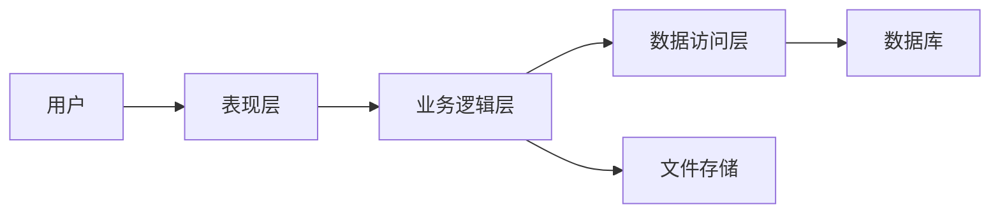

##  基于Spring Boot的文件管理系统

**作者：禅与计算机程序设计艺术**

## 1. 背景介绍

### 1.1 文件管理系统的意义

在信息时代，文件成为了企业和个人最重要的资产之一。如何高效地管理和利用这些文件资源，成为了一个亟待解决的问题。传统的文件夹管理方式存在着效率低下、安全性差、难以共享等弊端，已无法满足日益增长的文件管理需求。

### 1.2 Spring Boot的优势

Spring Boot 是一个基于 Java 的开源框架，它简化了 Spring 应用的初始搭建以及开发过程。其特点是快速开发、易于上手、开箱即用，能够帮助开发者快速构建独立的、生产级别的 Spring 应用。

### 1.3 本文目标

本文旨在利用 Spring Boot 框架，设计并实现一个功能完善、安全可靠的文件管理系统，以解决传统文件管理方式存在的弊端，并提供高效、便捷的文件管理体验。

## 2. 核心概念与联系

### 2.1 系统架构

本系统采用经典的三层架构设计，分别为：

* **表现层（Presentation Layer）：** 负责与用户进行交互，接收用户请求并展示处理结果。
* **业务逻辑层（Business Logic Layer）：** 负责处理业务逻辑，例如文件上传、下载、删除、搜索等。
* **数据访问层（Data Access Layer）：** 负责与数据库进行交互，进行数据的持久化操作。

### 2.2 核心组件

#### 2.2.1 Spring MVC

Spring MVC 是 Spring Framework 中的一个模块，它提供了一种基于 MVC（Model-View-Controller）设计模式的web应用程序开发框架。在本系统中，Spring MVC 负责接收用户请求、调用业务逻辑层处理请求，并将处理结果返回给用户。

#### 2.2.2 Spring Data JPA

Spring Data JPA 是 Spring Data 家族的一部分，它提供了一种简化数据库操作的方式。通过 Spring Data JPA，开发者可以使用面向对象的方式操作数据库，而无需编写繁琐的 SQL 语句。

#### 2.2.3 文件存储

文件存储是文件管理系统的核心功能之一。本系统支持多种文件存储方式，包括：

* **本地文件系统：** 将文件存储在服务器本地磁盘上。
* **云存储：** 将文件存储在云服务提供商的服务器上，例如阿里云 OSS、腾讯云 COS 等。

### 2.3 核心概念关系图



## 3. 核心算法原理具体操作步骤

### 3.1 文件上传

1. 用户在表现层选择要上传的文件。
2. 表现层将文件信息发送给业务逻辑层。
3. 业务逻辑层调用文件存储组件，将文件上传至指定的存储介质。
4. 文件存储组件返回文件存储路径等信息。
5. 业务逻辑层将文件信息保存至数据库。
6. 表现层将上传结果返回给用户。

### 3.2 文件下载

1. 用户在表现层选择要下载的文件。
2. 表现层将文件信息发送给业务逻辑层。
3. 业务逻辑层从数据库中查询文件信息，并调用文件存储组件下载文件。
4. 文件存储组件将文件下载至服务器本地。
5. 业务逻辑层将文件流返回给表现层。
6. 表现层将文件流发送给用户浏览器。

### 3.3 文件删除

1. 用户在表现层选择要删除的文件。
2. 表现层将文件信息发送给业务逻辑层。
3. 业务逻辑层从数据库中查询文件信息，并调用文件存储组件删除文件。
4. 文件存储组件删除存储介质上的文件。
5. 业务逻辑层从数据库中删除文件信息。
6. 表现层将删除结果返回给用户。

## 4. 数学模型和公式详细讲解举例说明

本系统不涉及复杂的数学模型和公式。

## 5. 项目实践：代码实例和详细解释说明

### 5.1 项目环境搭建

1. 安装 JDK 1.8 及以上版本。
2. 安装 Maven 3.5 及以上版本。
3. 安装 IntelliJ IDEA 或 Eclipse 等 IDE 工具。

### 5.2 创建 Spring Boot 项目

使用 Spring Initializr 创建一个 Spring Boot 项目，并添加以下依赖：

```xml
<dependencies>
    <dependency>
        <groupId>org.springframework.boot</groupId>
        <artifactId>spring-boot-starter-web</artifactId>
    </dependency>
    <dependency>
        <groupId>org.springframework.boot</groupId>
        <artifactId>spring-boot-starter-data-jpa</artifactId>
    </dependency>
    <dependency>
        <groupId>mysql