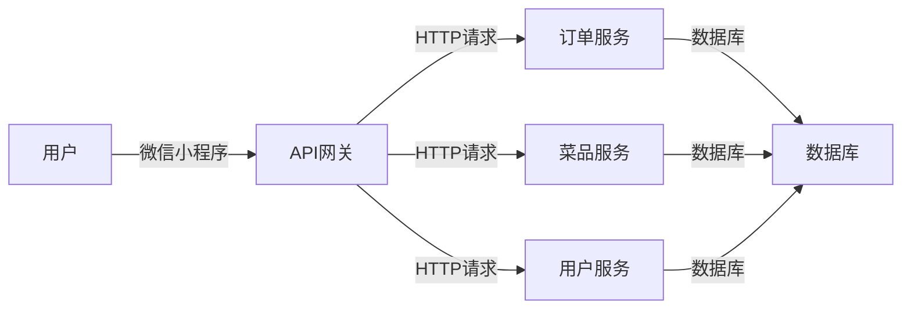

##  1. 背景介绍

### 1.1  餐饮行业数字化转型浪潮

近年来，随着移动互联网的快速发展和智能手机的普及，餐饮行业迎来了数字化转型浪潮。传统的线下点餐模式已经无法满足消费者日益增长的需求，越来越多的餐饮企业开始寻求线上线下融合的发展模式。微信小程序作为一种轻量级应用，凭借其无需下载安装、使用方便快捷等优势，成为了餐饮行业数字化转型的重要工具。

### 1.2  点餐小程序的优势

点餐小程序为餐饮企业带来了诸多优势，主要体现在以下几个方面：

* **提升用户体验:**  用户无需排队等候，通过小程序即可快速完成点餐、支付等操作，极大提升了点餐效率和用户体验。
* **降低运营成本:**  小程序点餐可以减少人工点餐、传菜等环节的人力成本，同时也可以避免传统纸质菜单的印刷成本。
* **提高运营效率:**  小程序可以实时统计菜品销量、用户数据等信息，帮助商家进行精准营销和运营决策。
* **增强用户粘性:**  小程序可以通过积分、优惠券等方式进行用户营销，提高用户粘性和复购率。

### 1.3 Spring Boot 的优势

Spring Boot 是一个基于 Java 的开源框架，旨在简化 Spring 应用的初始搭建以及开发过程。它采用了“约定大于配置”的理念，自动进行 Spring 应用的配置，使得开发者能够更加专注于业务逻辑的实现。

Spring Boot 具有以下优势：

* **快速开发:**  Spring Boot 提供了自动配置、起步依赖等功能，可以快速搭建项目框架，提高开发效率。
* **易于部署:**  Spring Boot 内嵌了 Tomcat、Jetty 等 Web 容器，可以直接打包成可执行的 jar 包进行部署，无需单独安装 Web 容器。
* **简化配置:**  Spring Boot 提供了大量的默认配置，可以减少开发者需要手动配置的内容，降低了配置的复杂度。
* **易于集成:**  Spring Boot 可以轻松地与 Spring Cloud、MyBatis、Redis 等其他框架进行集成，方便构建大型分布式应用。

## 2. 核心概念与联系

### 2.1  系统架构

本项目采用前后端分离的架构设计，前端使用微信小程序开发，后端使用 Spring Boot 框架开发。

系统架构图如下所示：



### 2.2  核心模块

本项目主要包含以下几个模块：

* **用户模块:**  负责用户注册、登录、个人信息管理等功能。
* **菜品模块:**  负责菜品的添加、修改、删除、查询等功能。
* **订单模块:**  负责用户下单、支付、订单管理等功能。
* **API 网关模块:**  负责接收微信小程序的请求，并将请求转发到对应的后端服务进行处理。

### 2.3  技术栈

本项目使用的主要技术栈如下：

* **前端:**  微信小程序、JavaScript、CSS
* **后端:**  Spring Boot、MyBatis、MySQL、Redis
* **工具:**  Maven、Git、IDEA

## 3. 核心算法原理具体操作步骤

### 3.1  用户登录流程

1. 用户打开微信小程序，点击“登录”按钮。
2. 小程序调用 wx.login() 获取用户 code。
3. 小程序将 code 发送给后端 API 网关。
4. API 网关调用微信登录接口，使用 code 换取用户 openid 和 session_key。
5. API 网关根据 openid 查询用户是否存在，如果不存在则创建新用户。
6. API 网关生成 JWT token，并将 token 返回给小程序。
7. 小程序将 token 保存到本地存储中，下次请求时携带 token。

### 3.2  下单流程

1. 用户选择菜品，点击“下单”按钮。
2. 小程序将订单信息发送给后端 API 网关。
3. API 网关调用订单服务创建订单。
4. 订单服务生成订单号，并将订单信息保存到数据库中。
5. 订单服务调用支付接口，完成支付操作。
6. 支付成功后，订单服务更新订单状态，并通知小程序支付结果。

## 4. 数学模型和公式详细讲解举例说明

本项目中没有涉及到复杂的数学模型和公式。

## 5. 项目实践：代码实例和详细解释说明

### 5.1  项目环境搭建

1. 安装 JDK 1.8 或以上版本。
2. 安装 Maven 3.6 或以上版本。
3. 安装 MySQL 5.7 或以上版本。
4. 安装 Redis 5.0 或以上版本。
5. 安装 IntelliJ IDEA 或其他 Java IDE。

### 5.2  创建 Spring Boot 项目

1. 打开 IntelliJ IDEA，选择 “Create New Project”。
2. 选择 “Spring Initializr”，点击 “Next”。
3. 填写项目信息，选择 Spring Web、MyBatis、MySQL Driver、Redis 依赖，点击 “Next”。
4. 选择项目路径，点击 “Finish”。

### 5.3  编写代码

```java
// 用户实体类
@Data
@TableName("user")
public class User {

    @TableId(type = IdType.AUTO)
    private Long id;

    private String openid;

    private String nickname;

    private String avatarUrl;

    private Date createTime;

    private Date updateTime;
}

// 用户服务接口
public interface UserService extends IService<User> {

    User getByOpenid(String openid);
}

// 用户服务实现类
@Service
public class UserServiceImpl extends ServiceImpl<UserMapper, User> implements UserService {

    @Override
    public User getByOpenid(String openid) {
        QueryWrapper<User> queryWrapper = new QueryWrapper<>();
        queryWrapper.eq("openid", openid);
        return baseMapper.selectOne(queryWrapper);
    }
}

// 用户控制器
@RestController
@RequestMapping("/user")
public class UserController {

    @Autowired
    private UserService userService;

    @PostMapping("/login")
    public Result login(@RequestBody LoginDTO loginDTO) {
        // 调用微信登录接口，获取用户 openid
        String openid = getOpenid(loginDTO.getCode());

        // 根据 openid 查询用户
        User user = userService.getByOpenid(openid);

        // 如果用户不存在，则创建新用户
        if (user == null) {
            user = new User();
            user.setOpenid(openid);
            user.setNickname(loginDTO.getNickname());
            user.setAvatarUrl(loginDTO.getAvatarUrl());
            userService.save(user);
        }

        // 生成 JWT token
        String token = generateToken(user);

        // 返回 token
        return Result.success(token);
    }
}
```

### 5.4  运行项目

1. 在 IntelliJ IDEA 中，点击 “Run” 按钮。
2. 项目启动后，访问 http://localhost:8080/swagger-ui.html 可以查看 API 文档。

## 6. 实际应用场景

点餐微信小程序适用于各种类型的餐饮场景，例如：

* **餐厅:**  用户可以通过小程序进行点餐、支付、评价等操作。
* **外卖平台:**  外卖平台可以开发自己的点餐小程序，为用户提供更加便捷的点餐服务。
* **酒店:**  酒店可以开发点餐小程序，为住客提供客房点餐服务。
* **咖啡厅:**  咖啡厅可以开发点餐小程序，方便用户快速点餐和支付。

## 7. 工具和资源推荐

### 7.1  开发工具

* **IntelliJ IDEA:**  一款功能强大的 Java IDE，提供了丰富的开发工具和插件。
* **微信开发者工具:**  微信官方提供的微信小程序开发工具，可以进行小程序的开发、调试、预览等操作。

### 7.2  学习资源

* **Spring Boot 官方文档:**  https://spring.io/projects/spring-boot
* **微信小程序开发文档:**  https://developers.weixin.qq.com/miniprogram/dev/framework/

## 8. 总结：未来发展趋势与挑战

### 8.1  未来发展趋势

* **更加智能化:**  随着人工智能技术的不断发展，点餐小程序将会更加智能化，例如：智能推荐菜品、智能客服等。
* **更加个性化:**  点餐小程序将会更加注重用户的个性化需求，例如：根据用户的口味推荐菜品、提供个性化的点餐服务等。
* **更加场景化:**  点餐小程序将会更加融入到用户的各种生活场景中，例如：提供预订座位、外卖配送、在线排队等服务。

### 8.2  挑战

* **数据安全:**  点餐小程序需要处理用户的个人信息和支付信息，数据安全是一个重要的挑战。
* **用户体验:**  点餐小程序需要不断提升用户体验，才能吸引用户长期使用。
* **市场竞争:**  点餐小程序市场竞争激烈，需要不断创新才能保持竞争力。

## 9. 附录：常见问题与解答

### 9.1  如何获取微信小程序的 code？

调用 wx.login() 方法可以获取用户 code。

### 9.2  如何使用 code 换取 openid？

调用微信登录接口，使用 code 换取 openid 和 session_key。

### 9.3  如何生成 JWT token？

使用 JWT 工具类生成 JWT token，并将用户信息存储到 token 中。

### 9.4  如何校验 JWT token？

使用 JWT 工具类校验 JWT token 的合法性，并从 token 中获取用户信息。