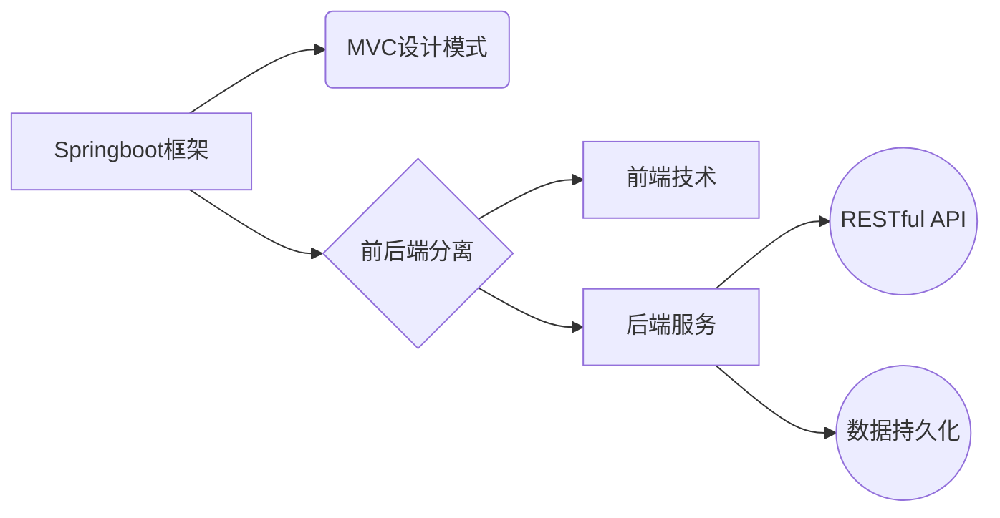

# 基于springboot的高校校园交流墙

作者：禅与计算机程序设计艺术

## 1.背景介绍

### 1.1 高校校园交流的重要性
在当今高校校园中,良好的交流与沟通是学生成长和发展的关键。校园交流墙为学生提供了一个自由表达、分享想法、交流经验的平台,有助于促进学生之间的互动,增强校园凝聚力。

### 1.2 传统校园交流方式的局限性
传统的校园交流方式,如海报、布告栏等,存在信息更新不及时、互动性差等问题。随着移动互联网的发展,学生们更青睐于使用移动应用进行即时交流。

### 1.3 开发校园交流墙应用的意义
开发一个基于springboot的校园交流墙应用,可以充分利用移动互联网技术,为学生提供便捷、高效、互动性强的交流平台。这不仅能够促进校园文化建设,还能提升学生的综合素质。

## 2.核心概念与联系

### 2.1 Springboot框架
Springboot是一个基于Java的开源Web应用框架,它简化了Spring应用的开发和配置过程,使得开发者能够快速构建独立运行的应用程序。

### 2.2 MVC设计模式
MVC(Model-View-Controller)是一种软件设计模式,它将应用程序分为三个相互关联的部分:模型(Model)、视图(View)和控制器(Controller)。Springboot 框架采用MVC模式来组织代码结构。

### 2.3 前后端分离
前后端分离是指将应用的前端界面和后端服务分开开发和部署。校园交流墙可采用前后端分离的架构,前端使用HTML、CSS、JavaScript等技术实现用户界面,后端使用Springboot提供RESTful API接口。

### 2.4 数据持久化
数据持久化是将应用数据长期保存的过程。校园交流墙需要将用户信息、帖子内容等数据持久化存储,常用的持久化方案包括关系型数据库(如MySQL)和非关系型数据库(如MongoDB)。

### 2.5 核心概念关联图


## 3.核心算法原理具体操作步骤

### 3.1 用户认证
校园交流墙要求用户登录后才能发帖和评论。常见的用户认证方式有:
1. 用户名密码认证:用户提交用户名和密码,后端服务验证登录信息。
2. OAuth认证:使用第三方认证服务(如QQ、微信)进行用户身份验证。
3. JWT(JSON Web Token):采用JWT进行用户认证和授权,确保请求的安全性。

### 3.2 发帖
发帖是校园交流墙的核心功能,其基本步骤如下:
1. 用户在前端界面编辑帖子内容,并提交发布请求。
2. 后端服务接收到请求后,将帖子内容、发布时间等信息存储到数据库,并生成唯一的帖子ID。
3. 后端服务返回帖子发布成功的响应,并将生成的帖子ID返回给前端。
4. 前端界面根据返回的帖子ID,更新帖子列表。

### 3.3 评论与回复
评论和回复功能允许用户对帖子进行讨论和交流,其基本步骤如下:
1. 用户在前端界面编辑评论内容,并提交评论请求。
2. 后端服务接收到请求后,将评论内容、评论时间、关联的帖子ID等信息存储到数据库。
3. 后端服务返回评论成功的响应,并将生成的评论ID返回给前端。
4. 前端界面根据返回的评论ID,更新评论列表。

### 3.4 点赞与收藏
点赞和收藏功能允许用户对感兴趣的帖子进行互动,其基本步骤如下:
1. 用户在前端界面点击点赞或收藏按钮。
2. 前端界面向后端服务发送点赞或收藏请求,请求中包含用户ID和帖子ID。
3. 后端服务接收到请求后,更新数据库中相应的点赞数或收藏记录。
4. 后端服务返回操作成功的响应。
5. 前端界面根据响应结果,更新帖子的点赞数或收藏状态。

## 4.数学模型和公式详细讲解举例说明

### 4.1 用户行为分析模型
为了分析用户在校园交流墙的行为,可以使用用户行为分析模型。常见的用户行为分析模型包括:

#### 4.1.1 RFM模型
RFM模型通过考虑用户的最近交互时间(Recency)、交互频率(Frequency)和交互强度(Monetary),来评估用户价值和参与度。
$$
RFM = \alpha \times R + \beta \times F + \gamma \times M
$$
其中,$\alpha$,$\beta$,$\gamma$为权重系数,可根据实际情况调整。

#### 4.1.2 漏斗模型
漏斗模型用于分析用户从初次接触到最终转化的过程,帮助找出用户流失的原因。漏斗模型的转化率计算公式为:
$$
转化率 = \frac{完成某一步骤的用户数}{进入该步骤的用户数}
$$

### 4.2 推荐系统模型
校园交流墙可以引入推荐系统,为用户推荐感兴趣的帖子。常见的推荐系统模型包括:

#### 4.2.1 协同过滤
协同过滤根据用户的历史行为,找到相似用户或相似物品,从而进行推荐。其中,基于用户的协同过滤计算用户相似度的公式为:
$$
sim(u,v) = \frac{\sum_{i \in I_{uv}}(r_{ui}-\bar{r}_u)(r_{vi}-\bar{r}_v)}{\sqrt{\sum_{i \in I_{uv}}(r_{ui}-\bar{r}_u)^2}\sqrt{\sum_{i \in I_{uv}}(r_{vi}-\bar{r}_v)^2}}
$$
其中,$u$和$v$为两个用户,$I_{uv}$为两个用户共同交互过的物品集合,$r_{ui}$和$r_{vi}$分别为用户$u$和$v$对物品$i$的评分,$\bar{r}_u$和$\bar{r}_v$分别为用户$u$和$v$的平均评分。

#### 4.2.2 基于内容的推荐
基于内容的推荐根据物品的属性特征,找到与用户历史喜好相似的物品进行推荐。常见的文本相似度计算方法有TF-IDF、Word2Vec等。

## 5.项目实践：代码实例和详细解释说明 

下面是一个使用Springboot和MyBatis实现用户登录功能的示例代码:

### 5.1 用户实体类
```java
public class User {
    private Long id;
    private String username;
    private String password;
    // 省略getter和setter方法
}
```

### 5.2 用户持久层接口
```java
@Mapper
public interface UserMapper {
    User getUserByUsername(String username);
}
```

### 5.3 用户服务层
```java
@Service
public class UserService {
    @Autowired
    private UserMapper userMapper;
    
    public User login(String username, String password) {
        User user = userMapper.getUserByUsername(username);
        if (user != null && user.getPassword().equals(password)) {
            return user;
        }
        return null;
    }
}
```

### 5.4 用户控制层
```java
@RestController
@RequestMapping("/user")
public class UserController {
    @Autowired
    private UserService userService;
    
    @PostMapping("/login")
    public Result login(@RequestBody User user) {
        User loggedInUser = userService.login(user.getUsername(), user.getPassword());
        if (loggedInUser != null) {
            return ResultGenerator.genSuccessResult(loggedInUser);
        } else {
            return ResultGenerator.genFailResult("用户名或密码错误");
        }
    }
}
```

### 5.5 代码说明
- UserMapper接口使用MyBatis的`@Mapper`注解标识,定义了根据用户名查询用户的方法。
- UserService是业务逻辑层,调用UserMapper进行数据访问,并进行登录验证。
- UserController是控制层,暴露了用户登录的API接口,接收前端请求并返回JSON格式的响应结果。
- ResultGenerator是一个工具类,用于生成统一格式的响应结果。

## 6.实际应用场景

校园交流墙在高校校园中有广泛的应用场景,主要包括:

### 6.1 学习交流
学生可以在交流墙上发布学习心得、请教问题、分享资料等,促进学习交流和知识分享。

### 6.2 社团活动
校园社团可以利用交流墙发布活动通知、组织讨论、招聘成员等,加强社团内部和社团之间的沟通。

### 6.3 校园服务
学校各部门可以通过交流墙发布校园新闻、通知公告、问卷调查等,方便学生及时获取校园信息和参与学校事务。

### 6.4 二手交易
学生可以在交流墙上发布二手物品的买卖信息,促进校园内的资源循环利用。

### 6.5 失物招领
交流墙可用于发布失物招领信息,帮助学生找回丢失物品。

## 7.工具和资源推荐

### 7.1 开发工具
- IntelliJ IDEA:Java IDE,提供了智能代码提示、调试、重构等功能。
- Postman:API测试工具,用于测试和调试后端接口。
- Git:版本控制工具,便于代码管理和团队协作。

### 7.2 技术文档
- Springboot官方文档:https://spring.io/projects/spring-boot
- MyBatis官方文档:https://mybatis.org/mybatis-3/
- Vue.js官方文档:https://cn.vuejs.org/
- Element UI官方文档:https://element.eleme.cn/

### 7.3 开源项目
- awesome-spring-boot:Springboot 资源大全
- mall:基于SpringBoot+MyBatis的电商系统
- vue-element-admin:基于Vue和Element UI的后台管理系统

## 8.总结：未来发展趋势与挑战

### 8.1 移动端适配
随着移动设备的普及,校园交流墙需要提供移动端友好的界面和功能,以满足学生随时随地进行交流的需求。

### 8.2 智能化推荐
利用人工智能技术,对用户行为进行分析和建模,实现个性化的内容推荐,提高用户的使用体验和粘性。

### 8.3 内容审核
为维护校园交流环境的健康和谐,需要引入智能内容审核机制,及时发现和处理不良信息。

### 8.4 社交化互动
加强交流墙的社交属性,引入类似点赞、评论、@用户等社交化互动功能,促进用户间的交流和链接。

### 8.5 数据安全与隐私保护
交流墙涉及用户的个人信息和隐私数据,需要采取必要的安全措施,如数据加密、访问控制等,保护用户隐私。

## 9.附录：常见问题与解答

### 9.1 如何处理敏感词和不良信息?
可以维护一个敏感词库,在用户发帖时进行文本匹配,过滤敏感词。对于疑似不良信息,可采用人工审核与智能审核相结合的方式处理。

### 9.2 如何保证系统的高可用性?
可以采用负载均衡、服务集群等手段提升系统的高可用性。同时要做好日志监控和异常报警,及时发现和处理故障。

### 9.3 如何提高查询性能?
可以使用索引、缓存等技术手段优化查询性能。对于复杂查询,可以采用读写分离、分库分表等方式进行优化。

### 9.4 如何进行压力测试?
可以使用JMeter、LoadRunner等工具进行压力测试,模拟大量用户并发访问的场景,找出系统的性能瓶颈和可能的问题。

### 9.5 如何进行数据备份和恢复?
要制定完善的数据备份策略,定期进行全量备份和增量备份。同时要有相应的数据恢复机制和流程,确保在故障发生时能够及时恢复数据。

以上就是基于Springboot的高校校园交流墙项