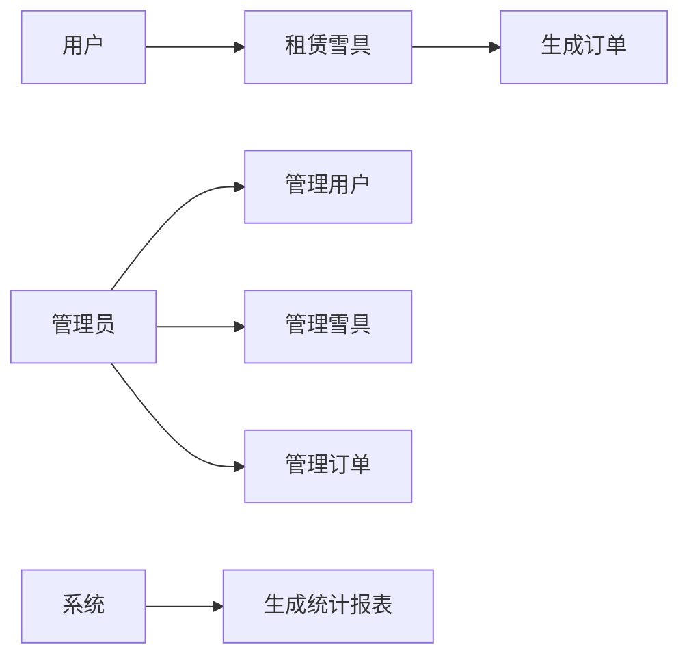

## 基于SSM的滑雪场租赁系统

### 1. 背景介绍

#### 1.1.  滑雪运动的兴起与市场需求

近年来，随着人们生活水平的提高和对健康生活方式的追求，参与冰雪运动的人数逐年增加，滑雪运动作为一项时尚、刺激的冬季运动，越来越受到大众的喜爱。滑雪场的数量和规模也在不断扩大，随之而来的是对滑雪场管理系统需求的不断增长。传统的滑雪场管理模式存在着效率低下、信息不透明、服务质量难以保证等问题，已经无法满足现代滑雪场的管理需求。

#### 1.2.  信息化管理的必要性

为了提高滑雪场的运营效率，提升客户体验，实现精细化管理，越来越多的滑雪场开始引入信息化管理系统。一个功能完善、性能稳定的滑雪场租赁系统可以帮助滑雪场实现以下目标：

*   **提高运营效率**: 自动化租赁流程，减少人工操作，提高工作效率。
*   **提升客户体验**: 提供便捷的在线预订、支付、取还雪具等服务，提升客户满意度。
*   **实现数据化管理**:  收集和分析运营数据，为经营决策提供数据支持。

#### 1.3. SSM框架的优势

SSM框架 (Spring + Spring MVC + MyBatis) 是一种轻量级的 Java EE 开发框架，具有以下优势：

*   **开发效率高**:  SSM框架集成了 Spring 的 IoC 和 AOP 特性，简化了开发流程，提高了开发效率。
*   **易于维护**:  SSM框架结构清晰，层次分明，代码易于理解和维护。
*   **性能优异**:  SSM框架各层之间耦合度低，可以灵活配置，优化系统性能。

基于以上原因，本系统采用 SSM 框架进行开发，旨在为滑雪场提供一个功能完善、性能稳定、易于维护的租赁系统。


### 2. 核心概念与联系

#### 2.1. 系统用户角色

本系统主要涉及以下用户角色：

*   **管理员**: 负责系统管理、用户管理、雪具管理、订单管理、统计报表等功能。
*   **用户**:  注册用户可以进行雪具预订、支付、查看订单、修改个人信息等操作。
*   **游客**: 未注册用户可以浏览雪具信息。

#### 2.2.  系统功能模块

本系统主要包括以下功能模块：

*   **用户管理模块**:  实现用户注册、登录、信息修改、密码找回等功能。
*   **雪具管理模块**: 实现雪具信息的添加、修改、删除、查询等功能。
*   **订单管理模块**:  实现雪具预订、支付、取消、退款、取货、归还等功能。
*   **统计报表模块**:  实现营业额统计、雪具租赁情况统计、用户消费情况统计等功能。

#### 2.3.  核心概念联系

*   用户可以通过系统租赁雪具，生成订单。
*   管理员可以管理系统用户、雪具信息和订单信息。
*   系统可以生成各种统计报表，为经营决策提供数据支持。

#### 2.4.  核心概念架构图



### 3.  核心算法原理具体操作步骤

#### 3.1.  雪具库存管理算法

本系统采用 **先进先出（FIFO）** 的算法来管理雪具库存。

**具体操作步骤如下**:

1.  当有新的雪具入库时，将新雪具的入库时间记录下来。
2.  当用户租赁雪具时，系统会根据雪具的入库时间，优先选择入库时间最早的雪具进行分配。
3.  当雪具归还时，系统会更新雪具的状态为“可租赁”。

#### 3.2.  订单生成算法

当用户提交订单时，系统会执行以下操作：

1.  检查用户选择的雪具是否 available，如果 available 则继续下一步，否则提示用户选择其他雪具。
2.  生成订单编号，记录订单信息，包括用户 ID、雪具 ID、租赁时间、归还时间、订单金额等。
3.  更新雪具状态为“已租赁”。
4.  向用户发送订单确认信息。

#### 3.3.  支付流程

本系统支持多种支付方式，包括支付宝、微信支付等。

**支付流程如下**:

1.  用户选择支付方式。
2.  系统根据用户选择的支付方式，生成支付二维码或跳转到第三方支付平台。
3.  用户完成支付操作。
4.  支付平台通知系统支付结果。
5.  系统更新订单状态为“已支付”。

### 4.  数学模型和公式详细讲解举例说明

#### 4.1.  营业额统计模型

**公式:**

```
日营业额 = 当日所有已完成订单的总金额
月营业额 = 当月所有已完成订单的总金额
年营业额 = 当年所有已完成订单的总金额
```

**举例说明**:

假设 2024 年 5 月 22 日，滑雪场共完成了 100 个订单，订单总金额为 10000 元，则当日营业额为 10000 元。

#### 4.2.  雪具租赁情况统计模型

**公式**:

```
雪具租赁率 = (已租赁雪具数量 / 雪具总数) * 100%
```

**举例说明**:

假设滑雪场共有 1000 副雪具，其中 800 副已租赁，则雪具租赁率为 (800 / 1000) * 100% = 80%。

#### 4.3. 用户消费情况统计模型

**公式**:

```
用户平均消费金额 = 用户总消费金额 / 用户数量
```

**举例说明**:

假设滑雪场共有 1000 名用户，用户总消费金额为 100000 元，则用户平均消费金额为 100000 / 1000 = 100 元。

### 5.  项目实践：代码实例和详细解释说明

#### 5.1. 项目结构

```
ski-rental-system
├── src
│   ├── main
│   │   ├── java
│   │   │   └── com
│   │   │       └── example
│   │   │           └── skirentalsystem
│   │   │               ├── controller
│   │   │               │   ├── UserController.java
│   │   │               │   ├── SkiController.java
│   │   │               │   └── OrderController.java
│   │   │               ├── service
│   │   │               │   ├── UserService.java
│   │   │               │   ├── SkiService.java
│   │   │               │   └── OrderService.java
│   │   │               ├── dao
│   │   │               │   ├── UserMapper.java
│   │   │               │   ├── SkiMapper.java
│   │   │               │   └── OrderMapper.java
│   │   │               ├── entity
│   │   │               │   ├── User.java
│   │   │               │   ├── Ski.java
│   │   │               │   └── Order.java
│   │   │               └── config
│   │   │                   ├── SpringConfig.java
│   │   │                   └── MyBatisConfig.java
│   │   └── resources
│   │       ├── mapper
│   │       │   ├── UserMapper.xml
│   │       │   ├── SkiMapper.xml
│   │       │   └── OrderMapper.xml
│   │       ├── application.properties
│   │       └── log4j2.xml
│   └── test
│       └── java
│           └── com
│               └── example
│                   └── skirentalsystem
│                       └── AppTest.java
└── pom.xml

```

#### 5.2.  代码实例

##### 5.2.1.  用户注册功能

```java
// UserController.java
@Controller
@RequestMapping("/user")
public class UserController {

    @Autowired
    private UserService userService;

    @PostMapping("/register")
    public String register(User user) {
        userService.register(user);
        return "redirect:/login";
    }
}
```

```java
// UserService.java
@Service
public class UserService {

    @Autowired
    private UserMapper userMapper;

    public void register(User user) {
        userMapper.insert(user);
    }
}
```

```xml
<!-- UserMapper.xml -->
<?xml version="1.0" encoding="UTF-8" ?>
<!DOCTYPE mapper PUBLIC "-//mybatis.org//DTD Mapper 3.0//EN" "http://mybatis.org/dtd/mybatis-3-mapper.dtd" >
<mapper namespace="com.example.skirentalsystem.dao.UserMapper" >
  <insert id="insert" parameterType="com.example.skirentalsystem.entity.User" >
    insert into user (username, password, phone, email)
    values (#{username}, #{password}, #{phone}, #{email})
  </insert>
</mapper>
```

##### 5.2.2.  雪具租赁功能

```java
// SkiController.java
@Controller
@RequestMapping("/ski")
public class SkiController {

    @Autowired
    private SkiService skiService;

    @PostMapping("/rent")
    public String rent(Order order) {
        skiService.rent(order);
        return "redirect:/order/list";
    }
}
```

```java
// SkiService.java
@Service
public class SkiService {

    @Autowired
    private SkiMapper skiMapper;

    @Autowired
    private OrderService orderService;

    public void rent(Order order) {
        // 检查雪具是否 available
        Ski ski = skiMapper.selectById(order.getSkiId());
        if (ski == null || !ski.getStatus().equals("available")) {
            throw new RuntimeException("雪具不可租赁");
        }

        // 生成订单
        orderService.createOrder(order);

        // 更新雪具状态为“已租赁”
        ski.setStatus("rented");
        skiMapper.updateById(ski);
    }
}
```

### 6.  实际应用场景

#### 6.1.  滑雪场租赁业务流程管理

本系统可以帮助滑雪场实现雪具租赁业务流程的自动化管理，提高租赁效率，减少人工成本。

#### 6.2.  客户关系管理

本系统可以记录用户的租赁信息，为客户提供个性化服务，提高客户满意度。

#### 6.3.  数据分析与决策支持

本系统可以收集和分析运营数据，为经营决策提供数据支持，例如：

*   分析不同类型雪具的租赁情况，调整采购策略。
*   分析不同时间段的客流量，优化运营时间。
*   分析用户的消费习惯，制定精准的营销策略。

### 7.  工具和资源推荐

#### 7.1.  开发工具

*   IntelliJ IDEA
*   Maven
*   Git

#### 7.2.  数据库

*   MySQL

#### 7.3.  框架和技术

*   Spring Framework
*   Spring MVC
*   MyBatis
*   JSP
*   Bootstrap

### 8.  总结：未来发展趋势与挑战

#### 8.1.  未来发展趋势

*   **移动化**:  随着移动互联网的普及，滑雪场租赁系统将更加注重移动端的用户体验，开发移动端 APP，方便用户随时随地租赁雪具。
*   **智能化**: 利用人工智能技术，实现雪具推荐、智能客服等功能，进一步提升用户体验。
*   **数据化**:  加强数据分析能力，为经营决策提供更加精准的数据支持。

#### 8.2.  挑战

*   **数据安全**:  随着系统数据量的不断增大，数据安全问题日益突出，需要加强数据加密、访问控制等安全措施。
*   **系统性能**:  随着用户量的增加，系统并发访问量也会增加，需要优化系统架构和代码，提高系统性能。
*   **用户体验**:  滑雪场租赁系统需要不断提升用户体验，才能吸引更多用户使用。


### 9.  附录：常见问题与解答

#### 9.1.  如何注册账号？

访问系统首页，点击“注册”按钮，填写相关信息即可完成注册。

#### 9.2.  如何租赁雪具？

登录系统，选择要租赁的雪具，填写租赁时间等信息，提交订单并完成支付即可。

#### 9.3.  如何取消订单？

登录系统，在我的订单中找到要取消的订单，点击“取消订单”按钮即可。

#### 9.4.  如何联系客服？

如果遇到任何问题，可以通过系统内的客服功能联系客服人员。


## 后记

本篇博客详细介绍了基于 SSM 的滑雪场租赁系统的开发过程，包括系统背景、核心概念、算法原理、代码实例、实际应用场景、未来发展趋势等内容。希望本篇博客能够为正在开发类似系统的开发者提供一些参考和帮助。
