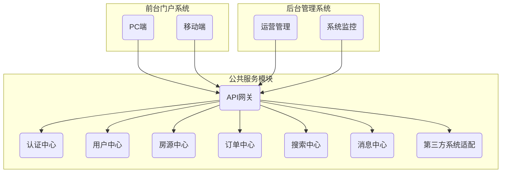

# 基于SSM的二手房屋交易系统

## 1. 背景介绍

### 1.1 二手房屋交易市场概况

随着城市化进程的不断加快,人口流动性加大,二手房屋交易市场日益壮大。相比于购买新房,二手房屋交易具有价格相对便宜、地理位置优越、装修成熟等优势。然而,传统的二手房屋交易模式存在信息不对称、交易效率低下等问题,亟需通过互联网技术来提升交易体验。

### 1.2 系统需求分析

为了解决上述痛点,我们需要开发一套基于互联网的二手房屋交易系统,主要需求包括:

1. 房源信息发布和查询
2. 在线即时沟通交流
3. 线上签约支付交易
4. 个人中心管理功能
5. 后台运营管理系统

### 1.3 技术选型

本系统采用目前流行的SSM(Spring+SpringMVC+MyBatis)框架,具体技术栈包括:

- 后端: Java、Spring、SpringMVC、MyBatis
- 前端: HTML5、CSS3、JavaScript、Vue.js
- 数据库: MySQL
- 中间件: Redis、RabbitMQ
- 其他: Elasticsearch(搜索)、JWT(认证)、Swagger(API文档)

## 2. 核心概念与联系

### 2.1 系统架构

整个系统采用前后端分离的架构设计,后端提供RESTful API接口,前端通过Ajax方式调用。系统主要包括:

- 前台门户系统(PC+移动端)
- 后台管理系统
- 公共服务模块



### 2.2 核心业务流程

1. 买家查看房源信息,与卖家在线沟通
2. 买家下单,调用第三方签约平台签订电子合同
3. 买家在线支付,订单状态更新为已支付
4. 系统通知卖家房屋已成功出售
5. 买家可查看个人订单,卖家可查看个人房源

### 2.3 关键技术难点

1. 高并发场景下的系统架构设计
2. 全文搜索与精准推荐算法
3. 实时通信与消息推送机制 
4. 在线签约及支付安全问题
5. 大文件(如房产证照等)的存储与传输

## 3. 核心算法原理具体操作步骤

### 3.1 房源搜索与推荐算法

搜索与推荐是本系统的核心功能,我们综合采用多种算法来提高检索质量:

1. **全文搜索**

   利用Elasticsearch建立房源信息的反向索引,支持基于多种条件(地理位置、价格区间、房型等)的组合搜索。

2. **相似度算法**

   计算用户浏览历史与房源信息的相似度,给出个性化推荐。常用的相似度算法有余弦相似度、汤普森相似度等。

   $$\text{sim}(X,Y) = \frac{\sum\limits_{i=1}^{n}x_iy_i}{\sqrt{\sum\limits_{i=1}^{n}x_i^2}\sqrt{\sum\limits_{i=1}^{n}y_i^2}}$$

3. **协同过滤算法**

   基于用户的浏览记录与其他用户的记录进行比较,找出兴趣相投的用户群,并推荐该群体喜欢的房源。

4. **LFM模型**

   将房源、用户及其行为数据映射到同一个隐语义空间,利用矩阵分解技术来发现用户潜在兴趣爱好,从而实现精准推荐。

5. **XGBoost排序**

   综合多种算法的结果,并结合房源静态特征(如地理位置、价格等),使用XGBoost进行加权排序,输出最终搜索结果。

### 3.2 实时通信与消息推送

为了提升用户体验,我们需要在系统中加入实时通信与消息推送功能:

1. **WebSocket**

   买家与卖家可以通过WebSocket技术进行实时在线聊天,快速沟通房源信息。

2. **消息队列**

   系统内部采用RabbitMQ作为消息队列,用于异步处理一些耗时较长的任务,如发送推送消息等。

3. **消息推送**

   将用户感兴趣的房源动态及时推送到用户手机端,可选择使用运营商推送通道或第三方推送服务。

### 3.3 在线签约及支付

为了确保交易安全,减少线下操作环节,我们将签约及支付环节集成到系统中:

1. **电子签名**

   用户可在线填写并签订电子合同,合同加密存证于区块链防止篡改。

2. **第三方支付**  

   集成了多家第三方支付渠道,如微信、支付宝、网银等,用户可选择在线付款。

3. **交易监控**

   通过设置状态机模型,监控并记录交易的每一个环节,确保万无一失。

## 4. 数学模型和公式详细讲解举例说明  

### 4.1 余弦相似度

余弦相似度通过计算两个向量的夹角余弦值来衡量它们的相似度,公式如下:

$$\text{sim}(X,Y) = \cos(\theta) = \frac{X \cdot Y}{\|X\|\|Y\|} = \frac{\sum\limits_{i=1}^{n}x_iy_i}{\sqrt{\sum\limits_{i=1}^{n}x_i^2}\sqrt{\sum\limits_{i=1}^{n}y_i^2}}$$

其中$X$和$Y$是两个n维向量,$x_i$和$y_i$是对应的分量值。

余弦相似度的值域为$[0,1]$,值越大表示两个向量越相似。

例如,对于两个2维向量$X=(3,4)$和$Y=(4,3)$,它们的余弦相似度为:

$$\begin{aligned}
\text{sim}(X,Y) &= \frac{3\times4 + 4\times3}{\sqrt{3^2+4^2}\sqrt{4^2+3^2}}\\
&= \frac{24}{\sqrt{25}\sqrt{25}}\\
&= \frac{24}{25}\\
&= 0.96
\end{aligned}$$

这个很高的相似度值说明两个向量的方向是非常接近的。

### 4.2 LFM 模型

LFM(Latent Factor Model)隐语义模型是一种基于矩阵分解的推荐算法,可以发现用户与物品的隐含关系。

设$R$为用户-物品评分矩阵,对于缺失的评分,我们用$r_{ui}$来预测:

$$r_{ui} = \mu + b_u + b_i + q_i^Tp_u$$

其中:
- $\mu$是全局偏置项
- $b_u$是用户偏置项
- $b_i$是物品偏置项  
- $q_i$是物品隐语义向量
- $p_u$是用户隐语义向量

模型通过最小化如下目标函数来学习各个参数:

$$\min\limits_{\{b_u,b_i,q_i,p_u\}}\sum\limits_{r_{ui}\in R}(r_{ui} - \hat{r}_{ui})^2 + \lambda(\|b_u\|^2+\|b_i\|^2+\|q_i\|^2+\|p_u\|^2)$$

其中$\lambda$是正则化系数,用于避免过拟合。可以使用随机梯度下降等优化算法来求解。

## 4. 项目实践: 代码实例和详细解释说明

### 4.1 房源搜索服务

我们以房源搜索服务为例,介绍如何使用Elasticsearch实现全文搜索功能:

1. 安装并配置Elasticsearch
2. 定义House实体映射
   ```java
    @Document(indexName = "house")
    public class House {
        @Id 
        private Long id;
        @Field(type = FieldType.Text, analyzer = "ik_max_word")
        private String title;
        // 其他字段...
    }
   ```
3. 编写HouseRepository
   ```java
    @Repository
    public interface HouseRepository extends ElasticsearchRepository<House, Long> {
        List<House> findByTitleContainingOrDescContainingOrHouseTypeOrRegionOrAddress(
                String title, String desc, HouseType type, String region, String address);
    }
   ```
4. 在HouseService中注入并使用
   ```java
    @Autowired
    private HouseRepository houseRepo;

    public List<House> search(HouseSearchParams params) {
        return houseRepo.findByTitleContainingOrDescContainingOrHouseTypeOrRegionOrAddress(
                params.getKeywords(), params.getKeywords(), params.getType(), 
                params.getRegion(), params.getAddress());
    }
   ```
5. 对搜索结果进行排序、高亮、分页等处理

### 4.2 实时通信示例

我们使用Spring的**SockJS**与**STOMP**模块实现WebSocket通信:

1. 启用WebSocket支持
   ```java
    @Configuration
    @EnableWebSocketMessageBroker
    public class WebSocketConfig extends AbstractWebSocketMessageBrokerConfigurer {
        // ...  
    }
   ```
2. 定义消息映射
   ```java
    @Controller
    public class ChatController {
        @MessageMapping("/chat/{houseId}")
        @SendTo("/house/{houseId}")
        public OutputMessage handleMessage(Message message, @DestinationVariable Long houseId) {
            // 处理消息并返回给订阅者
        }
    }
   ```
3. 前端订阅主题
   ```javascript
    const sock = new SockJS("/ws-endpoint");
    const stomp = Stomp.over(sock);
    stomp.connect({}, () => {
        const houseId = 123;
        stomp.subscribe(`/house/${houseId}`, msg => {
            renderMessage(msg.body);
        });
    });
   ```

## 5. 实际应用场景

本系统可广泛应用于如下场景:

- **房地产中介机构**: 替代传统的线下经纪人模式,提高工作效率。
- **房地产开发商**: 利用系统推广新房源信息,吸引潜在客户。
- **普通个人用户**: 自助发布出售房源,快速找到意向买家。
- **金融机构**: 为用户提供在线抵押贷款等增值金融服务。
- **装修公司**: 主动推广装修服务项目,获取新的装修订单。

## 6. 工具和资源推荐

在系统开发过程中,我们使用了如下优秀的工具和资源:

- **开发工具**: IntelliJ IDEA、WebStorm、Navicat等
- **构建工具**: Maven、npm 
- **测试工具**: JUnit、Selenium、Postman等
- **监控工具**: Zabbix、Grafana、Prometheus等
- **文档工具**: Swagger、ShowDoc等
- **在线教程**: 程序员的自我修养、慕课网、极客时间等
- **技术社区**: SegmentFault、CSDN、掘金、博客园等

## 7. 总结: 未来发展趋势与挑战

### 7.1 发展趋势

随着5G、人工智能等新兴技术的发展,二手房交易系统未来将向以下方向演进:

1. **VR/AR 看房**
   借助VR/AR技术,用户可以在线进行全景720度无死角虚拟实景看房,提升购房体验。

2. **人工智能助手**
   通过语音识别、对话系统等AI技术,提供智能交互助手,解答用户的各种疑问。

3. **区块链存证**
   利用区块链不可篡改的特性,将房产交易的全流程数据存证于链上,确保信息透明可追踪。

4. **房屋智能化**  
   融合物联网技术,实现对房屋设备的远程监控和智能控制,为用户提供智能家居体验。

### 7.2 技术挑战

在系统持续迭代演进的过程中,我们还需要面临以下技术挑战:

1. **数据隐私保护**
   如何在保护用户隐私的同时,利用用户数据进行个性化推荐和智能分析,需要平衡利弊。

2. **海量数据存储**
   随着业务发展,系统将面临房源信息、交易记录等