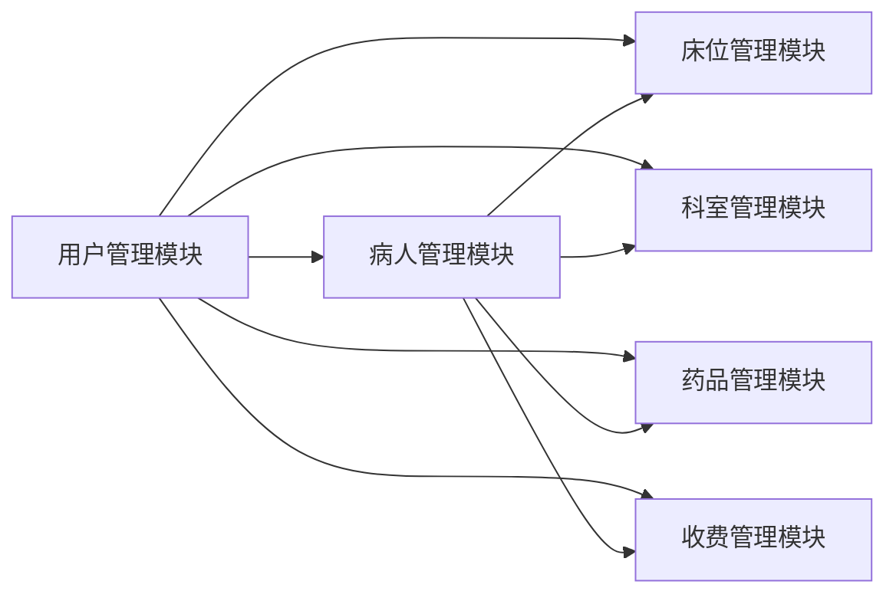

## 基于SSM的住院管理系统

### 1. 背景介绍

#### 1.1 住院管理现状与挑战

传统的住院管理模式主要依赖于手工操作和纸质记录，存在着效率低下、信息不透明、易出错等问题。随着信息技术的快速发展，越来越多的医院开始寻求信息化解决方案来提升住院管理水平。然而，传统的医院信息系统（HIS）往往功能单一、架构封闭，难以满足现代化医院对住院管理的个性化、精细化需求。

#### 1.2 SSM框架的优势与适用性

SSM（Spring+SpringMVC+MyBatis）框架作为一种轻量级的Java EE开发框架，具有易用性、灵活性、可扩展性等优点，被广泛应用于企业级Web应用开发。SSM框架的模块化设计和松耦合特性使其非常适合构建复杂的住院管理系统。

#### 1.3 本系统目标与意义

本系统旨在利用SSM框架构建一个功能完善、性能稳定、易于维护的住院管理系统，以提高医院住院管理效率和服务质量。

### 2. 核心概念与联系

#### 2.1 系统架构设计

本系统采用经典的三层架构设计，即表示层、业务逻辑层和数据访问层。

*   **表示层**：负责与用户交互，接收用户请求并展示数据。
*   **业务逻辑层**：负责处理业务逻辑，调用数据访问层完成数据操作。
*   **数据访问层**：负责与数据库交互，执行数据持久化操作。

#### 2.2 核心模块划分

本系统主要包括以下模块：

*   **用户管理模块**：负责管理系统用户，包括用户注册、登录、权限管理等功能。
*   **病人管理模块**：负责管理病人信息，包括病人入院登记、信息查询、出院结算等功能。
*   **床位管理模块**：负责管理医院床位资源，包括床位分配、调整、查询等功能。
*   **科室管理模块**：负责管理医院科室信息，包括科室设置、医生排班、护士管理等功能。
*   **药品管理模块**：负责管理医院药品信息，包括药品入库、出库、库存查询等功能。
*   **收费管理模块**：负责管理病人住院费用，包括费用录入、查询、统计等功能。

#### 2.3 模块间关系



### 3. 核心算法原理具体操作步骤

#### 3.1 Spring框架核心原理

##### 3.1.1 控制反转（IoC）

控制反转是Spring框架的核心思想之一，它将对象的创建和管理交给Spring容器，而不是由开发者手动控制。

##### 3.1.2 依赖注入（DI）

依赖注入是实现控制反转的一种方式，它通过配置文件或注解的方式将依赖关系注入到对象中。

#### 3.2 SpringMVC框架核心原理

##### 3.2.1 模型-视图-控制器（MVC）设计模式

SpringMVC框架基于MVC设计模式，将应用程序分为模型、视图和控制器三个部分。

##### 3.2.2 请求处理流程

SpringMVC框架的请求处理流程如下：

1.  用户发送请求到DispatcherServlet。
2.  DispatcherServlet根据请求映射规则找到对应的Controller。
3.  Controller调用业务逻辑处理请求。
4.  Controller返回ModelAndView对象到DispatcherServlet。
5.  DispatcherServlet根据ModelAndView对象选择合适的View进行渲染。
6.  DispatcherServlet将渲染后的结果返回给用户。

#### 3.3 MyBatis框架核心原理

##### 3.3.1 对象关系映射（ORM）

MyBatis框架是一种ORM框架，它可以将Java对象映射到数据库表，并将数据库查询结果映射到Java对象。

##### 3.3.2 SQL映射文件

MyBatis框架使用XML文件来配置SQL语句和映射关系。

### 4. 数学模型和公式详细讲解举例说明

本系统不涉及复杂的数学模型和算法。

### 5. 项目实践：代码实例和详细解释说明

#### 5.1 数据库设计

```sql
-- 创建病人表
CREATE TABLE patient (
  id INT PRIMARY KEY AUTO_INCREMENT,
  name VARCHAR(255) NOT NULL,
  gender VARCHAR(10) NOT NULL,
  age INT NOT NULL,
  id_card VARCHAR(20) NOT NULL,
  phone VARCHAR(20) NOT NULL,
  address VARCHAR(255) NOT NULL,
  admission_date DATE NOT NULL,
  discharge_date DATE,
  department_id INT NOT NULL,
  bed_id INT NOT NULL,
  doctor_id INT NOT NULL,
  nurse_id INT NOT NULL,
  status VARCHAR(20) NOT NULL
);

-- 创建科室表
CREATE TABLE department (
  id INT PRIMARY KEY AUTO_INCREMENT,
  name VARCHAR(255) NOT NULL
);

-- 创建床位表
CREATE TABLE bed (
  id INT PRIMARY KEY AUTO_INCREMENT,
  number INT NOT NULL,
  department_id INT NOT NULL,
  status VARCHAR(20) NOT NULL
);

-- 创建用户表
CREATE TABLE user (
  id INT PRIMARY KEY AUTO_INCREMENT,
  username VARCHAR(255) NOT NULL,
  password VARCHAR(255) NOT NULL,
  role VARCHAR(20) NOT NULL
);
```

#### 5.2 Spring配置文件

```xml
<?xml version="1.0" encoding="UTF-8"?>
<beans xmlns="http://www.springframework.org/schema/beans"
       xmlns:xsi="http://www.w3.org/2001/XMLSchema-instance"
       xmlns:context="http://www.springframework.org/schema/context"
       xsi:schemaLocation="http://www.springframework.org/schema/beans
       http://www.springframework.org/schema/beans/spring-beans.xsd
       http://www.springframework.org/schema/context
       http://www.springframework.org/schema/context/spring-context.xsd">

    <!-- 扫描包 -->
    <context:component-scan base-package="com.example.hospital"/>

    <!-- 配置数据源 -->
    <bean id="dataSource" class="org.apache.commons.dbcp.BasicDataSource" destroy-method="close">
        <property name="driverClassName" value="com.mysql.jdbc.Driver"/>
        <property name="url" value="jdbc:mysql://localhost:3306/hospital"/>
        <property name="username" value="root"/>
        <property name="password" value="123456"/>
    </bean>

    <!-- 配置SqlSessionFactoryBean -->
    <bean id="sqlSessionFactory" class="org.mybatis.spring.SqlSessionFactoryBean">
        <property name="dataSource" ref="dataSource"/>
        <!-- 扫描Mapper.xml文件 -->
        <property name="mapperLocations" value="classpath:mapper/*.xml"/>
    </bean>

    <!-- 配置MapperScannerConfigurer -->
    <bean class="org.mybatis.spring.mapper.MapperScannerConfigurer">
        <property name="basePackage" value="com.example.hospital.mapper"/>
    </bean>

    <!-- 配置事务管理器 -->
    <bean id="transactionManager" class="org.springframework.jdbc.datasource.DataSourceTransactionManager">
        <property name="dataSource" ref="dataSource"/>
    </bean>

    <!-- 开启注解式事务 -->
    <tx:annotation-driven transaction-manager="transactionManager"/>
</beans>
```

#### 5.3 SpringMVC配置文件

```xml
<?xml version="1.0" encoding="UTF-8"?>
<beans xmlns="http://www.springframework.org/schema/beans"
       xmlns:xsi="http://www.w3.org/2001/XMLSchema-instance"
       xmlns:context="http://www.springframework.org/schema/context"
       xmlns:mvc="http://www.springframework.org/schema/mvc"
       xsi:schemaLocation="http://www.springframework.org/schema/beans
       http://www.springframework.org/schema/beans/spring-beans.xsd
       http://www.springframework.org/schema/context
       http://www.springframework.org/schema/context/spring-context.xsd
       http://www.springframework.org/schema/mvc
       http://www.springframework.org/schema/mvc/spring-mvc.xsd">

    <!-- 扫描Controller -->
    <context:component-scan base-package="com.example.hospital.controller"/>

    <!-- 开启SpringMVC注解模式 -->
    <mvc:annotation-driven/>

    <!-- 配置视图解析器 -->
    <bean class="org.springframework.web.servlet.view.InternalResourceViewResolver">
        <property name="prefix" value="/WEB-INF/views/"/>
        <property name="suffix" value=".jsp"/>
    </bean>

    <!-- 配置静态资源访问 -->
    <mvc:resources mapping="/static/**" location="/static/"/>
</beans>
```

#### 5.4 MyBatis映射文件

```xml
<?xml version="1.0" encoding="UTF-8"?>
<!DOCTYPE mapper PUBLIC "-//mybatis.org//DTD Mapper 3.0//EN" "http://mybatis.org/dtd/mybatis-3-mapper.dtd">
<mapper namespace="com.example.hospital.mapper.PatientMapper">

    <resultMap id="patientMap" type="com.example.hospital.entity.Patient">
        <id column="id" property="id"/>
        <result column="name" property="name"/>
        <result column="gender" property="gender"/>
        <result column="age" property="age"/>
        <result column="id_card" property="idCard"/>
        <result column="phone" property="phone"/>
        <result column="address" property="address"/>
        <result column="admission_date" property="admissionDate"/>
        <result column="discharge_date" property="dischargeDate"/>
        <result column="department_id" property="departmentId"/>
        <result column="bed_id" property="bedId"/>
        <result column="doctor_id" property="doctorId"/>
        <result column="nurse_id" property="nurseId"/>
        <result column="status" property="status"/>
    </resultMap>

    <select id="findAll" resultMap="patientMap">
        SELECT * FROM patient
    </select>

    <insert id="insert" parameterType="com.example.hospital.entity.Patient">
        INSERT INTO patient (name, gender, age, id_card, phone, address, admission_date, discharge_date, department_id, bed_id, doctor_id, nurse_id, status)
        VALUES (#{name}, #{gender}, #{age}, #{idCard}, #{phone}, #{address}, #{admissionDate}, #{dischargeDate}, #{departmentId}, #{bedId}, #{doctorId}, #{nurseId}, #{status})
    </insert>

    <!-- 其他SQL语句 -->

</mapper>
```

#### 5.5 Controller代码

```java
package com.example.hospital.controller;

import com.example.hospital.entity.Patient;
import com.example.hospital.service.PatientService;
import org.springframework.beans.factory.annotation.Autowired;
import org.springframework.stereotype.Controller;
import org.springframework.ui.Model;
import org.springframework.web.bind.annotation.RequestMapping;

import java.util.List;

@Controller
@RequestMapping("/patient")
public class PatientController {

    @Autowired
    private PatientService patientService;

    @RequestMapping("/list")
    public String list(Model model) {
        List<Patient> patientList = patientService.findAll();
        model.addAttribute("patientList", patientList);
        return "patient/list";
    }

    // 其他Controller方法
}
```

### 6. 实际应用场景

#### 6.1 医院住院管理

本系统可以应用于医院住院管理，实现病人信息管理、床位管理、科室管理、药品管理、收费管理等功能，提高医院住院管理效率和服务质量。

#### 6.2 医疗机构信息化建设

本系统可以作为医疗机构信息化建设的一部分，与其他医疗信息系统进行集成，实现数据共享和业务协同。

### 7. 工具和资源推荐

#### 7.1 开发工具

*   IntelliJ IDEA
*   Eclipse
*   Maven
*   Git

#### 7.2 数据库

*   MySQL
*   Oracle
*   SQL Server

#### 7.3 框架和技术

*   Spring
*   SpringMVC
*   MyBatis
*   JSP
*   Servlet
*   JDBC

### 8. 总结：未来发展趋势与挑战

#### 8.1 未来发展趋势

*   **云计算**：将住院管理系统部署到云平台，实现资源弹性伸缩和按需付费。
*   **大数据**：利用大数据技术分析住院数据，为医院管理决策提供支持。
*   **人工智能**：将人工智能技术应用于住院管理，例如智能诊断、智能分诊等。

#### 8.2 面临挑战

*   **数据安全**：如何保障病人隐私和数据安全。
*   **系统集成**：如何与其他医疗信息系统进行集成。
*   **技术更新**：如何应对快速发展的技术更新。

### 9. 附录：常见问题与解答

#### 9.1 如何配置数据库连接？

在Spring配置文件中配置数据源信息，包括数据库驱动、连接地址、用户名和密码。

#### 9.2 如何运行项目？

使用Maven构建项目，并将war包部署到Tomcat等Web服务器中。

#### 9.3 如何访问系统？

在浏览器中输入系统访问地址，例如：http://localhost:8080/hospital。
