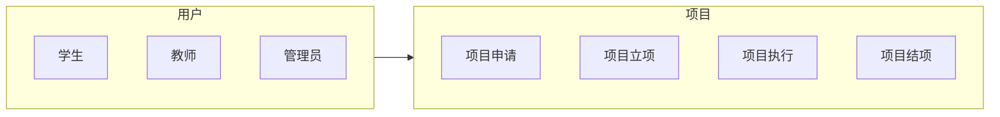

## 1. 背景介绍

### 1.1 高校创新创业项目管理现状

近年来，随着国家对创新创业教育的重视程度不断提高，高校纷纷响应号召，积极开展创新创业教育，并取得了显著成果。然而，随着高校创新创业项目的数量不断增加，项目管理工作也面临着新的挑战。传统的项目管理方式主要依靠人工操作，效率低下、信息不透明，难以满足高校创新创业项目管理的实际需求。

### 1.2 SSM框架优势

SSM框架（Spring + Spring MVC + MyBatis）是目前较为流行的Java Web开发框架之一，具有以下优势：

* **轻量级框架:** SSM框架的组件都是轻量级的，易于学习和使用。
* **松耦合:** SSM框架的各个组件之间是松耦合的，可以根据需要灵活组合。
* **易于测试:** SSM框架支持单元测试和集成测试，方便开发人员进行代码测试。
* **丰富的功能:** SSM框架提供了丰富的功能，可以满足各种Web应用开发需求。

### 1.3 基于SSM的创新创业项目管理系统意义

基于SSM框架开发的创新创业项目管理系统，可以有效解决高校创新创业项目管理中存在的痛点，提高项目管理效率，促进高校创新创业教育的健康发展。

## 2. 核心概念与联系

### 2.1 系统用户角色

系统用户角色主要包括：

* **学生:**  申请项目、提交项目进展、查看项目信息等。
* **教师:**  指导学生项目、审核项目申请、查看项目进展等。
* **管理员:**  管理系统用户、项目类别、项目信息等。

### 2.2 项目生命周期

项目生命周期包括以下阶段：

* **项目申请:**  学生提交项目申请，教师进行审核。
* **项目立项:**  审核通过的项目进入立项阶段。
* **项目执行:**  学生执行项目，定期提交项目进展。
* **项目结项:**  项目完成后，学生提交结项申请，教师进行审核。

### 2.3 系统功能模块

系统功能模块主要包括：

* **用户管理:**  管理系统用户，包括用户注册、登录、权限管理等。
* **项目管理:**  管理项目信息，包括项目申请、立项、执行、结项等。
* **统计分析:**  对项目数据进行统计分析，生成报表。

### 2.4 核心概念联系

系统用户角色、项目生命周期和系统功能模块之间存在紧密的联系。用户角色决定了用户在系统中可以执行的操作，项目生命周期定义了项目的不同阶段，系统功能模块提供了实现项目管理的功能。

## 3. 核心算法原理具体操作步骤

### 3.1 用户登录认证

1. 用户输入用户名和密码。
2. 系统根据用户名查询用户信息。
3. 校验密码是否正确。
4. 生成JWT token，并将token返回给用户。
5. 用户后续请求携带token进行身份认证。

### 3.2 项目申请流程

1. 学生填写项目申请表，提交申请。
2. 教师审核项目申请，并给出审核意见。
3. 系统根据审核结果更新项目状态。

### 3.3 项目进展提交

1. 学生定期填写项目进展报告，提交进展。
2. 教师查看项目进展，并给出指导意见。

## 4. 数学模型和公式详细讲解举例说明

本系统不涉及复杂的数学模型和公式。

## 5. 项目实践：代码实例和详细解释说明

### 5.1 项目架构

```
└── src
    └── main
        └── java
            └── com
                └── example
                    └── demo
                        ├── controller
                        │   ├── UserController.java
                        │   └── ProjectController.java
                        ├── service
                        │   ├── UserService.java
                        │   └── ProjectService.java
                        ├── dao
                        │   ├── UserMapper.java
                        │   └── ProjectMapper.java
                        └── entity
                            ├── User.java
                            └── Project.java

```

### 5.2 代码示例

#### 5.2.1 UserController.java

```java
@RestController
@RequestMapping("/user")
public class UserController {

    @Autowired
    private UserService userService;

    @PostMapping("/login")
    public Result login(@RequestBody User user) {
        // 用户登录逻辑
    }

    @GetMapping("/info")
    public Result info(@RequestHeader("Authorization") String token) {
        // 获取用户信息逻辑
    }
}
```

#### 5.2.2 ProjectController.java

```java
@RestController
@RequestMapping("/project")
public class ProjectController {

    @Autowired
    private ProjectService projectService;

    @PostMapping("/apply")
    public Result apply(@RequestBody Project project) {
        // 项目申请逻辑
    }

    @PostMapping("/progress")
    public Result progress(@RequestBody ProjectProgress progress) {
        // 项目进展提交逻辑
    }
}
```

### 5.3 代码解释

以上代码示例展示了用户登录和项目申请的接口实现。用户登录接口接收用户名和密码，进行登录认证后返回JWT token。项目申请接口接收项目信息，进行项目申请逻辑处理。

## 6. 实际应用场景

### 6.1 高校创新创业项目管理

本系统可以应用于高校创新创业项目管理，帮助高校提高项目管理效率，促进学生创新创业能力的提升。

### 6.2 企业内部项目管理

本系统也可以应用于企业内部项目管理，帮助企业规范项目管理流程，提高项目成功率。

## 7. 工具和资源推荐

### 7.1 开发工具

* IntelliJ IDEA
* Eclipse

### 7.2 数据库

* MySQL
* Oracle

### 7.3 前端框架

* Vue.js
* React

## 8. 总结：未来发展趋势与挑战

### 8.1 未来发展趋势

* **智能化:**  利用人工智能技术，实现项目智能推荐、风险预警等功能。
* **移动化:**  开发移动端应用，方便用户随时随地进行项目管理。
* **数据可视化:**  利用数据可视化技术，展示项目数据，帮助用户更好地了解项目进展。

### 8.2 面临挑战

* **数据安全:**  保障项目数据的安全，防止数据泄露。
* **系统性能:**  优化系统性能，提高系统响应速度。
* **用户体验:**  提升用户体验，方便用户使用系统。

## 9. 附录：常见问题与解答

### 9.1 如何申请项目？

学生登录系统后，点击“项目申请”菜单，填写项目申请表，提交申请即可。

### 9.2 如何查看项目进展？

教师登录系统后，点击“项目管理”菜单，选择要查看的项目，即可查看项目进展。


## 10. 架构图


