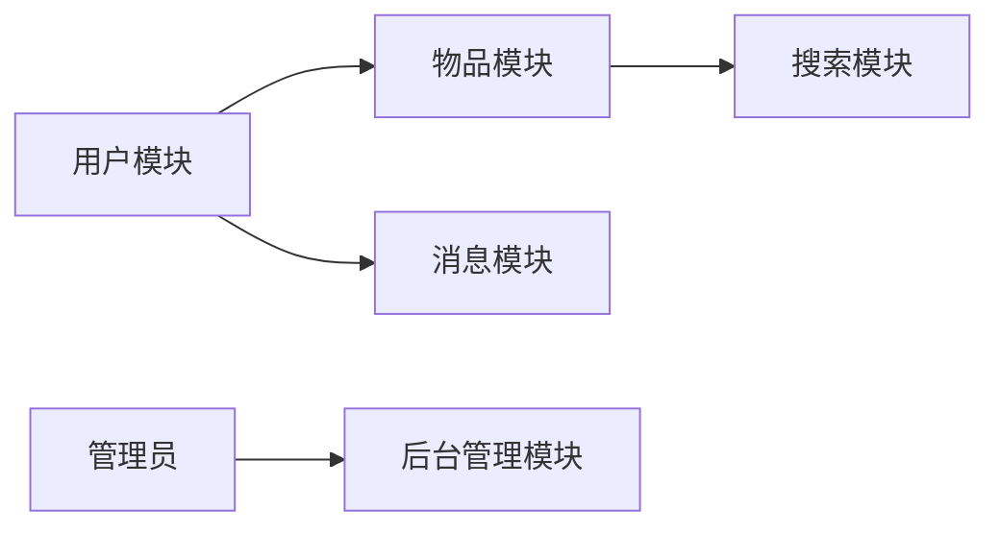

## 基于SSM的失物招领系统

**作者：禅与计算机程序设计艺术**

## 1. 背景介绍

### 1.1 失物招领问题的现状与挑战

在快节奏的现代生活中，人们常常因为各种原因丢失物品，从随身携带的手机、钱包到重要的证件，丢失物品不仅会带来经济损失，还会造成时间和精力的浪费。传统的失物招领方式存在诸多弊端，例如：

* **信息不对称:**  失主难以获取有效的寻回途径，而拾金不昧者也难以找到失主。
* **效率低下:**  传统的张贴寻物启事、广播寻物等方式效率低下，覆盖范围有限。
* **缺乏安全性:**  个人信息泄露的风险较高。

### 1.2 基于互联网的解决方案

随着互联网技术的快速发展，基于互联网的失物招领平台应运而生，为解决传统失物招领方式的弊端提供了新的思路。这类平台利用互联网的优势，可以实现：

* **信息共享:**  构建一个信息交流平台，方便失主发布寻物信息，拾金不昧者发布招领信息。
* **精准匹配:**  利用图像识别、关键词匹配等技术，提高失物与招领信息的匹配效率。
* **安全可靠:**  采用实名认证、信息加密等措施，保障用户信息安全。

### 1.3 SSM框架的优势

SSM框架 (Spring + Spring MVC + MyBatis) 是目前较为流行的Java Web开发框架之一，其具有以下优势：

* **轻量级:**  框架结构清晰，易于学习和使用。
* **灵活:**  可以根据项目需求灵活配置。
* **高效:**  框架性能优异，可以满足高并发访问的需求。

基于以上分析，本文将介绍如何使用SSM框架开发一个功能完善、安全可靠的失物招领系统。

## 2. 核心概念与联系

### 2.1 系统用户角色

系统用户主要分为三类：

* **管理员:**  负责系统管理，包括用户管理、物品管理、公告管理等。
* **失主:**  发布寻物信息，查看招领信息，联系拾金不昧者。
* **拾金不昧者:**  发布招领信息，查看寻物信息，联系失主。

### 2.2 功能模块设计

系统主要功能模块包括：

* **用户模块:**  用户注册、登录、个人信息管理等。
* **物品模块:**  发布寻物信息、发布招领信息、物品分类管理等。
* **消息模块:**  系统消息通知、用户之间私信交流等。
* **搜索模块:**  根据关键词、物品类别等条件搜索相关信息。
* **后台管理模块:**  管理员对系统进行管理，包括用户管理、物品管理、公告管理等。

### 2.3  核心概念联系



## 3. 核心算法原理具体操作步骤

### 3.1 用户注册与登录

#### 3.1.1 用户注册

1. 用户填写注册信息，包括用户名、密码、邮箱等。
2. 系统对用户提交的信息进行校验，例如用户名是否已存在、密码是否符合安全规则等。
3. 校验通过后，系统将用户信息存储到数据库中，并发送激活邮件到用户邮箱。
4. 用户点击激活链接，完成注册流程。

#### 3.1.2 用户登录

1. 用户输入用户名和密码。
2. 系统校验用户名和密码是否匹配。
3. 校验通过后，系统生成一个token，并将token存储到cookie中，用于用户身份验证。

### 3.2 发布寻物/招领信息

1. 用户选择发布寻物信息或招领信息。
2. 填写物品信息，包括物品名称、丢失/拾取时间、丢失/拾取地点、物品描述等。
3. 上传物品图片。
4. 提交信息，系统将信息存储到数据库中。

### 3.3 信息匹配与推荐

#### 3.3.1 基于关键词匹配

1. 对用户发布的寻物/招领信息进行关键词提取，例如物品名称、品牌、颜色等。
2. 将关键词与数据库中的其他信息进行匹配，返回匹配度较高的信息。

#### 3.3.2 基于图像识别

1. 对用户上传的物品图片进行特征提取。
2. 将提取的特征与数据库中其他图片的特征进行比对，返回相似度较高的图片及其对应的信息。

### 3.4  消息通知

1. 当有新的匹配信息时，系统会通过站内信、邮件等方式通知相关用户。
2. 用户可以设置消息通知的方式和频率。

## 4. 数学模型和公式详细讲解举例说明

本系统中未使用复杂的数学模型和算法，主要采用数据库查询、字符串匹配等技术实现功能。

## 5. 项目实践：代码实例和详细解释说明

### 5.1 开发环境搭建

* JDK 1.8+
* MySQL 5.7+
* Tomcat 8.5+
* Eclipse/IDEA

### 5.2 项目结构

```
lost-and-found-system
├── src
│   ├── main
│   │   ├── java
│   │   │   └── com
│   │   │       └── example
│   │   │           └── lostandfoundsystem
│   │   │               ├── controller
│   │   │               │   ├── UserController.java
│   │   │               │   ├── ItemController.java
│   │   │               │   └── MessageController.java
│   │   │               ├── service
│   │   │               │   ├── UserService.java
│   │   │               │   ├── ItemService.java
│   │   │               │   └── MessageService.java
│   │   │               ├── dao
│   │   │               │   ├── UserMapper.java
│   │   │               │   ├── ItemMapper.java
│   │   │               │   └── MessageMapper.java
│   │   │               ├── model
│   │   │               │   ├── User.java
│   │   │               │   ├── Item.java
│   │   │               │   └── Message.java
│   │   │               ├── config
│   │   │               │   ├── SpringConfig.java
│   │   │               │   ├── SpringMVCConfig.java
│   │   │               │   └── MyBatisConfig.java
│   │   │               └── LostAndFoundSystemApplication.java
│   │   └── resources
│   │       ├── mapper
│   │       │   ├── UserMapper.xml
│   │       │   ├── ItemMapper.xml
│   │       │   └── MessageMapper.xml
│   │       ├── application.properties
│   │       └── log4j2.xml
│   └── test
│       └── java
│           └── com
│               └── example
│                   └── lostandfoundsystem
│                       └── LostAndFoundSystemApplicationTests.java
└── pom.xml

```

### 5.3 代码示例

#### 5.3.1 用户注册接口

```java
@RestController
@RequestMapping("/user")
public class UserController {

    @Autowired
    private UserService userService;

    @PostMapping("/register")
    public Result register(@RequestBody User user) {
        // 校验用户信息
        // ...

        // 保存用户信息
        userService.save(user);

        // 发送激活邮件
        // ...

        return Result.success("注册成功，请前往邮箱激活");
    }
}
```

#### 5.3.2 发布寻物信息接口

```java
@RestController
@RequestMapping("/item")
public class ItemController {

    @Autowired
    private ItemService itemService;

    @PostMapping("/lost")
    public Result lost(@RequestBody Item item) {
        // 校验物品信息
        // ...

        // 保存物品信息
        itemService.save(item);

        return Result.success("发布成功");
    }
}
```

## 6. 实际应用场景

* **高校校园:**  学生丢失物品的现象较为普遍，可以通过搭建校园失物招领平台，方便学生寻找丢失物品。
* **社区服务:**  社区可以搭建失物招领平台，为居民提供更加便捷的失物招领服务。
* **公共场所:**  商场、车站、机场等公共场所可以搭建失物招领平台，提高物品找回率。

## 7. 总结：未来发展趋势与挑战

### 7.1 未来发展趋势

* **智能化:**  利用人工智能技术，提高信息匹配的准确率和效率。
* **个性化:**  根据用户的历史行为和偏好，提供更加精准的物品推荐服务。
* **社交化:**  引入社交元素，增强用户之间的互动，提高用户粘性。

### 7.2 面临的挑战

* **数据安全:**  如何保障用户的信息安全是平台发展的重要前提。
* **用户体验:**  如何提升用户的使用体验，提高用户满意度。
* **盈利模式:**  如何探索可持续的盈利模式，保障平台的长期发展。

## 8. 附录：常见问题与解答

### 8.1 如何发布寻物信息？

1. 注册并登录系统。
2. 点击“发布寻物信息”按钮。
3. 填写物品信息，上传物品图片。
4. 点击“提交”按钮。

### 8.2 如何联系拾金不昧者？

1. 在寻物信息详情页，点击“联系ta”按钮。
2. 发送私信给拾金不昧者。

### 8.3 如何修改个人信息？

1. 登录系统后，点击右上角的用户名。
2. 在弹出的菜单中选择“个人中心”。
3. 在个人中心页面，可以修改个人信息。
