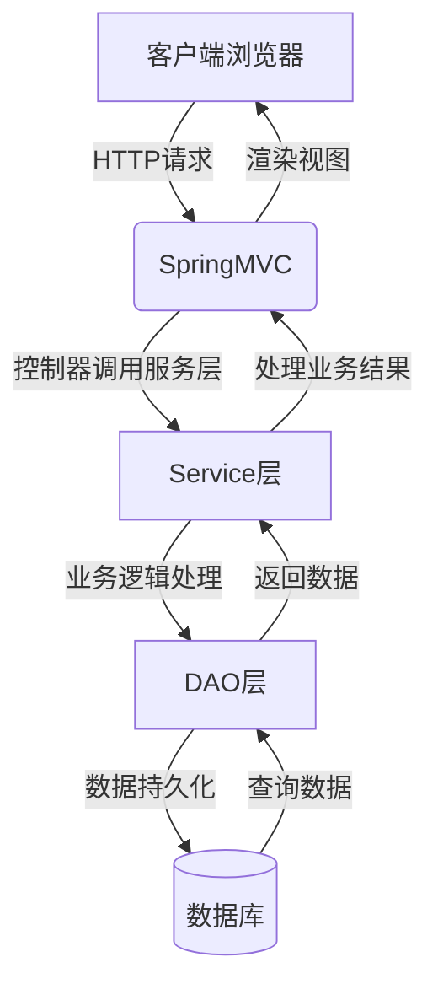

# 基于SSM的学籍管理系统

## 1.背景介绍

### 1.1 学籍管理系统的重要性

在当今教育领域,学籍管理系统扮演着至关重要的角色。它是高校管理学生信息、课程安排、成绩记录等核心数据的关键系统。高效的学籍管理有助于确保学校运营的顺利进行,为师生提供优质的教育服务。

### 1.2 传统管理方式的挑战

过去,学校普遍采用人工管理和纸质档案的方式,这种方法存在诸多弊端:

- 工作效率低下,容易出现错误
- 数据查询和统计困难
- 信息孤岛,缺乏数据共享和协作
- 安全性和数据保密性受到挑战

### 1.3 现代化解决方案的需求

为了解决传统管理模式的种种缺陷,现代化、自动化的学籍管理系统应运而生。基于Web的学籍管理系统可以提高工作效率,提供数据的一致性和完整性,增强信息安全,并实现跨部门的无缝协作。

## 2.核心概念与联系

### 2.1 SSM架构

SSM是指Spring+SpringMVC+MyBatis的架构模式,是当前流行的JavaEE企业级开发架构之一。

- Spring: 提供依赖注入(DI)和面向切面编程(AOP)支持,简化对象管理
- SpringMVC: 基于MVC模式的Web框架,处理HTTP请求和响应
- MyBatis: 持久层框架,实现对象关系映射(ORM),简化数据库操作

### 2.2 三层架构

基于SSM的学籍管理系统采用经典的三层架构设计:

1. **表现层(View)**: 提供用户界面,接收用户输入并显示处理结果
2. **业务逻辑层(Controller)**: 处理业务逻辑,协调数据流向
3. **数据访问层(Model)**: 负责与数据库进行交互,执行数据持久化操作

### 2.3 设计模式

在系统设计中,应用了多种设计模式,提高代码的可维护性和可扩展性:

- **MVC模式**: 将表现层、业务逻辑层和数据访问层分离,降低耦合度
- **工厂模式**: 创建对象的实例,屏蔽对象创建的细节
- **代理模式**: 控制对对象的访问,添加额外的处理逻辑
- **观察者模式**: 实现对象之间的通知和更新机制

## 3.核心算法原理具体操作步骤  

### 3.1 系统架构概览

基于SSM的学籍管理系统架构如下图所示:



该系统架构遵循经典的MVC设计模式,各层之间的职责分工明确:

1. **表现层(View)**: 由SpringMVC处理HTTP请求和响应,渲染视图展示数据
2. **业务逻辑层(Controller)**: Service层处理业务逻辑,协调数据流向
3. **数据访问层(Model)**: DAO层通过MyBatis框架与数据库进行交互

### 3.2 请求处理流程

当用户发起HTTP请求时,系统的请求处理流程如下:

1. 客户端发送HTTP请求至服务器
2. SpringMVC的前端控制器(DispatcherServlet)接收请求
3. 根据请求URL匹配对应的控制器方法
4. 控制器方法执行相应的业务逻辑
   - 调用Service层处理业务
   - Service层调用DAO层进行数据持久化操作
5. 控制器方法获取处理结果,选择合适的视图
6. SpringMVC渲染视图,将结果响应给客户端

### 3.3 数据持久化

MyBatis作为系统的持久层框架,负责对象与关系数据库之间的映射。其核心原理包括:

1. **配置文件**: 定义数据源、映射器等核心组件
2. **映射器(Mapper)**: 定义SQL语句和对象属性的映射关系
3. **会话(Session)**: 执行持久化操作,如增删改查等

在执行数据持久化操作时,流程如下:

1. 获取SqlSessionFactory实例
2. 打开SqlSession会话
3. 获取Mapper映射器实例
4. 通过映射器执行CRUD操作
5. 提交或回滚事务
6. 关闭会话

## 4.数学模型和公式详细讲解举例说明

在学籍管理系统中,可能需要使用一些数学模型和公式来处理数据,例如计算学生的平均成绩、绩点等。下面我们以计算学生的加权平均分(GPA)为例,介绍相关的数学模型和公式。

### 4.1 加权平均分(GPA)模型

加权平均分(GPA)是反映学生整体学习水平的重要指标。它考虑了不同课程的学分权重,能够更准确地评估学生的综合表现。GPA的计算公式如下:

$$
GPA = \frac{\sum_{i=1}^{n}(G_i \times C_i)}{\sum_{i=1}^{n}C_i}
$$

其中:

- $n$ 表示学生修读的课程数量
- $G_i$ 表示第 $i$ 门课程的最终成绩
- $C_i$ 表示第 $i$ 门课程的学分权重

通常,不同的成绩等级对应不同的绩点,例如:

| 成绩等级 | 绩点 |
|-----------|------|
| A+        | 4.3  |
| A         | 4.0  |
| A-        | 3.7  |
| B+        | 3.3  |
| B         | 3.0  |
| ...       | ...  |

在计算GPA时,我们将使用对应的绩点值代替 $G_i$。

### 4.2 实例说明

假设一名学生修读了以下5门课程:

| 课程名称 | 学分 | 成绩 | 绩点 |
|----------|------|------|------|
| 高等数学 | 4    | 88   | 3.7  |
| 大学物理 | 3    | 92   | 4.0  |
| 计算机导论 | 2  | 78 | 3.0  |
| 英语写作 | 3    | 85   | 3.3  |
| 体育     | 1    | 95   | 4.3  |

根据GPA公式,我们可以计算该学生的加权平均分:

$$
\begin{aligned}
GPA &= \frac{4 \times 3.7 + 3 \times 4.0 + 2 \times 3.0 + 3 \times 3.3 + 1 \times 4.3}{4 + 3 + 2 + 3 + 1} \\
    &= \frac{14.8 + 12.0 + 6.0 + 9.9 + 4.3}{13} \\
    &= \frac{47}{13} \\
    &\approx 3.62
\end{aligned}
$$

因此,该学生的加权平均分(GPA)约为3.62。

通过计算GPA,学校可以更准确地评估学生的整体学习情况,为其提供相应的指导和支持。同时,GPA也是学生申请升学、就业时的重要参考指标。

## 5.项目实践:代码实例和详细解释说明

在这一部分,我们将通过具体的代码实例,展示如何在基于SSM的学籍管理系统中实现核心功能。

### 5.1 系统架构及技术栈

- 前端: Bootstrap + jQuery + JSP
- 后端: Spring + SpringMVC + MyBatis
- 数据库: MySQL
- 构建工具: Maven
- 版本控制: Git

### 5.2 核心模块及功能

学籍管理系统包含以下核心模块:

1. **学生信息管理**
   - 学生基本信息维护(增删改查)
   - 学生成绩管理
   - 学生考勤记录
2. **课程管理**
   - 课程基本信息维护
   - 课程安排
   - 教学资源管理
3. **教师管理**
   - 教师基本信息维护
   - 教师课程分配
   - 教师考核评价
4. **系统管理**
   - 用户权限管理
   - 系统日志记录
   - 数据备份与恢复

### 5.3 代码示例

以下是一个简单的示例,展示如何在SpringMVC中定义控制器,处理学生信息的CRUD操作。

```java
// StudentController.java
@Controller
@RequestMapping("/student")
public class StudentController {

    @Autowired
    private StudentService studentService;

    // 查询所有学生
    @GetMapping("/list")
    public String listStudents(Model model) {
        List<Student> students = studentService.findAll();
        model.addAttribute("students", students);
        return "student/list";
    }

    // 添加学生
    @GetMapping("/add")
    public String showAddForm(Model model) {
        model.addAttribute("student", new Student());
        return "student/add";
    }

    @PostMapping("/add")
    public String addStudent(@ModelAttribute("student") Student student) {
        studentService.save(student);
        return "redirect:/student/list";
    }

    // 更新学生信息
    @GetMapping("/update/{id}")
    public String showUpdateForm(@PathVariable("id") Long id, Model model) {
        Student student = studentService.findById(id);
        model.addAttribute("student", student);
        return "student/update";
    }

    @PostMapping("/update")
    public String updateStudent(@ModelAttribute("student") Student student) {
        studentService.update(student);
        return "redirect:/student/list";
    }

    // 删除学生
    @GetMapping("/delete/{id}")
    public String deleteStudent(@PathVariable("id") Long id) {
        studentService.deleteById(id);
        return "redirect:/student/list";
    }
}
```

在上述代码中,我们定义了一个`StudentController`类,用于处理与学生信息相关的HTTP请求。

- `@Controller`注解标记该类为Spring MVC控制器
- `@RequestMapping`注解用于映射URL路径
- `@Autowired`注解自动注入`StudentService`实例,用于调用业务逻辑层的方法
- 控制器方法使用`@GetMapping`和`@PostMapping`注解,分别处理GET和POST请求
- 方法参数使用`@PathVariable`和`@ModelAttribute`注解,从请求中获取数据
- 方法返回值为视图名称,SpringMVC将渲染对应的JSP视图

在Service层和DAO层,我们可以使用Spring和MyBatis提供的功能,实现业务逻辑和数据持久化操作。

```java
// StudentService.java
@Service
public class StudentService {

    @Autowired
    private StudentMapper studentMapper;

    public List<Student> findAll() {
        return studentMapper.selectAll();
    }

    public Student findById(Long id) {
        return studentMapper.selectByPrimaryKey(id);
    }

    public void save(Student student) {
        if (student.getId() == null) {
            studentMapper.insert(student);
        } else {
            studentMapper.updateByPrimaryKey(student);
        }
    }

    public void update(Student student) {
        studentMapper.updateByPrimaryKey(student);
    }

    public void deleteById(Long id) {
        studentMapper.deleteByPrimaryKey(id);
    }
}
```

```xml
<!-- StudentMapper.xml -->
<mapper namespace="com.example.mapper.StudentMapper">
    <resultMap id="BaseResultMap" type="com.example.model.Student">
        <id column="id" property="id" jdbcType="BIGINT" />
        <result column="name" property="name" jdbcType="VARCHAR" />
        <result column="gender" property="gender" jdbcType="CHAR" />
        <result column="birthday" property="birthday" jdbcType="DATE" />
        <!-- 其他属性映射... -->
    </resultMap>

    <select id="selectAll" resultMap="BaseResultMap">
        SELECT * FROM student
    </select>

    <select id="selectByPrimaryKey" parameterType="java.lang.Long" resultMap="BaseResultMap">
        SELECT * FROM student WHERE id = #{id}
    </select>

    <insert id="insert" parameterType="com.example.model.Student">
        INSERT INTO student (name, gender, birthday, ...)
        VALUES (#{name}, #{gender}, #{birthday}, ...)
    </insert>

    <update id="updateByPrimaryKey" parameterType="com.example.model.Student">
        UPDATE student
        SET name = #{name}, gender = #{gender}, birthday = #{birthday}, ...
        WHERE id = #{id}
    </update>

    <delete id="deleteByPrimaryKey" parameterType="java.lang.Long">
        DELETE FROM student WHERE id = #{id}
    </delete>
</mapper>
```

在上述示例中,我们展示了如何在Service层调用DAO层的方法,完成对学生信息的增删改查操作。MyBatis的映射器(Mapper)定义了SQL语句和Java对