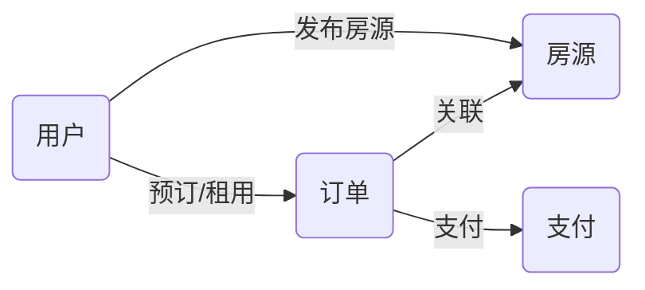

## 基于SSM的房屋租借系统

### 1. 背景介绍

#### 1.1 互联网+租房的兴起

随着互联网的快速发展和普及，人们的生活方式发生了翻天覆地的变化，租房市场也逐渐从线下转向线上。"互联网+"模式为传统租房行业带来了新的机遇，在线租房平台如雨后春笋般涌现，为房东和租客提供了更加便捷、高效的租房体验。

#### 1.2 传统租房模式的弊端

传统的租房模式存在着许多弊端，例如：

* **信息不对称：** 房东和租客之间信息不对称，租客难以获取真实可靠的房源信息，容易上当受骗；房东也难以找到合适的租客。
* **中介费用高昂：** 租房中介费用高昂，增加了租房成本。
* **效率低下：** 传统的租房方式需要线下看房、签合同等环节，效率低下。
* **安全性低：** 传统的租房方式缺乏监管，存在着安全隐患。

#### 1.3 在线租房平台的优势

在线租房平台的出现有效地解决了传统租房模式的弊端，其优势主要体现在：

* **信息透明：** 在线租房平台汇集了大量的房源信息，租客可以根据自己的需求筛选合适的房源，房东也可以发布真实的房源信息。
* **成本低廉：** 在线租房平台通常不收取中介费用，或者只收取少量的服务费，降低了租房成本。
* **高效便捷：** 在线租房平台提供在线看房、在线签约等服务，大大提高了租房效率。
* **安全可靠：** 在线租房平台通常会对房源信息进行审核，并提供在线支付、电子合同等服务，保障了交易的安全可靠。

### 2. 核心概念与联系

#### 2.1 SSM框架

SSM框架是Spring + Spring MVC + MyBatis的缩写，是目前比较流行的一种Java Web开发框架。

* **Spring:** 提供了IoC（控制反转）和AOP（面向切面编程）等功能，简化了应用程序的开发和管理。
* **Spring MVC:** 是一种基于MVC（模型-视图-控制器）设计模式的Web框架，用于构建Web应用程序。
* **MyBatis:** 是一种优秀的持久层框架，可以方便地进行数据库操作。

#### 2.2 房屋租借系统的核心概念

* **用户:** 包括房东和租客两种角色。
* **房源:** 指可供出租的房屋信息，包括房屋类型、面积、地址、租金等。
* **订单:** 指租客预订或租用房源的记录，包括订单状态、租期、租金等。
* **支付:** 指租客支付房租的记录，包括支付方式、支付金额等。

#### 2.3 核心概念之间的联系

* 用户可以发布房源信息、预订或租用房源、支付房租等。
* 房源可以被用户预订或租用。
* 订单与房源和用户相关联。
* 支付与订单相关联。

#### 2.4 系统架构图



### 3. 核心算法原理具体操作步骤

#### 3.1 用户注册登录模块

* 用户注册时，需要填写用户名、密码、手机号码等信息，系统对用户信息进行校验，并将用户信息保存到数据库中。
* 用户登录时，需要输入用户名和密码，系统对用户信息进行验证，验证通过后，将用户信息保存到session中。

#### 3.2 房源信息管理模块

* 房东可以发布房源信息，需要填写房屋类型、面积、地址、租金等信息，并上传房屋图片。
* 系统对房源信息进行审核，审核通过后，房源信息发布到平台上。
* 租客可以浏览房源信息，可以根据自己的需求筛选合适的房源。

#### 3.3 订单管理模块

* 租客可以预订或租用房源，需要填写租期、联系方式等信息。
* 系统生成订单，并将订单信息保存到数据库中。
* 房东可以查看订单信息，并确认订单。
* 租客可以取消订单。

#### 3.4 支付模块

* 租客可以选择支付方式进行支付，例如支付宝、微信支付等。
* 系统调用第三方支付接口完成支付。
* 支付成功后，系统更新订单状态。

### 4. 数学模型和公式详细讲解举例说明

本系统不涉及复杂的数学模型和公式。

### 5. 项目实践：代码实例和详细解释说明

#### 5.1 开发环境搭建

* 操作系统：Windows 10
* 开发工具：Eclipse
* 数据库：MySQL
* 服务器：Tomcat

#### 5.2 数据库设计

```sql
-- 用户表
CREATE TABLE `user` (
  `id` int(11) NOT NULL AUTO_INCREMENT COMMENT '用户ID',
  `username` varchar(255) NOT NULL COMMENT '用户名',
  `password` varchar(255) NOT NULL COMMENT '密码',
  `phone` varchar(20) DEFAULT NULL COMMENT '手机号码',
  PRIMARY KEY (`id`)
) ENGINE=InnoDB DEFAULT CHARSET=utf8mb4;

-- 房源表
CREATE TABLE `house` (
  `id` int(11) NOT NULL AUTO_INCREMENT COMMENT '房源ID',
  `user_id` int(11) NOT NULL COMMENT '房东ID',
  `type` varchar(255) NOT NULL COMMENT '房屋类型',
  `area` double NOT NULL COMMENT '面积',
  `address` varchar(255) NOT NULL COMMENT '地址',
  `rent` decimal(10,2) NOT NULL COMMENT '租金',
  PRIMARY KEY (`id`),
  KEY `user_id` (`user_id`),
  CONSTRAINT `house_ibfk_1` FOREIGN KEY (`user_id`) REFERENCES `user` (`id`)
) ENGINE=InnoDB DEFAULT CHARSET=utf8mb4;

-- 订单表
CREATE TABLE `order` (
  `id` int(11) NOT NULL AUTO_INCREMENT COMMENT '订单ID',
  `user_id` int(11) NOT NULL COMMENT '租客ID',
  `house_id` int(11) NOT NULL COMMENT '房源ID',
  `start_time` datetime NOT NULL COMMENT '开始时间',
  `end_time` datetime NOT NULL COMMENT '结束时间',
  `status` int(11) NOT NULL COMMENT '订单状态',
  PRIMARY KEY (`id`),
  KEY `user_id` (`user_id`),
  KEY `house_id` (`house_id`),
  CONSTRAINT `order_ibfk_1` FOREIGN KEY (`user_id`) REFERENCES `user` (`id`),
  CONSTRAINT `order_ibfk_2` FOREIGN KEY (`house_id`) REFERENCES `house` (`id`)
) ENGINE=InnoDB DEFAULT CHARSET=utf8mb4;

-- 支付表
CREATE TABLE `payment` (
  `id` int(11) NOT NULL AUTO_INCREMENT COMMENT '支付ID',
  `order_id` int(11) NOT NULL COMMENT '订单ID',
  `amount` decimal(10,2) NOT NULL COMMENT '支付金额',
  `pay_time` datetime DEFAULT NULL COMMENT '支付时间',
  PRIMARY KEY (`id`),
  KEY `order_id` (`order_id`),
  CONSTRAINT `payment_ibfk_1` FOREIGN KEY (`order_id`) REFERENCES `order` (`id`)
) ENGINE=InnoDB DEFAULT CHARSET=utf8mb4;
```

#### 5.3 代码实现

```java
// UserController.java
@Controller
@RequestMapping("/user")
public class UserController {

    @Autowired
    private UserService userService;

    @RequestMapping("/register")
    public String register(User user) {
        userService.register(user);
        return "redirect:/login";
    }

    @RequestMapping("/login")
    public String login(User user, HttpSession session) {
        User loginUser = userService.login(user);
        if (loginUser != null) {
            session.setAttribute("loginUser", loginUser);
            return "redirect:/index";
        } else {
            return "redirect:/login";
        }
    }
}

// HouseController.java
@Controller
@RequestMapping("/house")
public class HouseController {

    @Autowired
    private HouseService houseService;

    @RequestMapping("/publish")
    public String publish(House house) {
        houseService.publish(house);
        return "redirect:/index";
    }

    @RequestMapping("/detail/{id}")
    public String detail(@PathVariable("id") Integer id, Model model) {
        House house = houseService.findById(id);
        model.addAttribute("house", house);
        return "house/detail";
    }
}

// OrderController.java
@Controller
@RequestMapping("/order")
public class OrderController {

    @Autowired
    private OrderService orderService;

    @RequestMapping("/create")
    public String create(Order order) {
        orderService.create(order);
        return "redirect:/order/list";
    }

    @RequestMapping("/list")
    public String list(Model model) {
        List<Order> orderList = orderService.findAll();
        model.addAttribute("orderList", orderList);
        return "order/list";
    }
}

// PaymentController.java
@Controller
@RequestMapping("/payment")
public class PaymentController {

    @Autowired
    private PaymentService paymentService;

    @RequestMapping("/pay")
    public String pay(Payment payment) {
        paymentService.pay(payment);
        return "redirect:/order/list";
    }
}
```

### 6. 实际应用场景

* 个人房东出租房屋
* 中介公司管理房源
* 长租公寓管理平台

### 7. 工具和资源推荐

* **开发工具:** Eclipse、IntelliJ IDEA
* **数据库:** MySQL、Oracle
* **服务器:** Tomcat、Jetty
* **框架:** Spring、Spring MVC、MyBatis
* **前端框架:** Bootstrap、jQuery

### 8. 总结：未来发展趋势与挑战

#### 8.1 未来发展趋势

* **智能化:** 随着人工智能技术的不断发展，未来的在线租房平台将会更加智能化，例如智能推荐房源、智能客服等。
* **个性化:** 未来的在线租房平台将会更加注重用户的个性化需求，例如根据用户的租房历史、偏好等推荐更加精准的房源。
* **VR看房:** 随着VR技术的不断成熟，未来的在线租房平台将会提供更加真实的VR看房体验，让用户足不出户就能身临其境地感受房源情况。

#### 8.2 面临的挑战

* **数据安全:** 在线租房平台存储了大量的用户隐私信息，如何保障用户数据安全是一个重要的挑战。
* **市场竞争:** 在线租房市场竞争激烈，如何提升平台的核心竞争力是一个重要的挑战。
* **用户体验:** 在线租房平台的用户体验至关重要，如何提升用户体验是一个重要的挑战。

### 9. 附录：常见问题与解答

#### 9.1 如何发布房源信息？

登录系统后，点击"发布房源"按钮，填写房源信息并上传房屋图片即可。

#### 9.2 如何预订或租用房源？

浏览房源信息，找到合适的房源后，点击"预订"或"租用"按钮，填写相关信息即可。

#### 9.3 如何支付房租？

在订单详情页面，选择支付方式进行支付即可。

#### 9.4 如何联系客服？

在平台首页或个人中心页面，可以找到客服联系方式。
