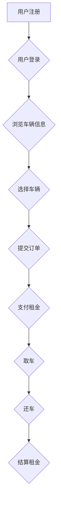

# 基于SSM的汽车租赁管理系统

## 1. 背景介绍

### 1.1 汽车租赁行业的现状与发展趋势

随着经济的快速发展和人民生活水平的提高，汽车已经成为人们生活中不可或缺的一部分。然而，汽车购置成本高、维护费用高、停车难等问题也日益凸显，这为汽车租赁行业提供了巨大的发展空间。近年来，汽车租赁行业发展迅速，市场规模不断扩大，服务模式不断创新，逐渐成为人们出行的一种重要方式。

### 1.2 汽车租赁管理系统的重要性

传统的汽车租赁管理模式主要依靠人工记录和管理，存在着效率低下、易出错、数据统计困难等问题。为了提高汽车租赁企业的管理效率、降低运营成本、提升客户满意度，开发一套功能完善、操作便捷、安全可靠的汽车租赁管理系统显得尤为重要。

### 1.3 SSM框架的技术优势

SSM（Spring+SpringMVC+MyBatis）框架是目前Java Web开发领域应用非常广泛的一种框架组合，它具有以下技术优势：

* **Spring框架：** 提供了强大的依赖注入和面向切面编程功能，简化了开发流程，提高了代码的可重用性和可维护性。
* **SpringMVC框架：** 实现了MVC（Model-View-Controller）设计模式，将业务逻辑、数据模型和用户界面分离，使得代码结构更加清晰，易于维护和扩展。
* **MyBatis框架：** 是一款优秀的持久层框架，提供了灵活的SQL映射机制，简化了数据库操作，提高了开发效率。

## 2. 核心概念与联系

### 2.1 系统用户角色

* **管理员：** 负责系统的整体管理，包括用户管理、车辆管理、租赁管理、统计报表等。
* **用户：**  注册用户可以浏览车辆信息、预订车辆、在线支付、查看订单等。

### 2.2 主要功能模块

* **用户管理模块：** 实现用户注册、登录、信息修改、密码找回等功能。
* **车辆管理模块：** 实现车辆信息的添加、修改、删除、查询等功能。
* **租赁管理模块：** 实现车辆预订、租赁合同生成、还车结算等功能。
* **统计报表模块：** 实现租赁业务数据的统计分析，生成各种报表。

### 2.3 模块间联系

* 用户管理模块为其他模块提供用户信息支持。
* 车辆管理模块为租赁管理模块提供车辆信息支持。
* 租赁管理模块依赖用户管理模块和车辆管理模块的数据。
* 统计报表模块从租赁管理模块获取数据进行统计分析。

## 3. 核心算法原理具体操作步骤

### 3.1 用户登录认证流程

1. 用户输入用户名和密码，提交登录请求。
2. 系统验证用户名是否存在，如果不存在则提示用户不存在。
3. 如果用户名存在，则验证密码是否正确，如果密码错误则提示密码错误。
4. 如果用户名和密码都正确，则生成token，并将token返回给客户端，同时将用户信息存储在session中。

### 3.2 车辆租赁流程

1. 用户选择租赁日期、车型等信息，提交预订请求。
2. 系统验证车辆库存，如果库存不足则提示用户选择其他车辆或日期。
3. 如果库存充足，则生成订单，并扣除相应车辆库存。
4. 用户支付租金，系统确认支付成功后，更新订单状态。
5. 用户到店取车，系统记录取车时间和里程数。
6. 用户还车，系统记录还车时间和里程数，并计算租金。
7. 用户支付租金，系统确认支付成功后，更新订单状态。

## 4. 数学模型和公式详细讲解举例说明

### 4.1 租金计算公式

```
租金 = 日租金 * 租赁天数 + ( 超公里数 * 超公里单价 )
```

其中：

* 日租金：根据车型和租赁市场行情确定。
* 租赁天数：按照24小时计算，不足24小时按一天计算。
* 超公里数：实际行驶里程数超过约定的免费里程数的部分。
* 超公里单价：根据车型和租赁市场行情确定。

### 4.2 库存管理模型

采用安全库存模型来管理车辆库存，确保在满足用户需求的同时，最大限度地减少车辆闲置率。

```
安全库存 = ( 最大日需求量 - 平均日需求量 ) * 提前期
```

其中：

* 最大日需求量：历史数据中最大的日租赁量。
* 平均日需求量：历史数据中平均每天的租赁量。
* 提前期：从用户预订车辆到实际取车之间的时间间隔。

## 5. 项目实践：代码实例和详细解释说明

### 5.1 用户登录认证代码示例

```java
@Controller
@RequestMapping("/user")
public class UserController {

    @Autowired
    private UserService userService;

    @PostMapping("/login")
    @ResponseBody
    public Result login(@RequestBody User user) {
        // 1. 校验用户名和密码
        if (StringUtils.isEmpty(user.getUsername()) || StringUtils.isEmpty(user.getPassword())) {
            return Result.error("用户名或密码不能为空");
        }

        // 2. 查询数据库
        User dbUser = userService.findByUsername(user.getUsername());
        if (dbUser == null) {
            return Result.error("用户名不存在");
        }
        if (!dbUser.getPassword().equals(user.getPassword())) {
            return Result.error("密码错误");
        }

        // 3. 生成token
        String token = JwtUtils.createToken(dbUser.getId(), dbUser.getUsername());

        // 4. 返回token
        return Result.ok().put("token", token);
    }
}
```

### 5.2 车辆租赁代码示例

```java
@Service
public class OrderServiceImpl implements OrderService {

    @Autowired
    private OrderMapper orderMapper;

    @Autowired
    private CarMapper carMapper;

    @Transactional
    @Override
    public Result createOrder(Order order) {
        // 1. 校验参数
        if (order.getCarId() == null || order.getUserId() == null || order.getRentStartTime() == null
                || order.getRentEndTime() == null) {
            return Result.error("参数错误");
        }

        // 2. 查询车辆信息
        Car car = carMapper.selectById(order.getCarId());
        if (car == null) {
            return Result.error("车辆不存在");
        }

        // 3. 计算租金
        long rentDays = ChronoUnit.DAYS.between(order.getRentStartTime().toLocalDate(),
                order.getRentEndTime().toLocalDate());
        BigDecimal rentPrice = car.getRentPrice().multiply(new BigDecimal(rentDays));

        // 4. 创建订单
        order.setRentPrice(rentPrice);
        order.setStatus(OrderStatusEnum.UNPAID.getCode());
        orderMapper.insert(order);

        // 5. 扣减车辆库存
        car.setStock(car.getStock() - 1);
        carMapper.updateById(car);

        return Result.ok();
    }
}
```

## 6. 实际应用场景

### 6.1 汽车租赁公司

* 管理车辆信息、用户信息、租赁订单等。
* 提供在线预订、支付、取还车等服务。
* 生成各种统计报表，为经营决策提供数据支持。

### 6.2 企业内部车辆管理

* 管理企业自有车辆信息。
* 跟踪车辆使用情况，进行车辆调度和维护。
* 统计车辆使用成本，优化车辆配置。

### 6.3 个人汽车租赁平台

* 为个人用户提供车辆租赁信息发布平台。
* 提供在线预订、支付、评价等功能。
* 为车主提供车辆管理、收益统计等服务。

## 7. 工具和资源推荐

### 7.1 开发工具

* IntelliJ IDEA：功能强大的Java集成开发环境。
* MySQL：流行的关系型数据库管理系统。
* Navicat：数据库管理工具，方便进行数据库操作。
* Postman：接口测试工具，方便进行接口调试。

### 7.2 学习资源

* Spring官网：https://spring.io/
* SpringMVC官网：https://docs.spring.io/spring-framework/docs/current/reference/html/web.html
* MyBatis官网：https://mybatis.org/mybatis-3/zh/index.html

## 8. 总结：未来发展趋势与挑战

### 8.1 未来发展趋势

* **共享化：** 随着共享经济的兴起，汽车租赁行业将更加注重车辆的共享利用，发展基于互联网的汽车共享平台。
* **智能化：** 随着人工智能、物联网等技术的应用，汽车租赁行业将更加智能化，实现车辆自动调度、无人驾驶等功能。
* **个性化：** 随着用户需求的不断提高，汽车租赁行业将更加注重个性化服务，提供更加灵活的租赁方式和更加丰富的增值服务。

### 8.2 面临的挑战

* **行业竞争加剧：** 随着越来越多的企业进入汽车租赁市场，行业竞争将更加激烈。
* **安全问题：** 汽车租赁涉及到车辆和人员的安全问题，需要不断加强安全管理措施。
* **政策法规：** 汽车租赁行业受到国家政策法规的影响，需要及时了解和适应政策变化。


## 9. 附录：常见问题与解答

### 9.1 如何注册账号？

访问系统首页，点击“注册”按钮，填写相关信息并提交即可。

### 9.2 如何预订车辆？

登录系统，选择租赁日期、车型等信息，点击“立即预订”按钮，填写订单信息并提交即可。

### 9.3 如何支付租金？

系统支持支付宝、微信支付等多种支付方式，用户可以选择自己方便的支付方式进行支付。


## 10.  Mermaid流程图




## 11.  结束语

本文详细介绍了基于SSM框架的汽车租赁管理系统的开发过程，从背景介绍、核心概念、算法原理、代码实例、应用场景、工具资源推荐、未来发展趋势等方面进行了全面的阐述。希望本文能够为广大读者提供一些参考和帮助。