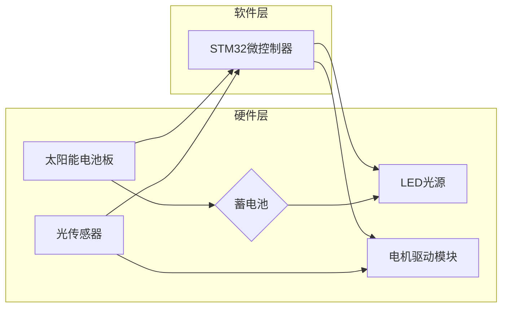

# 基于stm32的智能追光太阳能路灯控制系统设计与开发

作者：禅与计算机程序设计艺术

## 1. 背景介绍

### 1.1. 太阳能路灯的优势与不足

随着全球能源危机的加剧和环保意识的增强，太阳能作为一种清洁、可再生能源，在各个领域得到了广泛应用。太阳能路灯作为一种利用太阳能发电的新型照明系统，具有以下显著优势：

* **节能环保：** 利用太阳能供电，无需消耗传统电力资源，减少碳排放，符合可持续发展理念。
* **安装便捷：** 无需铺设复杂线路，安装方便快捷，降低施工成本。
* **使用寿命长：** 太阳能电池板和LED光源寿命长，维护成本低。

然而，传统的太阳能路灯也存在一些不足：

* **光照效率低：** 受限于太阳能电池板的转换效率和光照角度，传统太阳能路灯的光照效率较低，尤其是在阴雨天气下，难以满足照明需求。
* **智能化程度低：** 传统的太阳能路灯缺乏智能控制系统，无法根据环境光照强度和时间自动调节亮度，造成能源浪费。

### 1.2. 智能追光技术的必要性

为了克服传统太阳能路灯的不足，提高其光照效率和智能化水平，智能追光技术应运而生。智能追光太阳能路灯通过集成光传感器、电机驱动模块和智能控制算法，能够实时监测太阳的位置，并控制太阳能电池板的朝向，使其始终保持最佳光照角度，从而最大限度地提高太阳能的利用效率。

## 2. 核心概念与联系

### 2.1. 系统组成

基于stm32的智能追光太阳能路灯控制系统主要由以下几个部分组成：

* **太阳能电池板：** 将太阳能转化为电能，为整个系统供电。
* **蓄电池：** 存储太阳能电池板产生的电能，供路灯在夜间或阴雨天使用。
* **LED光源：** 将电能转化为光能，提供照明。
* **光传感器：**  用于感知环境光照强度，为控制系统提供决策依据。
* **电机驱动模块：** 控制太阳能电池板的旋转角度，使其始终朝向太阳。
* **STM32微控制器：** 作为系统的控制核心，负责采集传感器数据、执行控制算法、驱动电机和LED灯等。

### 2.2. 工作原理

智能追光太阳能路灯的工作原理如下：

1. 白天，太阳能电池板将太阳能转化为电能，一部分电能直接供给LED光源，另一部分电能为蓄电池充电。
2. 光传感器实时监测环境光照强度，并将数据传输给STM32微控制器。
3. STM32微控制器根据预设的阈值判断当前是否为白天或夜晚。
4. 白天，STM32微控制器根据光传感器的数据，控制电机驱动模块调整太阳能电池板的朝向，使其始终保持最佳光照角度。
5. 夜晚，STM32微控制器控制LED光源点亮，为道路提供照明。

### 2.3. 系统架构



## 3. 核心算法原理具体操作步骤

智能追光太阳能路灯的核心算法是**最大功率点跟踪（MPPT）算法**，其目的是使太阳能电池板始终工作在最大功率输出点，从而最大限度地提高太阳能的利用效率。

### 3.1. MPPT算法原理

太阳能电池板的输出功率与电压、电流之间存在非线性关系，并且最大功率点会随着光照强度和温度的变化而变化。MPPT算法通过不断调整太阳能电池板的工作电压和电流，使其始终工作在最大功率输出点。

### 3.2. 常见的MPPT算法

* **扰动观测法（P&O）：** 通过对太阳能电池板工作点的扰动，观察其输出功率的变化，从而判断最大功率点的方向，并不断向该方向调整工作点，直到找到最大功率点。
* **增量电导法（INC）：** 通过计算太阳能电池板输出功率对电压的导数，判断最大功率点的方向，并不断向该方向调整工作点，直到找到最大功率点。

### 3.3.  算法实现步骤

以扰动观测法为例，其算法实现步骤如下：

1. 初始化系统参数，设置初始工作电压和电流。
2. 采集太阳能电池板的输出电压和电流，计算输出功率。
3. 对工作电压进行微小的扰动（增加或减少）。
4. 再次采集太阳能电池板的输出电压和电流，计算输出功率。
5. 比较两次输出功率的大小，判断最大功率点的方向。
6. 根据最大功率点的方向，调整工作电压。
7. 重复步骤2-6，直到找到最大功率点。

## 4. 数学模型和公式详细讲解举例说明

### 4.1. 太阳能电池板数学模型

太阳能电池板的数学模型可以用以下公式表示：

$$ I = I_{ph} - I_s [exp(\frac{V + IR_s}{nV_t}) - 1] - \frac{V + IR_s}{R_{sh}} $$

其中：

* $I$：太阳能电池板的输出电流
* $V$：太阳能电池板的输出电压
* $I_{ph}$：光生电流
* $I_s$：反向饱和电流
* $R_s$：串联电阻
* $R_{sh}$：并联电阻
* $n$：二极管理想因子
* $V_t$：热电压

### 4.2. MPPT算法数学模型

以扰动观测法为例，其数学模型可以表示为：

$$ V_{k+1} = V_k + \Delta V \times sign(P_k - P_{k-1}) $$

其中：

* $V_k$：第k个采样点的电压
* $V_{k+1}$：第k+1个采样点的电压
* $\Delta V$：电压扰动步长
* $P_k$：第k个采样点的功率
* $P_{k-1}$：第k-1个采样点的功率

### 4.3. 举例说明

假设某一时刻，太阳能电池板的输出电压为17V，输出电流为1A，输出功率为17W。此时，对电压进行+0.1V的扰动，测得输出电压为17.1V，输出电流为0.95A，输出功率为16.245W。由于扰动后输出功率减小，因此最大功率点在电压减小的方向。

## 5. 项目实践：代码实例和详细解释说明

### 5.1. 硬件平台

本项目采用STM32F103C8T6微控制器作为主控芯片，外围电路包括太阳能电池板、蓄电池、LED光源、光传感器、电机驱动模块等。

### 5.2. 软件设计

软件设计采用模块化设计思想，主要包括以下模块：

* **系统初始化模块：** 完成STM32微控制器的初始化配置，包括时钟配置、GPIO配置、定时器配置、ADC配置等。
* **光传感器数据采集模块：** 通过ADC模块采集光传感器的模拟信号，并将其转换为数字信号。
* **MPPT算法模块：** 根据光传感器数据，执行MPPT算法，控制电机驱动模块调整太阳能电池板的朝向。
* **LED灯控制模块：** 根据环境光照强度和时间，控制LED灯的亮灭。

### 5.3. 代码实例

```c
// 光传感器数据采集
uint16_t Get_LightSensor_Data(void)
{
  uint16_t adc_value = 0;

  // 启动ADC转换
  ADC_SoftwareStartConvCmd(ADC1, ENABLE);

  // 等待ADC转换完成
  while(ADC_GetFlagStatus(ADC1, ADC_FLAG_EOC) == RESET);

  // 读取ADC转换结果
  adc_value = ADC_GetConversionValue(ADC1);

  // 返回ADC转换结果
  return adc_value;
}

// MPPT算法
void MPPT_Algorithm(void)
{
  static uint16_t pre_power = 0;
  uint16_t cur_power = 0;
  int16_t voltage_error = 0;

  // 采集太阳能电池板的输出电压和电流
  uint16_t voltage = Get_Voltage();
  uint16_t current = Get_Current();

  // 计算输出功率
  cur_power = voltage * current;

  // 计算电压误差
  voltage_error = cur_power - pre_power;

  // 根据电压误差调整工作电压
  if (voltage_error > 0)
  {
    // 最大功率点在电压增加的方向
    Set_Voltage(voltage + VOLTAGE_STEP);
  }
  else if (voltage_error < 0)
  {
    // 最大功率点在电压减小的方向
    Set_Voltage(voltage - VOLTAGE_STEP);
  }

  // 更新历史功率值
  pre_power = cur_power;
}
```

## 6. 实际应用场景

智能追光太阳能路灯可以广泛应用于以下场景：

* **城市道路照明：**  替代传统路灯，节约能源，降低碳排放。
* **景区景观照明：**  为景区提供环保、美观的照明方案。
* **庭院别墅照明：**  提升庭院别墅的档次和品味。
* **农业大棚照明：**  为农作物提供充足的光照，提高产量。

## 7. 工具和资源推荐

### 7.1. 硬件工具

* **STM32开发板：** 正点原子、野火等品牌的STM32F103C8T6开发板。
* **太阳能电池板：**  选择功率、电压合适的太阳能电池板。
* **蓄电池：**  选择容量、电压合适的蓄电池。
* **LED光源：**  选择亮度、色温合适的LED光源。
* **光传感器：**  选择灵敏度、精度合适的