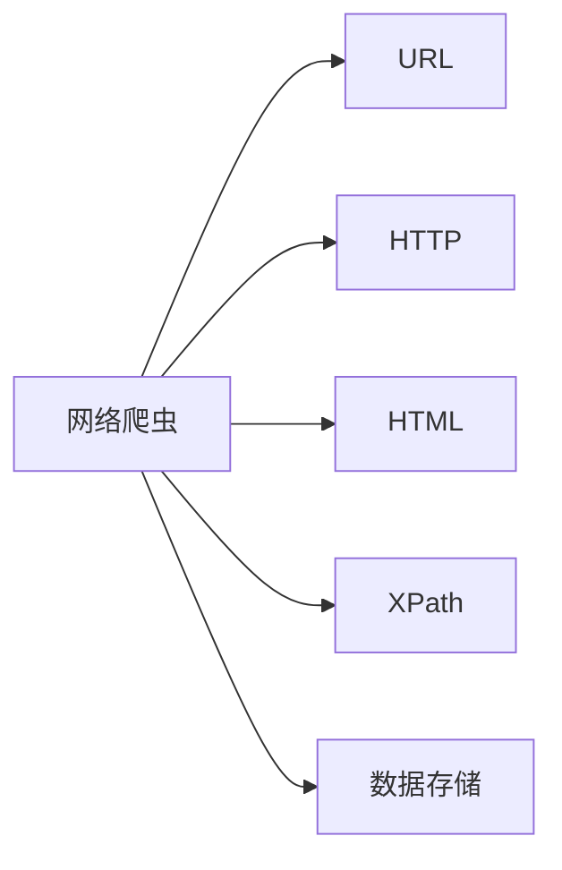

## 1. 背景介绍

### 1.1  互联网数据洪流与信息获取需求

互联网的蓬勃发展带来了海量的数据，如何高效地获取并利用这些信息成为了当今社会的重要课题。网络爬虫作为一种自动化信息采集工具，应运而生，并在各个领域发挥着越来越重要的作用。

### 1.2  传统爬虫的局限性

传统的爬虫系统通常以桌面应用程序的形式存在，存在着部署困难、维护成本高、扩展性差等问题。随着Web技术的不断发展，基于Web的爬虫系统逐渐成为主流，它具有易于部署、易于维护、易于扩展等优势。

### 1.3  基于Web的爬虫系统的优势

* **易于部署:** 基于Web的爬虫系统可以轻松部署在云服务器或Web服务器上，无需用户安装任何软件。
* **易于维护:**  Web界面方便用户监控爬虫运行状态、修改配置参数、查看采集结果，降低了维护成本。
* **易于扩展:**  基于Web的爬虫系统可以方便地集成其他Web服务，例如数据分析、可视化等，增强了系统的功能和价值。

## 2. 核心概念与联系

### 2.1  网络爬虫

网络爬虫（Web Crawler）是一种自动化程序，用于从互联网上采集信息。它模拟人类浏览网页的行为，自动访问目标网站，提取所需数据。

### 2.2  URL

URL（Uniform Resource Locator）是互联网上资源的唯一标识符，用于定位网络上的资源。

### 2.3  HTTP

HTTP（Hypertext Transfer Protocol）是用于传输网页的协议。网络爬虫通过发送HTTP请求获取网页内容。

### 2.4  HTML

HTML（Hypertext Markup Language）是用于描述网页结构的标记语言。网络爬虫需要解析HTML文档，提取所需信息。

### 2.5  XPath

XPath（XML Path Language）是一种用于在XML文档中定位节点的语言。网络爬虫可以使用XPath提取HTML文档中的特定信息。

### 2.6  数据存储

网络爬虫采集到的数据需要存储到数据库或文件中，以便后续分析和利用。

### 2.7  核心概念联系



## 3. 核心算法原理具体操作步骤

### 3.1  爬虫工作流程

1. **获取初始URL:**  从种子URL列表或数据库中获取待爬取的URL。
2. **发送HTTP请求:**  向目标URL发送HTTP请求，获取网页内容。
3. **解析HTML文档:**  解析HTML文档，提取所需信息，例如文本、图片、链接等。
4. **提取URL:**  从网页中提取新的URL，加入待爬取URL队列。
5. **数据存储:**  将提取到的数据存储到数据库或文件中。
6. **重复步骤2-5:**  循环爬取网页，直到满足停止条件。

### 3.2  URL去重

为了避免重复爬取相同的网页，需要对URL进行去重。常用的去重方法包括：

* **Set:**  使用Set数据结构存储URL，自动去重。
* **Bloom Filter:**  使用布隆过滤器判断URL是否已经爬取过。

### 3.3  网页解析

常用的网页解析方法包括：

* **正则表达式:**  使用正则表达式匹配目标信息。
* **XPath:**  使用XPath定位HTML文档中的特定节点。
* **CSS选择器:**  使用CSS选择器定位HTML文档中的特定元素。

### 3.4  数据存储

常用的数据存储方式包括：

* **关系型数据库:**  将数据存储到MySQL、PostgreSQL等关系型数据库中。
* **NoSQL数据库:**  将数据存储到MongoDB、Cassandra等NoSQL数据库中。
* **文件:**  将数据存储到文本文件、CSV文件等文件中。

## 4. 数学模型和公式详细讲解举例说明

### 4.1  爬虫效率

爬虫效率是指单位时间内爬取的网页数量。影响爬虫效率的因素包括：

* **网络带宽:**  网络带宽越大，爬取速度越快。
* **网页大小:**  网页越大，下载时间越长。
* **服务器响应速度:**  服务器响应速度越快，爬取速度越快。

### 4.2  爬虫深度

爬虫深度是指从初始URL开始，爬取网页的层数。爬虫深度越大，爬取到的网页数量越多，但也越容易遇到性能瓶颈。

### 4.3  爬虫广度

爬虫广度是指从初始URL开始，爬取网页的链接数量。爬虫广度越大，爬取到的网页数量越多，但也越容易遇到重复爬取的问题。

### 4.4  公式举例

假设网络带宽为 $B$ Mbps，网页平均大小为 $S$ KB，服务器平均响应时间为 $T$ 秒，则爬虫效率 $E$ 可以表示为：

$$E = \frac{B \times 1024}{8 \times S + T \times 1000}$$

## 5. 项目实践：代码实例和详细解释说明

### 5.1  Python爬虫框架

Python拥有丰富的爬虫框架，例如Scrapy、Beautiful Soup、Requests等。

### 5.2  代码实例

```python
import requests
from bs4 import BeautifulSoup

# 目标URL
url = 'https://www.example.com/'

# 发送HTTP请求
response = requests.get(url)

# 解析HTML文档
soup = BeautifulSoup(response.content, 'html.parser')

# 提取标题
title = soup.find('title').text

# 打印标题
print(title)
```

### 5.3  代码解释

* `requests.get(url)`:  发送HTTP GET请求，获取网页内容。
* `BeautifulSoup(response.content, 'html.parser')`:  使用Beautiful Soup解析HTML文档。
* `soup.find('title').text`:  使用Beautiful Soup提取网页标题。

## 6. 实际应用场景

### 6.1  搜索引擎

搜索引擎使用网络爬虫采集互联网上的网页，建立索引，为用户提供信息检索服务。

### 6.2  价格监控

价格监控网站使用网络爬虫采集电商网站上的商品价格，帮助用户比较价格，找到最优惠的商品。

### 6.3  新闻聚合

新闻聚合网站使用网络爬虫采集各个新闻网站的新闻，为用户提供最新的新闻资讯。

### 6.4  社交媒体分析

社交媒体分析公司使用网络爬虫采集社交媒体上的数据，分析用户行为，提供市场营销服务。

## 7. 总结：未来发展趋势与挑战

### 7.1  人工智能

人工智能技术可以用于提升爬虫系统的效率和智能化程度，例如：

* **自然语言处理:**  用于理解网页内容，提取更准确的信息。
* **机器学习:**  用于识别网页模式，优化爬取策略。
* **深度学习:**  用于处理非结构化数据，例如图片、视频等。

### 7.2  反爬虫技术

网站为了保护自身利益，会采取各种反爬虫技术，例如：

* **IP封锁:**  封锁频繁访问的IP地址。
* **验证码:**  要求用户输入验证码，防止机器人访问。
* **User-Agent检测:**  检测用户代理字符串，识别爬虫程序。

### 7.3  伦理和法律问题

网络爬虫需要遵守相关法律法规，例如：

* **Robots协议:**  遵守网站的robots.txt文件，不爬取禁止爬取的内容。
* **版权保护:**  尊重网站的版权，不未经授权转载网站内容。
* **隐私保护:**  保护用户隐私，不采集用户的个人信息。

## 8. 附录：常见问题与解答

### 8.1  如何防止被网站封锁IP？

* **降低爬取频率:**  不要过于频繁地访问网站。
* **使用代理IP:**  使用代理服务器隐藏真实IP地址。
* **设置User-Agent:**  将User-Agent设置为浏览器常用的值。

### 8.2  如何处理验证码？

* **手动输入:**  手动输入验证码。
* **使用第三方验证码识别服务:**  使用第三方服务识别验证码。
* **绕过验证码:**  尝试绕过验证码，例如分析验证码生成规则。

### 8.3  如何遵守Robots协议？

* **解析robots.txt文件:**  使用Python库解析robots.txt文件，获取允许爬取的URL。
* **尊重Disallow规则:**  不爬取robots.txt文件中Disallow规则禁止爬取的URL。
* **设置Crawl-delay:**  设置爬取间隔时间，避免对网站造成过大的压力。 
