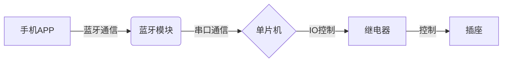

# 基于单片机智能蓝牙APP定时开关插座的设计与实现

作者：禅与计算机程序设计艺术

## 1. 背景介绍

### 1.1 物联网时代智能家居的兴起

近年来，随着物联网技术的快速发展，智能家居概念逐渐深入人心。智能家居是指利用先进的信息技术、网络技术和自动化控制技术，将家居生活相关的设施集成，构建高效的住宅设施管理系统，提升家居安全性、便利性、舒适性和艺术性，并实现环保节能的居住环境。智能家居产品种类繁多，涵盖了照明、家电、安防、娱乐等多个领域。其中，智能插座作为智能家居系统的重要组成部分，近年来备受关注。

### 1.2 传统插座的局限性

传统的插座仅仅提供简单的通断电功能，无法满足现代人对智能化、便捷化生活的需求。例如，用户无法远程控制家电开关，无法定时开启或关闭电器，也无法实时监测电器的用电情况。这些局限性促使人们寻求更智能、更便捷的插座解决方案。

### 1.3 智能蓝牙APP定时开关插座的优势

智能蓝牙APP定时开关插座应运而生，它基于单片机控制技术和蓝牙通信技术，通过手机APP与插座进行无线连接，实现对插座的远程控制、定时开关、用电监测等功能。相比传统插座，智能蓝牙APP定时开关插座具有以下优势：

* **远程控制:** 用户可以通过手机APP随时随地控制插座的通断电状态，无需走到插座旁边进行手动操作。
* **定时开关:** 用户可以根据自己的作息时间设置插座的定时开关时间，例如定时开启咖啡机、定时关闭电热毯等，提高生活效率和舒适度。
* **用电监测:** 智能插座可以实时监测连接设备的用电量、电压、电流等参数，帮助用户了解家电的用电情况，并进行节能管理。
* **安全可靠:** 智能插座通常具有过载保护、短路保护、漏电保护等安全功能，保障用电安全。

## 2. 核心概念与联系

### 2.1 单片机

单片机（Microcontroller Unit，MCU）是一种集成电路芯片，将中央处理器、存储器、输入输出接口等功能集成在一个芯片上，构成一个微型的计算机系统。在本项目中，单片机作为智能插座的控制核心，负责接收蓝牙模块传输的控制指令，并控制继电器实现插座的通断电。

### 2.2 蓝牙模块

蓝牙模块是一种支持蓝牙协议的无线通信模块，可以实现设备之间的短距离无线数据传输。在本项目中，蓝牙模块用于实现手机APP与智能插座之间的无线通信，将用户的控制指令传输给单片机，并将插座的状态信息反馈给手机APP。

### 2.3 继电器

继电器是一种电控开关元件，利用电磁效应实现电路的通断。在本项目中，继电器用于控制插座的通断电，当单片机接收到开启指令时，控制继电器闭合，接通电路，实现插座供电；当单片机接收到关闭指令时，控制继电器断开，断开电路，实现插座断电。

### 2.4 手机APP

手机APP是用户与智能插座进行交互的界面，用户可以通过手机APP发送控制指令、设置定时任务、查看设备状态等。手机APP通过蓝牙与智能插座进行通信，实现数据的交互。

### 2.5 核心概念联系图



## 3. 核心算法原理具体操作步骤

### 3.1  单片机程序设计

#### 3.1.1 初始化

* 初始化系统时钟，设置定时器中断。
* 初始化GPIO引脚，设置蓝牙模块、继电器等外设的引脚模式。
* 初始化蓝牙模块，设置蓝牙设备名称、连接密码等参数。
* 初始化定时器，设置定时时间。

#### 3.1.2 蓝牙数据接收

* 在主循环中，不断检测蓝牙模块是否接收到数据。
* 如果接收到数据，则解析数据包，判断控制指令类型。

#### 3.1.3 控制指令处理

* 根据不同的控制指令类型，执行相应的操作。
    * 开启指令：控制继电器闭合，接通电路，实现插座供电。
    * 关闭指令：控制继电器断开，断开电路，实现插座断电。
    * 定时开启指令：将定时开启时间存储到定时器中。
    * 定时关闭指令：将定时关闭时间存储到定时器中。
    * 查询状态指令：将当前插座状态、定时任务等信息发送给手机APP。

#### 3.1.4 定时器中断处理

* 在定时器中断服务程序中，判断当前时间是否到达定时任务的执行时间。
* 如果到达定时任务的执行时间，则根据定时任务类型控制继电器，实现插座的定时开关。

### 3.2  手机APP设计

#### 3.2.1 蓝牙连接

* 搜索附近的蓝牙设备，连接到智能插座的蓝牙模块。

#### 3.2.2 控制界面设计

* 设计简洁明了的控制界面，方便用户操作。
* 提供插座开关按钮，实现插座的远程控制。
* 提供定时任务设置界面，方便用户设置定时开关时间。
* 提供设备状态显示界面，显示插座的当前状态、定时任务等信息。

#### 3.2.3 数据交互

* 通过蓝牙模块与单片机进行数据交互，发送控制指令、接收设备状态信息等。

## 4. 数学模型和公式详细讲解举例说明

本项目中没有复杂的数学模型和公式。

## 5. 项目实践：代码实例和详细解释说明

### 5.1 单片机代码示例 (基于Arduino平台)

```c++
#include <SoftwareSerial.h>
#include <TimerOne.h>

// 定义蓝牙模块引脚
#define BT_RX 2
#define BT_TX 3

// 定义继电器控制引脚
#define RELAY_PIN 4

// 定义蓝牙模块通信波特率
#define BT_BAUD_RATE 9600

// 创建蓝牙串口对象
SoftwareSerial bluetooth(BT_RX, BT_TX);

// 定时器中断标志位
volatile bool timerFlag = false;

// 定时任务结构体
struct TimerTask {
  byte hour;
  byte minute;
  bool status; // true: 开启，false: 关闭
};

// 定时任务数组
TimerTask timerTasks[5];

// 定时任务数量
byte taskCount = 0;

void setup() {
  // 初始化串口
  Serial.begin(9600);
  bluetooth.begin(BT_BAUD_RATE);

  // 初始化继电器控制引脚
  pinMode(RELAY_PIN, OUTPUT);
  digitalWrite(RELAY_PIN, HIGH); // 默认关闭继电器

  // 初始化定时器
  Timer1.initialize(60000000); // 1分钟中断一次
  Timer1.attachInterrupt(timerInterrupt);
}

void loop() {
  // 处理蓝牙数据
  processBluetoothData();

  // 处理定时任务
  processTimerTasks();
}

// 处理蓝牙数据
void processBluetoothData() {
  if (bluetooth.available() > 0) {
    // 读取蓝牙数据
    String command = bluetooth.readStringUntil('\n');

    // 解析控制指令
    if (command.startsWith("ON")) {
      // 开启插座
      digitalWrite(RELAY_PIN, LOW);
      bluetooth.println("OK");
    } else if (command.startsWith("OFF")) {
      // 关闭插座
      digitalWrite(RELAY_PIN, HIGH);
      bluetooth.println("OK");
    } else if (command.startsWith("SET")) {
      // 设置定时任务
      setTimerTask(command);
    } else if (command.startsWith("GET")) {
      // 获取设备状态
      getDeviceInfo();
    }
  }
}

// 设置定时任务
void setTimerTask(String command) {
  // 解析定时任务参数
  byte index = command.substring(4, 5).toInt();
  byte hour = command.substring(6, 8).toInt();
  byte minute = command.substring(9, 11).toInt();
  bool status = (command.substring(12, 13) == "1");

  // 存储定时任务
  timerTasks[index].hour = hour;
  timerTasks[index].minute = minute;
  timerTasks[index].status = status;

  // 更新定时任务数量
  if (index >= taskCount) {
    taskCount = index + 1;
  }

  bluetooth.println("OK");
}

// 获取设备状态
void getDeviceInfo() {
  // 发送设备状态信息
  bluetooth.print("STATUS:");
  bluetooth.print(digitalRead(RELAY_PIN) == LOW ? "1" : "0");
  bluetooth.print(",");
  bluetooth.print(taskCount);
  for (byte i = 0; i < taskCount; i++) {
    bluetooth.print(",");
    bluetooth.print(timerTasks[i].hour);
    bluetooth.print(",");
    bluetooth.print(timerTasks[i].minute);
    bluetooth.print(",");
    bluetooth.print(timerTasks[i].status ? "1" : "0");
  }
  bluetooth.println();
}

// 定时器中断服务程序
void timerInterrupt() {
  // 设置定时器中断标志位
  timerFlag = true;
}

// 处理定时任务
void processTimerTasks() {
  if (timerFlag) {
    // 清除定时器中断标志位
    timerFlag = false;

    // 获取当前时间
    byte currentHour = hour();
    byte currentMinute = minute();

    // 遍历定时任务数组
    for (byte i = 0; i < taskCount; i++) {
      // 判断当前时间是否到达定时任务的执行时间
      if (timerTasks[i].hour == currentHour && timerTasks[i].minute == currentMinute) {
        // 控制继电器
        digitalWrite(RELAY_PIN, timerTasks[i].status ? LOW : HIGH);
      }
    }
  }
}
```

### 5.2  手机APP代码示例 (基于Android平台)

```java
// 蓝牙连接部分代码
BluetoothAdapter bluetoothAdapter = BluetoothAdapter.getDefaultAdapter();
Set<BluetoothDevice> pairedDevices = bluetoothAdapter.getBondedDevices();

if (pairedDevices.size() > 0) {
    for (BluetoothDevice device : pairedDevices) {
        if (device.getName().equals("智能插座")) {
            // 连接蓝牙设备
            BluetoothSocket socket = device.createRfcommSocketToServiceRecord(UUID.fromString("00001101-0000-1000-8000-00805F9B34FB"));
            socket.connect();

            // 获取输入输出流
            InputStream inputStream = socket.getInputStream();
            OutputStream outputStream = socket.getOutputStream();

            // 发送控制指令
            String command = "ON\n";
            outputStream.write(command.getBytes());

            // 接收设备状态信息
            byte[] buffer = new byte[1024];
            int bytes = inputStream.read(buffer);
            String data = new String(buffer, 0, bytes);

            // 关闭连接
            socket.close();
        }
    }
}

// 控制界面部分代码
Button onButton = findViewById(R.id.onButton);
Button offButton = findViewById(R.id.offButton);

onButton.setOnClickListener(new View.OnClickListener() {
    @Override
    public void onClick(View v) {
        // 发送开启指令
        sendCommand("ON");
    }
});

offButton.setOnClickListener(new View.OnClickListener() {
    @Override
    public void onClick(View v) {
        // 发送关闭指令
        sendCommand("OFF");
    }
});

// 发送控制指令
private void sendCommand(String command) {
    // 通过蓝牙连接发送指令
    // ...
}
```

## 6. 实际应用场景

智能蓝牙APP定时开关插座可以广泛应用于各种场景，例如：

* **家庭场景:** 控制家用电器，例如台灯、电风扇、加湿器等，实现远程控制、定时开关等功能，提高生活舒适度和便利性。
* **办公场景:** 控制办公室电器，例如打印机、咖啡机、饮水机等，实现定时开关、远程控制等功能，提高工作效率。
* **农业场景:** 控制农业灌溉设备，例如水泵、喷淋系统等，实现定时灌溉、远程控制等功能，提高农业生产效率和自动化水平。
* **工业场景:** 控制工业设备，例如电机、加热器等，实现定时开关、远程控制等功能，提高工业生产效率和安全性。

## 7. 总结：未来发展趋势与挑战

### 7.1 未来发展趋势

* **更加智能化:** 随着人工智能技术的不断发展，智能插座将更加智能化，例如可以通过语音控制、人脸识别等方式实现更加便捷的控制。
* **更加节能环保:** 智能插座将更加注重节能环保，例如可以通过智能算法优化用电策略，减少能源浪费。
* **更加安全可靠:** 智能插座将更加注重安全可靠性，例如可以通过多重保护机制保障用电安全。
* **更加个性化:** 智能插座将更加注重个性化需求，例如可以通过用户画像、行为习惯等数据分析，为用户提供更加个性化的服务。

### 7.2 面临的挑战

* **成本控制:** 智能插座的成本相对较高，需要不断降低成本来提高市场竞争力。
* **技术标准:** 智能家居行业缺乏统一的技术标准，不同品牌的产品之间互联互通困难，需要制定统一的技术标准来解决这一问题。
* **数据安全:** 智能插座收集用户的用电数据，需要采取有效的措施来保障用户的数据安全和隐私。

## 8. 附录：常见问题与解答

### 8.1  蓝牙连接不上怎么办？

* 确保蓝牙模块和手机蓝牙处于开启状态。
* 确保蓝牙模块和手机之间的距离在有效范围内。
* 检查蓝牙模块和手机是否已经配对，如果没有配对，则需要先进行配对操作。
* 尝试重启蓝牙模块和手机。

### 8.2  定时功能不准确怎么办？

* 检查单片机程序中定时器的设置是否正确。
* 检查单片机时钟频率是否准确。
* 尝试重新设置定时任务。

### 8.3  插座控制失灵怎么办？

* 检查继电器是否损坏，可以尝试更换新的继电器。
* 检查继电器控制电路是否正常，可以使用万用表测量电压和电流。
* 检查单片机程序中继电器控制代码是否正确。