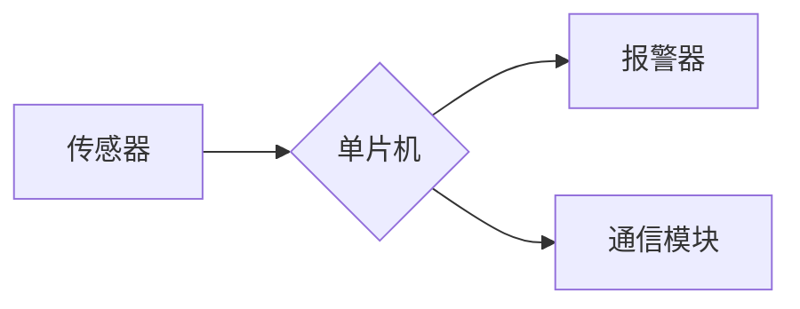

## 1. 背景介绍

### 1.1 火灾的危害

火灾是人类社会面临的主要灾害之一，其具有突发性、破坏性和不可预测性等特点，给人民生命财产安全和社会经济发展造成巨大损失。近年来，随着城市化进程的加快和工业生产的快速发展，火灾发生的频率和造成的损失也呈现出逐年上升的趋势。

### 1.2 火灾报警系统的意义

火灾报警系统是预防和减少火灾损失的重要手段，其通过实时监测环境中的烟雾、温度、火焰等火灾特征信息，并在火灾发生时及时发出警报，提醒人员疏散逃生，并启动灭火设施，最大限度地减少火灾造成的损失。

### 1.3 单片机在火灾报警系统中的应用

单片机(Microcontroller Unit, MCU)是一种集成电路芯片，具有体积小、功耗低、功能强大、易于集成等特点，在嵌入式系统中得到了广泛的应用。单片机在火灾报警系统中的应用主要体现在以下几个方面：

* **数据采集与处理**: 单片机可以采集来自传感器的数据，例如烟雾传感器、温度传感器、火焰传感器等，并对数据进行处理和分析，判断是否发生火灾。
* **报警控制**: 单片机可以控制报警器的启动和停止，并通过不同的报警方式，例如声音报警、灯光报警、短信报警等，提醒人员疏散逃生。
* **系统集成**: 单片机可以与其他设备进行通信，例如GSM模块、WIFI模块等，实现远程监控和报警功能。

## 2. 核心概念与联系

### 2.1 火灾探测技术

火灾探测技术是火灾报警系统的基础，其主要包括以下几种：

* **烟雾探测**: 通过检测空气中的烟雾浓度来判断是否发生火灾，常用的烟雾传感器有离子式烟雾传感器和光电式烟雾传感器。
* **温度探测**: 通过检测环境温度的变化来判断是否发生火灾，常用的温度传感器有热敏电阻和热电偶。
* **火焰探测**: 通过检测火焰发出的红外线或紫外线来判断是否发生火灾，常用的火焰传感器有红外火焰传感器和紫外火焰传感器。

### 2.2 报警方式

火灾报警系统可以通过多种方式发出警报，常用的报警方式有：

* **声音报警**: 通过蜂鸣器或喇叭发出警报声，提醒人员疏散逃生。
* **灯光报警**: 通过LED灯或警示灯发出警报信号，提醒人员注意火灾。
* **短信报警**: 通过GSM模块向指定手机号码发送短信，提醒相关人员及时处理火灾。

### 2.3 系统架构

基于单片机的火灾报警系统通常采用以下架构：



* **传感器**: 用于采集环境中的火灾特征信息，例如烟雾、温度、火焰等。
* **单片机**: 用于处理传感器数据，判断是否发生火灾，并控制报警器的启动和停止。
* **报警器**: 用于发出警报信号，提醒人员疏散逃生。
* **通信模块**: 用于与其他设备进行通信，例如GSM模块、WIFI模块等，实现远程监控和报警功能。

## 3. 核心算法原理具体操作步骤

### 3.1 烟雾浓度检测算法

离子式烟雾传感器的工作原理是利用放射性物质镅-241电离空气，形成正负离子，当空气中存在烟雾时，烟雾颗粒会吸附离子，导致离子电流减小，从而判断是否发生火灾。

光电式烟雾传感器的工作原理是利用光电效应，当空气中存在烟雾时，烟雾颗粒会散射光线，导致光敏元件接收到的光强发生变化，从而判断是否发生火灾。

### 3.2 温度变化检测算法

热敏电阻的阻值会随着温度的变化而变化，通过测量热敏电阻的阻值，可以判断环境温度的变化。

热电偶是由两种不同的金属材料组成的，当两种金属材料的结点温度不同时，会产生电势差，通过测量热电偶的电势差，可以判断环境温度的变化。

### 3.3 火焰特征识别算法

红外火焰传感器的工作原理是利用火焰发出的红外线进行探测，当红外火焰传感器接收到火焰发出的红外线时，会产生电信号，从而判断是否发生火灾。

紫外火焰传感器的工作原理是利用火焰发出的紫外线进行探测，当紫外火焰传感器接收到火焰发出的紫外线时，会产生电信号，从而判断是否发生火灾。

## 4. 数学模型和公式详细讲解举例说明

### 4.1 烟雾浓度计算公式

离子式烟雾传感器输出的电流与烟雾浓度之间存在一定的函数关系，可以通过标定实验确定该函数关系。

光电式烟雾传感器输出的光强与烟雾浓度之间也存在一定的函数关系，可以通过标定实验确定该函数关系。

### 4.2 温度变化计算公式

热敏电阻的阻值与温度之间存在一定的函数关系，可以通过标定实验确定该函数关系。

热电偶的电势差与温度之间存在一定的函数关系，可以通过标定实验确定该函数关系。

### 4.3 火焰特征识别公式

红外火焰传感器输出的电信号与火焰强度之间存在一定的函数关系，可以通过标定实验确定该函数关系。

紫外火焰传感器输出的电信号与火焰强度之间存在一定的函数关系，可以通过标定实验确定该函数关系。

## 5. 项目实践：代码实例和详细解释说明

### 5.1 硬件平台

* 单片机：STC89C52
* 烟雾传感器：MQ-2
* 温度传感器：DS18B20
* 火焰传感器：YG8300
* 报警器：蜂鸣器
* 通信模块：GSM模块

### 5.2 软件设计

```c
#include <reg52.h>
#include <intrins.h>

sbit buzzer = P1^0; // 蜂鸣器引脚定义
sbit gsm_power = P1^1; // GSM模块电源控制引脚定义

// 烟雾传感器引脚定义
sbit mq2_dout = P2^0;
sbit mq2_aout = P2^1;

// 温度传感器引脚定义
sbit ds18b20_dq = P2^2;

// 火焰传感器引脚定义
sbit yg8300_dout = P2^3;

// GSM模块串口通信引脚定义
sbit gsm_txd = P3^1;
sbit gsm_rxd = P3^0;

// 全局变量定义
unsigned char smoke_value; // 烟雾浓度值
unsigned int temp_value; // 温度值
unsigned char flame_value; // 火焰强度值

// 函数声明
void init(); // 初始化函数
void delay(unsigned int i); // 延时函数
void send_sms(char *phone_number, char *message); // 发送短信函数
void alarm(); // 报警函数

// 主函数
void main()
{
    init(); // 初始化
    while(1)
    {
        // 读取传感器数据
        smoke_value = get_smoke_value();
        temp_value = get_temp_value();
        flame_value = get_flame_value();

        // 判断是否发生火灾
        if(smoke_value > 100 || temp_value > 50 || flame_value > 50)
        {
            alarm(); // 报警
            send_sms("13800138000", "火灾报警！"); // 发送短信
        }

        delay(1000); // 延时1秒
    }
}

// 初始化函数
void init()
{
    // 初始化串口
    TMOD = 0x20;
    TH1 = 0xfd;
    TL1 = 0xfd;
    TR1 = 1;
    SCON = 0x50;

    // 初始化GSM模块
    gsm_power = 1; // 打开GSM模块电源
    delay(1000); // 延时1秒
    send_at_command("AT+CMGF=1\r\n"); // 设置短信格式为文本模式
}

// 延时函数
void delay(unsigned int i)
{
    unsigned int j, k;
    for(j = 0; j < i; j++)
    {
        for(k = 0; k < 125; k++);
    }
}

// 发送短信函数
void send_sms(char *phone_number, char *message)
{
    char cmd[100];
    sprintf(cmd, "AT+CMGS=\"%s\"\r\n", phone_number);
    send_at_command(cmd);
    delay(100);
    send_at_command(message);
    delay(100);
    send_at_command("\x1a"); // 发送Ctrl+Z结束短信输入
}

// 报警函数
void alarm()
{
    buzzer = 0; // 蜂鸣器报警
    delay(500); // 延时0.5秒
    buzzer = 1; // 停止报警
}

// 发送AT指令函数
void send_at_command(char *cmd)
{
    unsigned char i;
    for(i = 0; cmd[i] != '\0'; i++)
    {
        SBUF = cmd[i];
        while(!TI);
        TI = 0;
    }
}

// 获取烟雾浓度值函数
unsigned char get_smoke_value()
{
    // TODO: 读取MQ-2传感器数据并计算烟雾浓度值
}

// 获取温度值函数
unsigned int get_temp_value()
{
    // TODO: 读取DS18B20传感器数据并计算温度值
}

// 获取火焰强度值函数
unsigned char get_flame_value()
{
    // TODO: 读取YG8300传感器数据并计算火焰强度值
}
```

### 5.3 代码解释

* `init()`函数用于初始化串口和GSM模块。
* `delay()`函数用于延时指定时间。
* `send_sms()`函数用于发送短信。
* `alarm()`函数用于启动蜂鸣器报警。
* `send_at_command()`函数用于发送AT指令到GSM模块。
* `get_smoke_value()`、`get_temp_value()`和`get_flame_value()`函数分别用于读取烟雾传感器、温度传感器和火焰传感器数据，并计算相应的数值。

## 6. 实际应用场景

基于单片机的火灾报警系统可以应用于以下场景：

* **家庭火灾报警**: 家庭火灾报警系统可以安装在厨房、卧室、客厅等场所，用于监测火灾隐患，并在火灾发生时及时发出警报，提醒人员疏散逃生。
* **工厂火灾报警**: 工厂火灾报警系统可以安装在生产车间、仓库等场所，用于监测火灾隐患，并在火灾发生时及时发出警报，提醒人员疏散逃生，并启动灭火设施。
* **公共场所火灾报警**: 公共场所火灾报警系统可以安装在商场、超市、医院、学校等场所，用于监测火灾隐患，并在火灾发生时及时发出警报，提醒人员疏散逃生。

## 7. 工具和资源推荐

### 7.1 单片机开发工具

* **Keil C**: 一款常用的单片机开发软件，支持多种单片机型号，提供代码编辑、编译、调试等功能。
* **IAR Embedded Workbench**: 另一款常用的单片机开发软件，功能类似于Keil C。

### 7.2 传感器模块

* **DFRobot**: 提供各种传感器模块，例如烟雾传感器、温度传感器、火焰传感器等。
* **Seeed Studio**: 另一家提供各种传感器模块的供应商。

### 7.3 GSM模块

* **SIMCOM**: 提供各种GSM模块，例如SIM800C、SIM900A等。
* **AI-Thinker**: 另一家提供各种GSM模块的供应商。

## 8. 总结：未来发展趋势与挑战

### 8.1 未来发展趋势

* **智能化**: 随着人工智能技术的不断发展，火灾报警系统将会更加智能化，例如可以识别不同类型的火灾，并根据火灾类型采取不同的报警措施。
* **网络化**: 随着物联网技术的不断发展，火灾报警系统将会更加网络化，例如可以通过云平台实现远程监控和报警功能。
* **集成化**: 火灾报警系统将会与其他安全系统更加集成，例如视频监控系统、门禁系统等，形成更加完善的安全防护体系。

### 8.2 面临的挑战

* **误报率**: 火灾报警系统需要降低误报率，避免给用户带来不必要的麻烦。
* **成本控制**: 火灾报警系统的成本需要控制在合理的范围内，才能得到更广泛的应用。
* **技术更新**: 火灾报警系统的技术需要不断更新，才能适应不断变化的火灾形势。

## 9. 附录：常见问题与解答

### 9.1 如何选择合适的传感器？

选择传感器需要考虑以下因素：

* **灵敏度**: 传感器的灵敏度越高，越容易检测到火灾。
* **响应时间**: 传感器的响应时间越短，越能及时发出警报。
* **稳定性**: 传感器的稳定性越高，越能保证系统的可靠性。

### 9.2 如何降低误报率？

降低误报率可以采取以下措施：

* **选择高质量的传感器**: 高质量的传感器具有更高的灵敏度和稳定性，可以有效降低误报率。
* **合理设置报警阈值**: 报警阈值设置过低容易导致误报，设置过高容易导致漏报，需要根据实际情况进行调整。
* **采用多传感器融合技术**: 多传感器融合技术可以综合多个传感器的数据，提高系统的可靠性，降低误报率。

### 9.3 如何实现远程监控和报警？

实现远程监控和报警可以采用以下方案：

* **GSM模块**: GSM模块可以通过短信或语音通话的方式实现远程报警功能。
* **WIFI模块**: WIFI模块可以通过网络连接到云平台，实现远程监控和报警功能。
* **以太网模块**: 以太网模块可以通过网络连接到监控中心，实现远程监控和报警功能。
