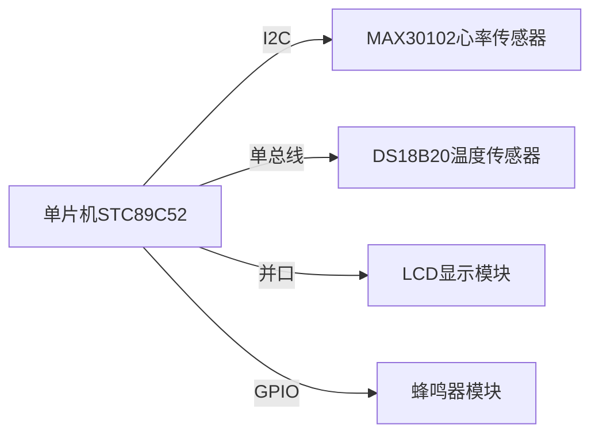
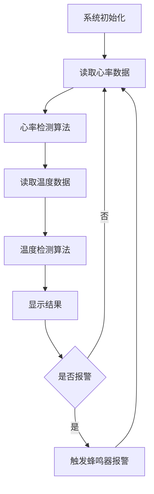

# 基于单片机的心率体温监测报警器

## 1.背景介绍

### 1.1 健康监测的重要性

在当今快节奏的生活方式中,人们越来越重视健康管理。及时监测心率和体温等生命体征对于及早发现潜在健康问题至关重要。传统的就医方式往往需要专门的医疗设备和专业人员,使得健康监测的成本和便利性受到限制。因此,开发一种便携、经济、易用的健康监测设备备受关注。

### 1.2 单片机在嵌入式系统中的应用

单片机是一种高度集成的微型计算机,具有体积小、功耗低、价格便宜等优点,广泛应用于各种嵌入式系统中。由于单片机的可编程性和硬件扩展能力,使其非常适合用于构建各种智能电子产品,如健康监测设备。

### 1.3 项目概述

本项目旨在设计并实现一种基于单片机的便携式心率和体温监测报警器。该设备能够实时检测佩戴者的心率和体温,并在异常情况下发出报警提醒。它采用了先进的传感器技术和微控制器技术,操作简单,可靠性高,对于普通家庭和医疗机构而言都是一种经济实用的健康监测工具。

## 2.核心概念与联系

### 2.1 心率检测原理

心率是指每分钟心脏搏动的次数,通常以次/分钟(bpm)来表示。心率的变化与人体的生理和心理状态密切相关,是评估健康状况的重要指标之一。

心率检测的原理是利用光电容积脉搏波(PPG)技术。当心脏收缩时,血液在血管中流动会引起组织的体积变化,进而导致组织对光的吸收发生微小变化。通过精确测量这种光吸收变化,就可以检测到脉搏信号,进而计算出心率值。

### 2.2 体温检测原理 

人体的正常体温范围约为36.5°C~37.5°C,体温的异常变化往往预示着身体可能出现了某种疾病或功能失调。因此,体温的监测对于健康评估至关重要。

体温检测的基本原理是利用温度传感器来测量人体表面的温度。常用的温度传感器有热电阻、热电偶等。这些传感器的工作原理是利用材料的电阻或电动势与温度之间的特定关系来测量温度。

### 2.3 单片机系统

单片机系统是本项目的核心,负责协调各个外围模块的工作、处理检测数据并执行相应的控制逻辑。

典型的单片机系统包括以下几个主要部分:

- 微控制器(MCU):单片机的"大脑",执行程序和控制指令。
- 存储器:用于存储程序代码和运行数据。
- 时钟电路:为MCU提供工作时钟信号。
- 复位电路:用于初始化MCU的工作状态。
- I/O接口电路:实现MCU与外部设备的连接和通信。

通过编程,可以让单片机系统完成各种复杂的控制和处理任务。

### 2.4 模数转换与中断控制

由于心率和体温检测所获得的原始数据都是模拟信号,因此需要通过模数转换(A/D转换)将其转换为微控制器可以处理的数字信号。

中断控制技术能够使微控制器在发生特定事件时暂停当前执行的程序,转而响应并处理该事件,从而提高系统的实时性和响应能力。在心率体温监测过程中,可以利用中断控制来及时捕获和处理传感器数据,确保数据的实时性和准确性。

## 3.核心算法原理具体操作步骤

### 3.1 心率检测算法

心率检测算法的核心是从PPG信号中精确识别出每一次脉搏,并根据脉搏间隔计算出心率值。常用的心率检测算法有:

1. **移动平均滤波**

   使用移动平均滤波器去除PPG信号中的高频噪声,获得较为平滑的波形。

2. **自相关算法**

   利用PPG信号与其自身的相关性来检测周期性的脉搏波峰,从而确定心率。

3. **小波变换算法**

   将PPG信号分解为不同尺度的小波分量,在特定尺度上检测脉搏波峰。

4. **自适应阈值算法**

   动态调整波峰检测的阈值,以适应PPG信号的时变特性,提高检测精度。

算法的具体步骤如下:

1. 获取PPG原始数据
2. 对数据进行预处理(去基线漂移、滤波等)
3. 使用选定的算法(如自相关)检测波峰
4. 计算相邻波峰间的时间间隔
5. 根据时间间隔计算心率值
6. 对心率值进行平滑滤波处理
7. 输出最终心率结果

### 3.2 体温检测算法

体温检测算法的主要任务是从温度传感器获取的原始数据中准确计算出人体的体温值。

1. **线性化处理**

   由于温度传感器的输出特性与温度之间通常不是线性关系,因此需要对原始数据进行线性化处理,将其转换为与温度成正比的量。

2. **温度计算**

   根据已知的温度-电压(或电阻)转换公式,将线性化后的数据转换为对应的温度值。

3. **温度补偿**

   由于环境温度、自加热效应等因素的影响,测量值可能会存在一定偏差。通过建立温度补偿模型,对测量结果进行校正。

4. **滤波平滑**

   使用数字滤波算法(如移动平均滤波)对温度值进行平滑处理,减小随机噪声的影响。

算法步骤:

1. 获取温度传感器的原始数据
2. 进行线性化处理
3. 将线性数据转换为温度值
4. 根据已建立的温度补偿模型对温度值进行校正
5. 使用数字滤波算法对温度值进行平滑处理
6. 输出最终温度结果

## 4.数学模型和公式详细讲解举例说明

### 4.1 心率检测相关公式

#### 4.1.1 自相关函数

自相关函数用于检测PPG信号中的周期性分量,公式如下:

$$R(k) = \sum_{n=0}^{N-k-1}x(n)x(n+k)$$

其中:
- $R(k)$是自相关函数的值
- $x(n)$是PPG信号的离散时间序列
- $N$是信号长度
- $k$是延迟样本数

当$k$等于PPG信号的周期时,自相关函数会达到局部极大值,可以据此检测出心跳周期。

#### 4.1.2 心率计算

已知心跳周期$T$,则心率可以计算为:

$$\text{Heart Rate} = \frac{60}{T}\ \text{bpm}$$

其中$T$的单位为秒。

### 4.2 体温检测相关公式

#### 4.2.1 NTC热敏电阻温度计算

对于负温度系数(NTC)热敏电阻,其电阻值$R_T$与绝对温度$T$之间的关系可以用Steinhart-Hart方程近似:

$$\frac{1}{T} = A + B\ln R_T + C(\ln R_T)^3$$

其中$A$、$B$、$C$是与热敏电阻材料有关的常数,可以通过实验拟合得到。已知$R_T$,可以解出$T$的值。

#### 4.2.2 热电偶温度计算

对于热电偶,其输出电压$V$与温度$T$之间的关系可以用多项式近似:

$$V = a_0 + a_1T + a_2T^2 + \cdots + a_nT^n$$

其中$a_0$、$a_1$、$a_2$...、$a_n$是与热电偶材料有关的常数,可以通过实验拟合获得。已知$V$,可以解出$T$的值。

### 4.3 数字滤波

数字滤波是消除噪声、平滑波形的重要手段。常用的数字滤波算法有移动平均滤波、中值滤波等。

#### 4.3.1 移动平均滤波

移动平均滤波的计算公式为:

$$y(n) = \frac{1}{M}\sum_{i=0}^{M-1}x(n-i)$$

其中:
- $y(n)$是滤波输出
- $x(n)$是原始输入序列
- $M$是滤波窗口大小

移动平均滤波能有效抑制高频噪声,但会引入相位延迟。

#### 4.3.2 中值滤波

中值滤波的计算公式为:

$$y(n) = \text{median}(x(n-\frac{M-1}{2}), \cdots, x(n), \cdots, x(n+\frac{M-1}{2}))$$

其中$\text{median}(\cdot)$表示取中值的操作。

中值滤波能有效抑制脉冲噪声,但对于高斯白噪声的抑制效果一般。

根据实际需求,可以选择合适的滤波算法,或者结合使用多种滤波器以获得更好的效果。

## 5.项目实践:代码实例和详细解释说明

### 5.1 硬件连接

本项目采用单片机STC89C52作为主控制器,使用MAX30102心率传感器和DS18B20温度传感器分别测量心率和体温。它们通过I2C和单总线接口与单片机相连。另外,还需要一个LCD显示模块用于显示检测结果,以及一个蜂鸣器模块用于报警。硬件连接示意图如下:



### 5.2 软件框架

软件采用模块化设计,主要包括以下几个模块:

- `main.c`: 主程序,负责初始化系统、调度各模块、显示检测结果等。
- `hr_sensor.c`: 心率传感器驱动模块,实现心率检测算法。
- `temp_sensor.c`: 温度传感器驱动模块,实现体温检测算法。
- `lcd.c`: LCD显示驱动模块。
- `buzzer.c`: 蜂鸣器驱动模块。
- `utils.c`: 通用工具函数模块,包括延时函数、I2C读写函数等。

程序的主要流程如下:



### 5.3 关键代码解释

#### 5.3.1 心率检测模块

```c
// hr_sensor.c
#include <reg52.h>
#include "utils.h"

#define HR_SENSOR_ADDR 0x57 // MAX30102设备地址

// 自相关算法实现
uint16_t detect_heart_rate(uint32_t *ir_data, uint16_t data_len) {
    uint32_t cor_val, max_cor_val = 0;
    uint16_t max_cor_idx = 0;
    
    for (uint16_t k = 0; k < data_len / 2; k++) {
        cor_val = 0;
        for (uint16_t n = 0; n < data_len - k; n++) {
            cor_val += ir_data[n] * ir_data[n + k];
        }
        if (cor_val > max_cor_val) {
            max_cor_val = cor_val;
            max_cor_idx = k;
        }
    }
    
    uint16_t heart_period = max_cor_idx;
    uint16_t heart_rate = 60 * 25 / heart_period; // 采样率为25Hz
    
    return heart_rate;
}

void read_hr_sensor() {
    uint8_t data[6];
    I2C_Read_Data(HR_SENSOR_ADDR, data, 6); // 读取原始PPG数据
    
    uint32_t ir_data[100];
    for (uint8_t i = 0;