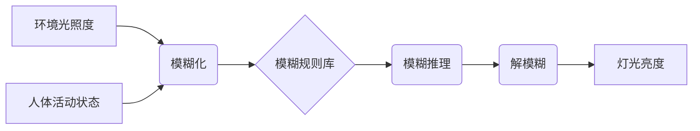

##  基于单片机的智能教室灯光节能控制系统

作者：禅与计算机程序设计艺术

## 1. 背景介绍

### 1.1  节能减排的迫切需求

随着全球经济的快速发展和人口的不断增长，能源消耗急剧增加，能源短缺和环境污染问题日益突出。为了应对这一全球性挑战，世界各国都在积极探索节能减排的新途径，其中智能照明控制系统作为一种有效的节能手段，受到了广泛关注。

### 1.2  传统教室照明存在的问题

传统的教室照明系统通常采用固定照度、人工开关的方式，存在着能源浪费严重、照明效果不佳、管理维护不便等问题。具体表现在：

* **能源浪费严重:**  在无人使用或光线充足的情况下，教室灯光仍然处于开启状态，造成大量的电能浪费。
* **照明效果不佳:**  固定照度无法满足不同时间、不同天气、不同课程对照明的不同需求，影响学生视力和学习效率。
* **管理维护不便:**  人工开关灯方式繁琐易忘，且难以实现对教室照明的实时监控和管理。

### 1.3  智能教室灯光节能控制系统的优势

智能教室灯光节能控制系统利用传感器、单片机等技术，实现了教室照明的自动化、智能化控制，能够有效解决传统教室照明存在的问题，具有以下优势：

* **节约能源:**  通过自动感应光线强度、人体活动等信息，实现灯光的自动开关和亮度调节，避免了能源的浪费。
* **提高照明质量:**  根据不同时间、不同天气、不同课程对照明的不同需求，自动调节灯光亮度，提供舒适健康的照明环境。
* **方便管理维护:**  系统可实现对教室照明的远程监控和管理，方便管理员及时了解教室照明状况并进行相应的调整。

## 2. 核心概念与联系

### 2.1  系统架构

本智能教室灯光节能控制系统采用分布式控制架构，主要由以下几个部分组成：

1. **传感器模块:**  用于采集教室内的环境光照度、人体活动等信息，并将信息传输给单片机进行处理。
2. **单片机控制模块:**  作为系统的核心控制单元，负责接收传感器信息，根据预设的控制策略，控制灯光开关和亮度调节。
3. **灯光驱动模块:**  接收单片机发出的控制信号，驱动LED灯的开关和亮度调节。
4. **人机交互模块:**  为用户提供友好的操作界面，方便用户进行参数设置和系统控制。

### 2.2  系统工作流程

1. **环境感知:**  传感器模块实时监测教室内的环境光照度和人体活动情况。
2. **信息处理:**  单片机控制模块接收传感器信息，并根据预设的控制策略进行分析处理。
3. **灯光控制:**  单片机控制模块根据处理结果，发出控制信号给灯光驱动模块，控制灯光开关和亮度调节。
4. **人机交互:**  用户可以通过人机交互模块对系统进行参数设置和控制。

### 2.3  核心技术

* **单片机技术:**  单片机作为系统的核心控制单元，负责接收传感器信息，根据预设的控制策略，控制灯光开关和亮度调节。
* **传感器技术:**  传感器用于采集教室内的环境光照度、人体活动等信息。
* **LED照明技术:**  LED灯具有节能、环保、寿命长等优点，是智能照明系统的理想光源。
* **控制算法:**  控制算法是实现智能照明控制的关键，本系统采用基于模糊控制的算法，能够根据环境变化自动调节灯光亮度，提供舒适健康的照明环境。

## 3. 核心算法原理具体操作步骤

### 3.1  模糊控制算法

模糊控制算法是一种基于人工智能的控制方法，它模拟人的思维方式，将人的经验知识转化为模糊规则，并通过模糊推理来实现对系统的控制。

### 3.2  算法操作步骤

1. **确定输入输出变量:**  本系统中，输入变量为环境光照度和人体活动状态，输出变量为灯光亮度。
2. **模糊化:**  将输入输出变量的值转换为相应的模糊语言值，例如，将环境光照度分为“很暗”、“较暗”、“适中”、“较亮”、“很亮”五个等级。
3. **建立模糊规则库:**  根据实际情况，建立模糊规则库，例如，当环境光照度“很暗”且有人活动时，灯光亮度应为“很亮”。
4. **模糊推理:**  根据输入变量的模糊语言值和模糊规则库，进行模糊推理，得到输出变量的模糊语言值。
5. **解模糊:**  将输出变量的模糊语言值转换为具体的数值，控制灯光亮度。

### 3.3  算法流程图



## 4. 数学模型和公式详细讲解举例说明

### 4.1  环境光照度模型

环境光照度是指单位面积上接收到的光通量，常用勒克斯（lux）表示。本系统采用光敏电阻作为光照度传感器，其阻值与光照度成反比。

光敏电阻阻值与光照度的关系可以用以下公式表示：

$$
R = k \cdot L^{-\alpha}
$$

其中：

* $R$ 为光敏电阻阻值
* $L$ 为光照度
* $k$ 为常数
* $\alpha$ 为非线性系数

### 4.2  人体活动状态模型

人体活动状态可以通过红外传感器进行检测。当有人进入教室时，红外传感器会检测到人体辐射的红外线，输出高电平信号；当人离开教室时，红外传感器输出低电平信号。

### 4.3  灯光亮度控制模型

灯光亮度控制采用PWM（Pulse Width Modulation，脉冲宽度调制）技术，通过调节PWM波的占空比来控制LED灯的亮度。

PWM波的占空比定义为高电平时间与周期的比值，可以用以下公式表示：

$$
Duty Cycle = \frac{T_{on}}{T}
$$

其中：

* $Duty Cycle$ 为占空比
* $T_{on}$ 为高电平时间
* $T$ 为周期

## 5. 项目实践：代码实例和详细解释说明

### 5.1  硬件电路设计

本系统硬件电路主要由以下几个部分组成：

* **单片机最小系统:**  采用STC89C52单片机作为主控芯片，晶振频率为11.0592MHz。
* **传感器模块:**  光敏电阻和红外传感器分别连接到单片机的P1.0和P1.1引脚。
* **灯光驱动模块:**  采用MOS管驱动LED灯，MOS管的栅极连接到单片机的P2.0引脚。
* **人机交互模块:**  采用按键和LCD1602液晶显示屏作为人机交互界面。

### 5.2  软件程序设计

```c
#include <reg52.h>

// 定义引脚
sbit LED = P2^0; // LED灯控制引脚
sbit LightSensor = P1^0; // 光敏电阻连接引脚
sbit PIRSensor = P1^1; // 红外传感器连接引脚

// 定义变量
unsigned char LightValue; // 光照度值
unsigned char PIRValue; // 人体活动状态值
unsigned char Brightness; // 灯光亮度值

// 初始化函数
void Init()
{
    // 初始化串口
    TMOD = 0x20; // 设置定时器1工作方式为方式2
    TH1 = 0xfd; // 设置波特率为9600
    TL1 = 0xfd;
    TR1 = 1; // 启动定时器1
    SCON = 0x50; // 设置串口工作方式为方式1

    // 初始化ADC
    // ...

    // 初始化其他外设
    // ...
}

// 读取光照度值
unsigned char ReadLightValue()
{
    // 读取ADC转换结果
    // ...

    // 将ADC转换结果转换为光照度值
    // ...

    return LightValue;
}

// 读取人体活动状态
unsigned char ReadPIRValue()
{
    // 读取红外传感器状态
    // ...

    return PIRValue;
}

// 控制灯光亮度
void ControlLED(unsigned char brightness)
{
    // 设置PWM占空比
    // ...
}

// 主函数
void main()
{
    Init(); // 初始化

    while(1)
    {
        LightValue = ReadLightValue(); // 读取光照度值
        PIRValue = ReadPIRValue(); // 读取人体活动状态

        // 根据光照度和人体活动状态，控制灯光亮度
        if (LightValue < 50 && PIRValue == 1) // 光线较暗且有人活动
        {
            Brightness = 255; // 灯光亮度最大
        }
        else if (LightValue < 100 && PIRValue == 1) // 光线较暗且有人活动
        {
            Brightness = 128; // 灯光亮度中等
        }
        else if (LightValue >= 100 || PIRValue == 0) // 光线较亮或无人活动
        {
            Brightness = 0; // 灯光关闭
        }

        ControlLED(Brightness); // 控制灯光亮度
    }
}
```

### 5.3  代码解释

* `Init()` 函数用于初始化系统，包括初始化串口、ADC、定时器等外设。
* `ReadLightValue()` 函数用于读取光敏电阻的模拟值，并将其转换为光照度值。
* `ReadPIRValue()` 函数用于读取红外传感器的数字值，判断是否有人体活动。
* `ControlLED()` 函数用于控制LED灯的亮度，通过设置PWM波的占空比来实现。
* `main()` 函数是程序的主函数，在主函数中，首先调用 `Init()` 函数初始化系统，然后进入无限循环，不断读取光照度值和人体活动状态，根据预设的控制策略，控制灯光亮度。

## 6. 实际应用场景

### 6.1  智能教室

智能教室是本系统的典型应用场景。通过部署智能教室灯光节能控制系统，可以实现教室照明的自动化、智能化控制，提高能源利用效率，改善教室照明环境，提升学生学习效率。

### 6.2  智能家居

智能家居是近年来兴起的一种新型家居模式，智能照明是智能家居的重要组成部分。本系统可以应用于智能家居系统中，实现家居照明的自动化、智能化控制，提高家居舒适度和安全性。

### 6.3  其他应用场景

除了智能教室和智能家居，本系统还可以应用于以下场景：

* 办公室照明
* 会议室照明
* 展厅照明
* 图书馆照明

## 7. 工具和资源推荐

### 7.1  硬件工具

* **单片机开发板:**  STC89C52开发板、Arduino开发板等。
* **传感器:**  光敏电阻、红外传感器等。
* **LED灯:**  高亮度LED灯、LED灯驱动模块等。
* **其他:**  面包板、杜邦线、USB转TTL模块等。

### 7.2  软件工具

* **Keil C51:**  单片机C语言开发环境。
* **Arduino IDE:**  Arduino开发环境。
* **Proteus:**  电路仿真软件。

### 7.3  学习资源

* **菜鸟教程:**  https://www.runoob.com/
* **电子发烧友:**  https://www.elecfans.com/
* **单片机教程网:**  http://www.51mcu.com/

## 8. 总结：未来发展趋势与挑战

### 8.1  未来发展趋势

* **更加智能化:**  随着人工智能技术的不断发展，智能照明控制系统将更加智能化，能够根据用户的习惯和需求，自动调节灯光亮度和色温，提供更加舒适健康的照明环境。
* **更加节能环保:**  未来智能照明控制系统将采用更加节能环保的材料和技术，例如，采用太阳能供电、无线通信等技术，进一步降低系统能耗。
* **更加个性化:**  未来智能照明控制系统将更加注重用户的个性化需求，可以根据用户的喜好和习惯，定制不同的照明方案。

### 8.2  挑战

* **成本控制:**  智能照明控制系统的成本仍然较高，如何降低系统成本是推广应用的关键。
* **技术标准:**  目前智能照明控制系统的技术标准还不完善，不同厂家的产品之间存在兼容性问题。
* **用户接受度:**  部分用户对智能照明控制系统的了解不足，接受度不高。

## 9. 附录：常见问题与解答

### 9.1  问题1：系统无法正常工作怎么办？

**解答:**  首先检查硬件电路连接是否正确，传感器是否正常工作，LED灯是否损坏。如果硬件电路没有问题，则检查软件程序是否正确，控制算法是否合理。

### 9.2  问题2：如何提高系统灵敏度？

**解答:**  可以通过调整传感器灵敏度、优化控制算法等方式提高系统灵敏度。

### 9.3  问题3：如何实现远程控制？

**解答:**  可以通过添加WiFi模块、蓝牙模块等无线通信模块，实现远程控制。
