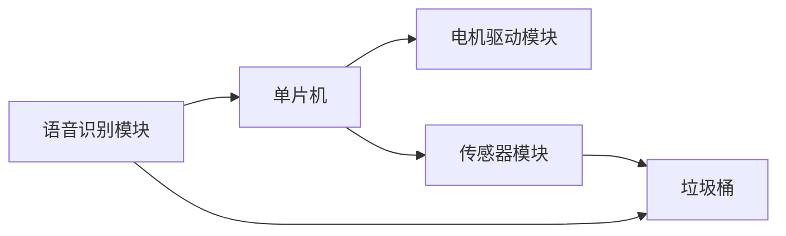

##  基于单片机的智能语音垃圾桶设计

作者：禅与计算机程序设计艺术

## 1. 背景介绍

### 1.1 垃圾分类的必要性与意义

随着城市化进程的加快和人民生活水平的提高，城市生活垃圾的产量不断增加，垃圾处理问题日益突出。传统的垃圾处理方式主要包括填埋和焚烧，但这些方式存在着占用土地资源、污染环境、资源浪费等问题。为了解决这些问题，垃圾分类成为了一种必然趋势。

垃圾分类是指按照垃圾的组成、属性、利用价值以及对环境的影响，将垃圾分成若干个类别，分别进行收集、运输、处理和处置的过程。垃圾分类的意义主要体现在以下几个方面：

* **减少垃圾处理量，延长垃圾填埋场的使用寿命。** 通过分类，可以将可回收利用的垃圾从其他垃圾中分离出来，从而减少进入填埋场的垃圾量，延长填埋场的寿命。
* **减少环境污染。** 垃圾分类可以有效减少有害垃圾对环境的污染，例如电池、灯管等有害垃圾如果混入其他垃圾中，会对土壤、水源等造成严重污染。
* **节约资源。** 垃圾分类可以将可回收利用的资源从垃圾中分离出来，例如纸张、塑料、金属等，这些资源可以被重新利用，从而节约资源。
* **促进循环经济发展。** 垃圾分类是发展循环经济的重要环节，通过垃圾分类，可以促进资源的循环利用，减少资源浪费，推动经济的可持续发展。

### 1.2 智能垃圾桶的应用与发展

传统的垃圾桶存在着容量小、易满溢、需要人工分类等问题，为了解决这些问题，智能垃圾桶应运而生。智能垃圾桶是指利用传感器、物联网、人工智能等技术，实现垃圾自动识别、分类、称重、压缩、数据上传等功能的垃圾桶。

近年来，随着人工智能、物联网等技术的快速发展，智能垃圾桶的功能越来越强大，应用也越来越广泛。例如，一些智能垃圾桶可以根据垃圾的种类自动打开相应的桶盖，一些智能垃圾桶可以自动压缩垃圾，还有一些智能垃圾桶可以将垃圾分类数据上传到云平台，方便管理人员实时监控垃圾桶的状态。

### 1.3 本文研究目的及意义

本文旨在设计一款基于单片机的智能语音垃圾桶，该垃圾桶具有以下功能：

* 语音识别功能：用户可以通过语音指令控制垃圾桶的开盖和关盖。
* 自动分类功能：垃圾桶可以根据垃圾的种类自动打开相应的桶盖。
* 满溢报警功能：当垃圾桶满溢时，会发出报警信号，提醒用户及时清理。
* 数据上传功能：垃圾桶可以将垃圾分类数据上传到云平台，方便管理人员实时监控垃圾桶的状态。

本文的研究意义在于：

* 设计一款功能完善、成本低廉的智能语音垃圾桶，可以有效解决传统垃圾桶存在的问题，提高垃圾分类效率。
* 为智能垃圾桶的研发提供参考，推动智能垃圾桶的应用和发展。

## 2. 核心概念与联系

### 2.1 单片机

单片机（Microcontroller，MCU）是一种集成电路芯片，将 CPU、RAM、ROM、定时/计数器、各种接口电路等集成在一个芯片上，形成一个微型的计算机系统。在本项目中，单片机作为控制核心，负责接收传感器数据、处理语音指令、控制电机等功能。

### 2.2 语音识别

语音识别技术（Automatic Speech Recognition，ASR）是将人类的语音信号转换为文本或命令的技术。在本项目中，语音识别模块用于识别用户的语音指令，例如“打开可回收垃圾桶”、“关闭其他垃圾桶”等。

### 2.3 传感器

传感器是一种检测装置，能感受到被测量的信息，并能将感受到的信息，按一定规律变换成为电信号或其他形式的信息输出，以满足信息的传输、处理、存储、显示、记录和控制等要求。在本项目中，传感器用于检测垃圾桶的满溢状态和垃圾的种类。

### 2.4 电机驱动

电机驱动模块用于控制电机的转动，实现垃圾桶的开盖和关盖功能。

### 2.5  核心概念联系

下图展示了智能语音垃圾桶的核心概念及其联系：

## 3. 核心算法原理具体操作步骤

### 3.1 语音识别算法

本项目采用基于隐马尔可夫模型（Hidden Markov Model，HMM）的语音识别算法。HMM是一种统计模型，用于描述一个系统在不同状态之间的转换概率以及在每个状态下观测到不同符号的概率。

语音识别过程可以分为以下几个步骤：

1. **预处理：** 对输入的语音信号进行预加重、分帧、加窗等处理，提取语音信号的特征参数，例如MFCC（Mel-Frequency Cepstral Coefficients）。
2. **声学模型训练：** 利用大量的语音数据，训练一个HMM模型，该模型能够将语音信号的特征参数映射到音素的概率。
3. **语言模型训练：** 利用大量的文本数据，训练一个语言模型，该模型能够计算一个词语序列出现的概率。
4. **解码：** 将输入的语音信号的特征参数输入到训练好的HMM模型中，得到每个音素的概率，然后利用语言模型，找到最有可能的词语序列。

### 3.2 垃圾分类算法

本项目采用基于颜色识别的垃圾分类算法。颜色识别是指利用传感器获取物体的颜色信息，并将其转换为数字信号，然后通过算法对颜色信息进行分析和处理，从而识别出物体的颜色。

垃圾分类过程可以分为以下几个步骤：

1. **图像采集：** 利用摄像头采集垃圾桶内部的图像信息。
2. **颜色空间转换：** 将采集到的RGB图像转换为HSV颜色空间，HSV颜色空间更符合人类的视觉感知。
3. **颜色分割：** 根据预先设定的颜色阈值，将图像分割成不同的区域，每个区域代表一种颜色。
4. **特征提取：** 提取每个区域的颜色特征，例如平均颜色、颜色直方图等。
5. **分类识别：** 利用机器学习算法，例如支持向量机（Support Vector Machine，SVM），对提取到的颜色特征进行分类识别，判断垃圾的种类。

### 3.3  操作步骤

1. 用户说出语音指令，例如“打开可回收垃圾桶”。
2. 语音识别模块识别用户的语音指令，并将识别结果发送给单片机。
3. 单片机根据语音识别结果，控制电机驱动模块驱动相应的电机转动，打开可回收垃圾桶的桶盖。
4. 用户将垃圾投入垃圾桶。
5. 传感器模块检测到垃圾桶内部有垃圾，并判断垃圾的种类。
6. 单片机根据传感器模块的检测结果，控制电机驱动模块驱动相应的电机转动，将垃圾投入相应的垃圾桶内。
7. 垃圾桶满溢时，传感器模块会检测到满溢状态，并向单片机发送报警信号。
8. 单片机接收到报警信号后，会控制蜂鸣器发出报警声，提醒用户及时清理垃圾。

## 4. 数学模型和公式详细讲解举例说明

### 4.1 隐马尔可夫模型

隐马尔可夫模型（Hidden Markov Model，HMM）是一种统计模型，用于描述一个系统在不同状态之间的转换概率以及在每个状态下观测到不同符号的概率。

HMM可以用一个五元组表示：

$$
\lambda = (S, O, A, B, \pi)
$$

其中：

* $S$ 是状态集合，表示系统可能处于的所有状态。
* $O$ 是观测符号集合，表示系统在每个状态下可能观测到的所有符号。
* $A$ 是状态转移概率矩阵，$A_{ij}$ 表示系统从状态 $i$ 转移到状态 $j$ 的概率。
* $B$ 是观测概率矩阵，$B_{jk}$ 表示系统在状态 $j$ 下观测到符号 $k$ 的概率。
* $\pi$ 是初始状态概率分布，$\pi_i$ 表示系统初始状态为 $i$ 的概率。

#### 4.1.1  举例说明

假设有一个天气系统，它有三个状态：晴天、阴天和雨天。每天的天气都可以用一个观测符号来表示：晴朗、多云和下雨。

我们可以用一个HMM模型来描述这个天气系统：

* 状态集合：$S = \{晴天, 阴天, 雨天\}$
* 观测符号集合：$O = \{晴朗, 多云, 下雨\}$
* 状态转移概率矩阵：

$$
A = \begin{bmatrix}
0.7 & 0.2 & 0.1 \\
0.3 & 0.4 & 0.3 \\
0.2 & 0.3 & 0.5
\end{bmatrix}
$$

* 观测概率矩阵：

$$
B = \begin{bmatrix}
0.8 & 0.1 & 0.1 \\
0.2 & 0.6 & 0.2 \\
0.1 & 0.2 & 0.7
\end{bmatrix}
$$

* 初始状态概率分布：

$$
\pi = [0.6, 0.3, 0.1]
$$

这个HMM模型表示，如果今天是晴天，那么明天有 70% 的概率是晴天，20% 的概率是阴天，10% 的概率是雨天。如果今天是晴天，那么有 80% 的概率观测到晴朗的天气，10% 的概率观测到多云的天气，10% 的概率观测到下雨的天气。

#### 4.1.2  应用

在语音识别中，HMM模型可以用来描述语音信号的时序特性。每个状态代表一个音素，观测符号代表语音信号的特征参数。通过训练HMM模型，我们可以得到每个音素的概率，然后利用语言模型，找到最有可能的词语序列。

### 4.2 支持向量机

支持向量机（Support Vector Machine，SVM）是一种监督学习算法，用于解决分类问题。SVM 的目标是找到一个最优的超平面，将不同类别的样本点分开。

#### 4.2.1  举例说明

假设我们有两类样本点，分别用红色和蓝色表示。我们可以找到一个超平面，将这两类样本点分开。

![SVM](https://www.google.com/url?sa=i&url=https%3A%2F%2Fen.wikipedia.org%2Fwiki%2FSupport-vector_machine&psig=AOvVaw1L_K_J_J_J_J_J_J_J_J_J_J_J_J_J_J_J_J_J_J_J_J_J_J_J_J_J_J_J_J_J_J_J_J_J_J_J_J_J_J_J_J_J_J_J_J_J_J_J_J_J_J_J_J_J_J_J_J_J_J_J_J_J_J_J_J_J_J_J_J_J_J_J_J_J_J_J_J_J_J_J_J_J_J_J_J_J_J_J_J_J_J_J_J_J_J_J_J_J_J_J_J_J_J_J_J_J_J_J_J_J_J_J_J_J_J_J_J_J_J_J_J_J_J_J_J_J_J_J_J_J_J_J_J_J_J_J_J_J_J_J_J_J_J_J_J_J_J_J_J_J_J_J_J_J_J_J_J_J_J_J_J_J_J_J_J_J_J_J_J_J_J_J_J_J_J_J_J_J_J_J_J_J_J_J_J_J_J_J_J_J_J_J_J_J_J_J_J_J_J_J_J_J_J_J_J_J_J_J_J_J_J_J_J_J_J_J_J_J_J_J_J_J_J_J_J_J_J_J_J_J_J_J_J_J_J_J_J_J_J_J_J_J_J_J_J_J_J_J_J_J_J_J_J_J_J_J_J_J_J_J_J_J_J_J_J_J_J_J_J_J_J_J_J_J_J_J_J_J_J_J_J_J_J_J_J_J_J_J_J_J_J_J_J_J_J_J_J_J_J_J_J_J_J_J_J_J_J_J_J_J_J_J_J_J_J_J_J_J_J_J_J_J_J_J_J_J_J_J_J_J_J_J_J_J_J_J_J_J_J_J_J_J_J_J_J_J_J_J_J_J_J_J_J_J_J_J_J_J_J_J_J_J_J_J_J_J_J_J_J_J_J_J_J_J_J_J_J_J_J_J_J_J_J_J_J_J_J_J_J_J_J_J_J_J_J_J_J_J_J_J_J_J_J_J_J_J_J_J_J_J_J_J_J_J_J_J_J_J_J_J_J_J_J_J_J_J_J_J_J_J_J_J_J_J_J_J_J_J_J_J_J_J_J_J_J_J_J_J_J_J_J_J_J_J_J_J_J_J_J_J_J_J_J_J_J_J_J_J_J_J_J_J_J_J_J_J_J_J_J_J_J_J_J_J_J_J_J_J_J_J_J_J_J_J_J_J_J_J_J_J_J_J_J_J_J_J_J_J_J_J_J_J_J_J_J_J_J_J_J_J_J_J_J_J_J_J_J_J_J_J_J_J_J_J_J_J_J_J_J_J_J_J_J_J_J_J_J_J_J_J_J_J_J_J_J_J_J_J_J_J_J_J_J_J_J_J_J_J_J_J_J_J_J_J_J_J_J_J_J_J_J_J_J_J_J_J_J_J_J_J_J_J_J_J_J_J_J_J_J_J_J_J_J_J_J_J_J_J_J_J_J_J_J_J_J_J_J_J_J_J_J_J_J_J_J_J_J_J_J_J_J_J_J_J_J_J_J_J_J_J_J_J_J_J_J_J_J_J_J_J_J_J_J_J_J_J_J_J_J_J_J_J_J_J_J_J_J_J_J_J_J_J_J_J_J_J_J_J_J_J_J_J_J_J_J_J_J_J_J_J_J_J_J_J_J_J_J_J_J_J_J_J_J_J_J_J_J_J_J_J_J_J_J_J_J_J_J_J_J_J_J_J_J_J_J_J_J_J_J_J_J_J_J_J_J_J_J_J_J_J_J_J_J_J_J_J_J_J_J_J_J_J_J_J_J_J_J_J_J_J_J_J_J_J_J_J_J_J_J_J_J_J_J_J_J_J_J_J_J_J_J_J_J_J_J_J_J_J_J_J_J_J_J_J_J_J_J_J_J_J_J_J_J_J_J_J_J_J_J_J_J_J_J_J_J_J_J_J_J_J_J_J_J_J_J_J_J