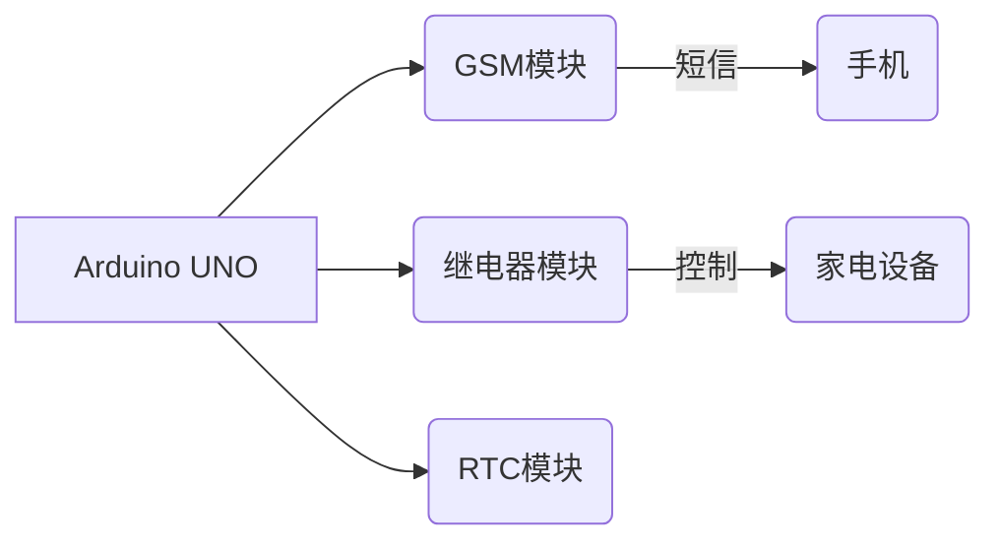

# 基于单片机短信定时控制家电的设计与实现

## 1. 背景介绍

### 1.1 家庭自动化的需求

随着生活水平的提高和科技的发展,家庭自动化系统已经成为现代家庭中不可或缺的一部分。通过智能控制,可以实现对家中电器的远程操控,提高生活质量和能源利用效率。然而,传统的家庭自动化系统往往需要专门的网络基础设施和复杂的软硬件配置,成本较高,给普通家庭带来了一定的障碍。

### 1.2 短信控制的优势

相比之下,利用短信系统进行家电控制具有明显的优势。短信系统覆盖范围广、成本低廉、操作简单,只需要一部普通的手机就可以实现远程控制。同时,短信控制也避免了网络安全隐患,提高了系统的可靠性和隐私性。

### 1.3 单片机在家庭自动化中的应用

单片机是一种高度集成的微型计算机,具有体积小、功耗低、价格便宜等优点,非常适合应用于家庭自动化领域。通过编程,单片机可以实现对各种家电的intelligent控制,成为家庭自动化系统的核心部件。

## 2. 核心概念与联系

### 2.1 单片机系统

单片机系统是一种基于微控制器的嵌入式系统,由微控制器芯片、存储器、输入/输出接口等组成。它具有独立的处理能力,可以根据预先编写的程序完成特定的控制任务。

### 2.2 短信通信

短信(Short Message Service,SMS)是一种通过移动通信网络传输简短文本信息的服务。每条短信最多可包含160个字符,可以实现设备与设备之间、人与设备之间的信息交互。

### 2.3 定时控制

定时控制是指根据预设的时间参数,自动执行特定的控制操作。在家庭自动化中,可以利用定时控制实现对家电的定时开关、调节等功能,提高生活便利性。

### 2.4 系统架构

基于单片机的短信定时控制系统通常由以下几个主要部分组成:

- 单片机控制器
- 短信模块(如GSM模块)
- 继电器模块
- 传感器模块
- 电源模块

单片机作为系统的大脑,负责接收和解析短信指令、执行定时控制逻辑、驱动各个外围模块。

## 3. 核心算法原理具体操作步骤

### 3.1 短信解析算法

系统需要解析收到的短信内容,提取出控制指令和参数。常用的短信解析算法包括:

1. 字符串匹配算法
2. 正则表达式匹配
3. 有限状态机

具体的实现方式取决于短信指令的复杂程度和系统资源。

### 3.2 定时控制算法

定时控制算法需要根据预设的时间参数,在特定时刻执行相应的控制操作。常见的实现方法包括:

1. 硬件定时器中断
2. 软件定时循环扫描
3. 实时时钟(RTC)模块

算法的选择需要权衡精确度、资源占用和功耗等因素。

### 3.3 系统工作流程

1. 初始化各个模块,包括短信模块、继电器模块、传感器模块等。
2. 周期性检查是否有新的短信到达。
3. 若收到新短信,调用短信解析算法提取控制指令和参数。
4. 根据解析结果执行相应的操作:
    - 如果是即时控制指令,直接操作继电器开关家电状态。
    - 如果是定时控制指令,将控制参数存入定时任务队列。
5. 定时控制模块根据任务队列,在预设时间点执行相应的家电开关操作。
6. 根据需要,可以通过短信模块向用户发送状态反馈信息。
7. 循环执行步骤2~6,实现持续的监控和控制。

## 4. 数学模型和公式详细讲解举例说明

在短信定时控制系统中,可能需要使用一些数学模型和公式来描述和优化系统行为。

### 4.1 时间表示

要实现准确的定时控制,需要对时间进行精确的表示和计算。通常使用以下方式:

$$
t = h \times 3600 + m \times 60 + s
$$

其中 $t$ 表示时间(秒),$h$ 表示小时,$m$ 表示分钟,$s$ 表示秒。

在单片机系统中,时间通常使用无符号长整型变量 `uint32_t` 来存储,方便进行运算和比较。

### 4.2 任务调度算法

当有多个定时控制任务同时存在时,需要一个高效的任务调度算法来安排它们的执行顺序。一种常见的方法是使用优先级队列,根据任务的截止时间对它们进行排序:

$$
\begin{aligned}
\text{PriorityQueue} &= \{ (t_1, p_1), (t_2, p_2), \ldots, (t_n, p_n)\} \\
\text{where } t_1 &\leq t_2 \leq \ldots \leq t_n
\end{aligned}
$$

其中 $t_i$ 表示第 $i$ 个任务的截止时间, $p_i$ 表示对应的控制操作。系统按照时间顺序依次执行队列中的任务。

### 4.3 能耗模型

对于battery供电的嵌入式系统,合理的能耗管理是非常重要的。我们可以建立如下的能耗模型:

$$
E = P_\text{active} \times T_\text{active} + P_\text{sleep} \times T_\text{sleep}
$$

其中 $E$ 表示总能耗, $P_\text{active}$ 和 $P_\text{sleep}$ 分别表示活动模式和睡眠模式下的功耗, $T_\text{active}$ 和 $T_\text{sleep}$ 表示对应模式下的持续时间。

通过优化控制算法,最大化系统的睡眠时间 $T_\text{sleep}$,可以有效降低总体能耗 $E$,延长电池寿命。

## 4. 项目实践: 代码实例和详细解释说明

为了更好地理解上述原理和算法,我们将给出一个基于Arduino平台的短信定时控制项目实例,并对关键代码部分进行详细解释。

### 4.1 硬件连接



- Arduino UNO作为控制核心,通过串口与GSM模块通信,接收和发送短信
- 继电器模块连接到Arduino的数字IO口,用于开关家电设备
- RTC(实时时钟)模块为系统提供精确的时间信息

### 4.2 代码框架

```cpp
#include <SoftwareSerial.h>
#include <SMSPDUDECODER.h>

// 初始化GSM模块
SoftwareSerial gsm(2, 3); // RX, TX
SMSPDUDECODER sms;

// 定义家电设备数量和引脚映射
const int numDevices = 3;
const int devicePins[numDevices] = {4, 5, 6};

// 定时任务队列
struct ScheduledTask {
  uint32_t timestamp;
  int deviceId;
  bool state;
};
std::vector<ScheduledTask> taskQueue;

void setup() {
  // 初始化串口和GSM模块
  Serial.begin(9600);
  gsm.begin(9600);
  sms.begin(&gsm);

  // 设置家电IO引脚为输出模式
  for (int i = 0; i < numDevices; i++) {
    pinMode(devicePins[i], OUTPUT);
  }
}

void loop() {
  // 检查是否有新短信
  if (sms.available()) {
    handleIncomingSMS();
  }

  // 执行定时任务
  executeScheduledTasks();
}
```

该框架包括以下主要部分:

1. 初始化GSM模块和串口通信
2. 定义家电设备数量和引脚映射
3. 定时任务队列的数据结构
4. `setup()`函数中进行硬件初始化
5. `loop()`函数中处理新短信和执行定时任务

接下来我们将详细介绍`handleIncomingSMS()`和`executeScheduledTasks()`两个关键函数。

### 4.3 处理新短信

```cpp
void handleIncomingSMS() {
  String message = sms.getIncomingMessage();
  Serial.println("Received SMS: " + message);

  // 解析短信内容
  if (message.startsWith("CONTROL")) {
    handleControlCommand(message);
  } else if (message.startsWith("SCHEDULE")) {
    handleScheduleCommand(message);
  }
  // 其他指令...

  sms.flush(); // 清空短信缓存
}
```

该函数首先获取新收到的短信内容,然后根据短信的前缀关键字调用不同的处理函数。我们来看看`handleControlCommand()`和`handleScheduleCommand()`的实现:

```cpp
void handleControlCommand(String message) {
  // 解析设备ID和状态
  int deviceId = message.substring(8, 9).toInt() - 1;
  bool state = message.substring(10, 11) == "1";

  if (deviceId >= 0 && deviceId < numDevices) {
    digitalWrite(devicePins[deviceId], state);
    Serial.println("Device " + String(deviceId + 1) + " turned " + (state ? "ON" : "OFF"));
  }
}

void handleScheduleCommand(String message) {
  // 解析设备ID、状态和时间
  int deviceId = message.substring(9, 10).toInt() - 1;
  bool state = message.substring(11, 12) == "1";
  uint32_t timestamp = getTimestamp(message.substring(13, 21));

  if (deviceId >= 0 && deviceId < numDevices && timestamp > 0) {
    ScheduledTask task = {timestamp, deviceId, state};
    taskQueue.push_back(task);
    Serial.println("Scheduled task for device " + String(deviceId + 1) + " at " + formatTimestamp(timestamp));
  }
}
```

`handleControlCommand()`函数用于处理即时控制指令,它解析出设备ID和目标状态,然后直接通过`digitalWrite()`函数控制对应的继电器引脚。

`handleScheduleCommand()`函数则处理定时控制指令,它从短信内容中提取出设备ID、目标状态和预设时间,构建一个`ScheduledTask`对象,并将其插入到任务队列中。`getTimestamp()`函数用于将时间字符串转换为无符号长整型时间戳。

### 4.4 执行定时任务

```cpp
void executeScheduledTasks() {
  uint32_t currentTime = getRTCTimestamp();

  for (std::vector<ScheduledTask>::iterator it = taskQueue.begin(); it != taskQueue.end(); ) {
    if (it->timestamp <= currentTime) {
      digitalWrite(devicePins[it->deviceId], it->state);
      Serial.println("Executed task for device " + String(it->deviceId + 1) + " at " + formatTimestamp(currentTime));
      it = taskQueue.erase(it);
    } else {
      ++it;
    }
  }
}
```

`executeScheduledTasks()`函数首先从RTC模块获取当前时间戳,然后遍历任务队列,检查每个任务的截止时间是否已经到期。如果任务已到期,则执行对应的开关操作,并从队列中移除该任务。

需要注意的是,我们使用了`std::vector`的迭代器来安全地遍历和修改队列,避免了在遍历过程中删除元素导致的问题。

### 4.5 辅助函数

```cpp
uint32_t getTimestamp(String timeStr) {
  uint32_t timestamp = 0;
  int h = timeStr.substring(0, 2).toInt();
  int m = timeStr.substring(3, 5).toInt();
  int s = timeStr.substring(6, 8).toInt();

  if (h >= 0 && h < 24 && m >= 0 && m < 60 && s >= 0 && s < 60) {
    timestamp = h * 3600 + m * 60 + s;
  }

  return timestamp;
}

String formatTimestamp(uint32_t timestamp) {
  uint32_t h = timestamp / 3600;
  uint32_t m = (timestamp % 3600) / 60;
  uint32_t s = timestamp % 60;

  return String(h) + ":" + formatDigits(m) + ":" + formatDigits(s);
}

String formatDigits(uint32_t digits) {
  if (digits < 10) {
    return "0" + String(digits);
  } else {
    return String(digits);
  }
}

uint32_t getRTCTimestamp() {
  // 从RTC模块获取当前时间,并转换为时间戳
  // ...
}