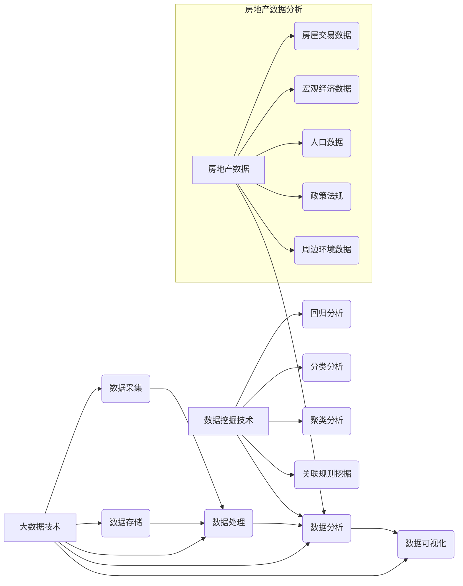

## 基于大数据技术的房价数据分析研究

作者：禅与计算机程序设计艺术

## 1. 背景介绍

### 1.1 房地产市场现状与挑战

随着城市化进程的不断推进，房地产市场一直是国民经济的重要支柱产业。然而，近年来，随着房价的持续上涨，房地产市场也面临着一系列挑战，例如：

*   **信息不对称:** 买卖双方信息不对称，导致市场价格波动较大。
*   **数据分散:** 房地产数据分散在各个部门和机构，难以整合利用。
*   **预测难度大:** 传统的房价预测方法难以准确预测未来房价走势。

### 1.2 大数据技术为房地产市场带来的机遇

大数据技术的兴起为解决上述挑战提供了新的思路和方法。大数据技术具有**数据量大、数据类型多样、处理速度快**等特点，可以帮助我们：

*   **整合海量数据:** 从多个来源收集和整合房地产相关数据，例如房屋交易数据、人口数据、经济数据等。
*   **挖掘数据价值:** 利用数据挖掘技术分析房价影响因素，预测未来房价走势。
*   **提高市场透明度:** 建立房地产信息平台，为买卖双方提供更全面、准确的市场信息。

### 1.3 本文研究目标

本文旨在探讨如何利用大数据技术进行房价数据分析研究，具体目标如下：

*   **建立基于大数据的房价分析模型:** 采用机器学习等方法，构建能够准确预测房价的模型。
*   **分析影响房价的关键因素:** 识别影响房价的关键因素，并分析其影响程度。
*   **提供决策支持:** 为政府部门、房地产企业和个人投资者提供数据支持和决策参考。

## 2. 核心概念与联系

### 2.1 大数据技术

大数据技术是指**从各种各样类型的大量数据中，快速获得有价值信息的能力**。它涉及数据采集、存储、处理、分析和可视化等多个环节，常用的技术包括：

*   **数据采集:** 网络爬虫、传感器网络、API接口等
*   **数据存储:** 分布式文件系统（HDFS）、NoSQL数据库（MongoDB、Cassandra）等
*   **数据处理:** Hadoop、Spark等分布式计算框架
*   **数据分析:** 机器学习、深度学习等算法
*   **数据可视化:** Tableau、Echarts等可视化工具

### 2.2 房地产数据

房地产数据是指与房地产市场相关的各种数据，主要包括以下几类:

*   **房屋交易数据:** 成交价格、面积、楼层、朝向、小区、地理位置等。
*   **宏观经济数据:** GDP、CPI、利率、货币供应量等。
*   **人口数据:** 人口数量、年龄结构、收入水平等。
*   **政策法规:** 房地产调控政策、税收政策等。
*   **周边环境数据:** 交通状况、教育资源、医疗设施等。

### 2.3 数据挖掘技术

数据挖掘是从大量数据中**提取隐藏的、先前未知的、潜在有用的信息和知识的过程**。常用的数据挖掘技术包括：

*   **回归分析:** 用于预测连续型变量，例如房价。
*   **分类分析:** 用于预测离散型变量，例如房屋是否会涨价。
*   **聚类分析:** 用于将数据分组，例如根据地理位置对房屋进行分组。
*   **关联规则挖掘:** 用于发现数据项之间的关联关系，例如购买学区房的客户也倾向于购买高档小区的房子。

### 2.4 核心概念联系



## 3. 核心算法原理具体操作步骤

### 3.1 数据预处理

数据预处理是指在进行数据分析之前，对原始数据进行清洗、转换、集成和归约等操作，以提高数据质量，方便后续分析。

#### 3.1.1 数据清洗

*   **缺失值处理:**  对于缺失的数据，可以使用均值、中位数、众数等方法进行填充。
*   **异常值处理:**  对于异常的数据，可以使用箱线图、散点图等方法进行识别和处理，例如删除、替换、修正等。

#### 3.1.2 数据转换

*   **数据标准化:** 将数据缩放到相同的范围，例如0到1之间，消除不同特征之间量纲的影响。
*   **数据编码:** 将类别型变量转换为数值型变量，例如将房屋朝向转换为One-Hot编码。

#### 3.1.3 数据集成

*   **数据合并:** 将来自不同数据源的数据合并到一起，例如将房屋交易数据和周边环境数据合并。
*   **数据连接:** 根据数据的关联关系，将不同表中的数据连接起来，例如根据房屋ID连接房屋交易数据和房屋属性数据。

#### 3.1.4 数据归约

*   **数据降维:**  降低数据的维度，例如使用主成分分析（PCA）将高维数据降到低维。
*   **数据抽样:**  从数据集中抽取一部分数据进行分析，例如随机抽样、分层抽样等。

### 3.2 特征工程

特征工程是指从原始数据中提取、构建和选择特征的过程，以提高模型的预测性能。

#### 3.2.1 特征提取

*   **时间特征:**  从时间变量中提取年、月、日、星期几等特征。
*   **地理位置特征:**  从地理位置信息中提取经纬度、城市、区域等特征。
*   **文本特征:**  从文本数据中提取关键词、主题等特征，例如使用TF-IDF算法提取房屋描述文本中的关键词。

#### 3.2.2 特征构建

*   **组合特征:**  将多个特征组合成新的特征，例如将面积和楼层组合成面积/楼层特征。
*   **统计特征:**  计算数据的统计指标，例如均值、方差、最大值、最小值等。

#### 3.2.3 特征选择

*   **过滤法:**  根据特征的相关性、方差等指标进行筛选，例如使用Pearson相关系数筛选与房价相关性高的特征。
*   **包裹法:**  使用模型进行特征选择，例如使用递归特征消除法（RFE）选择对模型预测性能贡献大的特征。
*   **嵌入法:**  将特征选择融入模型训练过程中，例如使用L1正则化进行特征选择。

### 3.3 模型训练与评估

#### 3.3.1 模型选择

常用的房价预测模型包括：

*   **线性回归模型:**  简单易懂，但要求数据满足线性关系。
*   **支持向量机:**  适用于高维数据，但对参数敏感。
*   **决策树:**  可解释性强，但容易过拟合。
*   **随机森林:**  由多个决策树组成，泛化能力强。
*   **梯度提升树:**  由多个决策树组成，预测精度高。
*   **神经网络:**  能够学习复杂的非线性关系，但需要大量数据进行训练。

#### 3.3.2 模型训练

*   **数据划分:** 将数据集划分为训练集、验证集和测试集。
*   **超参数调整:**  使用网格搜索、随机搜索等方法寻找模型的最佳超参数。
*   **模型训练:**  使用训练集训练模型。

#### 3.3.3 模型评估

*   **评估指标:**  常用的评估指标包括均方误差（MSE）、均方根误差（RMSE）、决定系数（R2）等。
*   **模型比较:**  比较不同模型的预测性能，选择最优模型。

## 4. 数学模型和公式详细讲解举例说明

### 4.1 线性回归模型

线性回归模型假设目标变量与特征之间存在线性关系，其数学表达式为：

$$
y = \beta_0 + \beta_1 x_1 + \beta_2 x_2 + ... + \beta_n x_n + \epsilon
$$

其中：

*   $y$ 是目标变量，例如房价。
*   $x_1, x_2, ..., x_n$ 是特征，例如面积、楼层、地理位置等。
*   $\beta_0, \beta_1, \beta_2, ..., \beta_n$ 是回归系数，表示特征对目标变量的影响程度。
*   $\epsilon$ 是误差项，表示模型无法解释的部分。

#### 4.1.1 参数估计

线性回归模型的参数估计可以使用最小二乘法，其目标是最小化残差平方和：

$$
\min_{\beta_0, \beta_1, ..., \beta_n} \sum_{i=1}^m (y_i - \hat{y_i})^2
$$

其中：

*   $m$ 是样本数量。
*   $y_i$ 是第 $i$ 个样本的真实值。
*   $\hat{y_i}$ 是第 $i$ 个样本的预测值。

#### 4.1.2 举例说明

假设我们想建立一个线性回归模型来预测房价，特征包括面积和楼层，模型表达式为：

$$
\text{房价} = \beta_0 + \beta_1 \times \text{面积} + \beta_2 \times \text{楼层} + \epsilon
$$

我们收集了100套房子的数据，使用最小二乘法估计模型参数，得到：

$$
\beta_0 = 100, \beta_1 = 2, \beta_2 = 0.5
$$

这意味着：

*   房屋的基准价格为100万元。
*   面积每增加1平方米，房价增加2万元。
*   楼层每增加1层，房价增加0.5万元。

### 4.2 决策树模型

决策树模型是一种树形结构，每个节点表示一个特征，每个分支表示一个特征取值，每个叶子节点表示一个预测结果。

#### 4.2.1 算法原理

决策树模型的构建过程是一个递归的过程，主要包括以下步骤：

1.  选择最佳特征：根据信息增益、信息增益率、基尼系数等指标选择最佳特征作为当前节点。
2.  划分数据集：根据最佳特征的取值将数据集划分成多个子集。
3.  递归构建子树：对每个子集递归调用步骤1和步骤2，直到满足停止条件。

#### 4.2.2 举例说明

假设我们想建立一个决策树模型来预测房价，特征包括面积、楼层和地理位置，数据集如下：

| 面积（平方米） | 楼层 | 地理位置 | 房价（万元） |
|---|---|---|---|
| 100 | 10 | A | 500 |
| 120 | 5 | B | 600 |
| 80 | 15 | A | 400 |
| 150 | 12 | C | 700 |
| 90 | 8 | B | 450 |

我们可以使用信息增益作为特征选择指标，计算每个特征的信息增益：

*   面积：0.5
*   楼层：0.3
*   地理位置：0.7

由于地理位置的信息增益最大，因此选择地理位置作为根节点，将数据集划分成3个子集：

*   地理位置=A：{（100，10，500），（80，15，400）}
*   地理位置=B：{（120，5，600），（90，8，450）}
*   地理位置=C：{（150，12，700）}

对每个子集递归构建子树，最终得到如下决策树：

```
                     地理位置
                    /  |  \
                   A   B   C
                  / \   /\
              面积  面积
              <100 >100
              400  500
```

## 5. 项目实践：代码实例和详细解释说明

### 5.1 数据集介绍

本项目使用加州房价数据集，该数据集包含加州不同地区的房价信息，包括以下特征：

*   MedInc：该地区家庭收入的中位数
*   HouseAge：该地区房屋年龄的中位数
*   AveRooms：该地区平均每户拥有的房间数
*   AveBedrms：该地区平均每户拥有的卧室数
*   Population：该地区的人口数
*   AveOccup：该地区平均每户的人口数
*   Latitude：该地区的纬度
*   Longitude：该地区的经度
*   Target：该地区的房价中位数

### 5.2 代码实例

```python
import pandas as pd
from sklearn.model_selection import train_test_split
from sklearn.linear_model import LinearRegression
from sklearn.metrics import mean_squared_error, r2_score

# 加载数据集
df = pd.read_csv('housing.csv')

# 数据预处理
# ...

# 特征工程
# ...

# 划分数据集
X = df.drop('Target', axis=1)
y = df['Target']
X_train, X_test, y_train, y_test = train_test_split(X, y, test_size=0.2, random_state=42)

# 模型训练
model = LinearRegression()
model.fit(X_train, y_train)

# 模型评估
y_pred = model.predict(X_test)
mse = mean_squared_error(y_test, y_pred)
rmse = mean_squared_error(y_test, y_pred, squared=False)
r2 = r2_score(y_test, y_pred)

# 打印结果
print('MSE:', mse)
print('RMSE:', rmse)
print('R2:', r2)
```

### 5.3 代码解释

*   **加载数据集:** 使用 `pandas` 库加载 `housing.csv` 文件。
*   **数据预处理:** 对数据集进行清洗、转换、集成和归约等操作。
*   **特征工程:** 从原始数据中提取、构建和选择特征。
*   **划分数据集:** 使用 `train_test_split` 函数将数据集划分为训练集和测试集。
*   **模型训练:** 创建 `LinearRegression` 模型，并使用训练集进行训练。
*   **模型评估:** 使用测试集评估模型性能，计算均方误差、均方根误差和决定系数。

## 6. 实际应用场景

基于大数据技术的房价数据分析研究在实际应用中具有广泛的应用场景，例如：

*   **政府部门:** 
    *   **制定房地产调控政策:** 通过分析房价变化趋势、影响因素等，为政府制定科学合理的房地产调控政策提供依据。
    *   **监测房地产市场风险:**  建立房地产市场预警机制，及时发现和防范市场风险。
*   **房地产企业:** 
    *   **项目选址:**  分析不同地区的房价水平、市场需求等，为房地产项目选址提供决策支持。
    *   **产品定价:**  根据市场行情、竞品价格等因素，制定合理的房屋售价。
    *   **营销推广:**  分析目标客户群体特征，制定精准的营销推广策略。
*   **个人投资者:** 
    *   **购房决策:**  分析不同地区、不同类型的房屋价格走势，为个人购房提供参考。
    *   **投资理财:**  根据房价预测结果，进行房地产投资，获得投资收益。

## 7. 工具和资源推荐

### 7.1 数据采集工具

*   **八爪鱼:**  一款可视化的网页数据采集工具，支持多种数据采集方式，例如正则表达式、XPath、CSS选择器等。
*   **火车头:**  一款功能强大的网页数据采集工具，支持分布式采集、数据清洗、数据导出等功能。

### 7.2 数据存储和处理工具

*   **Hadoop:**  一个开源的分布式计算框架，适用于处理海量数据。
*   **Spark:**  一个快速、通用的集群计算系统，适用于迭代计算、交互式查询等场景。

### 7.3 数据分析工具

*   **Python:**  一种解释型、面向对象、动态数据类型的高级程序设计语言，拥有丰富的第三方库，例如 `pandas`、`numpy`、`scikit-learn` 等，适用于数据分析和机器学习。
*   **R:**  一种自由软件编程语言与操作环境，主要用于统计分析、绘图、数据挖掘等。

## 8. 总结：未来发展趋势与挑战

### 8.1 未来发展趋势

*   **数据规模更大、维度更高:** 随着物联网、移动互联网等技术的快速发展，未来房地产数据规模将会越来越大，维度也会越来越高，这对数据存储、处理和分析都提出了更高的要求。
*   **人工智能技术深度应用:** 人工智能技术，例如深度学习、强化学习等，将会更加深入地应用于房价数据分析研究，例如自动特征工程、模型优化等