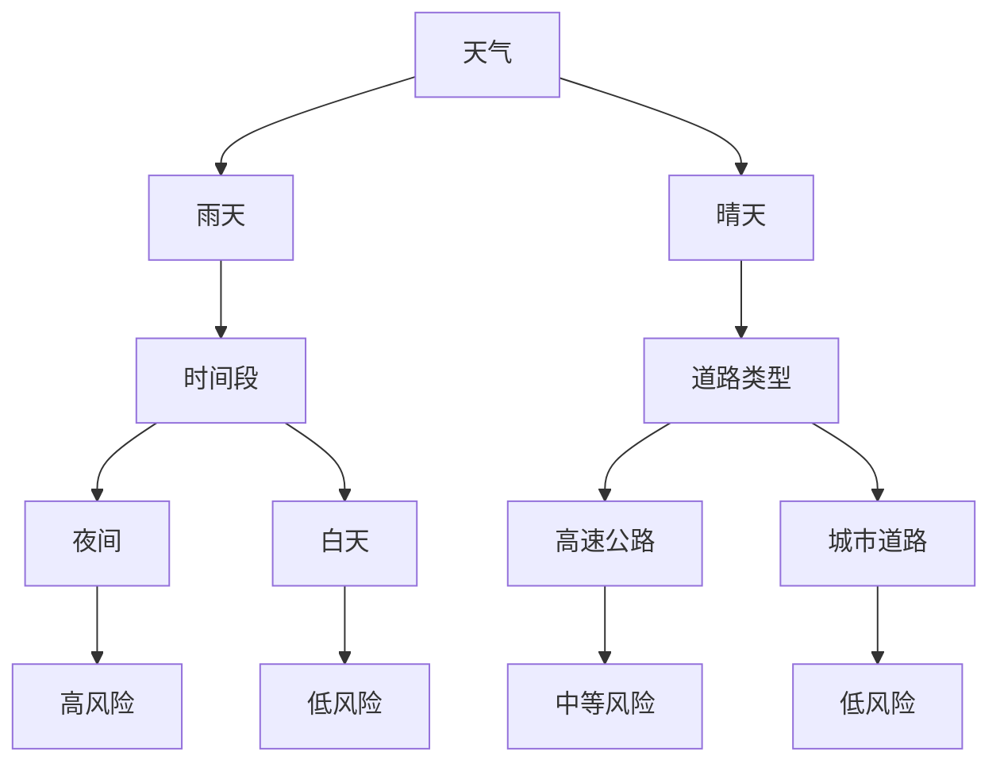

# 基于数据挖掘的交通安全事故分析研究

## 1.背景介绍

### 1.1 交通安全问题概述

交通安全事故一直是全球面临的一个严峻挑战。根据世界卫生组织的数据,每年约120万人死于交通事故,另有数百万人受伤。交通事故不仅造成了巨大的人员伤亡,同时也给社会和经济带来了沉重的负担。因此,有效预防和减少交通事故对于保护人民生命安全、维护社会稳定和促进经济发展至关重要。

交通事故的发生通常是多种因素共同作用的结果,包括驾驶员行为、车辆状况、道路基础设施、天气环境等。传统的事故分析方法往往只关注事故发生的直接原因,难以全面把握事故发生的深层次原因及其内在联系。

### 1.2 数据挖掘在交通安全分析中的应用

随着大数据时代的到来,交通领域积累了大量的历史事故数据、监控数据、天气数据等多源异构数据。如何高效地从海量数据中发现有价值的知识和模式,成为交通安全分析的一个新的挑战和机遇。

数据挖掘技术作为一种从大规模数据中提取隐含信息和知识的过程,为交通安全分析提供了新的思路和方法。通过对交通事故相关数据进行智能分析和建模,可以深入挖掘事故发生的潜在规律,为交通管理部门制定精准的预防措施和决策提供数据支撑。

本文将介绍基于数据挖掘的交通安全事故分析研究的相关理论和方法,并给出具体的案例分析,以期为读者提供一个全面的认识。

## 2.核心概念与联系

### 2.1 数据挖掘概述

数据挖掘(Data Mining)是一门探索性的数据分析方法,旨在从大量的数据中发现有趣的模式、规律和知识。它融合了多个领域的理论和技术,如数据库技术、统计学、机器学习、模式识别等。

数据挖掘过程包括以下几个主要步骤:

1. 数据收集和预处理
2. 数据转换
3. 数据挖掘
4. 模式评估
5. 知识表示

其中,数据挖掘阶段是整个过程的核心,常用的数据挖掘算法和技术包括:

- 关联规则挖掘
- 分类与预测
- 聚类分析
- 异常检测
- 序列模式挖掘

### 2.2 交通安全数据特点

交通安全数据具有以下几个主要特点:

1. **多源异构**:交通安全涉及多个领域,包括车辆、道路、环境、人员等,相关数据来源复杂,格式多样。
2. **时空相关性**:交通事故与时间和地理位置密切相关,呈现明显的时空分布特征。
3. **动态性**:交通系统是一个动态的复杂系统,各个因素相互影响、动态变化。
4. **高维度**:影响交通事故的因素众多,导致相关数据维度很高。
5. **数据不平衡**:事故数据与正常交通数据存在严重的不平衡性。

这些特点给交通安全数据的挖掘与分析带来了新的挑战,需要采用合适的数据预处理和挖掘算法。

### 2.3 数据挖掘在交通安全分析中的作用

将数据挖掘技术应用于交通安全分析,可以发挥以下几个方面的作用:

1. **发现事故潜在规律**:通过关联规则挖掘、序列模式挖掘等技术,可以发现事故发生的潜在规律和风险因素组合。
2. **事故预测与预警**:基于分类和回归模型,可以对潜在事故进行预测,为交通管理提供早期预警。
3. **事故原因分析**:利用聚类分析等无监督学习技术,可以自动发现事故数据的内在模式和类别,深入分析事故发生的原因。
4. **异常检测**:通过异常检测算法,可以及时发现异常的交通事件,为紧急情况做好准备。
5. **辅助决策**:数据挖掘可为交通管理部门制定政策、优化资源配置等决策提供数据支持。

总的来说,数据挖掘为交通安全分析提供了有力的工具和方法,有助于提高交通安全管理的科学性和前瞻性。

## 3.核心算法原理具体操作步骤

在交通安全事故数据挖掘中,常用的核心算法包括关联规则挖掘、决策树分类、聚类分析等,下面将详细介绍它们的原理和具体操作步骤。

### 3.1 关联规则挖掘

#### 3.1.1 算法原理

关联规则挖掘旨在从数据集中发现有趣的关联关系或相关模式。在交通安全领域,它可用于发现事故发生的风险因素组合。

关联规则的形式为:$X \Rightarrow Y$,其中$X$和$Y$分别是数据集中的项目集合,称为前件和后件。规则的支持度(support)表示同时包含$X$和$Y$的记录占总记录的比例;置信度(confidence)表示包含$X$的记录中同时包含$Y$的比例。

挖掘关联规则的关键步骤是发现所有频繁项集,即支持度超过用户指定最小支持度阈值的项集。经典的Apriori算法采用迭代方式逐层产生候选频繁项集,通过剪枝策略减少搜索空间。

#### 3.1.2 具体操作步骤

1. **数据预处理**:对原始交通事故数据进行清洗、转换和整合,构建事务数据集。
2. **确定最小支持度和置信度阈值**:根据应用场景和数据特点设置合适的阈值。
3. **发现频繁项集**:使用Apriori算法或其他优化算法,发现所有支持度超过最小支持度的频繁项集。
4. **生成关联规则**:从频繁项集中产生所有满足最小置信度阈值的关联规则。
5. **规则评估与可视化**:对生成的规则进行统计分析和可视化展示,发现有价值的规则模式。

示例:假设在某城市交通事故数据中发现以下关联规则:

```
{夜间,雨天} => {碰撞} (支持度=0.05,置信度=0.7)
```

该规则表明,在夜间和雨天的情况下,发生碰撞事故的概率较高(置信度为0.7)。这为制定改善夜间和雨天行车安全的对策提供了依据。

### 3.2 决策树分类

#### 3.2.1 算法原理  

决策树是一种常用的监督学习算法,可用于构建事故预测模型。决策树由节点和有向边组成,每个内部节点表示对一个特征的判断,每个分支代表该特征的一个值,而叶节点则对应于一个类别或预测值。

构建决策树的核心是特征选择,每次选择一个最优特征对当前数据集进行分割,使得分割后各子集的纯度提高。常用的特征选择标准包括信息增益(ID3算法)、信息增益比(C4.5算法)和基尼指数(CART算法)等。

决策树的优点是模型可解释性强,缺点是可能出现过拟合问题。因此需要进行适当的剪枝以控制模型复杂度。

#### 3.2.2 具体操作步骤

1. **数据准备**:从交通事故数据中抽取出特征变量(如天气、时间、地点等)和目标变量(是否发生事故)。
2. **数据分割**:将数据集分为训练集和测试集,用于模型训练和评估。
3. **决策树构建**:使用ID3、C4.5或CART等算法构建决策树模型,并根据需要进行剪枝。
4. **模型评估**:在测试集上评估模型的准确性、召回率、F1分数等指标。
5. **模型应用**:将训练好的决策树模型应用于新的数据样本,进行事故风险预测。
6. **结果分析**:分析决策树模型的结构,找出对事故风险影响最大的特征组合。

示例:假设基于某城市交通数据构建的决策树模型如下:



从决策树可以看出,在雨天夜间行车和在晴天高速公路上行车时,发生事故的风险较高。这为制定针对性的交通管理措施提供了依据。

### 3.3 聚类分析

#### 3.3.1 算法原理

聚类分析是一种无监督学习技术,旨在根据数据对象之间的相似性自动将它们划分为若干个聚类。在交通安全领域,聚类分析可用于发现事故数据的内在模式和类别,深入分析事故原因。

常用的聚类算法包括:

- **K-Means**:基于距离的迭代聚类算法,需要预先确定聚类数目$k$。
- **层次聚类**:通过距离矩阵构建层次树状聚类结构。
- **密度聚类**:如DBSCAN算法,根据数据密度分布发现任意形状的聚类。
- **模糊聚类**:每个数据对象都有不同程度的隶属于各个聚类。

选择合适的聚类算法和距离度量方式是聚类分析的关键。

#### 3.2.2 具体操作步骤

1. **数据预处理**:对交通事故数据进行标准化或归一化等预处理,消除量纲影响。
2. **确定聚类数目或参数**:对于K-Means等算法需要预先设定聚类数目,也可通过评价指标(如轮廓系数)自动确定。
3. **聚类计算**:使用选定的聚类算法在数据集上运行,得到各个数据对象的聚类标签。
4. **聚类评估**:计算各聚类的内聚度和外离度等指标,评估聚类质量。
5. **结果分析**:对每个聚类的事故数据进行深入分析,总结各类事故的特征和原因。
6. **可视化展示**:将聚类结果以散点图等形式可视化展示,方便理解和交互分析。

示例:使用DBSCAN算法对某城市交通事故数据进行聚类分析,发现以下三类事故模式:

- 聚类1:夜间、雨雪天气、碰撞事故为主
- 聚类2:工作日早高峰、拥堵路段、追尾事故为主  
- 聚类3:周末、娱乐场所周边、醉驾事故为主

通过对各聚类数据的深入分析,可以发现不同类型事故背后的主要原因,为制定有针对性的交通管理策略提供支持。

## 4.数学模型和公式详细讲解举例说明

在交通安全事故数据挖掘中,常常需要借助数学模型和公式来量化描述事故风险、预测事故发生概率等。下面将介绍几种常用的数学模型。

### 4.1 Logistic回归模型

Logistic回归模型是一种广泛应用于分类问题的概率模型,可用于预测交通事故发生的概率。

假设$X=(x_1,x_2,...,x_n)$为影响事故的$n$个自变量,如天气、时间、车速等;$Y$为因变量,取值为0(未发生事故)或1(发生事故)。Logistic回归模型定义事故发生的概率为:

$$P(Y=1|X)=\frac{1}{1+e^{-z}}$$

其中,

$$z=\beta_0+\beta_1x_1+\beta_2x_2+...+\beta_nx_n$$

$\beta_0,\beta_1,...,\beta_n$是待估计的模型参数。可以使用最大似然估计法求解参数值。

一旦模型训练完