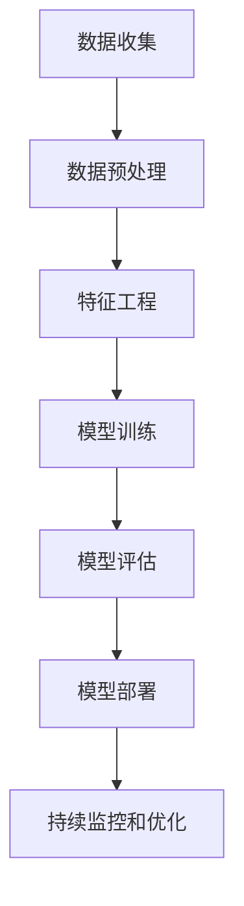

# 基于机器学习的银行信贷评分模型研究

## 1. 背景介绍

### 1.1 信贷评分的重要性

在金融领域中,信贷评分扮演着至关重要的角色。银行和其他金融机构需要准确评估潜在借款人的信用风险,以确保贷款决策的合理性和可持续性。传统的信贷评分方法主要依赖人工评估和统计模型,这种方式存在着主观性、低效率和准确性不足等缺陷。

随着大数据和机器学习技术的快速发展,基于机器学习的信贷评分模型应运而生,为金融机构提供了更加智能、高效和准确的风险评估工具。这种模型可以从海量的历史数据中自动学习模式,捕捉复杂的非线性关系,从而更好地预测借款人的还款能力。

### 1.2 机器学习在信贷评分中的优势

与传统方法相比,基于机器学习的信贷评分模型具有以下优势:

1. **准确性更高**: 机器学习算法能够从大量的历史数据中自动学习复杂的模式,捕捉人工难以发现的细微关联,从而提高评分的准确性。

2. **适应性更强**: 机器学习模型可以持续学习新的数据,自适应地调整模型参数,以适应金融环境的变化。

3. **处理复杂数据**: 机器学习算法可以处理各种类型的数据,包括结构化数据(如人口统计数据)和非结构化数据(如社交媒体数据)。

4. **自动化和高效**: 机器学习模型可以自动化评分过程,大大提高了评估效率,降低了人工成本。

5. **可解释性**: 一些机器学习模型(如决策树)具有较好的可解释性,有助于理解评分决策的原因。

基于以上优势,机器学习在信贷评分领域已经得到了广泛的应用和研究。本文将详细探讨基于机器学习的信贷评分模型的核心概念、算法原理、实践应用及未来发展趋势。

## 2. 核心概念与联系

### 2.1 机器学习概述

机器学习是一种通过利用数据,让计算机系统自主学习和改进的人工智能技术。它的目标是构建能够从数据中自动分析并获取模式的算法和统计模型。机器学习算法可以分为三大类:

1. **监督学习**: 给定一组带有标签的训练数据,算法从中学习模式,并对新的数据进行预测或分类。常见算法包括线性回归、逻辑回归、决策树、随机森林等。

2. **无监督学习**: 算法从未标记的数据中自动发现隐藏的模式和结构。常见算法包括聚类(K-Means)、关联规则挖掘(Apriori)、降维(PCA)等。

3. **强化学习**: 算法通过与环境的交互来学习,目标是最大化长期累积奖励。常见算法包括Q-Learning、Sarsa等。

在信贷评分领域中,主要采用监督学习算法,将历史贷款数据作为训练集,学习借款人的特征与还款能力之间的映射关系,从而对新的申请者进行评分和风险预测。

### 2.2 信贷评分的机器学习流程

基于机器学习的信贷评分模型通常包括以下核心步骤:

1. **数据收集**: 从银行的历史贷款记录、申请者的个人信息、财务状况等多个渠道收集相关数据。

2. **数据预处理**: 对原始数据进行清洗、标准化、缺失值处理等,以确保数据质量。

3. **特征工程**: 从原始数据中提取有意义的特征,构建模型的输入。这是信贷评分模型的关键步骤之一。

4. **模型训练**: 选择合适的机器学习算法,使用训练数据训练模型,获得最优参数。

5. **模型评估**: 使用测试数据评估模型的性能,包括准确性、recall、AUC等指标。

6. **模型部署**: 将训练好的模型集成到银行的信贷系统中,用于实际的贷款申请评分。

7. **持续监控和优化**: 持续监控模型的表现,根据新的数据和反馈调整和优化模型。

在整个流程中,特征工程和模型选择是两个最关键的步骤,直接影响模型的性能和泛化能力。下面将详细介绍常用的机器学习算法及其在信贷评分中的应用。

## 3. 核心算法原理具体操作步骤

在信贷评分领域中,常用的机器学习算法包括逻辑回归、决策树、随机森林、梯度提升树、支持向量机等。下面将分别介绍它们的原理和具体操作步骤。

### 3.1 逻辑回归

逻辑回归是一种广泛使用的分类算法,它可以用于二分类(如是否违约)或多分类(如多个信用等级)问题。其核心思想是通过对数几率(logit)函数将输入特征映射到(0,1)区间,表示样本属于正类的概率。

#### 3.1.1 算法原理

对于二分类问题,逻辑回归模型可表示为:

$$P(Y=1|X) = \sigma(w^TX + b) = \frac{1}{1+e^{-(w^TX+b)}}$$

其中:
- $X$是输入特征向量
- $Y$是二值目标变量(0或1)
- $w$和$b$是模型的权重和偏置参数
- $\sigma(z)$是逻辑sigmoid函数

模型的目标是通过最大似然估计(MLE)找到最优参数$w$和$b$,使得训练数据的对数似然函数最大化:

$$\max_{w,b} \sum_{i=1}^N [y_i\log P(Y=1|X_i) + (1-y_i)\log(1-P(Y=1|X_i))]$$

这可以通过梯度下降法或其他优化算法来求解。

#### 3.1.2 操作步骤

1. 数据预处理:对特征数据进行标准化或归一化处理。
2. 构建模型:初始化权重$w$和偏置$b$,设置学习率和正则化参数。
3. 计算模型输出:对每个样本$X_i$,计算$\hat{y}_i=\sigma(w^TX_i+b)$。
4. 计算损失函数:对数损失函数$L(w,b) = -\sum_{i=1}^N [y_i\log \hat{y}_i + (1-y_i)\log(1-\hat{y}_i)]$。
5. 计算梯度:对$w$和$b$分别计算损失函数的梯度$\frac{\partial L}{\partial w}$和$\frac{\partial L}{\partial b}$。
6. 更新参数:$w \leftarrow w - \alpha \frac{\partial L}{\partial w}$, $b \leftarrow b - \alpha \frac{\partial L}{\partial b}$。
7. 重复步骤3-6,直到收敛或达到最大迭代次数。
8. 使用训练好的模型对新样本进行预测和评分。

逻辑回归是一种简单且解释性强的算法,但对于非线性数据可能效果不佳。下面介绍一种更强大的树模型算法。

### 3.2 决策树

决策树是一种基于树形结构的监督学习算法,它可以用于分类和回归任务。决策树通过递归地对特征空间进行划分,构建一棵决策树,每个内部节点对应一个特征,每个分支对应该特征的一个取值,叶节点对应预测结果。

#### 3.2.1 算法原理

决策树的构建过程是一个递归的特征选择和数据划分的过程。对于每个节点,算法选择一个最优特征,根据该特征的取值将数据划分到相应的子节点,重复这个过程直到满足停止条件(如最大深度或最小样本数)。

特征选择的目标是最大限度地减少数据的杂质(impurity),常用的指标包括信息增益(ID3算法)、信息增益率(C4.5算法)和基尼系数(CART算法)。

对于分类问题,信息增益定义为:

$$\text{Gain}(D, a) = \text{Entropy}(D) - \sum_{v \in \text{Values}(a)} \frac{|D^v|}{|D|} \text{Entropy}(D^v)$$

其中:
- $D$是当前数据集
- $a$是特征
- $\text{Values}(a)$是特征$a$的所有可能取值
- $D^v$是特征$a$取值为$v$的子集
- $\text{Entropy}(D)$是数据集$D$的信息熵,表示数据的杂质程度

算法选择具有最大信息增益的特征作为当前节点的特征。

对于回归问题,通常采用均方差(MSE)或均方根误差(RMSE)作为指标,选择能最小化输出变量的方差的特征。

#### 3.2.2 操作步骤

1. 初始化:将整个数据集作为根节点。
2. 计算每个特征的指标(如信息增益或MSE)。
3. 选择指标最优的特征作为当前节点的特征。
4. 根据该特征的取值,将数据划分到相应的子节点。
5. 对每个子节点,重复步骤2-4,递归构建决策树。
6. 直到满足停止条件,将当前节点标记为叶节点。
7. 对于分类问题,叶节点存储该节点数据的类别占比;对于回归问题,存储该节点数据的均值。
8. 使用构建好的决策树对新样本进行预测。

决策树具有很好的可解释性和高效性,但容易过拟合。下面介绍随机森林算法,它通过集成多棵决策树来提高泛化能力。

### 3.3 随机森林

随机森林是一种基于集成学习的算法,它通过构建多棵决策树,并将它们的预测结果进行投票或平均,从而提高模型的准确性和鲁棒性。

#### 3.3.1 算法原理

随机森林的核心思想是通过两种随机性来减少单棵决策树的过拟合风险:

1. **数据采样**: 对于每棵决策树,从原始数据中有放回地抽取一个子集作为训练集(称为bootstrap采样)。未被选中的数据子集作为该树的out-of-bag(OOB)数据,用于内部估计该树的泛化误差。

2. **特征采样**: 在构建每个决策树节点时,从所有特征中随机选择一个子集,只在这个子集中选择最优特征进行划分。

通过这两种随机性,每棵决策树在训练集和特征空间上都有所不同,从而获得了差异性。最终,随机森林通过对多棵树的预测结果进行投票(分类问题)或平均(回归问题),获得更加鲁棒的预测结果。

#### 3.3.2 操作步骤

1. 初始化:设置树的数量$N$,以及每棵树的最大深度和特征采样比例等超参数。
2. 对于每棵树$i$:
   a. 从原始数据中有放回地抽取一个bootstrap样本作为训练集。
   b. 使用上述决策树算法,在训练集上构建一棵决策树,但在每个节点分裂时只从$m$个随机选择的特征中选择最优特征(其中$m \ll M$,M是总特征数)。
   c. 将OOB数据输入到该树中,计算OOB误差作为该树的内部泛化误差估计。
3. 对于新的测试样本$x$:
   a. 将$x$输入到每棵树中,获得每棵树的预测结果。
   b. 对于分类问题,采用投票法(majority vote)确定最终类别预测。
   c. 对于回归问题,采用所有树的平均预测值作为最终预测结果。

随机森林通过集成多棵决策树,能够显著提高模型的泛化能力和鲁棒性,是信贷评分领域常用的强大算法之一。下面介绍另一种集成算法梯度提升树。

### 3.4 梯度提升树

梯度