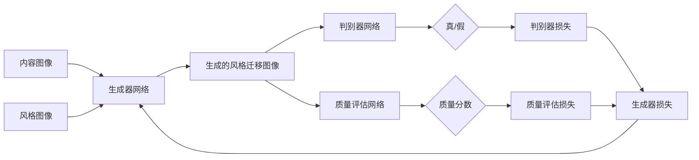
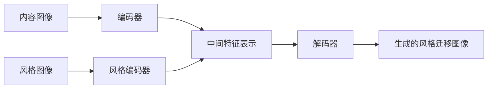
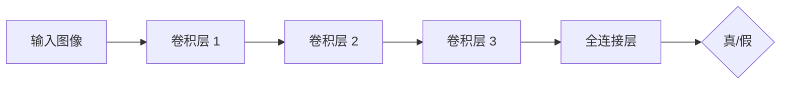
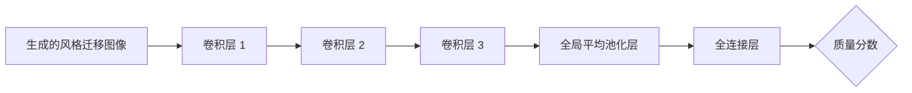

# 基于生成对抗网络和质量评估的图像风格迁移方法

作者：禅与计算机程序设计艺术

## 1. 背景介绍
   
### 1.1 图像风格迁移简介

图像风格迁移是一项令人着迷的计算机视觉任务，旨在将一张图像的风格转移到另一张图像的内容上，同时保留内容图像的语义信息。这种技术融合了两个不同图像的本质特征，生成了一张具有艺术感和创意的新图像。

### 1.2 传统方法的局限性

传统的图像风格迁移方法主要基于纹理合成和色彩迁移等技术，但这些方法往往难以捕捉图像的高层语义信息，生成的图像质量和艺术效果也不尽如人意。此外，这些方法通常需要繁琐的手动调参和优化过程，难以实现端到端的自动化处理。

### 1.3 基于深度学习的图像风格迁移

近年来，随着深度学习技术的飞速发展，特别是卷积神经网络（CNN）在计算机视觉领域取得了诸多突破性进展，基于深度学习的图像风格迁移方法应运而生。这些方法利用CNN强大的特征提取和表示能力，通过优化一个损失函数来实现风格迁移，取得了比传统方法更加出色的效果。

### 1.4 本文的研究重点

尽管基于深度学习的方法已经取得了可喜的成果，但仍然存在一些亟待解决的问题：

1. 如何更好地平衡内容保留和风格迁移，避免过度风格化而损失图像的语义信息。
2. 如何提高生成图像的质量和清晰度，克服模糊、伪影等常见问题。
3. 如何减少训练和推理的计算开销，提高算法的实用性和效率。

本文将重点探讨如何利用生成对抗网络（GAN）和图像质量评估技术来解决上述问题，提出一种新颖的图像风格迁移方法。

## 2. 核心概念与联系

### 2.1 生成对抗网络（GAN）

生成对抗网络由Goodfellow等人于2014年提出，是一种用于生成模型的深度学习架构。GAN由两个子网络组成：生成器（Generator）和判别器（Discriminator）。

- 生成器：接收随机噪声作为输入，并尝试生成与真实数据分布尽可能相似的样本。
- 判别器：接收真实样本和生成样本，并尝试区分它们是真实的还是生成的。

生成器和判别器通过互相博弈的方式进行训练，最终目标是让生成器能够生成以假乱真的样本，而判别器无法分辨真假。

### 2.2 图像风格迁移中的GAN

在图像风格迁移任务中，可以将GAN应用于以下几个方面：

1. 将原始的风格迁移网络作为生成器，以内容图像和风格图像作为输入，生成风格迁移后的图像。

2. 引入判别器网络，鉴别生成图像与真实风格图像的相似程度，指导生成器的优化方向。

3. 通过对抗训练，不断提升生成器的风格迁移效果，同时提高生成图像的真实性和一致性。

### 2.3 图像质量评估

图像质量评估是一项重要的计算机视觉任务，旨在量化和评估图像的视觉质量。传统的图像质量评估方法主要基于人工设计的特征和指标，如峰值信噪比（PSNR）、结构相似性（SSIM）等。

然而，这些传统方法往往难以很好地反映人眼的主观感知。近年来，基于深度学习的图像质量评估方法得到了广泛关注，通过端到端的学习方式，自动提取图像的高层语义特征，更加符合人类视觉感知。

### 2.4 图像质量评估在风格迁移中的应用

在图像风格迁移任务中，引入图像质量评估技术可以带来以下益处：

1. 作为损失函数的一部分，指导风格迁移网络生成高质量、视觉上令人愉悦的图像。

2. 量化评估生成图像的质量，提供客观的性能指标，便于算法的对比和优化。

3. 作为判别器的辅助工具，帮助判别器更好地区分真实图像和生成图像，提高对抗训练的效果。

## 3. 核心算法原理与具体步骤

本节将详细介绍基于生成对抗网络和质量评估的图像风格迁移算法的核心原理和具体步骤。

### 3.1 算法总体框架

算法的总体框架如下图所示：

算法主要包括以下几个关键组件：

- 生成器网络：接收内容图像和风格图像，生成风格迁移后的图像。
- 判别器网络：接收生成图像和真实风格图像，判断它们是真实的还是生成的。
- 质量评估网络：对生成图像进行质量评分，量化其视觉质量。
- 损失函数：包括判别器损失、质量评估损失和生成器损失，指导模型的优化方向。

### 3.2 生成器网络

生成器网络的主要任务是将内容图像的语义信息与风格图像的纹理特征相结合，生成风格迁移后的图像。本文采用一种基于编码器-解码器架构的生成器网络，如下图所示：

具体步骤如下：

1. 内容图像通过编码器网络，提取其高层语义特征。
2. 风格图像通过风格编码器网络，提取其纹理和风格特征。
3. 将内容特征和风格特征在中间层进行融合，得到融合后的特征表示。
4. 融合后的特征通过解码器网络，逐步恢复空间分辨率，生成最终的风格迁移图像。

### 3.3 判别器网络

判别器网络的主要任务是区分生成图像和真实风格图像，为生成器网络提供对抗反馈信号。本文采用一种基于卷积神经网络的判别器架构，如下图所示：

具体步骤如下：

1. 输入图像通过一系列卷积层，提取其局部和全局特征。
2. 卷积层的输出经过全连接层，映射为一个标量值，表示输入图像为真实风格图像的概率。
3. 通过二元交叉熵损失函数，计算判别器的损失，并反向传播更新判别器的参数。

### 3.4 质量评估网络

质量评估网络的主要任务是对生成图像进行质量评分，量化其视觉质量。本文采用一种基于深度卷积神经网络的质量评估架构，如下图所示：

具体步骤如下：

1. 生成的风格迁移图像通过一系列卷积层，提取其高层语义特征。
2. 卷积层的输出经过全局平均池化层，得到固定长度的特征向量。
3. 特征向量通过全连接层，映射为一个标量值，表示生成图像的质量分数。
4. 通过均方误差损失函数，计算质量评估网络的损失，并反向传播更新其参数。

### 3.5 损失函数设计

本文的损失函数由三部分组成：判别器损失、质量评估损失和生成器损失。

- 判别器损失：采用二元交叉熵损失，衡量判别器对真实风格图像和生成图像的区分能力。
- 质量评估损失：采用均方误差损失，衡量质量评估网络对生成图像质量的评估能力。
- 生成器损失：由判别器损失和质量评估损失加权组合而成，指导生成器网络的优化方向。

具体地，生成器损失的数学表达式如下：

$$L_{G} = \lambda_1 L_{adv} + \lambda_2 L_{qa}$$

其中，$L_{adv}$ 表示判别器损失，$L_{qa}$ 表示质量评估损失，$\lambda_1$ 和 $\lambda_2$ 为平衡因子，控制两项损失的权重。

### 3.6 训练过程

算法的训练过程采用交替优化的策略，具体步骤如下：

1. 固定生成器网络的参数，优化判别器网络和质量评估网络，最小化判别器损失和质量评估损失。
2. 固定判别器网络和质量评估网络的参数，优化生成器网络，最小化生成器损失。
3. 重复步骤1和步骤2，直至模型收敛或达到预设的训练轮数。

在训练过程中，采用Adam优化器调整各个网络的参数，学习率设置为0.0001，动量项设置为0.9。

## 4. 数学模型与公式讲解

本节将详细讲解算法中涉及的关键数学模型和公式，并通过实例说明它们的具体应用。

### 4.1 卷积神经网络

卷积神经网络（CNN）是本文算法的基础，广泛应用于生成器、判别器和质量评估网络中。CNN通过局部连接和权重共享的方式，提取图像的局部和全局特征。

假设输入图像为 $X$，卷积核为 $W$，卷积操作可以表示为：

$$(W * X)(i,j) = \sum_m \sum_n W(m,n) X(i-m, j-n)$$

其中，$*$ 表示卷积操作，$(i,j)$ 为输出特征图上的位置索引，$(m,n)$ 为卷积核的大小。

卷积层的输出经过激活函数（如ReLU）和池化操作（如最大池化），得到更高层次的特征表示。多个卷积层的堆叠，可以提取图像的层次化特征。

### 4.2 生成器损失函数

生成器损失函数由判别器损失和质量评估损失组成，其数学表达式为：

$$L_{G} = \lambda_1 L_{adv} + \lambda_2 L_{qa}$$

其中，$L_{adv}$ 为判别器损失，采用二元交叉熵损失：

$$L_{adv} = -\mathbb{E}_{x \sim p_{data}(x)}[\log D(x)] - \mathbb{E}_{z \sim p_z(z)}[\log(1 - D(G(z)))]$$

其中，$x$ 为真实风格图像，$z$ 为随机噪声，$D$ 为判别器网络，$G$ 为生成器网络，$\mathbb{E}$ 表示期望。

$L_{qa}$ 为质量评估损失，采用均方误差损失：

$$L_{qa} = \mathbb{E}_{x \sim p_{data}(x), y \sim p_{data}(y)}[(Q(G(x,y)) - s)^2]$$

其中，$x$ 为内容图像，$y$ 为风格图像，$Q$ 为质量评估网络，$s$ 为真实图像的质量分数（通常设为1）。

### 4.3 判别器损失函数

判别器损失函数采用二元交叉熵损失，其数学表达式为：

$$L_{D} = -\mathbb{E}_{x \sim p_{data}(x)}[\log D(x)] - \mathbb{E}_{z \sim p_z(z)}[\log(1 - D(G(z)))]$$

其中，符号定义与生成器损失函数中一致。

判别