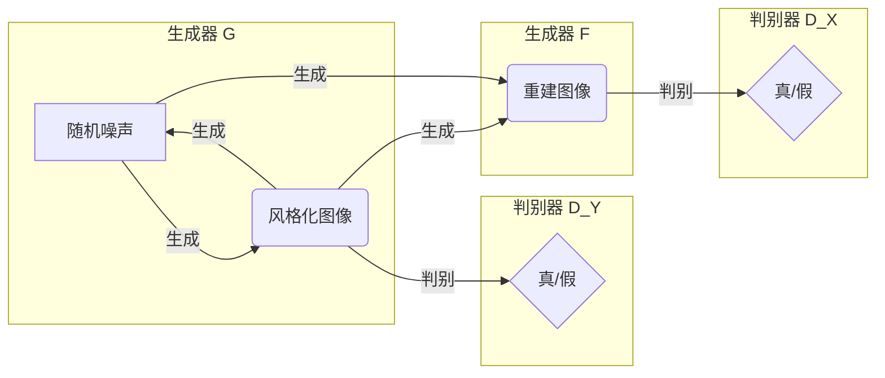

## 1. 背景介绍

### 1.1 人像摄影与风格迁移的艺术碰撞

人像摄影作为一种独特的艺术形式，一直以来都在追求捕捉人物的神韵、情感和故事。摄影师通过镜头语言，运用光影、构图、色彩等元素，赋予照片独特的风格，使其超越简单的记录，升华为具有艺术感染力的作品。近年来，随着人工智能技术的飞速发展，特别是深度学习的兴起，为摄影艺术注入了新的活力，其中最引人注目的应用之一便是**人像摄影风格迁移**。

### 1.2 传统风格迁移方法的局限性

传统的图像风格迁移方法，如基于笔触渲染、图像类比等，通常依赖于人工设计的特征和规则，难以捕捉和迁移复杂多变的摄影风格。例如，要将一张普通的人像照片转换为具有文艺复兴时期油画风格的作品，需要艺术家手动调整画笔大小、颜色、纹理等参数，操作繁琐且难以保证风格一致性。

### 1.3 生成对抗网络（GAN）的突破

生成对抗网络（Generative Adversarial Networks，GAN）作为一种强大的深度学习模型，为解决传统风格迁移方法的局限性提供了新的思路。GAN通过生成器和判别器之间的对抗训练，能够自动学习和生成具有高度真实感的图像，并在图像风格迁移领域取得了突破性进展。

## 2. 核心概念与联系

### 2.1 生成对抗网络（GAN）

#### 2.1.1 GAN的基本原理

GAN的核心思想是通过两个神经网络的对抗训练来生成逼真的数据样本。这两个网络分别是：

* **生成器（Generator）**: 接收随机噪声向量作为输入，通过学习真实数据的分布，生成与真实数据相似的新样本。
* **判别器（Discriminator）**: 接收真实数据和生成数据作为输入，判断输入数据是真实的还是生成的。

#### 2.1.2 GAN的训练过程

在训练过程中，生成器和判别器不断进行博弈：

1. 生成器试图生成能够欺骗判别器的假样本。
2. 判别器试图区分真实样本和生成样本。

通过不断对抗训练，生成器的生成能力逐渐增强，最终能够生成以假乱真的样本。

### 2.2 图像风格迁移（Image Style Transfer）

#### 2.2.1 图像风格迁移的概念

图像风格迁移是指将一张图像的风格特征迁移到另一张图像上，保留内容图像的内容信息，同时赋予其目标图像的风格特征，生成风格化的新图像。

#### 2.2.2 图像风格迁移的应用

图像风格迁移在艺术创作、娱乐、广告等领域具有广泛的应用前景，例如：

* 将照片转换为名画风格，创作艺术作品。
* 将视频转换为卡通风格，制作动画片。
* 将产品图片转换为不同风格，进行广告宣传。

### 2.3 人像摄影风格自动学习与迁移系统

#### 2.3.1 系统目标

本系统旨在利用生成对抗网络技术，实现人像摄影风格的自动学习和迁移。具体目标如下：

* 自动学习不同摄影师或不同艺术流派的摄影风格。
* 将学习到的风格迁移到任意人像照片上，生成风格化的人像照片。
* 提供简单易用的用户界面，方便用户进行风格选择和参数调整。

#### 2.3.2 系统架构

本系统主要由以下模块组成：

* **数据收集与预处理模块**: 负责收集不同风格的人像照片，并进行数据清洗、格式转换、图像增强等预处理操作。
* **风格学习模块**: 利用生成对抗网络，从预处理后的数据中学习不同摄影师或不同艺术流派的摄影风格，并生成相应的风格模型。
* **风格迁移模块**: 接收用户上传的人像照片和选择的风格模型，将学习到的风格迁移到人像照片上，生成风格化的人像照片。
* **用户界面模块**: 提供用户友好的界面，方便用户上传照片、选择风格、调整参数以及下载生成的照片。

## 3. 核心算法原理具体操作步骤

### 3.1 风格学习模块

#### 3.1.1 网络结构

本系统采用基于循环一致性对抗网络（Cycle-Consistent Adversarial Networks, CycleGAN）的风格学习模型，其网络结构如下图所示：



#### 3.1.2 损失函数

CycleGAN 的损失函数由对抗损失、循环一致性损失和身份损失三部分组成:

* **对抗损失**: 用于衡量生成图像与真实图像之间的差距，促使生成器生成更逼真的图像。
* **循环一致性损失**: 用于保证风格迁移后的图像能够被还原回原始图像，避免风格迁移过程中内容信息的丢失。
* **身份损失**: 用于保证输入图像经过风格迁移后，其内容信息保持不变，例如人物的身份、表情等。

#### 3.1.3 训练过程

1. 将不同风格的人像照片分别输入到两个生成器中，生成风格化图像和重建图像。
2. 将生成图像和真实图像分别输入到对应的判别器中，计算对抗损失。
3. 将生成图像输入到另一个生成器中，生成循环重建图像，计算循环一致性损失。
4. 将输入图像输入到自身对应的生成器中，生成身份重建图像，计算身份损失。
5. 根据总损失函数更新生成器和判别器的参数，直至模型收敛。

### 3.2 风格迁移模块

#### 3.2.1 风格迁移过程

1. 用户上传待风格化的人像照片。
2. 用户选择目标风格模型。
3. 将用户上传的照片输入到对应的生成器中，生成风格化的人像照片。
4. 将风格化的人像照片返回给用户。

#### 3.2.2 参数调整

用户可以根据需要调整风格迁移的参数，例如风格强度、平滑度等，以控制生成图像的风格化程度。

## 4. 数学模型和公式详细讲解举例说明

### 4.1 对抗损失

对抗损失用于衡量生成图像与真实图像之间的差距，其数学公式如下：

$$
\begin{aligned}
L_{GAN}(G, D_Y, X, Y) &= \mathbb{E}_{y \sim p_{data}(y)}[\log D_Y(y)] \\
&+ \mathbb{E}_{x \sim p_{data}(x)}[\log (1 - D_Y(G(x)))]
\end{aligned}
$$

其中：

* $G$ 表示生成器。
* $D_Y$ 表示目标域的判别器。
* $X$ 表示源域的数据分布。
* $Y$ 表示目标域的数据分布。

对抗损失的目标是最小化生成图像与真实图像之间的差距，即最小化 $L_{GAN}$。

### 4.2 循环一致性损失

循环一致性损失用于保证风格迁移后的图像能够被还原回原始图像，其数学公式如下：

$$
\begin{aligned}
L_{cyc}(G, F) &= \mathbb{E}_{x \sim p_{data}(x)}[\|F(G(x)) - x\|_1] \\
&+ \mathbb{E}_{y \sim p_{data}(y)}[\|G(F(y)) - y\|_1]
\end{aligned}
$$

其中：

* $F$ 表示将目标域图像转换为源域图像的生成器。

循环一致性损失的目标是最小化循环重建图像与原始图像之间的差距，即最小化 $L_{cyc}$。

### 4.3 身份损失

身份损失用于保证输入图像经过风格迁移后，其内容信息保持不变，其数学公式如下：

$$
\begin{aligned}
L_{idt}(G, F) &= \mathbb{E}_{x \sim p_{data}(x)}[\|G(x) - x\|_1] \\
&+ \mathbb{E}_{y \sim p_{data}(y)}[\|F(y) - y\|_1]
\end{aligned}
$$

身份损失的目标是最小化身份重建图像与原始图像之间的差距，即最小化 $L_{idt}$。

## 5. 项目实践：代码实例和详细解释说明

### 5.1 环境搭建

```
# 安装 Python 3.7
# 安装 PyTorch
pip install torch torchvision torchaudio
# 安装其他依赖库
pip install numpy opencv-python pillow matplotlib tqdm
```

### 5.2 数据集准备

本项目使用 FFHQ 数据集作为训练数据，该数据集包含 70,000 张高分辨率人脸图像。

### 5.3 模型训练

```python
import torch
import torch.nn as nn
from torch.utils.data import DataLoader
from torchvision import transforms
from model import Generator, Discriminator
from dataset import FFHQDataset
from utils import save_checkpoint, load_checkpoint

# 超参数设置
learning_rate = 0.0002
batch_size = 16
num_epochs = 200
image_size = 256
lambda_cycle = 10
lambda_identity = 0.5

# 设备设置
device = torch.device('cuda' if torch.cuda.is_available() else 'cpu')

# 数据集加载
train_dataset = FFHQDataset(root_dir='./data/ffhq', transform=transforms.ToTensor())
train_loader = DataLoader(train_dataset, batch_size=batch_size, shuffle=True)

# 模型实例化
G_XtoY = Generator().to(device)
G_YtoX = Generator().to(device)
D_X = Discriminator().to(device)
D_Y = Discriminator().to(device)

# 优化器和损失函数
optimizer_G = torch.optim.Adam(list(G_XtoY.parameters()) + list(G_YtoX.parameters()), lr=learning_rate)
optimizer_D = torch.optim.Adam(list(D_X.parameters()) + list(D_Y.parameters()), lr=learning_rate)
criterion_GAN = nn.BCELoss()
criterion_cycle = nn.L1Loss()
criterion_identity = nn.L1Loss()

# 训练循环
for epoch in range(num_epochs):
    for real_X, real_Y in train_loader:
        real_X = real_X.to(device)
        real_Y = real_Y.to(device)

        # 训练判别器
        # ...

        # 训练生成器
        # ...

    # 保存模型
    save_checkpoint(G_XtoY, optimizer_G, filename=f'G_XtoY_{epoch + 1}.pth.tar')
    save_checkpoint(G_YtoX, optimizer_G, filename=f'G_YtoX_{epoch + 1}.pth.tar')
    save_checkpoint(D_X, optimizer_D, filename=f'D_X_{epoch + 1}.pth.tar')
    save_checkpoint(D_Y, optimizer_D, filename=f'D_Y_{epoch + 1}.pth.tar')
```

### 5.4 模型测试

```python
import torch
from torchvision import transforms
from PIL import Image
from model import Generator

# 加载模型
device = torch.device('cuda' if torch.cuda.is_available() else 'cpu')
G_XtoY = Generator().to(device)
G_XtoY.load_state_dict(torch.load('G_XtoY_200.pth.tar')['state_dict'])

# 加载图像
image = Image.open('test.jpg').convert('RGB')
transform = transforms.ToTensor()
image = transform(image).unsqueeze(0).to(device)

# 风格迁移
with torch.no_grad():
    fake_Y = G_XtoY(image)

# 保存结果
fake_Y = fake_Y.squeeze(0).permute(1, 2, 0).cpu().numpy()
fake_Y = (fake_Y * 255).astype(np.uint8)
Image.fromarray(fake_Y).save('result.jpg')
```

## 6. 实际应用场景

### 6.1 艺术创作

艺术家可以使用本系统将自己的摄影作品转换为不同的艺术风格，例如油画、水彩、素描等，进行艺术创作和作品展示。

### 6.2 娱乐

用户可以使用本系统将自己的照片转换为卡通、动漫等风格，制作个性化的头像、表情包等，用于社交娱乐。

### 6.3 广告

广告公司可以使用本系统将产品图片转换为不同的风格，例如复古、时尚、科技等，用于产品宣传和品牌推广。

## 7. 工具和资源推荐

### 7.1 深度学习框架

* **PyTorch**: 由 Facebook 人工智能研究院 (FAIR) 开发，是一个开源的深度学习平台，提供了丰富的 API 和工具，方便用户进行模型构建、训练和部署。

### 7.2 数据集

* **FFHQ**: 由 NVIDIA 研究团队发布，包含 70,000 张高分辨率人脸图像，可用于训练和评估人脸识别、人脸生成等模型。

### 7.3 预训练模型

* **CycleGAN**: 在 GitHub 上开源，提供了多种预训练模型，可用于图像风格迁移、图像修复等任务。

## 8. 总结：未来发展趋势与挑战

### 8.1 未来发展趋势

* **更高质量的风格迁移**: 随着深度学习技术的不断发展，未来将出现能够生成更高质量、更逼真风格化图像的模型。
* **更丰富的风格选择**: 未来将出现更多不同类型、不同风格的预训练模型，为用户提供更丰富的风格选择。
* **更智能化的风格控制**: 未来将出现能够根据用户需求，自动调整风格迁移参数，生成更符合用户预期风格化图像的模型。

### 8.2 面临挑战

* **数据需求**: 高质量的风格迁移模型需要大量的训练数据，如何获取和构建大规模、高质量的风格化图像数据集是一个挑战。
* **计算资源**: 训练复杂的深度学习模型需要大量的计算资源，如何降低模型训练的计算成本是一个挑战。
* **伦理问题**: 生成式人工智能技术的发展也带来了一些伦理问题，例如如何防止技术被滥用，如何保护用户隐私等。


## 9. 附录：常见问题与解答

### 9.1 问：什么是生成对抗网络？

**答**: 生成对抗网络（GAN）是一种深度学习模型，由两个神经网络组成：生成器和判别器。生成器试图生成能够欺骗判别器的假样本，而判别器试图区分真实样本和生成样本。通过不断对抗训练，生成器的生成能力逐渐增强，最终能够生成以假乱真的样本。

### 9.2 问：什么是图像风格迁移？

**答**: 图像风格迁移是指将一张图像的风格特征迁移到另一张图像上，保留内容图像的内容信息，同时赋予其目标图像的风格特征，生成风格化的新图像。

### 9.3 问：如何使用本系统进行人像摄影风格迁移？

**答**: 使用本系统进行人像摄影风格迁移非常简单，只需上传待风格化的人像照片，选择目标风格模型，即可生成风格化的人像照片。

### 9.4 问：本系统有哪些应用场景？

**答**: 本系统在艺术创作、娱乐、广告等领域具有广泛的应用前景，例如艺术家可以使用本系统进行艺术创作，用户可以使用本系统制作个性化的头像、表情包等，广告公司可以使用本系统进行产品宣传和品牌推广。
