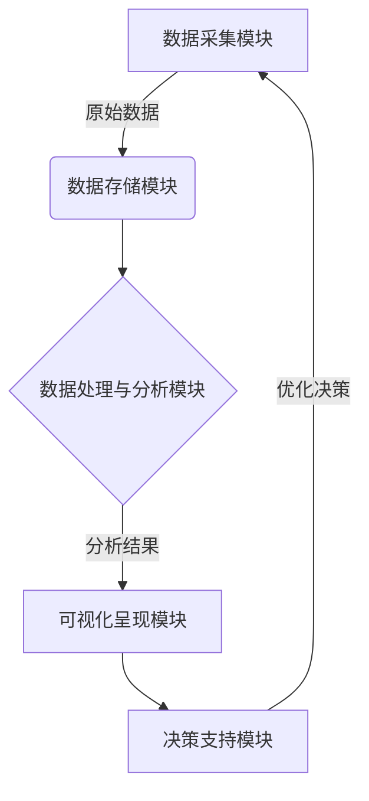
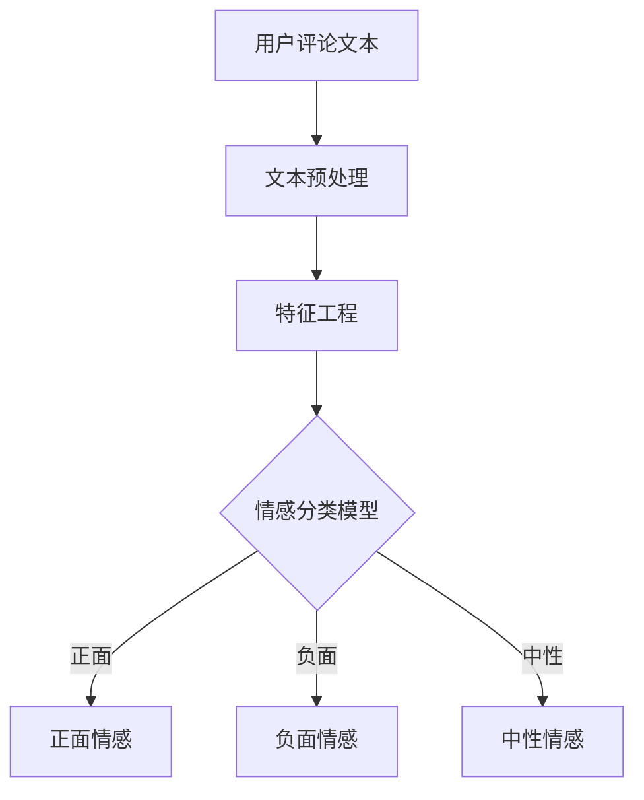
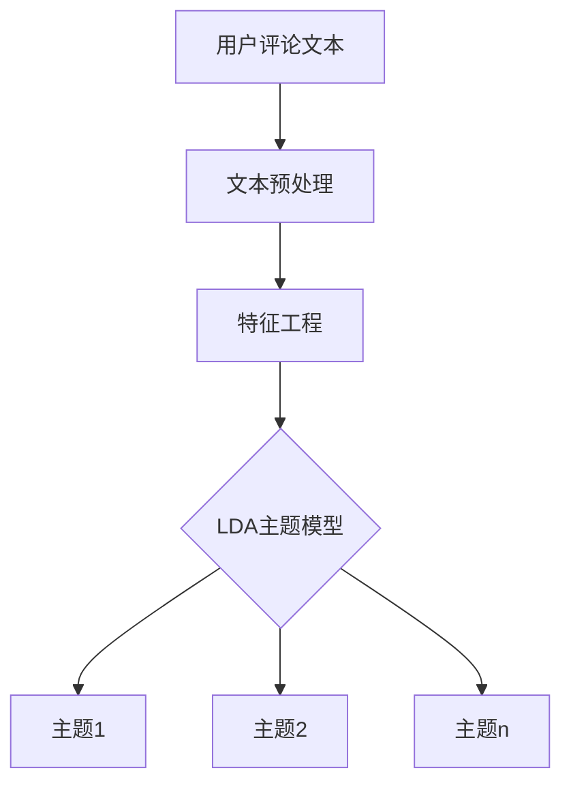
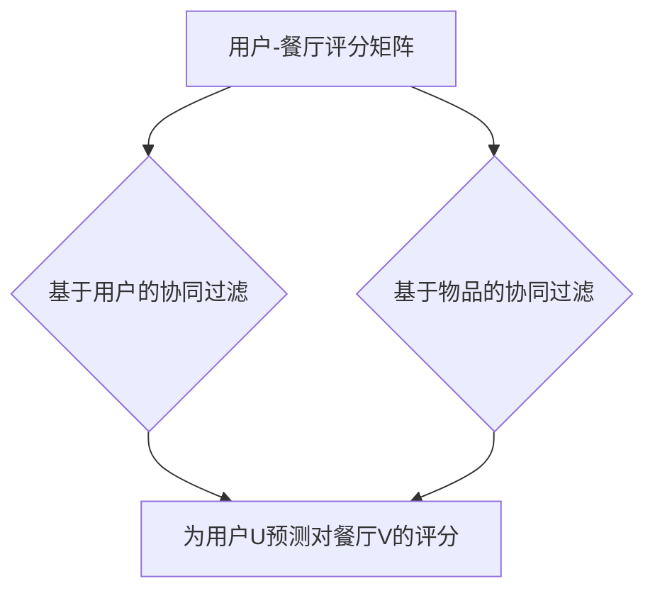
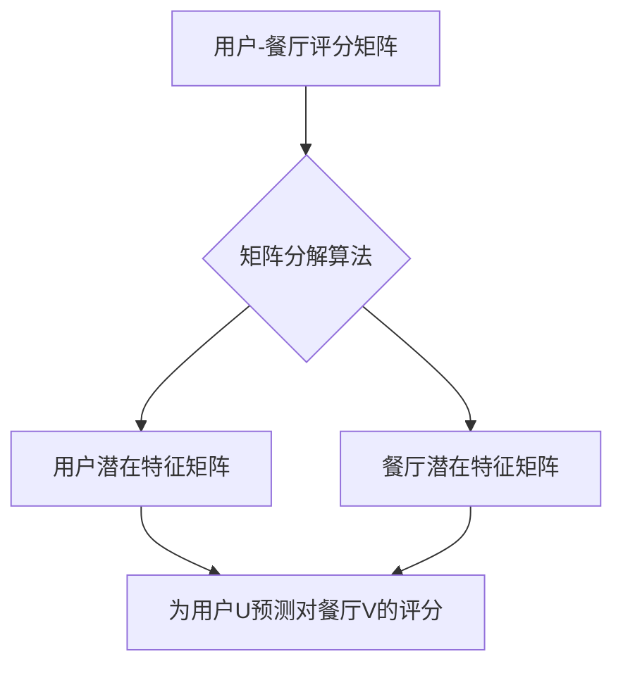
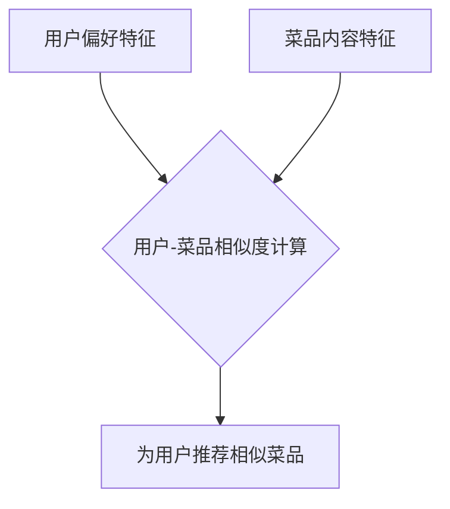

# 基于用户评价体系改善餐饮业经营的分析与应用研究

## 1.背景介绍

### 1.1 餐饮业的重要性

餐饮业是服务业的重要组成部分,在促进经济发展、满足人民生活需求、增加就业等方面发挥着重要作用。随着人们生活水平的不断提高,对餐饮服务质量的要求也越来越高。如何提升餐饮服务质量,增强顾客满意度,成为餐饮企业面临的重大挑战。

### 1.2 传统餐饮服务评价方式的不足

传统的餐饮服务评价方式主要依赖于顾客反馈、经理巡视等方式,存在以下几个缺陷:

1. 评价数据来源单一、覆盖面较窄
2. 评价过程主观性较强,缺乏量化指标
3. 反馈延迟,难以及时发现并改正问题

### 1.3 用户评价体系的重要意义

基于大数据和人工智能技术,构建科学的用户评价体系,可以克服传统评价方式的不足,全面客观地评估餐饮服务质量,为餐饮企业持续改进服务质量提供数据支撑和分析依据。

## 2.核心概念与联系

### 2.1 用户评价体系

用户评价体系是指通过多种渠道收集用户对餐饮服务的评价数据,并基于大数据分析和人工智能技术对这些数据进行处理、分析和可视化呈现,为餐饮企业提供决策支持的一整套系统解决方案。

它主要包括以下几个核心模块:

1. 数据采集模块
2. 数据存储模块 
3. 数据处理与分析模块
4. 可视化呈现模块
5. 决策支持模块

这些模块相互关联、协同工作,形成了一个完整的闭环体系。



### 2.2 大数据技术

大数据技术是用户评价体系的技术基础,涵盖了数据采集、存储、处理和分析等多个环节,主要包括:

- 分布式存储系统(HDFS、HBase等)
- 分布式计算框架(MapReduce、Spark等)  
- 数据处理工具(Hive、Pig等)
- 数据可视化工具(ECharts等)

### 2.3 人工智能技术

人工智能技术在用户评价体系中发挥了重要作用,主要包括:

- 自然语言处理(NLP):对用户评论进行分析挖掘
- 机器学习算法:构建评分预测模型
- 知识图谱:构建餐饮领域知识库
- 推荐系统:个性化菜品/套餐推荐

## 3.核心算法原理具体操作步骤  

用户评价体系涉及了多种算法和技术,其核心算法主要包括:

### 3.1 文本分析算法

用于对用户评论文本进行情感分析、主题提取等,主要算法有:

1. **情感分析算法**



步骤说明:

- 文本预处理:分词、去停用词等
- 特征工程:将文本转化为特征向量
- 情感分类模型:监督学习训练,常用算法有Naïve Bayes、SVM、LSTM等

2. **主题模型算法**



步骤说明:

- 文本预处理:分词、去停用词等
- 特征工程:将文本转化为词频向量
- LDA主题模型:无监督学习,发现评论文本主题

### 3.2 评分预测算法

用于根据用户评论、历史评分等数据预测餐厅的综合评分,主要算法有:

1. **协同过滤算法**



步骤说明:

- 计算用户(或物品)之间的相似度
- 根据相似用户(或相似物品)的历史评分,预测目标用户对目标物品的评分

2. **矩阵分解算法**



步骤说明:

- 将评分矩阵分解为用户潜在特征矩阵和物品潜在特征矩阵
- 根据用户和物品的潜在特征,计算预测评分

### 3.3 推荐算法

用于根据用户偏好、菜品特征等信息为用户推荐感兴趣的菜品或套餐,主要算法有:

1. **协同过滤算法**

参见评分预测算法中的协同过滤算法

2. **基于内容的推荐算法**



步骤说明:

- 提取用户偏好特征和菜品内容特征
- 计算用户和菜品之间的相似度
- 推荐与用户偏好相似的菜品

## 4.数学模型和公式详细讲解举例说明

### 4.1 文本向量化

将文本转化为向量形式是文本分析算法的基础,常用的方法有:

1. **One-hot编码**

对于词汇表$V=\{w_1,w_2,...,w_n\}$,每个单词$w_i$用一个n维向量$x_i$表示,其中只有第i个元素为1,其余元素为0。

$$x_i = (0,0,...,1,...,0)$$

2. **TF-IDF向量**

考虑单词在文档中的词频(Term Frequency)和逆文档频率(Inverse Document Frequency):

$$\mathrm{tfidf}(w,d) = \mathrm{tf}(w,d) \times \log{\frac{N}{\mathrm{df}(w)}}$$

其中:
- $\mathrm{tf}(w,d)$是单词$w$在文档$d$中出现的次数
- $N$是文档总数
- $\mathrm{df}(w)$是包含单词$w$的文档数量

3. **Word Embedding**

利用Word2Vec、Glove等模型将单词映射到低维连续向量空间,语义相近的单词在向量空间上距离也相近。

### 4.2 文本分类模型

常用的文本分类模型有:

1. **朴素贝叶斯分类器**

基于贝叶斯定理和单词条件独立假设,对给定文档$d$分类为$c_k$的概率为:

$$P(c_k|d)=\frac{P(c_k)P(d|c_k)}{P(d)}$$

其中:
- $P(c_k)$为先验概率
- $P(d|c_k)$为条件概率,根据单词条件独立假设计算

2. **支持向量机分类器**

将文本向量映射到高维空间,并找到一个超平面将不同类别的文本分开,超平面方程为:

$$\vec{w}^T\vec{x}+b=0$$

目标是最大化不同类别实例到超平面的距离,即最大化几何间隔:

$$\gamma = \min_{x_i}\frac{|w^Tx_i+b|}{||w||_2}$$

3. **循环神经网络分类器**

利用循环神经网络(RNN)或长短期记忆网络(LSTM)对文本序列进行建模,捕捉上下文语义信息:

$$h_t = \mathcal{F}(x_t, h_{t-1})$$

其中$\mathcal{F}$是RNN或LSTM的递归函数,输出分类概率通过Softmax层得到。

### 4.3 协同过滤算法

以基于用户的协同过滤算法为例,预测用户u对物品i的评分$r_{ui}$:

1. 计算用户u与其他用户v的相似度,常用的相似度度量有余弦相似度、皮尔逊相关系数等。

2. 根据u的k个最相似用户对物品i的评分,计算u对i的预测评分:

$$r_{ui}=\overline{r_u}+\frac{\sum\limits_{v\in N(u,k)}sim(u,v)(r_{vi}-\overline{r_v})}{\sum\limits_{v\in N(u,k)}sim(u,v)}$$

其中:
- $\overline{r_u}$是用户u的平均评分
- $N(u,k)$是u的k个最相似用户集合
- $sim(u,v)$是u与v的相似度

### 4.4 矩阵分解算法

将用户-物品评分矩阵$R$分解为两个低秩矩阵$U$和$V$的乘积:

$$R\approx UV^T$$

其中$U$是用户潜在特征矩阵,每一行对应一个用户的潜在特征向量,而$V$是物品潜在特征矩阵。

通过优化目标函数求解$U$和$V$的值:

$$\min\limits_{U,V}\sum\limits_{(u,i)\in R}(r_{ui}-(UV^T)_{ui})^2+\lambda(||U||_F^2+||V||_F^2)$$

其中$\lambda$是正则化系数,用于避免过拟合。

预测用户u对物品i的评分为:

$$\hat{r}_{ui}=(UV^T)_{ui}$$

## 4.项目实践:代码实例和详细解释说明

这里以一个基于Spark的餐厅评分预测项目为例,展示核心代码和实现细节。

### 4.1 数据预处理

```python
from pyspark.sql.functions import col, explode, split

# 加载评论数据
reviews = spark.read.json("reviews.json")

# 分词和去停用词
tokenized = reviews \
    .select(col("user_id"), col("business_id"), col("text")) \
    .withColumn("tokens", split(col("text"), "\\s+")) \
    .withColumn("tokens", explode("tokens")) \
    .dropna(subset=["tokens"]) \
    .filter("tokens != ''")

# 保存分词结果
tokenized.write.mode("overwrite").parquet("tokenized")
```

说明:

- 首先加载原始评论数据reviews.json
- 对评论文本进行分词和去停用词操作
- 将分词结果保存为Parquet文件

### 4.2 文本特征提取

```python
from pyspark.ml.feature import HashingTF, IDF, IDFModel

# 加载分词数据
tokenized = spark.read.parquet("tokenized")

# 构建TF-IDF向量化器
hashingTF = HashingTF(inputCol="tokens", outputCol="rawFeatures")
idf = IDF(inputCol="rawFeatures", outputCol="features")

# 计算IDF
idfModel = idf.fit(hashingTF.transform(tokenized))

# 保存IDF模型
idfModel.write().overwrite().save("idfModel")
```

说明:

- 加载分词后的评论数据
- 使用HashingTF计算词频(TF)特征
- 使用IDF计算逆文档频率并训练IDF模型
- 保存IDF模型以备将来使用

### 4.3 协同过滤评分预测

```python
from pyspark.ml.recommendation import ALS

# 加载评分数据
ratings = spark.read.parquet("ratings.parquet")

# 划分训练集和测试集
train, test = ratings.randomSplit([0.8, 0.2])  

# 训练ALS模型
als = ALS(maxIter=10, rank=50, regParam=0.05, userCol="user_id", 
          itemCol="business_id", ratingCol="rating")
alsModel = als.fit(train)

# 评估模型
predictions = alsModel.transform(test)
rmse = evalu