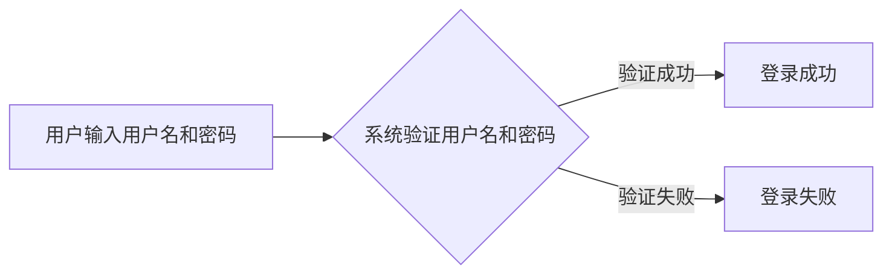
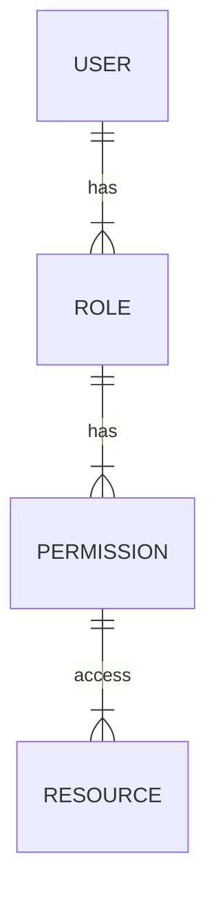
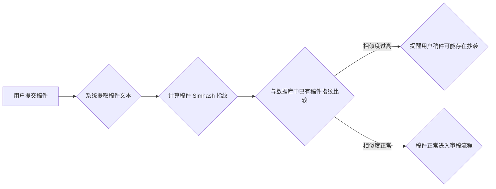
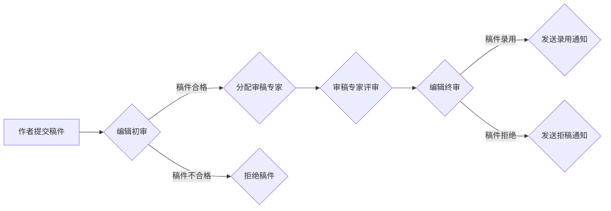

## 基于网络的电子期刊投稿系统设计与实现

作者：禅与计算机程序设计艺术

## 1. 引言

### 1.1  期刊投稿的数字化转型趋势
随着互联网技术的飞速发展和普及，传统纸质期刊出版模式面临着严峻的挑战。信息传播速度慢、出版周期长、印刷成本高、受众范围受限等问题日益凸显。为了适应时代发展潮流，越来越多的期刊选择数字化转型，将投稿、审稿、出版等环节迁移至网络平台，以提高效率、降低成本、扩大影响力。

### 1.2 电子期刊投稿系统的意义
电子期刊投稿系统作为期刊数字化转型的核心平台，为作者、审稿专家、编辑和读者提供了一个便捷、高效、安全的在线交流和协作平台。它不仅简化了投稿流程，提高了审稿效率，还促进了学术交流，提升了期刊的学术质量和影响力。

### 1.3 本文研究内容和目标
本文旨在设计和实现一个功能完善、安全可靠、易于维护的基于网络的电子期刊投稿系统，以满足现代期刊出版的需求。文章将从系统需求分析、系统设计、系统实现、系统测试等方面进行详细阐述，并结合实际案例进行分析，以期为相关领域的开发者提供参考。


## 2. 核心概念与联系

### 2.1 用户角色与权限
系统涉及的用户角色主要包括：

* **作者:**  提交稿件、查看稿件状态、修改稿件、与编辑交流等。
* **审稿专家:**  接收审稿邀请、查看稿件、提交审稿意见、与编辑交流等。
* **编辑:**  管理稿件、分配审稿专家、处理稿件状态、与作者和审稿专家交流等。
* **管理员:**  管理用户、管理期刊信息、系统维护等。

不同角色拥有不同的权限，以确保系统安全和数据安全。

### 2.2 稿件状态流转
稿件从提交到最终发表，需要经历一系列状态变化，例如：

* **已提交:**  作者提交稿件后，稿件处于“已提交”状态。
* **审稿中:**  编辑分配审稿专家后，稿件状态变为“审稿中”。
* **审稿完成:**  所有审稿专家完成审稿后，稿件状态变为“审稿完成”。
* **修改中:**  编辑根据审稿意见要求作者修改稿件，稿件状态变为“修改中”。
* **已接受:**  编辑接受稿件后，稿件状态变为“已接受”。
* **已拒绝:**  编辑拒绝稿件后，稿件状态变为“已拒绝”。
* **已发表:**  稿件正式发表后，稿件状态变为“已发表”。

稿件状态流转是系统设计的核心流程之一，需要保证其严谨性和可靠性。

### 2.3 核心功能模块
系统主要包括以下功能模块：

* **用户管理模块:**  实现用户注册、登录、信息修改、密码找回等功能。
* **稿件管理模块:**  实现稿件提交、稿件审核、稿件修改、稿件查询、稿件统计等功能。
* **审稿管理模块:**  实现审稿专家邀请、审稿意见提交、审稿结果反馈等功能。
* **期刊管理模块:**  实现期刊信息管理、栏目管理、稿件类型管理等功能。
* **系统管理模块:**  实现系统参数设置、日志管理、数据备份等功能。

## 3. 核心算法原理具体操作步骤

### 3.1 用户认证与授权

系统采用基于角色的访问控制（RBAC）机制实现用户认证和授权。

* **用户认证:**  系统采用用户名和密码的方式进行用户身份验证。用户登录时，系统将用户输入的用户名和密码与数据库中存储的用户信息进行比对，如果匹配则允许用户登录，否则拒绝登录。
* **用户授权:**  系统根据用户的角色分配不同的权限。例如，作者只能访问和操作自己的稿件，而编辑可以访问和操作所有稿件。

#### 3.1.1 用户登录流程图



#### 3.1.2  RBAC 模型图



### 3.2 稿件查重

系统采用基于文本相似度的算法实现稿件查重功能，以防止学术不端行为。

#### 3.2.1 Simhash 算法

Simhash 算法是一种常用的文本相似度计算算法，其基本原理是将文本转换为一个固定长度的指纹，然后通过比较指纹的汉明距离来判断文本的相似度。

1. **分词:** 将文本切分成词语序列。
2. **计算词语权重:**  使用 TF-IDF 等算法计算每个词语的权重。
3. **生成词语向量:**  将每个词语转换为一个固定维度的向量，例如使用 Word2Vec 算法。
4. **加权求和:**  将所有词语向量加权求和，得到文本向量。
5. **降维:**  将文本向量降维到固定长度，例如使用哈希函数。

#### 3.2.2  稿件查重流程图



### 3.3 审稿流程管理

系统采用双盲审稿机制，确保审稿的公平性和客观性。

* **双盲审稿:**  作者和审稿专家互相不知道对方身份。
* **审稿流程:**  编辑将稿件分配给多个审稿专家进行评审，审稿专家根据评审标准给出评审意见，编辑根据评审意见决定稿件的录用情况。

#### 3.3.1 审稿流程图



## 4. 数学模型和公式详细讲解举例说明

### 4.1 TF-IDF 算法

TF-IDF（Term Frequency-Inverse Document Frequency）是一种用于信息检索与文本挖掘的常用加权技术。它是一种统计方法，用以评估一字词对于一个文件集或一个语料库中的其中一份文件的重要程度。字词的重要性随着它在文件中出现的次数成正比增加，但同时会随着它在语料库中出现的频率成反比下降。

**TF（词频）：**  指某个词在当前文档中出现的频率，计算公式如下：

```
TF(t, d) = count(t, d) / len(d)
```

其中，t 表示词语，d 表示文档，count(t, d) 表示词语 t 在文档 d 中出现的次数，len(d) 表示文档 d 的长度。

**IDF（逆文档频率）：**  用于衡量词语在语料库中的重要程度，计算公式如下：

```
IDF(t) = log(N / DF(t))
```

其中，N 表示语料库中文档总数，DF(t) 表示包含词语 t 的文档数量。

**TF-IDF 值：**  将词频和逆文档频率相乘，得到词语的 TF-IDF 值，计算公式如下：

```
TF-IDF(t, d) = TF(t, d) * IDF(t)
```

TF-IDF 值越高，表示词语对文档的重要性越高。

**示例：**

假设我们有一个包含 1000 篇文档的语料库，其中包含词语 "人工智能" 的文档数量为 100 篇，一篇文档的长度为 1000 个词语，其中词语 "人工智能" 出现了 10 次。

则词语 "人工智能" 在该文档中的 TF 值为：

```
TF("人工智能", d) = 10 / 1000 = 0.01
```

词语 "人工智能" 的 IDF 值为：

```
IDF("人工智能") = log(1000 / 100) = 2.303
```

词语 "人工智能" 在该文档中的 TF-IDF 值为：

```
TF-IDF("人工智能", d) = 0.01 * 2.303 = 0.023
```

### 4.2  余弦相似度

余弦相似度是一种常用的向量空间模型，用于衡量两个向量之间的相似度。其计算公式如下：

```
similarity(A, B) = (A · B) / (||A|| * ||B||)
```

其中，A 和 B 表示两个向量，· 表示向量点积，||A|| 表示向量 A 的模长。

余弦相似度的取值范围为 [-1, 1]，值越接近 1，表示两个向量越相似，值越接近 -1，表示两个向量越不相似。

**示例：**

假设有两个向量 A = (1, 2, 3) 和 B = (4, 5, 6)。

则向量 A 和 B 的点积为：

```
A · B = 1 * 4 + 2 * 5 + 3 * 6 = 32
```

向量 A 的模长为：

```
||A|| = sqrt(1^2 + 2^2 + 3^2) = 3.742
```

向量 B 的模长为：

```
||B|| = sqrt(4^2 + 5^2 + 6^2) = 8.775
```

则向量 A 和 B 的余弦相似度为：

```
similarity(A, B) = 32 / (3.742 * 8.775) = 0.992
```

## 5. 项目实践：代码实例和详细解释说明

### 5.1  技术架构

系统采用前后端分离的架构设计，前端使用 Vue.js 框架实现，后端使用 Spring Boot 框架实现，数据库使用 MySQL。

#### 5.1.1 系统架构图

```mermaid
graph LR
A[浏览器] --> B{前端 (Vue.js)}
B --> C{后端 (Spring Boot)}
C --> D{数据库 (MySQL)}
```

### 5.2 代码实例

#### 5.2.1 用户登录接口

```java
@RestController
@RequestMapping("/api/user")
public class UserController {

    @Autowired
    private UserService userService;

    @PostMapping("/login")
    public Result login(@RequestBody UserLoginDTO userLoginDTO) {
        User user = userService.findByUsername(userLoginDTO.getUsername());
        if (user == null) {
            return Result.error("用户名不存在");
        }
        if (!user.getPassword().equals(userLoginDTO.getPassword())) {
            return Result.error("密码错误");
        }
        return Result.success(user);
    }
}
```

#### 5.2.2 稿件提交接口

```java
@RestController
@RequestMapping("/api/manuscript")
public class ManuscriptController {

    @Autowired
    private ManuscriptService manuscriptService;

    @PostMapping("/submit")
    public Result submit(@RequestBody ManuscriptDTO manuscriptDTO) {
        Manuscript manuscript = new Manuscript();
        BeanUtils.copyProperties(manuscriptDTO, manuscript);
        manuscriptService.save(manuscript);
        return Result.success();
    }
}
```

## 6. 实际应用场景

### 6.1  高校学报

高校学报可以利用电子期刊投稿系统实现稿件在线提交、审稿、编辑、出版等全流程管理，提高办刊效率和学术水平。

### 6.2  学术会议

学术会议可以使用电子期刊投稿系统征集论文，并进行在线评审和反馈，方便快捷地完成会议论文的评审工作。

### 6.3  企事业单位期刊

企事业单位可以利用电子期刊投稿系统搭建内部期刊平台，方便员工投稿、交流和学习，提升企业文化建设水平。

## 7. 总结：未来发展趋势与挑战

### 7.1  发展趋势

* **人工智能技术应用:**  未来电子期刊投稿系统将更加智能化，例如利用自然语言处理技术实现稿件自动分类、自动审稿等功能。
* **移动化趋势:**  随着移动互联网的发展，电子期刊投稿系统将更加便捷化，例如开发手机 APP，方便作者随时随地投稿和查看稿件状态。
* **数据挖掘与分析:**  电子期刊投稿系统将积累大量的稿件数据，利用数据挖掘技术可以发现学术热点、预测研究趋势，为期刊发展提供决策支持。

### 7.2  挑战

* **网络安全:**  电子期刊投稿系统存储着大量的稿件信息，需要加强网络安全防护，防止数据泄露和系统攻击。
* **学术道德:**  电子期刊投稿系统需要建立健全的学术道德规范，防止学术不端行为的发生。
* **用户体验:**  电子期刊投稿系统需要不断优化用户体验，提高用户满意度。

## 8. 附录：常见问题与解答

### 8.1  问：稿件提交后多久可以收到回复？

答：稿件提交后，编辑会尽快进行初审，一般会在 3 个工作日内给出回复。如果稿件通过初审，则会进入审稿流程，审稿时间一般为 2-4 周。

### 8.2  问：如何修改稿件？

答：如果稿件需要修改，编辑会通过系统发送修改意见给作者。作者登录系统后，可以查看修改意见并进行修改。修改完成后，需要重新提交稿件。

### 8.3  问：如何联系编辑？

答：作者可以通过系统发送消息给编辑，也可以在稿件页面留言给编辑。