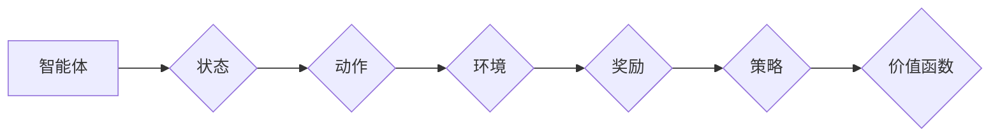

## 1. 背景介绍

### 1.1 人工智能与机器学习

人工智能 (AI) 的目标是使机器能够像人类一样思考和行动。机器学习 (ML) 是人工智能的一个子领域，它使机器能够从数据中学习，而无需进行明确的编程。近年来，机器学习取得了显著的进展，并在各个领域得到广泛应用，例如图像识别、自然语言处理和机器人技术。

### 1.2 增强学习：一种独特的学习范式

增强学习 (RL) 是一种独特的机器学习范式，它专注于训练**智能体 (Agent)** 在与**环境 (Environment)** 交互的过程中学习最佳行为策略。与其他机器学习方法不同，增强学习不依赖于预先标记的数据集。相反，它通过**试错 (Trial and Error)** 的方式学习，并根据环境的反馈不断优化其策略。

### 1.3 增强学习的应用

增强学习已成功应用于各种领域，包括：

- **游戏**:  AlphaGo 和 OpenAI Five 分别在围棋和 Dota 2 等复杂游戏中战胜了人类世界冠军。
- **机器人**: 增强学习被用于训练机器人执行各种任务，例如抓取物体、导航和控制。
- **自动驾驶**: 增强学习可以用于开发自动驾驶汽车，使其能够在复杂的路况中安全行驶。
- **医疗保健**: 增强学习可用于个性化治疗方案，优化药物剂量，并改善患者护理。
- **金融**: 增强学习可用于开发算法交易策略，优化投资组合，并管理风险。

## 2. 核心概念与联系

### 2.1 智能体与环境

- **智能体 (Agent)**:  是增强学习系统的核心，它通过与环境交互来学习和执行动作。智能体可以是任何实体，例如机器人、软件程序或虚拟角色。
- **环境 (Environment)**:  智能体所处的外部世界，它可以是真实的物理世界，也可以是模拟环境。环境会根据智能体的动作提供反馈，例如奖励或惩罚。

### 2.2 状态、动作和奖励

- **状态 (State)**:  描述环境在特定时间点的状况，例如机器人的位置和速度，或游戏中的棋盘布局。
- **动作 (Action)**:  智能体可以执行的操作，例如移动、抓取或选择。
- **奖励 (Reward)**:  环境对智能体动作的反馈，它可以是正面的（奖励）或负面的（惩罚）。奖励的目标是引导智能体学习最佳行为策略。

### 2.3 策略和价值函数

- **策略 (Policy)**:  智能体根据当前状态选择动作的规则，它可以是确定性的（根据状态总是选择相同的动作）或随机性的（根据概率分布选择动作）。
- **价值函数 (Value Function)**:  预测智能体在特定状态下采取特定策略所能获得的长期累积奖励，它可以用于评估策略的好坏。

### 2.4 核心概念之间的联系



## 3. 核心算法原理具体操作步骤

### 3.1 基于价值的算法

#### 3.1.1 Q-learning 算法

Q-learning 是一种基于价值的算法，它使用 Q 表来存储每个状态-动作对的价值。算法通过迭代更新 Q 表来学习最佳策略。

**操作步骤:**

1. 初始化 Q 表，将所有状态-动作对的价值设置为 0。
2. 循环执行以下步骤，直到收敛：
    - 观察当前状态 $s$。
    - 根据当前策略选择动作 $a$。
    - 执行动作 $a$，并观察新的状态 $s'$ 和奖励 $r$。
    - 更新 Q 表中的对应值:  $Q(s, a) \leftarrow Q(s, a) + \alpha [r + \gamma \max_{a'} Q(s', a') - Q(s, a)]$，其中 $\alpha$ 是学习率，$\gamma$ 是折扣因子。
3. 最终的 Q 表包含了每个状态-动作对的最佳价值，可以用于推导出最佳策略。

#### 3.1.2 SARSA 算法

SARSA (State-Action-Reward-State-Action) 是一种 on-policy 的基于价值的算法，它使用 Q 表来存储每个状态-动作对的价值。算法通过迭代更新 Q 表来学习最佳策略。

**操作步骤:**

1. 初始化 Q 表，将所有状态-动作对的价值设置为 0。
2. 循环执行以下步骤，直到收敛：
    - 观察当前状态 $s$。
    - 根据当前策略选择动作 $a$。
    - 执行动作 $a$，并观察新的状态 $s'$ 和奖励 $r$。
    - 根据当前策略选择新的动作 $a'$。
    - 更新 Q 表中的对应值:  $Q(s, a) \leftarrow Q(s, a) + \alpha [r + \gamma Q(s', a') - Q(s, a)]$，其中 $\alpha$ 是学习率，$\gamma$ 是折扣因子。
3. 最终的 Q 表包含了每个状态-动作对的最佳价值，可以用于推导出最佳策略。

### 3.2 基于策略的算法

#### 3.2.1 策略梯度算法

策略梯度算法直接学习策略，而不是价值函数。算法通过迭代更新策略参数来最大化预期累积奖励。

**操作步骤:**

1. 初始化策略参数 $\theta$。
2. 循环执行以下步骤，直到收敛：
    - 使用当前策略 $\pi_{\theta}$ 收集一系列轨迹（状态、动作、奖励序列）。
    - 计算每个轨迹的累积奖励。
    - 更新策略参数 $\theta$，以最大化预期累积奖励:  $\theta \leftarrow \theta + \alpha \nabla_{\theta} J(\theta)$，其中 $\alpha$ 是学习率，$J(\theta)$ 是预期累积奖励。
3. 最终的策略参数 $\theta$ 对应于最佳策略。

#### 3.2.2 Actor-Critic 算法

Actor-Critic 算法结合了基于价值和基于策略的方法。它使用两个神经网络：Actor 网络学习策略，Critic 网络学习价值函数。算法通过迭代更新 Actor 和 Critic 网络的参数来学习最佳策略。

**操作步骤:**

1. 初始化 Actor 网络参数 $\theta$ 和 Critic 网络参数 $\phi$。
2. 循环执行以下步骤，直到收敛：
    - 使用 Actor 网络 $\pi_{\theta}$ 收集一系列轨迹（状态、动作、奖励序列）。
    - 使用 Critic 网络 $V_{\phi}$ 评估每个状态的价值。
    - 更新 Actor 网络参数 $\theta$，以最大化预期累积奖励:  $\theta \leftarrow \theta + \alpha \nabla_{\theta} J(\theta)$，其中 $\alpha$ 是学习率，$J(\theta)$ 是预期累积奖励。
    - 更新 Critic 网络参数 $\phi$，以最小化价值估计误差:  $\phi \leftarrow \phi - \beta \nabla_{\phi} L(\phi)$，其中 $\beta$ 是学习率，$L(\phi)$ 是价值估计误差。
3. 最终的 Actor 网络参数 $\theta$ 对应于最佳策略，Critic 网络参数 $\phi$ 对应于最佳价值函数。

## 4. 数学模型和公式详细讲解举例说明

### 4.1 马尔可夫决策过程 (MDP)

马尔可夫决策过程 (MDP) 是增强学习的数学框架，它描述了智能体与环境的交互。MDP 包含以下要素：

- **状态空间 (State Space)**:  所有可能状态的集合。
- **动作空间 (Action Space)**:  所有可能动作的集合。
- **状态转移概率 (State Transition Probability)**:  在状态 $s$ 下执行动作 $a$ 后，转移到状态 $s'$ 的概率，记为 $P(s'|s, a)$。
- **奖励函数 (Reward Function)**:  在状态 $s$ 下执行动作 $a$ 后，获得的奖励，记为 $R(s, a)$。
- **折扣因子 (Discount Factor)**:  用于权衡未来奖励和当前奖励的权重，记为 $\gamma$。

### 4.2 Bellman 方程

Bellman 方程是增强学习中的一个重要方程，它描述了价值函数和策略之间的关系。Bellman 方程有多种形式，其中最常见的是状态-价值函数的 Bellman 方程：

$$
V^{\pi}(s) = \sum_{a} \pi(a|s) \sum_{s'} P(s'|s, a) [R(s, a) + \gamma V^{\pi}(s')]
$$

其中，$V^{\pi}(s)$ 表示在状态 $s$ 下遵循策略 $\pi$ 的价值，$\pi(a|s)$ 表示在状态 $s$ 下选择动作 $a$ 的概率。

### 4.3 举例说明

以一个简单的迷宫游戏为例，说明 MDP 和 Bellman 方程的应用。

**迷宫游戏:**

- 迷宫包含 5 个房间，分别编号为 1 到 5。
- 房间 5 是目标房间，到达目标房间会获得 10 分奖励。
- 智能体可以执行 4 种动作：向上、向下、向左、向右。
- 每个动作的奖励为 -1 分，除非到达目标房间。
- 折扣因子 $\gamma$ 设置为 0.9。

**MDP:**

- 状态空间:  {1, 2, 3, 4, 5}
- 动作空间:  {上, 下, 左, 右}
- 状态转移概率:  根据迷宫的布局确定，例如，在房间 1 执行“向右”动作会转移到房间 2。
- 奖励函数:  如上所述。
- 折扣因子:  0.9

**Bellman 方程:**

以房间 1 为例，其状态-价值函数的 Bellman 方程为：

$$
V^{\pi}(1) = \pi(上|1) [-1 + 0.9 V^{\pi}(1)] + \pi(下|1) [-1 + 0.9 V^{\pi}(4)] + \pi(左|1) [-1 + 0.9 V^{\pi}(1)] + \pi(右|1) [-1 + 0.9 V^{\pi}(2)]
$$

其中，$\pi(上|1)$ 表示在房间 1 选择“向上”动作的概率，其他概率类似。

## 5. 项目实践：代码实例和详细解释说明

### 5.1 OpenAI Gym 环境

OpenAI Gym 是一个用于开发和比较增强学习算法的工具包，它提供了一系列环境，例如 Atari 游戏、经典控制问题和机器人模拟。

**安装 OpenAI Gym:**

```
pip install gym
```

### 5.2 CartPole 环境

CartPole 是 OpenAI Gym 中的一个经典控制问题，目标是控制一个倒立摆，使其保持平衡。

**CartPole 环境:**

- 状态:  [小车位置, 小车速度, 摆杆角度, 摆杆角速度]
- 动作:  [向左推, 向右推]
- 奖励:  每一步获得 1 分奖励，如果摆杆角度超过一定阈值或小车位置超出边界，则游戏结束。

### 5.3 Q-learning 算法实现

```python
import gym
import numpy as np

# 创建 CartPole 环境
env = gym.make('CartPole-v1')

# 定义 Q 表参数
n_states = 10 ** 4
n_actions = env.action_space.n
q_table = np.zeros((n_states, n_actions))

# 定义 Q-learning 参数
alpha = 0.1  # 学习率
gamma = 0.99  # 折扣因子
epsilon = 0.1  # 探索率

# 定义状态离散化函数
def discretize_state(state):
    return tuple((state / np.array([0.2, 0.2, 0.1, 0.1])).astype(int))

# 训练 Q-learning 算法
for episode in range(1000):
    state = env.reset()
    state = discretize_state(state)
    done = False
    total_reward = 0

    while not done:
        # 选择动作
        if np.random.uniform(0, 1) < epsilon:
            action = env.action_space.sample()  # 随机探索
        else:
            action = np.argmax(q_table[state])  # 利用 Q 表选择最佳动作

        # 执行动作
        next_state, reward, done, _ = env.step(action)
        next_state = discretize_state(next_state)

        # 更新 Q 表
        q_table[state, action] += alpha * (reward + gamma * np.max(q_table[next_state]) - q_table[state, action])

        # 更新状态和奖励
        state = next_state
        total_reward += reward

    print(f"Episode {episode + 1}: Total Reward = {total_reward}")

# 测试 Q-learning 算法
state = env.reset()
state = discretize_state(state)
done = False
total_reward = 0

while not done:
    # 选择动作
    action = np.argmax(q_table[state])

    # 执行动作
    next_state, reward, done, _ = env.step(action)
    next_state = discretize_state(next_state)

    # 更新状态和奖励
    state = next_state
    total_reward += reward

print(f"Test: Total Reward = {total_reward}")
```

**代码解释:**

- 首先，创建 CartPole 环境，并定义 Q 表参数、Q-learning 参数和状态离散化函数。
- 然后，使用 for 循环训练 Q-learning 算法，在每个 episode 中，智能体与环境交互，并根据奖励更新 Q 表。
- 最后，测试 Q-learning 算法，使用训练好的 Q 表选择动作，并计算总奖励。

## 6. 实际应用场景

### 6.1 游戏

- **AlphaGo**:  DeepMind 开发的围棋程序，使用增强学习战胜了人类世界冠军。
- **OpenAI Five**:  OpenAI 开发的 Dota 2 程序，使用增强学习战胜了人类世界冠军。
- **游戏 AI**:  增强学习被广泛应用于游戏 AI，例如 NPC 行为控制、游戏难度调整和游戏内容生成。

### 6.2 机器人

- **机器人控制**:  增强学习可以用于训练机器人执行各种任务，例如抓取物体、导航和控制。
- **工业自动化**:  增强学习可以用于优化工业流程，例如生产线控制、质量检测和故障诊断。

### 6.3 自动驾驶

- **路径规划**:  增强学习可以用于开发自动驾驶汽车，使其能够在复杂的路况中规划安全高效的路径。
- **行为决策**:  增强学习可以用于训练自动驾驶汽车，使其能够在各种交通场景中做出安全合理的决策。

### 6.4 医疗保健

- **个性化治疗**:  增强学习可用于开发个性化治疗方案，根据患者的具体情况优化药物剂量和治疗方法。
- **医疗机器人**:  增强学习可以用于训练医疗机器人执行各种任务，例如手术、康复和护理。

### 6.5 金融

- **算法交易**:  增强学习可用于开发算法交易策略，根据市场情况自动执行交易。
- **投资组合优化**:  增强学习可以用于优化投资组合，最大化回报并最小化风险。
- **风险管理**:  增强学习可以用于开发风险管理模型，识别和评估潜在风险。

## 7. 总结：未来发展趋势与挑战

### 7.1 未来发展趋势

- **深度增强学习**:  将深度学习与增强学习相结合，可以处理更复杂的环境和任务。
- **多智能体增强学习**:  研究多个智能体在共享环境中协作或竞争的学习问题。
- **迁移学习**:  将知识从一个任务迁移到另一个任务，提高学习效率。
- **元学习**:  学习如何学习，使智能体能够快速适应新的任务和环境。

### 7.2 挑战

- **样本效率**:  增强学习通常需要大量的训练数据才能学习到有效的策略。
- **安全性**:  增强学习系统可能会做出不可预测的行为，需要确保其安全性。
- **可解释性**:  增强学习系统的决策过程通常难以解释，需要提高其可解释性。

## 8. 附录：常见问题与解答

### 8.1 增强学习与监督学习的区别是什么？

监督学习需要预先标记的数据集，而增强学习通过与环境交互来学习。监督学习的目标是学习一个从输入到输出的映射函数，而增强学习的目标是学习一个最大化累积奖励的策略。

### 8.2 增强学习与无监督学习的区别是什么？

无监督学习的目标是发现数据中的模式，而增强学习的目标是学习一个最大化累积奖励的策略。无监督学习不需要预先标记的数据集，而增强学习需要环境提供奖励信号。

### 8.3 增强学习有哪些应用场景？

增强学习已成功应用于各种领域，包括游戏、机器人、自动驾驶、医疗保健和金融。

### 8.4 增强学习有哪些挑战？

增强学习面临着样本效率、安全性、可解释性等挑战。