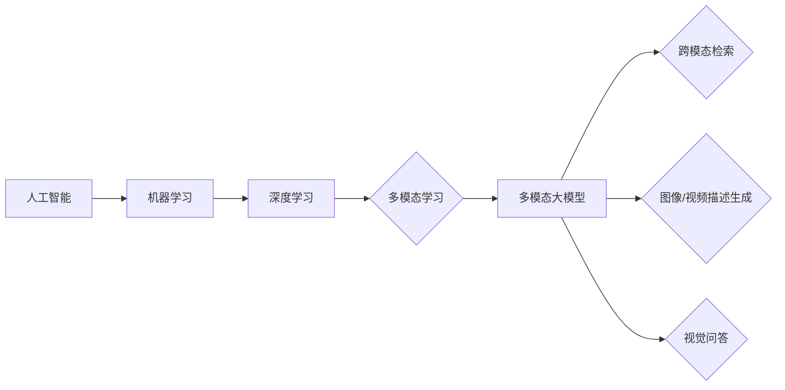

# 多模态大模型：技术原理与实战 感知能力评测

作者：禅与计算机程序设计艺术

## 1. 背景介绍

### 1.1 人工智能的新纪元：从单模态到多模态

近年来，人工智能领域取得了令人瞩目的进步，其中深度学习的兴起功不可没。然而，传统的深度学习模型大多局限于单一模态的数据，例如图像识别模型只能处理图像数据，语音识别模型只能处理音频数据。这种单模态的局限性限制了人工智能应用的广度和深度。

为了突破单模态的瓶颈，研究人员开始探索多模态学习，旨在构建能够同时处理和理解多种模态信息的智能系统。多模态学习的兴起标志着人工智能进入了一个全新的发展阶段，也为解决更复杂、更接近人类认知水平的智能任务提供了新的思路和方法。

### 1.2 多模态大模型：技术发展与应用前景

近年来，随着深度学习技术的不断发展，以及大规模数据集的出现，多模态大模型应运而生。这些模型通常包含数十亿甚至数千亿个参数，能够学习到不同模态数据之间复杂的语义关联，并在各种多模态任务上取得了突破性的进展。

多模态大模型的应用前景十分广阔，例如：

* **跨模态检索：**  用户可以使用文本描述搜索图像或视频，也可以使用图像搜索相关文本。
* **图像/视频描述生成：**  自动生成图像或视频内容的文字描述，方便信息检索和理解。
* **视觉问答：**  根据图像或视频内容回答用户提出的问题，实现更自然的人机交互。
* **多模态情感分析：**  分析文本、语音、表情等多模态信息，识别用户的情感状态。

### 1.3 本文目标：深入解析多模态大模型

本文旨在深入探讨多模态大模型的技术原理、实战应用以及感知能力评测方法。我们将从以下几个方面展开讨论：

* **核心概念与联系：**  介绍多模态学习、多模态大模型等基本概念，以及它们之间的联系。
* **核心算法原理具体操作步骤：**  详细介绍多模态大模型的训练过程、优化技巧以及常见架构，并通过具体的操作步骤帮助读者理解模型的运作机制。
* **数学模型和公式详细讲解举例说明：**  对多模态大模型中涉及的数学模型和公式进行详细的讲解，并结合实际例子进行说明，帮助读者深入理解模型的理论基础。
* **项目实践：代码实例和详细解释说明：**  提供基于Python和主流深度学习框架的多模态大模型实战项目，包括代码实例、数据集介绍、模型训练和评估等内容，帮助读者快速上手实践。
* **实际应用场景：**  介绍多模态大模型在不同领域的实际应用场景，例如跨模态检索、图像/视频描述生成等，并分析其优势和局限性。
* **工具和资源推荐：**  推荐一些常用的多模态大模型训练和应用工具、数据集以及学习资源，方便读者进一步学习和研究。
* **总结：未来发展趋势与挑战：**  总结多模态大模型的优势、局限性以及未来发展趋势，并探讨该领域面临的挑战。
* **附录：常见问题与解答：**  解答一些读者在学习和应用多模态大模型过程中可能会遇到的常见问题。

## 2. 核心概念与联系

### 2.1 多模态学习：定义、目标与意义

多模态学习（Multimodal Learning）是指利用多种感官模态的信息进行学习，例如视觉、听觉、语言等。其目标是构建能够处理和理解多种模态信息的智能系统，从而更好地模拟人类的感知、认知和决策过程。

多模态学习的意义在于：

* **突破单模态信息的局限性：** 单一模态的信息往往是不完整、不准确或模棱两可的，而多模态信息可以相互补充和印证，提高信息的可靠性和准确性。
* **更接近人类的认知方式：** 人类在感知和理解世界时，通常会综合利用多种感官信息，多模态学习旨在模拟这种认知机制，构建更智能、更人性化的系统。
* **拓展人工智能的应用领域：** 多模态学习可以应用于更广泛的领域，例如跨模态检索、图像/视频描述生成、视觉问答等，为解决更复杂、更接近人类认知水平的智能任务提供新的思路和方法。

### 2.2 多模态数据的表示与融合

多模态学习的关键在于如何有效地表示和融合不同模态的信息。常见的表示方法包括：

* **联合表示（Joint Representation）：** 将不同模态的数据映射到一个共享的特征空间，从而实现信息的融合。
* **协同表示（Coordinated Representation）：** 保留不同模态数据的独立性，通过学习模态之间的关联关系来实现信息的交互。

多模态数据融合的方法包括：

* **早期融合（Early Fusion）：** 在特征提取阶段就将不同模态的数据进行融合。
* **晚期融合（Late Fusion）：** 分别提取不同模态数据的特征，然后在决策阶段进行融合。
* **混合融合（Hybrid Fusion）：** 结合早期融合和晚期融合的优点，在不同层次上进行信息的融合。

### 2.3 多模态大模型：架构、特点与优势

多模态大模型是指参数量巨大、能够处理和理解多种模态信息的深度学习模型。常见的架构包括：

* **基于Transformer的多模态模型：** 利用Transformer强大的特征提取能力，学习不同模态数据之间的语义关联。
* **图神经网络（GNN）模型：** 将不同模态的数据表示为图结构，利用GNN学习节点之间的关系，实现信息的融合。

多模态大模型的特点：

* **强大的特征表示能力：**  能够学习到不同模态数据之间复杂的语义关联，提取更丰富、更抽象的特征表示。
* **端到端的学习方式：**  可以同时进行特征提取、信息融合和任务学习，简化模型训练流程。
* **可迁移性强：**  在大规模数据集上训练得到的模型，可以迁移到其他相关任务上，具有较强的泛化能力。

多模态大模型的优势：

* **性能优异：**  在各种多模态任务上都取得了突破性的进展，例如跨模态检索、图像/视频描述生成等。
* **应用广泛：**  可以应用于更广泛的领域，例如智能客服、虚拟主播、智能医疗等。
* **发展潜力巨大：**  随着技术的不断发展，多模态大模型的性能和应用范围还将进一步提升。

### 2.4 多模态大模型与其他相关概念的关系

多模态大模型与其他相关概念的关系如下图所示：

## 3. 核心算法原理具体操作步骤

### 3.1 数据预处理

#### 3.1.1 数据清洗

* **去除噪声数据：**  例如，去除包含错误标签、图像模糊、文本语义不清的数据。
* **处理缺失值：**  例如，使用平均值、中位数或插值法填充缺失的数值型数据，使用特殊符号或文本描述填充缺失的文本型数据。

#### 3.1.2 数据格式转换

* **图像数据：**  将图像数据转换为模型可接受的格式，例如RGB格式、灰度图格式等，并进行尺寸缩放、归一化等操作。
* **文本数据：**  对文本数据进行分词、去除停用词、词干提取等操作，并将文本转换为数值向量表示，例如词袋模型、词嵌入模型等。
* **音频数据：**  将音频数据转换为模型可接受的格式，例如WAV格式、MP3格式等，并进行采样率转换、音频增强等操作。

#### 3.1.3 数据增强

* **图像数据：**  例如，进行随机裁剪、旋转、翻转、颜色变换等操作，增加训练数据的多样性。
* **文本数据：**  例如，进行同义词替换、随机插入或删除词语、回译等操作，增加训练数据的语义丰富度。
* **音频数据：**  例如，添加随机噪声、改变音调、语速等操作，增加训练数据的鲁棒性。

### 3.2 模型构建

#### 3.2.1 选择合适的模型架构

* **基于Transformer的多模态模型：**  例如，ViLBERT、LXMERT、UNITER等。
* **图神经网络（GNN）模型：**  例如，GraphSage、GAT、GIN等。

#### 3.2.2 初始化模型参数

* **随机初始化：**  例如，使用高斯分布或均匀分布随机初始化模型参数。
* **预训练模型初始化：**  使用在大规模数据集上预训练好的模型参数初始化模型，可以加速模型收敛速度，提高模型性能。

### 3.3 模型训练

#### 3.3.1 选择合适的损失函数

* **跨模态检索：**  例如，对比损失函数、三元组损失函数等。
* **图像/视频描述生成：**  例如，交叉熵损失函数、BLEU评分等。
* **视觉问答：**  例如，准确率、召回率、F1值等。

#### 3.3.2 选择合适的优化器

* **随机梯度下降（SGD）：**  例如，Adam、Adagrad、RMSprop等。

#### 3.3.3 设置训练参数

* **学习率：**  控制模型参数更新的步长。
* **批大小（Batch Size）：**  每次迭代训练的数据量。
* **迭代次数（Epoch）：**  训练集上的完整训练次数。

#### 3.3.4 训练过程监控

* **损失函数值：**  监控模型训练过程中的损失函数值变化，判断模型是否收敛。
* **评估指标：**  在验证集上评估模型性能，例如准确率、召回率、F1值等。

### 3.4 模型评估与优化

#### 3.4.1 模型评估

* **选择合适的评估指标：**  根据具体任务选择合适的评估指标，例如跨模态检索的评估指标包括Recall@K、Mean Reciprocal Rank (MRR)等，图像/视频描述生成的评估指标包括BLEU、ROUGE、METEOR等。
* **划分数据集：**  将数据集划分为训练集、验证集和测试集，使用训练集训练模型，使用验证集调整模型参数，使用测试集评估模型性能。

#### 3.4.2 模型优化

* **调整模型参数：**  例如，调整学习率、批大小、迭代次数等参数，寻找最佳的模型配置。
* **尝试不同的模型架构：**  尝试使用不同的模型架构，例如基于Transformer的模型、图神经网络模型等，比较它们的性能差异。
* **进行数据增强：**  增加训练数据的数量和多样性，可以提高模型的泛化能力。

## 4. 数学模型和公式详细讲解举例说明

### 4.1 Transformer模型

Transformer模型是一种基于自注意力机制的神经网络模型，可以有效地学习序列数据之间的长期依赖关系。在多模态大模型中，Transformer模型通常用于提取不同模态数据的特征表示，并学习它们之间的语义关联。

#### 4.1.1 自注意力机制

自注意力机制（Self-Attention Mechanism）是一种可以学习序列数据内部依赖关系的机制。它通过计算序列中任意两个位置之间的相关性，来学习它们之间的语义关联。

自注意力机制的计算过程如下：

1. **计算查询向量（Query Vector）、键向量（Key Vector）和值向量（Value Vector）：**  对于序列中的每个位置 $i$，将该位置的输入向量 $x_i$ 分别乘以三个不同的矩阵 $W_Q$、$W_K$ 和 $W_V$，得到该位置的查询向量 $q_i$、键向量 $k_i$ 和值向量 $v_i$。
2. **计算注意力权重（Attention Weights）：**  计算每个位置 $i$ 的查询向量 $q_i$ 与所有位置的键向量 $k_j$ 之间的点积，然后进行缩放和softmax归一化，得到该位置的注意力权重 $\alpha_{ij}$。
3. **加权求和：**  将所有位置的值向量 $v_j$ 按照注意力权重 $\alpha_{ij}$ 进行加权求和，得到该位置的输出向量 $y_i$。

自注意力机制的数学公式如下：

$$
\begin{aligned}
q_i &= x_i W_Q \\
k_i &= x_i W_K \\
v_i &= x_i W_V \\
\alpha_{ij} &= \frac{\exp(q_i \cdot k_j / \sqrt{d_k})}{\sum_{l=1}^n \exp(q_i \cdot k_l / \sqrt{d_k})} \\
y_i &= \sum_{j=1}^n \alpha_{ij} v_j
\end{aligned}
$$

其中，$d_k$ 是键向量的维度，$n$ 是序列的长度。

#### 4.1.2 多头注意力机制

多头注意力机制（Multi-Head Attention Mechanism）是自注意力机制的扩展，它通过使用多个注意力头（Attention Head）来学习序列数据中不同方面的语义关联。

多头注意力机制的计算过程如下：

1. **将输入向量分别输入到多个注意力头中：**  对于序列中的每个位置 $i$，将该位置的输入向量 $x_i$ 分别输入到 $h$ 个注意力头中。
2. **每个注意力头独立计算自注意力：**  每个注意力头使用不同的参数矩阵 $W_Q^k$、$W_K^k$ 和 $W_V^k$ 计算自注意力，得到该注意力头的输出向量 $y_i^k$。
3. **拼接所有注意力头的输出向量：**  将所有注意力头的输出向量 $y_i^k$ 拼接在一起，得到一个长向量。
4. **线性变换：**  将拼接后的长向量乘以一个矩阵 $W_O$，得到最终的输出向量 $y_i$。

多头注意力机制的数学公式如下：

$$
\begin{aligned}
y_i^k &= \text{Attention}(x_i W_Q^k, x_i W_K^k, x_i W_V^k) \\
y_i &= \text{Concat}(y_i^1, y_i^2, ..., y_i^h) W_O
\end{aligned}
$$

其中，$h$ 是注意力头的数量。

#### 4.1.3 Transformer编码器

Transformer编码器（Transformer Encoder）是由多个编码层（Encoder Layer）堆叠而成的。每个编码层包含一个多头注意力层和一个前馈神经网络层。

编码层的计算过程如下：

1. **多头注意力层：**  计算输入序列的自注意力，学习序列数据之间的语义关联。
2. **残差连接和层归一化：**  将多头注意力层的输出与输入相加，然后进行层归一化，防止梯度消失或爆炸。
3. **前馈神经网络层：**  对每个位置的特征向量进行非线性变换，增强模型的表达能力。
4. **残差连接和层归一化：**  将前馈神经网络层的输出与输入相加，然后进行层归一化。

#### 4.1.4 Transformer解码器

Transformer解码器（Transformer Decoder）是由多个解码层（Decoder Layer）堆叠而成的。每个解码层包含一个多头注意力层、一个编码器-解码器注意力层和一个前馈神经网络层。

解码层的计算过程如下：

1. **多头注意力层：**  计算解码器输入序列的自注意力，学习解码器输入序列之间的语义关联。
2. **编码器-解码器注意力层：**  计算解码器输入序列与编码器输出序列之间的注意力，将编码器的信息融入到解码器中。
3. **残差连接和层归一化：**  将编码器-解码器注意力层的输出与输入相加，然后进行层归一化。
4. **前馈神经网络层：**  对每个位置的特征向量进行非线性变换，增强模型的表达能力。
5. **残差连接和层归一化：**  将前馈神经网络层的输出与输入相加，然后进行层归一化。

### 4.2 图神经网络（GNN）模型

图神经网络（Graph Neural Network, GNN）是一种可以处理图结构数据的深度学习模型。在多模态大模型中，GNN模型通常用于学习不同模态数据之间的关联关系，实现信息的融合。

#### 4.2.1 图卷积网络（GCN）

图卷积网络（Graph Convolutional Network, GCN）是一种可以对图结构数据进行卷积操作的GNN模型。它通过聚合节点邻居的信息，来更新节点的特征表示。

GCN的计算过程如下：

1. **计算节点的度矩阵（Degree Matrix）：**  度矩阵是一个对角矩阵，对角线上的元素表示对应节点的度。
2. **计算邻接矩阵（Adjacency Matrix）：**  邻接矩阵表示节点之间的连接关系，如果节点 $i$ 和节点 $j$ 之间存在边，则邻接矩阵的元素 $A_{ij}=1$，否则 $A_{ij}=0$。
3. **计算拉普拉斯矩阵（Laplacian Matrix）：**  拉普拉斯矩阵等于度矩阵减去邻接矩阵。
4. **