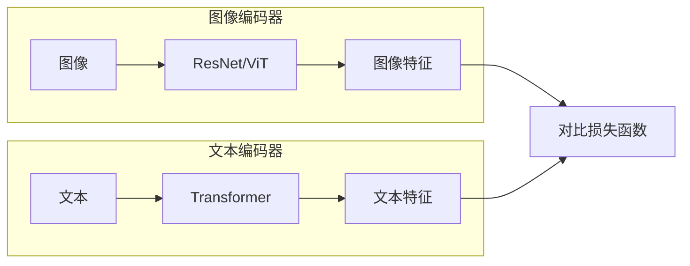
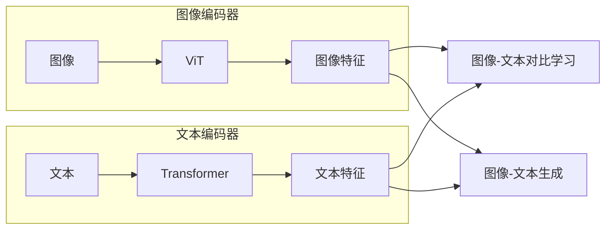

# 多模态大模型：技术原理与实战 部署环境准备

作者：禅与计算机程序设计艺术

## 1. 背景介绍

### 1.1 多模态学习的兴起

近年来，随着深度学习技术的飞速发展，人工智能领域取得了突破性进展。其中，多模态学习作为人工智能领域的一个重要分支，受到了越来越多的关注。多模态学习旨在使计算机能够像人类一样，同时理解和处理来自不同模态的信息，例如文本、图像、音频、视频等。

传统的单模态学习方法通常只能处理单一模态的数据，例如图像识别模型只能处理图像数据，而自然语言处理模型只能处理文本数据。然而，现实世界中的信息往往是多模态的，例如一张图片可能包含了文字描述、人物表情、场景信息等多种模态的信息。多模态学习通过融合不同模态的信息，可以更全面、更准确地理解和处理现实世界中的信息。

### 1.2 多模态大模型的优势

近年来，随着计算能力的提升和数据集的丰富，多模态大模型逐渐兴起。多模态大模型通常是指参数量巨大、训练数据量庞大的多模态学习模型，例如 OpenAI 的 CLIP、Google 的 LaMDA 等。

相比于传统的单模态模型和小型多模态模型，多模态大模型具有以下优势：

* **更强的表达能力:** 多模态大模型可以学习到更复杂、更抽象的特征表示，从而能够更好地理解和处理多模态信息。
* **更好的泛化能力:** 多模态大模型在训练过程中接触了大量的多模态数据，因此具有更好的泛化能力，能够更好地适应新的任务和领域。
* **更强的迁移学习能力:** 多模态大模型可以将从一个模态学习到的知识迁移到另一个模态，从而可以更快地学习新的任务。

### 1.3 多模态大模型的应用

多模态大模型在各个领域都有着广泛的应用前景，例如：

* **图像描述生成:** 可以根据图像内容自动生成文字描述，例如为图片添加标题、生成新闻报道等。
* **文本到图像生成:** 可以根据文字描述自动生成对应的图像，例如根据小说情节生成插图、根据产品描述生成产品图片等。
* **视频理解:** 可以理解视频内容，例如识别视频中的人物、物体、场景等，以及分析视频中的情感、行为等。
* **跨模态检索:** 可以根据一种模态的信息检索另一种模态的信息，例如根据图片检索相关的文本、根据语音检索相关的视频等。

## 2. 核心概念与联系

### 2.1 多模态数据的表示

多模态学习的第一步是如何有效地表示多模态数据。常用的多模态数据表示方法包括：

#### 2.1.1  联合表示（Joint Representation）

联合表示是指将不同模态的数据映射到一个共同的特征空间中，从而实现不同模态数据之间的交互和融合。常用的联合表示方法包括：

* **基于深度学习的联合表示:** 使用深度神经网络将不同模态的数据映射到一个共同的特征空间中，例如使用多层感知机 (MLP)、卷积神经网络 (CNN)、循环神经网络 (RNN) 等。
* **基于矩阵分解的联合表示:** 使用矩阵分解技术将不同模态的数据分解成多个低秩矩阵的乘积，从而得到不同模态数据的低维表示，例如奇异值分解 (SVD)、非负矩阵分解 (NMF) 等。

#### 2.1.2 协同表示（Coordinated Representation）

协同表示是指在保留不同模态数据自身特征的同时，学习不同模态数据之间的关联关系。常用的协同表示方法包括：

* **典型相关分析 (CCA):**  CCA 是一种常用的统计方法，用于寻找两组随机变量之间的线性关系。在多模态学习中，CCA 可以用于寻找不同模态数据之间的相关性，并学习不同模态数据的协同表示。
* **多视图学习 (Multi-view Learning):**  多视图学习是指从多个视角 (view) 学习数据的表示，其中每个视角对应一种模态的数据。多视图学习的目标是学习一个一致的表示，能够捕捉到不同视角下数据的共同特征。

### 2.2 多模态数据的融合

多模态数据融合是指将不同模态的数据进行整合，从而得到更全面、更准确的信息。常用的多模态数据融合方法包括：

#### 2.2.1 早期融合（Early Fusion）

早期融合是指在特征提取阶段就将不同模态的数据进行融合，例如将不同模态的特征向量拼接在一起，或者将不同模态的特征矩阵进行融合。

#### 2.2.2 晚期融合（Late Fusion）

晚期融合是指先分别对不同模态的数据进行处理，然后在决策阶段将不同模态的结果进行融合，例如将不同模态的分类结果进行投票，或者将不同模态的预测结果进行加权平均。

#### 2.2.3 中期融合（Intermediate Fusion）

中期融合是指在特征提取和决策阶段之间进行融合，例如在深度神经网络的中间层进行融合。

### 2.3 多模态模型的训练

多模态模型的训练方法与单模态模型的训练方法类似，主要包括以下步骤：

1. 数据预处理：对多模态数据进行清洗、格式转换、特征提取等操作，以便于模型的训练和学习。
2. 模型构建：选择合适的多模态模型结构，例如基于联合表示的模型、基于协同表示的模型等。
3. 模型训练：使用训练数据对模型进行训练，并调整模型的参数，使模型能够更好地拟合训练数据。
4. 模型评估：使用测试数据对训练好的模型进行评估，评估指标包括准确率、召回率、F1 值等。

## 3. 核心算法原理具体操作步骤

### 3.1 CLIP 算法原理

CLIP (Contrastive Language-Image Pre-Training) 是 OpenAI 提出的一种多模态预训练模型，其核心思想是将图像和文本映射到同一个特征空间中，并最大化匹配图像和文本对之间的相似度，同时最小化不匹配图像和文本对之间的相似度。

CLIP 模型的结构如下图所示：



* **图像编码器:** 用于提取图像的特征，可以使用 ResNet、ViT 等常见的图像特征提取模型。
* **文本编码器:** 用于提取文本的特征，可以使用 Transformer 等常见的文本特征提取模型。
* **对比损失函数:** 用于计算图像特征和文本特征之间的相似度，并最大化匹配图像和文本对之间的相似度，同时最小化不匹配图像和文本对之间的相似度。

CLIP 模型的训练过程如下：

1. 从数据集中随机采样一批图像和文本对，其中包括匹配的图像和文本对，以及不匹配的图像和文本对。
2. 将图像和文本分别输入到图像编码器和文本编码器中，得到图像特征和文本特征。
3. 计算匹配的图像和文本对之间的相似度，以及不匹配的图像和文本对之间的相似度。
4. 使用对比损失函数计算模型的损失值，并使用梯度下降法更新模型的参数。

### 3.2  CLIP 算法具体操作步骤

#### 3.2.1 数据准备

* 收集大量的图像和文本对数据，例如从网络上爬取图片和对应的文字描述。
* 对数据进行清洗和预处理，例如去除重复数据、处理缺失值、对文本进行分词和编码等。

#### 3.2.2 模型训练

* 使用预处理后的数据训练 CLIP 模型，可以使用 PyTorch、TensorFlow 等深度学习框架。
* 在训练过程中，需要设置合适的超参数，例如学习率、批大小、训练轮数等。

#### 3.2.3 模型评估

* 使用测试数据集评估训练好的 CLIP 模型的性能，可以使用准确率、召回率、F1 值等指标进行评估。

### 3.3  BLIP 算法原理

BLIP (Bootstrapping Language-Image Pre-training) 是 Salesforce Research 提出的一种多模态预训练模型，其核心思想是利用图像和文本之间的互信息来进行预训练。

BLIP 模型的结构如下图所示：



* **图像编码器:** 用于提取图像的特征，使用 ViT (Vision Transformer) 模型。
* **文本编码器:** 用于提取文本的特征，使用 Transformer 模型。
* **图像-文本对比学习:** 用于最大化匹配图像和文本对之间的互信息，同时最小化不匹配图像和文本对之间的互信息。
* **图像-文本生成:** 用于根据图像生成文本，或者根据文本生成图像。

BLIP 模型的训练过程如下：

1. 从数据集中随机采样一批图像和文本对，其中包括匹配的图像和文本对，以及不匹配的图像和文本对。
2. 将图像和文本分别输入到图像编码器和文本编码器中，得到图像特征和文本特征。
3. 使用图像-文本对比学习任务最大化匹配图像和文本对之间的互信息，同时最小化不匹配图像和文本对之间的互信息。
4. 使用图像-文本生成任务根据图像生成文本，或者根据文本生成图像。

## 4. 数学模型和公式详细讲解举例说明

### 4.1 对比损失函数

对比损失函数是 CLIP 模型中用于计算图像特征和文本特征之间相似度的函数，其公式如下：

$$
L = \sum_{(x_i, y_i) \in D} [y_i \cdot d(x_i, y_i) + (1 - y_i) \cdot max(0, m - d(x_i, y_i))]
$$

其中：

* $D$ 表示数据集，$(x_i, y_i)$ 表示数据集中的一对图像和文本，$y_i = 1$ 表示图像和文本匹配，$y_i = 0$ 表示图像和文本不匹配。
* $d(x_i, y_i)$ 表示图像 $x_i$ 和文本 $y_i$ 之间的距离，可以使用余弦距离等度量方法计算。
* $m$ 是一个 margin 参数，用于控制不匹配的图像和文本对之间的距离。

对比损失函数的目标是最小化匹配的图像和文本对之间的距离，同时最大化不匹配的图像和文本对之间的距离。

### 4.2 互信息

互信息是 BLIP 模型中用于度量图像和文本之间关联程度的指标，其公式如下：

$$
I(X;Y) = H(X) + H(Y) - H(X,Y)
$$

其中：

* $X$ 表示图像，$Y$ 表示文本。
* $H(X)$ 表示图像的熵，$H(Y)$ 表示文本的熵，$H(X,Y)$ 表示图像和文本的联合熵。

互信息的值越大，表示图像和文本之间的关联程度越高。

### 4.3 举例说明

假设我们有一对匹配的图像和文本：

* **图像:** 一只猫躺在沙发上。
* **文本:** The cat is sleeping on the couch.

我们可以使用 CLIP 模型提取图像和文本的特征，并计算它们之间的距离。如果距离较小，则说明图像和文本匹配。

我们也可以使用 BLIP 模型计算图像和文本之间的互信息。如果互信息较大，则说明图像和文本之间存在较强的关联性。

## 5. 项目实践：代码实例和详细解释说明

### 5.1 部署环境准备

在进行多模态大模型的项目实践之前，首先需要准备相应的部署环境。以下是部署多模态大模型所需的一些常见软件和硬件要求：

#### 5.1.1 硬件要求

* **GPU:** 多模态大模型通常需要大量的计算资源进行训练和推理，因此建议使用 GPU 进行加速。建议使用 NVIDIA Tesla V100、A100 等高性能 GPU。
* **CPU:** CPU 的性能对模型的训练和推理速度也有一定的影响，建议使用 Intel Xeon、AMD EPYC 等高性能 CPU。
* **内存:** 多模态大模型的参数量通常很大，因此需要大量的内存来存储模型参数和中间结果。建议使用至少 64GB 的内存，最好是 128GB 或以上。
* **存储空间:** 多模态大模型的训练数据和模型文件通常很大，因此需要大量的存储空间。建议使用 SSD 或 NVMe SSD 等高速存储设备。

#### 5.1.2 软件要求

* **操作系统:** 建议使用 Ubuntu、CentOS 等 Linux 操作系统。
* **深度学习框架:** 建议使用 PyTorch、TensorFlow 等深度学习框架。
* **CUDA:** 如果使用 GPU 进行加速，则需要安装 CUDA 工具包。
* **cuDNN:** cuDNN 是 NVIDIA 推出的深度神经网络库，可以加速深度学习模型的训练和推理。
* **其他 Python 库:**  NumPy、SciPy、Pandas、OpenCV 等。

#### 5.1.3 环境配置

以下是一些常用的环境配置工具：

* **Anaconda:** Anaconda 是一个 Python 和 R 语言的发行版本，用于科学计算和数据分析。
* **Miniconda:** Miniconda 是 Anaconda 的精简版本，只包含 Python 和 conda 包管理器。
* **Docker:** Docker 是一个开源的应用容器引擎，可以将应用程序和其依赖项打包到一个容器中，方便应用程序的部署和迁移。

#### 5.1.4 代码实例

以下是如何使用 Miniconda 创建一个名为 `multimodal` 的 Python 环境，并安装 PyTorch 和 torchvision 的示例代码：

```bash
# 创建环境
conda create -n multimodal python=3.8

# 激活环境
conda activate multimodal

# 安装 PyTorch 和 torchvision
conda install pytorch torchvision -c pytorch
```

### 5.2 数据集准备

多模态大模型的训练需要大量的标注数据，以下是一些常用的多模态数据集：

* **MS COCO (Microsoft Common Objects in Context):** 包含超过 33 万张图片，每张图片包含多个物体和对应的文字描述。
* **Visual Genome:** 包含超过 10 万张图片，每张图片包含多个物体、物体之间的关系以及对应的文字描述。
* **Conceptual Captions:** 包含超过 300 万张图片和对应的文字描述。

#### 5.2.1 数据集下载

可以使用以下代码下载 MS COCO 数据集：

```python
from torchvision.datasets import CocoCaptions

# 指定数据集路径
data_dir = './data'

# 下载训练集和验证集
train_dataset = CocoCaptions(root=data_dir, annFile='annotations/captions_train2017.json', download=True)
val_dataset = CocoCaptions(root=data_dir, annFile='annotations/captions_val2017.json', download=True)
```

#### 5.2.2 数据集预处理

下载数据集后，需要对数据进行预处理，例如：

* **图像预处理:** 将图像 resize 到固定大小、进行数据增强等操作。
* **文本预处理:** 对文本进行分词、构建词表、将文本转换为数字编码等操作。

以下是如何使用 torchvision 对图像进行预处理的示例代码：

```python
from torchvision import transforms

# 定义图像预处理 pipeline
transform = transforms.Compose([
    transforms.Resize((224, 224)),
    transforms.ToTensor(),
    transforms.Normalize(mean=[0.485, 0.456, 0.406], std=[0.229, 0.224, 0.225])
])

# 对图像进行预处理
image = transform(image)
```

## 6. 实际应用场景

### 6.1 图像描述生成

图像描述生成是指根据图像内容自动生成文字描述，例如为图片添加标题、生成新闻报道等。

#### 6.1.1 应用场景

* **社交媒体:** 自动为用户上传的图片生成文字描述，提高用户体验。
* **电商平台:** 自动为商品图片生成文字描述，方便用户浏览和搜索。
* **新闻媒体:** 自动为新闻图片生成文字描述，提高新闻报道的效率和准确性。

#### 6.1.2 代码实例

以下是如何使用 CLIP 模型进行图像描述生成的示例代码：

```python
import clip
import torch

# 加载 CLIP 模型
device = "cuda" if torch.cuda.is_available() else "cpu"
model, preprocess = clip.load("ViT/B/32", device=device)

# 加载图像
image = preprocess(Image.open("image.jpg")).unsqueeze(0).to(device)

# 生成文字描述
with torch.no_grad():
    text = clip.tokenize(["a photo of a cat", "a photo of a dog"]).to(device)
    image_features = model.encode_image(image)
    text_features = model.encode_text(text)
    logits_per_image, logits_per_text = model(image, text)
    probs = logits_per_image.softmax(dim=-1).cpu().numpy()

# 打印生成的文字描述
print(f"Label probs: {probs}")
```

### 6.2 文本到图像生成

文本到图像生成是指根据文字描述自动生成对应的图像，例如根据小说情节生成插图、根据产品描述生成产品图片等。

#### 6.2.1 应用场景

* **游戏开发:** 自动生成游戏场景和角色。
* **