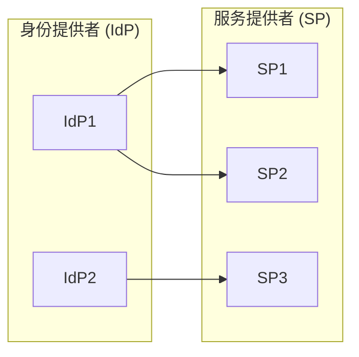

## 1. 背景介绍

### 1.1 身份管理的挑战

随着信息技术的快速发展，企业和组织内部的系统和应用数量急剧增加，用户信息分散在各个系统中，难以统一管理和维护。传统的身份管理系统通常采用单点登录（SSO）的方式，允许用户使用一组凭据访问多个应用系统，但这种方式存在以下挑战：

* **安全性风险**：单点登录的安全性依赖于中心化的认证服务器，一旦认证服务器被攻破，所有系统的安全性都将受到威胁。
* **可扩展性问题**：随着用户数量和应用系统的增加，中心化的认证服务器可能会成为性能瓶颈。
* **管理复杂性**：维护和管理大量的用户和权限信息是一项复杂的任务，需要专门的IT人员和工具。

### 1.2 多级身份管理的优势

为了解决上述挑战，多级身份管理系统应运而生。多级身份管理系统将身份管理功能分散到多个层级，每个层级负责管理特定范围内的用户和权限信息，从而提高系统的安全性、可扩展性和管理效率。

多级身份管理系统具有以下优势：

* **增强安全性**：通过将身份管理功能分散到多个层级，可以降低单点故障的风险，提高系统的整体安全性。
* **提高可扩展性**：每个层级可以独立管理用户和权限信息，从而提高系统的可扩展性，适应不断增长的用户数量和应用系统。
* **简化管理**：将身份管理功能分散到多个层级，可以简化管理任务，降低管理成本。

## 2. 核心概念与联系

### 2.1 身份

身份是指能够唯一标识一个用户的属性集合，例如用户名、电子邮件地址、手机号码等。

### 2.2 认证

认证是指验证用户身份的过程，通常使用用户名和密码进行身份验证。

### 2.3 授权

授权是指授予用户访问特定资源或执行特定操作的权限。

### 2.4 身份提供者

身份提供者（IdP）是指负责管理用户身份信息的系统，例如企业内部的 Active Directory 或云端的身份管理服务。

### 2.5 服务提供者

服务提供者（SP）是指提供服务的应用系统，例如企业内部的 ERP 系统或云端的 SaaS 应用。

### 2.6 联合身份

联合身份是指在多个身份提供者之间共享用户身份信息，允许用户使用同一组凭据访问多个服务提供者。

### 2.7 关系图



## 3. 核心算法原理具体操作步骤

### 3.1 基于角色的访问控制（RBAC）

RBAC 是一种常用的授权机制，它将用户分配到不同的角色，每个角色拥有特定的权限。用户可以通过所属角色获得相应的权限。

RBAC 的核心概念包括：

* **角色**：角色是一组权限的集合。
* **权限**：权限是指用户可以执行的操作，例如读取、写入、删除等。
* **用户-角色分配**：将用户分配到不同的角色。
* **角色-权限分配**：将权限分配到不同的角色。

### 3.2 OAuth 2.0

OAuth 2.0 是一种开放标准，用于授权第三方应用访问用户资源，而无需用户提供用户名和密码。

OAuth 2.0 的核心流程包括：

1. **授权请求**：第三方应用向用户请求授权访问其资源。
2. **用户授权**：用户授权第三方应用访问其资源。
3. **授权码**：授权服务器向第三方应用颁发授权码。
4. **访问令牌**：第三方应用使用授权码换取访问令牌。
5. **访问资源**：第三方应用使用访问令牌访问用户资源。

### 3.3 OpenID Connect

OpenID Connect（OIDC）是基于 OAuth 2.0 协议的身份验证层，它提供了一种标准化的方式来验证用户身份并获取用户信息。

OIDC 的核心流程包括：

1. **身份验证请求**：用户向身份提供者请求身份验证。
2. **用户身份验证**：身份提供者验证用户身份。
3. **身份令牌**：身份提供者向用户颁发身份令牌，其中包含用户的身份信息。
4. **用户信息请求**：应用系统使用身份令牌获取用户信息。
5. **用户信息**：身份提供者向应用系统提供用户信息。

## 4. 数学模型和公式详细讲解举例说明

### 4.1 访问控制矩阵

访问控制矩阵是一种常用的授权模型，它使用矩阵来表示用户对资源的访问权限。

| 用户/资源 | 资源 1 | 资源 2 | 资源 3 |
|---|---|---|---|
| 用户 A | 读取 | 写入 |  |
| 用户 B |  | 读取 | 执行 |
| 用户 C | 读取 |  | 执行 |

### 4.2 布尔表达式

布尔表达式可以用来表示复杂的授权规则。

例如，以下布尔表达式表示只有拥有“管理员”角色的用户才能访问“系统设置”资源：

```
hasRole("管理员") && resource.equals("系统设置")
```

## 5. 项目实践：代码实例和详细解释说明

### 5.1 基于 Spring Security 的多级身份管理系统

Spring Security 是一个功能强大的安全框架，可以用于构建多级身份管理系统。

以下代码示例演示了如何使用 Spring Security 实现基于角色的访问控制：

```java
@Configuration
@EnableWebSecurity
public class SecurityConfig extends WebSecurityConfigurerAdapter {

    @Override
    protected void configure(HttpSecurity http) throws Exception {
        http
            .authorizeRequests()
                .antMatchers("/admin/**").hasRole("ADMIN")
                .antMatchers("/user/**