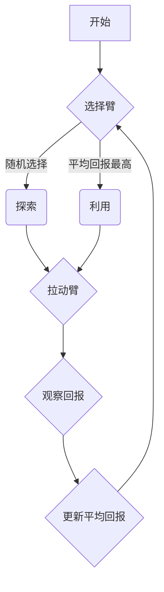

## 1. 背景介绍

### 1.1 探索与利用的困境

在生活中，我们常常面临着“探索”和“利用”之间的权衡。想象一下，你走进一家新开的餐厅，面对着琳琅满目的菜单，你是应该尝试新菜品（探索），还是选择你已经知道并喜欢的菜品（利用）？这就是探索与利用困境的典型例子。

在机器学习领域，多臂老虎机问题（Multi-Armed Bandit Problem，MAB）就是一个经典的探索与利用问题。它抽象了这种决策困境，并提供了一种数学框架来解决它。

### 1.2 多臂老虎机问题

多臂老虎机问题得名于赌场中的老虎机。假设你面对着多个老虎机（“臂”），每个老虎机都有不同的中奖概率（未知）。你的目标是在有限的时间内，通过拉动老虎机来最大化你的总回报。

这个问题的核心在于如何在“探索”新老虎机以找到最佳选择和“利用”已知回报较高的老虎机之间取得平衡。

## 2. 核心概念与联系

### 2.1 核心概念

* **臂（Arm）**: 每个老虎机就是一个臂，代表一个可选择的行动或策略。
* **回报（Reward）**: 每次拉动老虎机后获得的奖励，通常是一个数值。
* **遗憾（Regret）**:  由于选择了非最佳臂而导致的潜在收益损失。
* **策略（Policy）**:  决定在每个时间步选择哪个臂的规则。

### 2.2 概念间联系

多臂老虎机问题的目标是找到一个策略，以最小化总遗憾。为了实现这一目标，我们需要在探索和利用之间找到最佳平衡。

## 3. 核心算法原理具体操作步骤

解决多臂老虎机问题有很多算法，以下是几种常用的算法：

### 3.1 Epsilon-Greedy 算法

* **原理**:  以一定的概率  $ \epsilon $  随机选择一个臂进行探索，以  $ 1-\epsilon $  的概率选择当前平均回报最高的臂进行利用。
* **操作步骤**:
    1. 初始化每个臂的平均回报为 0。
    2. 对于每个时间步：
        * 以  $ \epsilon $  的概率随机选择一个臂。
        * 以  $ 1-\epsilon $  的概率选择当前平均回报最高的臂。
        * 拉动选择的臂并观察回报。
        * 更新选择的臂的平均回报。
* **优点**:  简单易实现。
* **缺点**:  探索效率不高，容易陷入局部最优。

### 3.2 UCB 算法

* **原理**:  根据每个臂的平均回报和探索次数，计算一个置信上限，选择置信上限最高的臂。
* **操作步骤**:
    1. 初始化每个臂的平均回报和探索次数为 0。
    2. 对于每个时间步：
        * 对于每个臂，计算其置信上限：
        $$
        \text{置信上限} = \text{平均回报} + \sqrt{\frac{2\ln{t}}{\text{探索次数}}}
        $$
        其中， $ t $  是当前时间步。
        * 选择置信上限最高的臂。
        * 拉动选择的臂并观察回报。
        * 更新选择的臂的平均回报和探索次数。
* **优点**:  探索效率高，能够有效地找到最佳臂。
* **缺点**:  计算复杂度较高。

### 3.3 Thompson Sampling 算法

* **原理**:  为每个臂维护一个 Beta 分布，表示该臂的回报概率的先验分布。根据 Beta 分布采样一个回报概率，选择回报概率最高的臂。
* **操作步骤**:
    1. 初始化每个臂的 Beta 分布参数  $ \alpha $  和  $ \beta $  为 1。
    2. 对于每个时间步：
        * 对于每个臂，从其 Beta 分布中采样一个回报概率。
        * 选择回报概率最高的臂。
        * 拉动选择的臂并观察回报。
        * 根据观察到的回报更新选择的臂的 Beta 分布参数：
            * 如果获得回报，则  $ \alpha = \alpha + 1 $ 。
            * 如果没有获得回报，则  $ \beta = \beta + 1 $ 。
* **优点**:  探索效率高，能够有效地找到最佳臂，并且计算复杂度较低。
* **缺点**:  需要维护 Beta 分布，参数更新较为复杂。

## 4. 数学模型和公式详细讲解举例说明

### 4.1 遗憾的数学定义

多臂老虎机问题的目标是最小化总遗憾。遗憾的数学定义如下：

$$
R_T = \sum_{t=1}^T (r^*(t) - r_t)
$$

其中：

*  $ R_T $  是总遗憾。
*  $ T $  是时间步的总数。
*  $ r^*(t) $  是在时间步  $ t $  选择最佳臂获得的回报。
*  $ r_t $  是在时间步  $ t $  实际选择的臂获得的回报。

### 4.2 Epsilon-Greedy 算法的遗憾界

Epsilon-Greedy 算法的遗憾界为：

$$
R_T = O(\epsilon T + \frac{K}{\epsilon} \ln{T})
$$

其中：

*  $ K $  是臂的数量。

这个公式表明，Epsilon-Greedy 算法的遗憾随着时间步的增加而线性增长。此外， $ \epsilon $  的值越小，探索的次数越少，遗憾的增长速度越慢，但陷入局部最优的风险越高。

### 4.3 UCB 算法的遗憾界

UCB 算法的遗憾界为：

$$
R_T = O(\sum_{i=1}^K \Delta_i + \ln{T})
$$

其中：

*  $ \Delta_i $  是最佳臂和第  $ i $  个臂之间的回报差异。

这个公式表明，UCB 算法的遗憾随着时间步的增加而对数增长。此外，遗憾的上界与最佳臂和非最佳臂之间的回报差异有关。

## 5. 项目实践：代码实例和详细解释说明

### 5.1 Python 代码实现 Epsilon-Greedy 算法

```python
import numpy as np

class EpsilonGreedy:
    def __init__(self, epsilon, n_arms):
        self.epsilon = epsilon
        self.n_arms = n_arms
        self.counts = np.zeros(n_arms)
        self.values = np.zeros(n_arms)

    def select_arm(self):
        if np.random.rand() < self.epsilon:
            return np.random.randint(self.n_arms)
        else:
            return np.argmax(self.values)

    def update(self, chosen_arm, reward):
        self.counts[chosen_arm] += 1
        n = self.counts[chosen_arm]
        value = self.values[chosen_arm]
        new_value = ((n - 1) / float(n)) * value + (1 / float(n)) * reward
        self.values[chosen_arm] = new_value
```

### 5.2 代码解释

* `__init__`  方法初始化算法参数，包括  $ \epsilon $ 、臂的数量、每个臂的探索次数和平均回报。
* `select_arm`  方法根据 Epsilon-Greedy 策略选择一个臂。
* `update`  方法更新选择的臂的平均回报。

### 5.3 代码使用示例

```python
# 创建一个 Epsilon-Greedy 算法实例
epsilon = 0.1
n_arms = 5
algorithm = EpsilonGreedy(epsilon, n_arms)

# 模拟 1000 次拉动老虎机
for i in range(1000):
    # 选择一个臂
    chosen_arm = algorithm.select_arm()

    # 模拟老虎机的回报
    reward = np.random.randn()

    # 更新算法
    algorithm.update(chosen_arm, reward)

# 打印每个臂的平均回报
print(algorithm.values)
```

## 6. 实际应用场景

### 6.1 在线广告

在在线广告中，多臂老虎机问题可以用来选择向用户展示哪个广告。每个广告就是一个臂，用户的点击行为就是回报。通过使用多臂老虎机算法，可以最大化广告点击率。

### 6.2 推荐系统

在推荐系统中，多臂老虎机问题可以用来选择向用户推荐哪个商品。每个商品就是一个臂，用户的购买行为就是回报。通过使用多臂老虎机算法，可以最大化商品购买率。

### 6.3 临床试验

在临床试验中，多臂老虎机问题可以用来选择给患者使用哪种治疗方案。每个治疗方案就是一个臂，患者的康复情况就是回报。通过使用多臂老虎机算法，可以找到最有效的治疗方案。

## 7. 工具和资源推荐

### 7.1 Python 库

* `numpy`: 用于数值计算。
* `scipy`: 用于科学计算。

### 7.2 在线资源

* [Multi-Armed Bandit](https://en.wikipedia.org/wiki/Multi-armed_bandit): 维基百科上的多臂老虎机问题介绍。
* [Bandit Algorithms for Website Optimization](http://banditalgs.com/): 关于多臂老虎机算法的书籍。

## 8. 总结：未来发展趋势与挑战

### 8.1 未来发展趋势

* **上下文信息**:  将上下文信息（例如用户信息、环境信息）纳入多臂老虎机问题，以提高决策的准确性。
* **深度强化学习**:  将深度强化学习应用于多臂老虎机问题，以学习更复杂的策略。

### 8.2 挑战

* **高维数据**:  如何有效地处理高维数据，例如用户特征、商品特征。
* **非平稳环境**:  如何应对环境的变化，例如用户兴趣的变化、商品流行度的变化。

## 9. 附录：常见问题与解答

### 9.1 Epsilon-Greedy 算法中  $ \epsilon $  的值如何选择？

$ \epsilon $  的值是一个超参数，需要根据具体问题进行调整。通常情况下， $ \epsilon $  的值越小，探索的次数越少，遗憾的增长速度越慢，但陷入局部最优的风险越高。

### 9.2 UCB 算法和 Thompson Sampling 算法哪个更好？

UCB 算法和 Thompson Sampling 算法都是有效的算法，它们的性能取决于具体问题。UCB 算法的计算复杂度较高，但遗憾界较低。Thompson Sampling 算法的计算复杂度较低，但参数更新较为复杂。

### 9.3 多臂老虎机问题有哪些变种？

多臂老虎机问题有很多变种，例如：

* **上下文多臂老虎机问题**:  将上下文信息纳入决策过程。
* **线性多臂老虎机问题**:  假设臂的回报与特征之间存在线性关系。
* **非平稳多臂老虎机问题**:  假设臂的回报概率随时间变化。

### 9.4 多臂老虎机问题有哪些应用？

多臂老虎机问题在很多领域都有应用，例如：

* 在线广告
* 推荐系统
* 临床试验
* 金融投资
* 网络路由
* 资源分配


## 10. Mermaid 流程图


