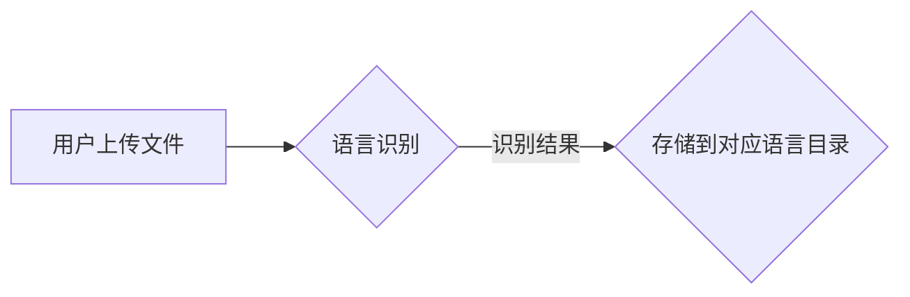
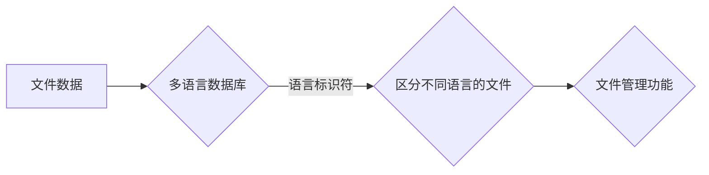
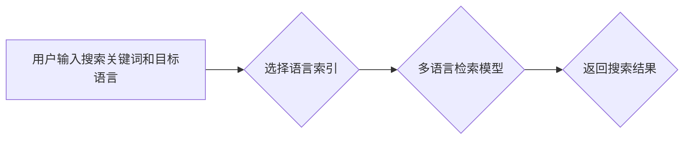
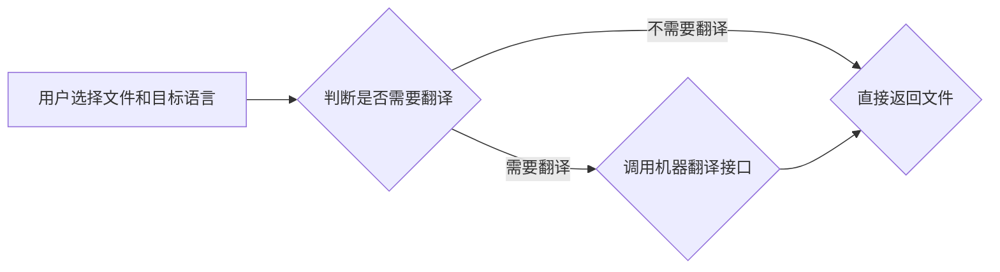

##  1. 背景介绍

### 1.1. 网络存储需求的演变

随着互联网的普及和信息技术的快速发展，人们对数据存储的需求日益增长。从最初的个人电脑存储到后来的移动设备存储，再到如今的云存储，网络存储方式不断演变，存储容量和访问速度也在不断提升。与此同时，用户对网络存储的功能需求也越来越多样化，安全性、可靠性、易用性等方面都提出了更高的要求。

### 1.2. 多语种环境下的挑战

在全球化背景下，多语言环境已经成为常态。人们在工作和生活中需要处理来自不同国家和地区的文档、图片、视频等各种类型的数据。传统的网络存储系统通常只支持单一语言，无法满足多语言环境下的数据存储和管理需求。例如，用户可能需要存储不同语言版本的文档，或者需要在不同语言环境下搜索和访问文件。

### 1.3. 多语种网络硬盘系统的意义

为了解决上述问题，设计和实现一个支持多语种的网络硬盘系统显得尤为重要。该系统需要具备以下特点：

* **多语言支持：** 支持存储和管理多种语言的文本、文档、图片、视频等数据。
* **语言识别与转换：** 能够自动识别文件的语言类型，并提供语言转换功能。
* **多语言搜索：** 支持用户使用不同语言进行文件搜索。
* **安全性与可靠性：** 采用安全可靠的技术架构和数据加密措施，保障用户数据的安全性和完整性。
* **易用性：** 提供简洁易用的用户界面，方便用户进行文件上传、下载、管理等操作。

## 2. 核心概念与联系

### 2.1. 多语种支持

#### 2.1.1. 字符编码

字符编码是计算机中表示字符的一种方法。常见的字符编码包括 ASCII、Unicode 等。ASCII 编码只能表示 128 个字符，无法满足多语言环境的需求。Unicode 编码则可以表示世界上几乎所有语言的字符。

#### 2.1.2. 语言标识符

语言标识符用于标识一种特定的语言。常见的语言标识符包括 ISO 639-1、ISO 639-2 等。例如，英语的语言标识符为 "en"，中文的语言标识符为 "zh"。

#### 2.1.3. 多语言数据库

多语言数据库是指支持存储和管理多种语言数据的数据库。为了实现多语言支持，数据库需要采用 Unicode 编码存储字符数据，并使用语言标识符区分不同语言的数据。

### 2.2. 语言识别与转换

#### 2.2.1. 语言识别技术

语言识别技术是指自动识别文本或语音所属语言的技术。常见的语言识别技术包括统计语言模型、神经网络等。

#### 2.2.2. 机器翻译技术

机器翻译技术是指使用计算机自动将一种语言的文本翻译成另一种语言的技术。常见的机器翻译技术包括规则 based 机器翻译、统计机器翻译、神经机器翻译等。

### 2.3. 多语言搜索

#### 2.3.1. 多语言索引

多语言索引是指支持对多种语言文本进行索引的技术。为了实现多语言索引，需要对不同语言的文本进行分词、词干提取等预处理操作。

#### 2.3.2. 多语言检索模型

多语言检索模型是指支持使用不同语言进行检索的模型。常见的多语言检索模型包括基于翻译的检索模型、基于跨语言主题模型的检索模型等。


## 3. 核心算法原理具体操作步骤

### 3.1. 文件上传与语言识别

1. 用户上传文件到网络硬盘系统。
2. 系统使用语言识别技术自动识别文件的语言类型。
3. 系统根据文件的语言类型，将文件存储到相应的语言目录下。



### 3.2. 文件存储与管理

1. 系统使用多语言数据库存储文件数据。
2. 系统使用语言标识符区分不同语言的文件。
3. 系统提供文件管理功能，例如文件重命名、移动、删除等。



### 3.3. 文件搜索

1. 用户输入搜索关键词和目标语言。
2. 系统根据目标语言选择相应的语言索引。
3. 系统使用多语言检索模型对索引进行检索，返回搜索结果。



### 3.4. 文件下载与语言转换

1. 用户选择要下载的文件和目标语言。
2. 如果目标语言与文件的语言类型不同，系统调用机器翻译接口将文件翻译成目标语言。
3. 系统将翻译后的文件返回给用户。



## 4. 数学模型和公式详细讲解举例说明

本节介绍多语种网络硬盘系统中涉及的一些数学模型和公式，并结合具体例子进行讲解说明。

### 4.1. TF-IDF 算法

TF-IDF（Term Frequency-Inverse Document Frequency）是一种常用的文本信息检索权重计算方法，用于评估一个词语对于一个文档集或语料库中的其中一份文档的重要程度。字词的重要性随着它在文件中出现的次数成正比增加，但同时会随着它在语料库中出现的频率成反比下降。

TF-IDF 的计算公式如下：

```
TF-IDF(t, d) = TF(t, d) * IDF(t)
```

其中：

* **TF(t, d)** 表示词语 t 在文档 d 中出现的频率。
* **IDF(t)** 表示词语 t 的逆文档频率，计算公式如下：

```
IDF(t) = log(N / df(t))
```

其中：

* **N** 表示语料库中文档的总数。
* **df(t)** 表示包含词语 t 的文档数量。

**举例说明：**

假设我们有一个包含以下三个文档的语料库：

* 文档 1：我喜欢吃苹果。
* 文档 2：我喜欢吃香蕉。
* 文档 3：我喜欢吃苹果和香蕉。

现在我们想要计算词语 "苹果" 在文档 1 中的 TF-IDF 值。

首先计算 TF 值：

```
TF("苹果", 文档 1) = 1 / 3 = 0.333
```

然后计算 IDF 值：

```
IDF("苹果") = log(3 / 2) = 0.405
```

最后计算 TF-IDF 值：

```
TF-IDF("苹果", 文档 1) = 0.333 * 0.405 = 0.135
```

### 4.2. 余弦相似度

余弦相似度是一种常用的文本相似度计算方法，用于衡量两个向量之间的相似程度。在多语种网络硬盘系统中，可以使用余弦相似度计算两个文档之间的相似度，从而实现文档聚类、相似文档推荐等功能.

余弦相似度的计算公式如下：

```
similarity(A, B) = (A · B) / (||A|| * ||B||)
```

其中：

* **A · B** 表示向量 A 和向量 B 的点积。
* **||A||** 表示向量 A 的模长。

**举例说明：**

假设我们有两个文档，分别表示为向量 A 和向量 B：

```
A = [1, 2, 0]
B = [2, 1, 1]
```

则它们的余弦相似度为：

```
similarity(A, B) = (1 * 2 + 2 * 1 + 0 * 1) / (sqrt(1^2 + 2^2 + 0^2) * sqrt(2^2 + 1^2 + 1^2)) = 0.80
```

## 5. 项目实践：代码实例和详细解释说明

### 5.1. 项目环境搭建

* 操作系统：Ubuntu 20.04 LTS
* 编程语言：Python 3.8
* 数据库：MySQL 8.0
* Web 框架：Django 3.2
* 语言识别库：langdetect
* 机器翻译 API：Google Translate API

### 5.2. 数据库设计

| 表名 | 字段 | 数据类型 | 说明 |
|---|---|---|---|
| user | id | INT | 用户 ID |
| user | username | VARCHAR(255) | 用户名 |
| user | password | VARCHAR(255) | 密码 |
| file | id | INT | 文件 ID |
| file | user_id | INT | 用户 ID |
| file | filename | VARCHAR(255) | 文件名 |
| file | language | VARCHAR(2) | 文件语言 |
| file | upload_time | DATETIME | 上传时间 |
| file | file_path | VARCHAR(255) | 文件路径 |

### 5.3. 代码实例

```python
# 导入必要的库
import os
from langdetect import detect
from googletrans import Translator

# 设置 Google Translate API 密钥
os.environ['GOOGLE_APPLICATION_CREDENTIALS'] = '/path/to/your/credentials.json'

# 创建 Translator 对象
translator = Translator()

# 定义文件上传函数
def upload_file(request):
    # 获取上传的文件
    file = request.FILES['file']

    # 获取文件名和文件语言
    filename = file.name
    language = detect(file.read())

    # 将文件保存到磁盘
    file_path = os.path.join('/path/to/upload/directory', filename)
    with open(file_path, 'wb+') as destination:
        for chunk in file.chunks():
            destination.write(chunk)

    # 将文件信息保存到数据库
    # ...

    # 返回成功信息
    return JsonResponse({'message': 'File uploaded successfully.'})

# 定义文件下载函数
def download_file(request, file_id):
    # 从数据库中获取文件信息
    # ...

    # 判断是否需要翻译
    target_language = request.GET.get('language', None)
    if target_language is not None and target_language != file.language:
        # 调用 Google Translate API 进行翻译
        translated_text = translator.translate(text, src=file.language, dest=target_language).text

        # 将翻译后的内容保存到临时文件
        # ...

        # 返回临时文件
        # ...
    else:
        # 直接返回原始文件
        # ...

# 定义文件搜索函数
def search_files(request):
    # 获取搜索关键词和目标语言
    # ...

    # 根据目标语言选择相应的语言索引
    # ...

    # 使用多语言检索模型进行检索
    # ...

    # 返回搜索结果
    # ...
```

### 5.4. 部署与测试

1. 将代码部署到 Web 服务器。
2. 创建测试用例，测试文件上传、下载、搜索、语言识别、机器翻译等功能。
3. 对系统进行性能测试和安全测试，确保系统稳定可靠。

## 6. 实际应用场景

多语种网络硬盘系统可以应用于各种需要存储和管理多语言数据的场景，例如：

* **跨国企业：** 跨国企业可以利用多语种网络硬盘系统存储和管理来自不同国家和地区的文档、合同、报表等数据。
* **政府机构：** 政府机构可以利用多语种网络硬盘系统存储和管理多语言版本的法律法规、政策文件、新闻稿等信息。
* **教育机构：** 教育机构可以利用多语种网络硬盘系统存储和管理多语言版本的教材、课件、论文等资料。
* **个人用户：** 个人用户可以利用多语种网络硬盘系统存储和管理来自不同语言的音乐、电影、书籍等个人文件。

## 7. 工具和资源推荐

* **语言识别库：**
    * langdetect：https://pypi.org/project/langdetect/
    * fasttext：https://fasttext.cc/
* **机器翻译 API：**
    * Google Translate API：https://cloud.google.com/translate/docs/reference/rest
    * Microsoft Translator API：https://docs.microsoft.com/en-us/azure/cognitive-services/translator/
* **多语言数据库：**
    * MySQL：https://www.mysql.com/
    * PostgreSQL：https://www.postgresql.org/

## 8. 总结：未来发展趋势与挑战

### 8.1. 未来发展趋势

* **人工智能技术的进一步发展：** 随着人工智能技术的不断发展，语言识别、机器翻译等技术的精度和效率将不断提升，这将进一步推动多语种网络硬盘系统的发展。
* **云计算技术的普及：** 云计算技术的普及将为多语种网络硬盘系统提供更加便捷、高效、低成本的存储和计算资源。
* **数据安全和隐私保护：** 随着数据安全和隐私保护意识的不断增强，多语种网络硬盘系统需要更加注重数据的安全性和隐私保护。

### 8.2. 面临的挑战

* **技术挑战：** 如何设计和实现高效、可靠、安全的多语种网络硬盘系统仍然是一个巨大的技术挑战。
* **成本挑战：** 多语种网络硬盘系统的开发、部署和维护成本较高。
* **市场竞争：** 目前市场上已经存在一些多语种网络硬盘系统，例如 Google Drive、Dropbox 等，这给新进入者带来了一定的市场竞争压力。

## 9. 附录：常见问题与解答

### 9.1. 问：多语种网络硬盘系统与传统的网络硬盘系统有什么区别？

**答：** 多语种网络硬盘系统与传统的网络硬盘系统的主要区别在于对多语言的支持。传统的网络硬盘系统通常只支持单一语言，而多语种网络硬盘系统可以支持存储和管理多种语言的数据。

### 9.2. 问：多语种网络硬盘系统如何保证数据的安全？

**答：** 多语种网络硬盘系统可以通过以下措施保证数据的安全：

* **数据加密：** 对用户数据进行加密存储和传输，防止数据泄露。
* **访问控制：** 对用户进行身份验证和授权，控制用户对数据的访问权限。
* **安全审计：** 记录用户的操作日志，以便于追溯和审计。

### 9.3. 问：如何选择合适的机器翻译 API？

**答：** 选择合适的机器翻译 API 需要考虑以下因素：

* **翻译精度：** 不同 API 的翻译精度有所差异，需要根据实际需求选择精度较高的 API。
* **支持的语言：** 不同 API 支持的语言数量不同，需要选择支持目标语言的 API。
* **价格：** 不同 API 的价格有所差异，需要根据预算选择性价比高的 API。


## 10. 结束语

多语种网络硬盘系统的设计与实现是一个复杂而富有挑战性的课题，需要综合考虑多方面的因素。相信随着技术的不断进步和应用需求的不断增长，多语种网络硬盘系统将会得到更加广泛的应用，并为人们的工作和生活带来更大的便利。