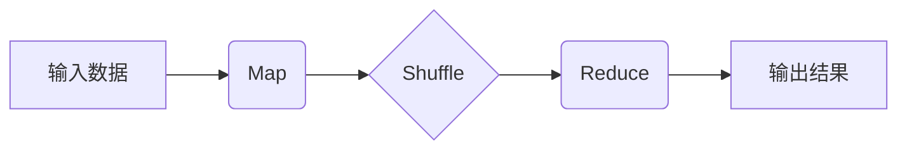
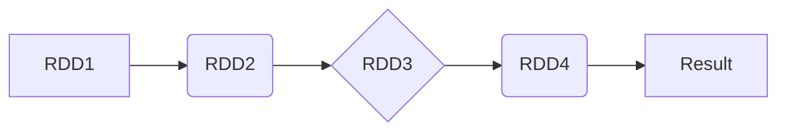
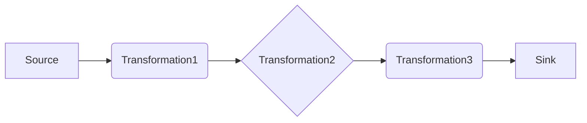

# 大数据处理框架原理与代码实战案例讲解

## 1.背景介绍

### 1.1 大数据时代的到来

随着互联网、移动互联网、物联网等新技术的快速发展,数据呈现出爆炸式增长。根据IDC的预测,到2025年,全球数据量将达到175ZB(1ZB=1万亿GB)。这些海量的数据来源广泛,种类繁多,包括网络日志、社交媒体数据、物联网设备数据等。如何高效、准确地处理这些大数据,已经成为当前科技界面临的一大挑战。

传统的数据处理方式已经无法满足大数据时代的需求,因此出现了一系列新的大数据处理框架和技术。这些框架和技术能够快速、可靠地存储和处理海量数据,为企业和组织提供了洞察和价值。

### 1.2 大数据处理框架的重要性

大数据处理框架在当代数据密集型应用中扮演着关键角色。它们提供了高度可扩展、容错、高吞吐量的数据处理能力,能够支持各种复杂的数据处理场景,如实时数据流处理、离线批处理、机器学习等。掌握这些框架的原理和实践技能,对于开发人员和数据工程师来说至关重要。

本文将深入探讨几种主流的大数据处理框架,包括Hadoop、Spark、Flink等。我们将剖析它们的核心概念、算法原理、数学模型,并通过实际案例和代码示例,帮助读者全面掌握这些框架的使用方法和最佳实践。

## 2.核心概念与联系 

### 2.1 大数据处理框架的核心概念

在深入探讨具体框架之前,我们需要先了解一些核心概念:

1. **批处理(Batch Processing)**: 指将大量数据作为一个静态文件或数据集进行处理。Hadoop MapReduce就是一种典型的批处理框架。

2. **流处理(Stream Processing)**: 指对持续不断产生的数据流进行实时处理。Spark Streaming和Flink等框架支持流处理。

3. **有向无环图(DAG)**: 许多大数据处理框架内部采用DAG来表示数据处理流程,如Spark的RDD和DataFrame。

4. **容错(Fault Tolerance)**: 大数据处理框架需要具备容错能力,以确保在节点故障时仍能可靠地完成计算任务。

5. **数据分区(Data Partitioning)**: 将大数据集分割为多个分区,分布在集群的不同节点上,以实现并行计算。

6. **数据存储**: 常用的大数据存储系统有HDFS、HBase、Cassandra等,它们支持高吞吐、高可用的大规模数据存储。

这些概念贯穿于各种大数据处理框架之中,是理解和使用这些框架的基础。

### 2.2 大数据处理框架之间的关系

不同的大数据处理框架在设计理念、应用场景等方面存在一些差异,但它们也有很多共通之处。比如Spark和Flink都支持批处理和流处理,都采用DAG执行模型。我们可以将它们进行横向对比:

|  框架  | 处理模型 | 容错机制 | 部署模式 |
|:------:|:--------:|:---------:|:--------:|
| Hadoop |    批处理    |  重启工作  |  YARN    |
|  Spark |  批处理/流处理  |    RDD线性化     |  Standalone/YARN/Mesos |
|  Flink |  批处理/流处理  | 检查点/重播 | Standalone/YARN/Kubernetes |

从上表可以看出,Spark和Flink在处理模型、容错机制、部署灵活性等方面更加先进。但是,Hadoop MapReduce由于简单、稳定的特点,在某些传统的批处理场景下仍有一席之地。

总的来说,这些大数据处理框架并非相互排斥,而是可以组合使用,发挥各自的优势,共同构建强大的大数据处理管道。

## 3.核心算法原理具体操作步骤

接下来,我们将分别介绍Hadoop MapReduce、Spark和Flink这三种主流大数据处理框架的核心算法原理和具体操作步骤。

### 3.1 Hadoop MapReduce

Hadoop MapReduce是最早也是最具代表性的大数据处理框架。它的核心思想是将计算过程拆分为Map阶段和Reduce阶段,并行处理数据,实现高吞吐量和高容错性。

#### 3.1.1 MapReduce工作原理

1. **Map阶段**:输入数据被拆分为多个数据块,并行处理由用户编写的Map函数。Map函数将输入的键值对转换为一系列中间键值对。

2. **Shuffle阶段**:将Map阶段输出的中间键值对按照键进行归并和分组,分发到对应的Reduce节点。

3. **Reduce阶段**:对于每一个键及其对应的值列表,并行执行用户编写的Reduce函数,将中间结果合并为最终输出。



#### 3.1.2 MapReduce实现步骤

1. 编写Map和Reduce函数,实现数据处理逻辑。

2. 将输入数据上传到HDFS。

3. 启动MapReduce作业,指定输入/输出路径、Map/Reduce函数等参数。

4. MapReduce框架自动将作业分发到集群中,并行执行Map和Reduce任务。

5. 监控作业进度,等待作业完成。

6. 从HDFS获取输出结果。

下面是一个使用Java编写的WordCount示例:

```java
public static class WordCountMapper extends Mapper<LongWritable, Text, Text, IntWritable> {
    public void map(LongWritable key, Text value, Context context) throws IOException, InterruptedException {
        String line = value.toString();
        StringTokenizer tokenizer = new StringTokenizer(line);
        while (tokenizer.hasMoreTokens()) {
            Text word = new Text(tokenizer.nextToken());
            IntWritable one = new IntWritable(1);
            context.write(word, one);
        }
    }
}

public static class WordCountReducer extends Reducer<Text, IntWritable, Text, IntWritable> {
    public void reduce(Text key, Iterable<IntWritable> values, Context context) throws IOException, InterruptedException {
        int sum = 0;
        for (IntWritable value : values) {
            sum += value.get();
        }
        context.write(key, new IntWritable(sum));
    }
}
```

### 3.2 Apache Spark

Apache Spark是一种通用的大数据处理框架,支持批处理、流处理、机器学习和图计算等多种工作负载。它采用了RDD(Resilient Distributed Dataset)和DAG执行模型,提供了高度的容错性和并行计算能力。

#### 3.2.1 Spark RDD和DAG执行模型

1. **RDD**:RDD是Spark的核心数据抽象,表示一个不可变、分区的记录集合。RDD支持各种转换操作(如map、filter、join等),这些操作构建了一个RDD血统图。

2. **DAG执行模型**:Spark将RDD血统图转换为DAG(有向无环图),描述了各个分区的计算任务及其依赖关系。在执行时,Spark根据DAG调度各个任务在集群上并行执行。



#### 3.2.2 Spark代码示例

下面是一个使用Scala编写的WordCount示例:

```scala
val textFile = sc.textFile("hdfs://...")
val counts = textFile.flatMap(line => line.split(" "))
                      .map(word => (word, 1))
                      .reduceByKey(_ + _)
counts.saveAsTextFile("hdfs://...")
```

1. 从HDFS读取文本文件,创建一个RDD。

2. 使用flatMap将每一行拆分为单词,map将每个单词映射为(word, 1)键值对。

3. 使用reduceByKey对每个键(单词)对应的值(计数)进行聚合求和。

4. 将结果RDD保存到HDFS。

### 3.3 Apache Flink

Apache Flink是一种分布式流处理框架,支持有状态的流处理和批处理。它采用了基于流的编程模型,将批处理视为有界的流处理特例。Flink具有低延迟、高吞吐、精确一次语义等优点。

#### 3.3.1 Flink流处理模型

Flink将数据源抽象为无限长的流,通过一系列转换操作(如filter、map、window等)对数据流进行处理,最终将结果输出到sink。这些转换操作构成了一个流处理管道。



#### 3.3.2 Flink容错机制

Flink采用了检查点(Checkpoint)和状态恢复机制来实现容错。

1. **检查点**:定期将算子的状态保存到持久化存储,形成一致的检查点。

2. **状态恢复**:当发生故障时,Flink会从最近的检查点恢复算子状态,并重新处理数据,保证精确一次语义。

#### 3.3.3 Flink代码示例

下面是一个使用Java编写的WordCount示例:

```java
StreamExecutionEnvironment env = StreamExecutionEnvironment.getExecutionEnvironment();
DataStream<String> text = env.readTextFile("hdfs://...");
DataStream<Tuple2<String, Integer>> counts = text.flatMap(new FlatMapFunction<String, Tuple2<String, Integer>>() {
    public void flatMap(String value, Collector<Tuple2<String, Integer>> out) {
        String[] words = value.split(" ");
        for (String word : words) {
            out.collect(new Tuple2<String, Integer>(word, 1));
        }
    }
})
.keyBy(0)
.sum(1);
counts.print();
env.execute("WordCount Example");
```

1. 从HDFS读取文本文件,创建一个DataStream。

2. 使用flatMap将每一行拆分为单词,映射为(word, 1)键值对。

3. 使用keyBy对单词进行分组,sum对每个单词的计数求和。

4. 打印输出结果。

## 4.数学模型和公式详细讲解举例说明

在大数据处理框架中,一些核心算法和模型涉及到数学理论和公式。下面我们将详细介绍其中的几个重要概念。

### 4.1 MapReduce数学模型

MapReduce的数学模型可以用两个函数来表示:

$$
map: (k_1, v_1) \rightarrow \text{list}(k_2, v_2)
$$
$$
reduce: (k_2, \text{list}(v_2)) \rightarrow \text{list}(v_3)
$$

其中:

- $k_1$和$v_1$分别表示Map输入的键和值
- $k_2$和$v_2$分别表示Map输出的键和值
- $v_3$表示Reduce输出的值列表

MapReduce框架会自动完成Shuffle过程,将Map输出按照$k_2$进行分组,然后将每个$k_2$对应的$v_2$列表传递给Reduce函数。

### 4.2 PageRank算法

PageRank是一种用于计算网页重要性的著名算法,它广泛应用于搜索引擎排名。PageRank算法可以用迭代方法来计算,公式如下:

$$
PR(p_i) = \frac{1-d}{N} + d \sum_{p_j \in M(p_i)} \frac{PR(p_j)}{L(p_j)}
$$

其中:

- $PR(p_i)$表示网页$p_i$的PageRank值
- $N$是网络中网页的总数
- $M(p_i)$是链接到$p_i$的网页集合
- $L(p_j)$是网页$p_j$的出链接数
- $d$是一个阻尼系数,通常取值0.85

PageRank算法可以使用MapReduce或Spark等框架进行并行计算。每一轮迭代会更新所有网页的PageRank值,直到收敛或达到最大迭代次数。

### 4.3 逻辑回归模型

逻辑回归是一种常见的机器学习分类算法,它可以用于大数据处理框架中进行并行训练。

对于二元逻辑回归,我们需要最小化以下目标函数:

$$
J(\theta) = -\frac{1}{m}\sum_{i=1}^m[y^{(i)}\log h_\theta(x^{(i)}) + (1-y^{(i)})\log(1-h_\theta(x^{(i)}))]
$$

其中