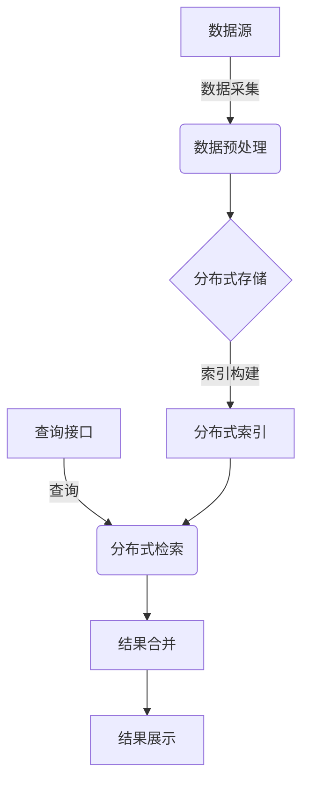

# 大数据背景下的信息安全检索技术研究

## 1.背景介绍

### 1.1 大数据时代的到来

随着互联网、移动互联网、物联网以及各种传感设备的快速发展,海量的数据正以前所未有的规模和速度被生成和积累。这些数据不仅包括结构化数据,如关系型数据库中的数据,还包括非结构化数据,如网页、图像、视频、音频等。这种规模庞大、增长迅速、种类繁多的数据被称为"大数据"(Big Data)。

大数据时代的到来给传统的数据处理和分析技术带来了巨大挑战,同时也催生了新的数据处理和分析方法。大数据的特点主要包括:

1. 数据量大(Volume)
2. 种类繁多(Variety) 
3. 传输速度快(Velocity)
4. 价值密度低(Value Density)

这些特点使得传统的数据处理和分析方法难以满足大数据环境下的需求。

### 1.2 大数据环境下的信息安全挑战

在大数据环境下,信息安全面临着前所未有的挑战。由于数据量巨大、种类繁多、传输速度快,传统的安全防护措施难以应对。同时,大数据环境下的数据价值密度低,使得数据被窃取、篡改或破坏的风险加大。

大数据环境下的信息安全挑战主要包括:

1. 数据保护(Data Protection)
2. 访问控制(Access Control)
3. 隐私保护(Privacy Protection)
4. 安全审计(Security Auditing)
5. 威胁检测(Threat Detection)

为了应对这些挑战,需要开发新的信息安全技术和方法。其中,信息安全检索技术是一种重要的手段,可以有效地发现和追踪安全威胁,提高信息系统的安全性和可靠性。

## 2.核心概念与联系

### 2.1 信息检索概述

信息检索(Information Retrieval, IR)是一门研究如何存储、组织和访问信息项目的学科。它的目标是为用户提供与其信息需求相关的信息资源。

信息检索系统通常包括以下几个关键组件:

1. 信息资源(Information Resources)
2. 索引(Index)
3. 查询(Query)
4. 检索模型(Retrieval Model)
5. 评估(Evaluation)

### 2.2 信息安全检索

信息安全检索(Security Information Retrieval, SIR)是信息检索在信息安全领域的应用。它的目标是从大量的数据中快速、准确地检索与安全相关的信息,以支持安全监控、威胁检测、事件响应等任务。

信息安全检索系统通常包括以下几个关键组件:

1. 安全数据源(Security Data Sources)
2. 安全索引(Security Index)
3. 安全查询(Security Query)
4. 安全检索模型(Security Retrieval Model)
5. 安全评估(Security Evaluation)

安全数据源包括日志文件、网络流量数据、威胁情报数据等;安全索引对这些数据进行预处理和组织,以便快速检索;安全查询描述用户的安全信息需求;安全检索模型定义了如何从索引中检索相关信息;安全评估则评估检索结果的质量和有效性。

### 2.3 大数据与信息安全检索的联系

在大数据环境下,信息安全检索面临着巨大的挑战和机遇:

- 挑战:海量的数据源、多样的数据类型、高速的数据流,使得传统的信息安全检索技术难以满足需求。
- 机遇:大数据技术为信息安全检索提供了强大的数据处理和分析能力,有助于提高检索的效率和准确性。

因此,将大数据技术与信息安全检索相结合,开发出适用于大数据环境的信息安全检索技术,是当前研究的热点和重点。

## 3.核心算法原理具体操作步骤

### 3.1 大数据信息安全检索架构

在大数据环境下,信息安全检索系统需要一个全新的架构来满足高性能、高可扩展性的需求。一种典型的大数据信息安全检索架构如下图所示:

该架构的核心步骤包括:

1. **数据采集**：从各种安全数据源(如日志、网络流量、威胁情报等)采集原始数据。
2. **数据预处理**：对原始数据进行清洗、解析、标准化等预处理,以准备索引构建。
3. **分布式存储**：将预处理后的数据存储到分布式文件系统(如HDFS)中,以支持大规模数据存储和处理。
4. **索引构建**：利用分布式计算框架(如Apache Spark)对存储的数据进行索引构建,生成分布式索引。
5. **分布式检索**：当接收到查询请求时,利用分布式索引并行执行检索操作。
6. **结果合并**：将分布式检索的结果进行合并和排序,生成最终检索结果。
7. **结果展示**：将检索结果以适当的形式展示给用户。

### 3.2 分布式索引技术

在大数据环境下,索引的构建和存储需要采用分布式技术,以支持大规模数据处理。常用的分布式索引技术包括:

1. **倒排索引**(Inverted Index)
2. **列式存储**(Column-oriented Storage)
3. **压缩技术**(Compression Techniques)

#### 3.2.1 倒排索引

倒排索引是文本检索中最常用的索引技术。它将文档集合中的每个词项与包含该词项的文档列表相关联,从而实现快速查找包含特定词项的文档。

在大数据环境下,倒排索引需要采用分布式构建和存储方式。常用的分布式倒排索引框架包括Apache Lucene/Solr和Elasticsearch。

#### 3.2.2 列式存储

列式存储是一种面向分析型工作负载的数据存储方式。它按列而非按行存储数据,可以显著提高分析查询的性能。

在信息安全检索中,列式存储可以用于存储结构化的安全数据(如日志数据),并提供快速的分析和查询能力。常用的列式存储系统包括Apache Parquet和Apache ORC。

#### 3.2.3 压缩技术

由于大数据环境下的数据量巨大,压缩技术对于节省存储空间和提高I/O效率至关重要。常用的压缩技术包括:

- **字典编码**(Dictionary Encoding)
- **比特向量**(Bit-Vector)
- **熵编码**(Entropy Encoding)

这些技术可以有效地压缩索引数据,从而减少存储和传输开销。

### 3.3 分布式检索算法

在大数据环境下,检索算法也需要采用分布式方式,以支持大规模数据集的高效检索。常用的分布式检索算法包括:

1. **Term-partitioned检索**(Term-partitioned Retrieval)
2. **Document-partitioned检索**(Document-partitioned Retrieval)
3. **组合分区检索**(Combined Partitioning)

#### 3.3.1 Term-partitioned检索

Term-partitioned检索将索引按词项(term)进行分区,每个分区包含一部分词项及其对应的倒排列表。查询时,将查询词项路由到相应的分区,并在各个分区上并行执行检索操作。

这种方式适用于查询词项数量较少的情况,但当查询词项数量较多时,需要在多个分区上执行检索,效率会下降。

#### 3.3.2 Document-partitioned检索

Document-partitioned检索将索引按文档进行分区,每个分区包含一部分文档的完整索引信息。查询时,在所有分区上并行执行检索操作,然后合并结果。

这种方式适用于查询词项数量较多的情况,但当文档集合规模较大时,每个分区的索引规模也会变大,影响检索效率。

#### 3.3.3 组合分区检索

组合分区检索综合了Term-partitioned和Document-partitioned两种方式,将索引按词项和文档进行二维分区。这种方式可以平衡查询词项数量和文档集合规模对检索效率的影响,是一种较为通用的分布式检索方法。

### 3.4 相关性排序算法

在信息安全检索中,相关性排序算法用于根据查询与文档之间的相关程度对检索结果进行排序,从而返回最相关的文档。常用的相关性排序算法包括:

1. **向量空间模型**(Vector Space Model)
2. **概率模型**(Probabilistic Model)
3. **语言模型**(Language Model)

#### 3.4.1 向量空间模型

向量空间模型将查询和文档表示为高维向量,并根据两个向量之间的相似度(如余弦相似度)来衡量相关性。这种模型简单直观,易于计算和扩展。

#### 3.4.2 概率模型

概率模型基于贝叶斯定理,计算文档与查询相关的概率作为相关性分数。常用的概率模型包括BM25和Robertson模型。这些模型考虑了词频、文档长度等因素,能够获得较好的检索效果。

#### 3.4.3 语言模型

语言模型将查询和文档看作是由同一个语言模型生成的,并根据文档生成查询的概率来衡量相关性。语言模型具有良好的理论基础,并且可以灵活地融入各种特征,是当前研究的热点。

在大数据环境下,这些相关性排序算法需要结合分布式计算框架(如Apache Spark)进行并行化计算,以提高效率。

## 4.数学模型和公式详细讲解举例说明

### 4.1 向量空间模型

在向量空间模型中,查询 $q$ 和文档 $d$ 被表示为向量:

$$\vec{q} = (q_1, q_2, \ldots, q_n)$$
$$\vec{d} = (d_1, d_2, \ldots, d_n)$$

其中 $n$ 是词项(term)的总数,每个分量 $q_i$ 和 $d_i$ 表示相应词项在查询和文档中的权重。

常用的词项权重计算方法是 TF-IDF(Term Frequency-Inverse Document Frequency),定义如下:

$$\text{tf}(t, d) = \frac{n_{t,d}}{\sum_{t' \in d} n_{t',d}}$$
$$\text{idf}(t, D) = \log \frac{|D|}{|\{d \in D: t \in d\}|}$$
$$\text{tfidf}(t, d, D) = \text{tf}(t, d) \times \text{idf}(t, D)$$

其中 $n_{t,d}$ 表示词项 $t$ 在文档 $d$ 中出现的次数, $|D|$ 表示文档集合的大小, $|\{d \in D: t \in d\}|$ 表示包含词项 $t$ 的文档数量。

相关性分数则可以通过查询向量和文档向量之间的相似度来计算,常用的相似度度量包括余弦相似度和欧几里得距离。

余弦相似度定义为:

$$\text{sim}_{\cos}(\vec{q}, \vec{d}) = \frac{\vec{q} \cdot \vec{d}}{|\vec{q}||\vec{d}|} = \frac{\sum_{i=1}^{n} q_i d_i}{\sqrt{\sum_{i=1}^{n} q_i^2} \sqrt{\sum_{i=1}^{n} d_i^2}}$$

### 4.2 BM25 模型

BM25 是一种常用的概率模型,它考虑了词频、文档长度等因素,计算文档与查询的相关性分数。

BM25 模型的计算公式如下:

$$\text{score}(d, q) = \sum_{t \in q} \text{IDF}(t) \cdot \frac{f(t, d) \cdot (k_1 + 1)}{f(t, d) + k_1 \cdot (1 - b + b \cdot \frac{|d|}{avgdl})}$$

其中:

- $f(t, d)$ 表示词项 $t$ 在文档 $d$ 中出现的次数
- $|d|$ 表示文档 $d$ 的长度(词项数量)
- $avgdl$ 表示文档集合中文档的